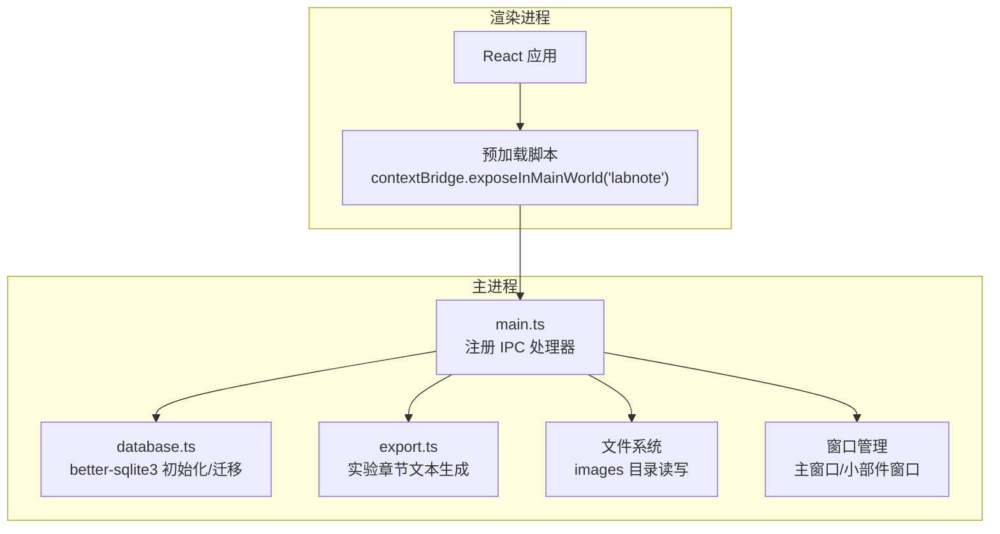
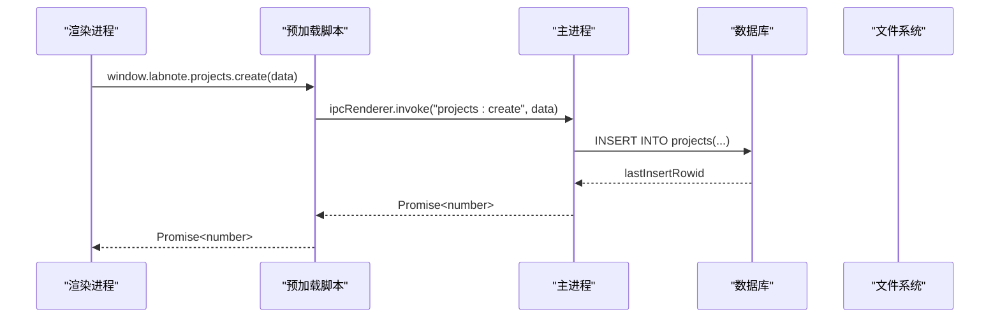
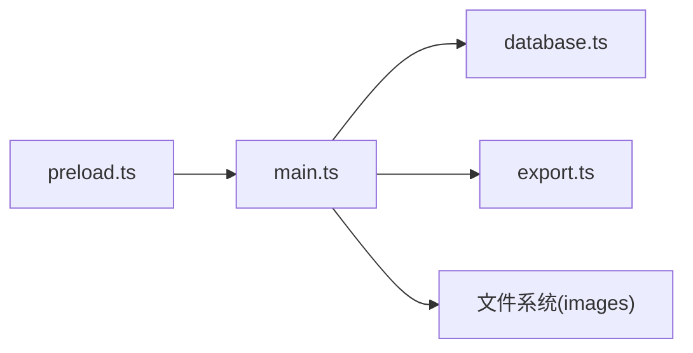

# API参考文档

<cite>
**本文引用的文件**   
- [electron/main.ts](file://electron/main.ts)
- [electron/preload.ts](file://electron/preload.ts)
- [electron/database.ts](file://electron/database.ts)
- [electron/export.ts](file://electron/export.ts)
</cite>

## 目录
1. [简介](#简介)
2. [项目结构](#项目结构)
3. [核心组件](#核心组件)
4. [架构总览](#架构总览)
5. [详细API参考](#详细api参考)
6. [依赖关系分析](#依赖关系分析)
7. [性能与并发特性](#性能与并发特性)
8. [安全与权限控制](#安全与权限控制)
9. [客户端集成指南](#客户端集成指南)
10. [错误处理策略](#错误处理策略)
11. [故障排查与调试技巧](#故障排查与调试技巧)
12. [结论](#结论)

## 简介
本文件为 LabNote 的 IPC 通信接口提供完整的 API 参考，覆盖主进程暴露的所有能力：文件系统（图片保存）、数据库查询与写入、窗口管理（主窗口与桌面小部件）等。每个 API 均包含方法签名、参数说明、返回值类型、错误处理与调用示例路径，并说明预加载脚本的安全隔离机制、异步调用模式、错误处理策略与性能考虑，帮助开发者正确集成与使用这些接口。

## 项目结构
LabNote 基于 Electron 构建，采用“主进程 + 渲染进程”的双进程模型。IPC 通过 preload 脚本以 contextBridge 暴露最小化 API 给渲染进程，主进程在 ipcMain.handle 中实现具体逻辑，访问本地文件系统与 SQLite 数据库。

图表来源
- [electron/main.ts:102-132](file://electron/main.ts#L102-L132)
- [electron/preload.ts:82-165](file://electron/preload.ts#L82-L165)
- [electron/database.ts:6-120](file://electron/database.ts#L6-L120)
- [electron/export.ts:55-137](file://electron/export.ts#L55-L137)

章节来源
- [electron/main.ts:102-132](file://electron/main.ts#L102-L132)
- [electron/preload.ts:1-165](file://electron/preload.ts#L1-L165)
- [electron/database.ts:1-320](file://electron/database.ts#L1-L320)
- [electron/export.ts:1-138](file://electron/export.ts#L1-L138)

## 核心组件
- 预加载脚本（preload.ts）：通过 contextBridge 将 labnote API 暴露到 window.labnote，仅暴露必要方法，严格限制 Node.js 和 Electron 原生对象访问。
- 主进程（main.ts）：注册所有 IPC 处理器，封装对 better-sqlite3 的调用、文件系统操作、窗口管理与导出功能。
- 数据库（database.ts）：负责 SQLite 初始化、表结构创建、增量迁移与种子数据填充。
- 导出模块（export.ts）：将实验数据格式化为期刊风格的实验章节文本。

章节来源
- [electron/preload.ts:1-165](file://electron/preload.ts#L1-L165)
- [electron/main.ts:395-1046](file://electron/main.ts#L395-L1046)
- [electron/database.ts:6-320](file://electron/database.ts#L6-L320)
- [electron/export.ts:55-137](file://electron/export.ts#L55-L137)

## 架构总览
渲染进程通过 window.labnote 调用 IPC 方法；主进程根据 channel 路由到对应处理器，执行数据库或文件系统操作后返回 Promise 结果。部分操作会触发 widget 刷新事件。

图表来源
- [electron/preload.ts:89-95](file://electron/preload.ts#L89-L95)
- [electron/main.ts:430-441](file://electron/main.ts#L430-L441)
- [electron/database.ts:18-24](file://electron/database.ts#L18-L24)

## 详细API参考

### 应用信息
- app.getDataPath
  - 描述：获取当前数据存储根路径。
  - 参数：无
  - 返回：Promise<string>
  - 错误：无显式错误抛出；若未初始化可能返回空字符串（取决于初始化流程）。
  - 调用示例路径：[electron/preload.ts:84](file://electron/preload.ts#L84)

章节来源
- [electron/main.ts:404](file://electron/main.ts#L404)
- [electron/preload.ts:84](file://electron/preload.ts#L84)

### 图片存储
- images.save
  - 描述：将 base64 DataURL 图片保存到 images 目录，返回文件名。
  - 参数：dataUrl string（格式 data:image/<ext>;base64,...）
  - 返回：Promise<string>（文件名）
  - 错误：当 dataUrl 不匹配预期格式时抛出错误。
  - 调用示例路径：[electron/preload.ts:87](file://electron/preload.ts#L87)

章节来源
- [electron/main.ts:407-419](file://electron/main.ts#L407-L419)
- [electron/preload.ts:87](file://electron/preload.ts#L87)

### 项目管理
- projects.list
  - 描述：列出所有项目，附带实验数量统计。
  - 参数：无
  - 返回：Promise<any[]>
  - 错误：无显式错误抛出。
  - 调用示例路径：[electron/preload.ts:90](file://electron/preload.ts#L90)

- projects.get
  - 描述：按 ID 获取项目详情。
  - 参数：id number
  - 返回：Promise<any>
  - 错误：无显式错误抛出。
  - 调用示例路径：[electron/preload.ts:91](file://electron/preload.ts#L91)

- projects.create
  - 描述：创建新项目。
  - 参数：{ name: string; description?: string; innovations?: string; tasks?: string; progress?: number }
  - 返回：Promise<number>（新记录ID）
  - 错误：数据库约束失败时抛出错误。
  - 调用示例路径：[electron/preload.ts:92](file://electron/preload.ts#L92)

- projects.update
  - 描述：更新项目字段（仅存在则更新）。
  - 参数：id number, data { name?: string; description?: string; innovations?: string; tasks?: string; progress?: number }
  - 返回：Promise<void>
  - 错误：无显式错误抛出。
  - 调用示例路径：[electron/preload.ts:93](file://electron/preload.ts#L93)

- projects.delete
  - 描述：删除项目。
  - 参数：id number
  - 返回：Promise<void>
  - 错误：无显式错误抛出。
  - 调用示例路径：[electron/preload.ts:94](file://electron/preload.ts#L94)

章节来源
- [electron/main.ts:422-458](file://electron/main.ts#L422-L458)
- [electron/preload.ts:90-94](file://electron/preload.ts#L90-L94)

### 实验管理
- experiments.list
  - 描述：列出所有实验，附带所属项目名称。
  - 参数：无
  - 返回：Promise<any[]>
  - 错误：无显式错误抛出。
  - 调用示例路径：[electron/preload.ts:97](file://electron/preload.ts#L97)

- experiments.get
  - 描述：按 ID 获取实验详情，包括反应物、催化剂、溶剂、标签与自定义模块数据。
  - 参数：id number
  - 返回：Promise<any>
  - 错误：无显式错误抛出。
  - 调用示例路径：[electron/preload.ts:98](file://electron/preload.ts#L98)

- experiments.create
  - 描述：创建实验及关联子实体（事务保证一致性），支持自定义模块数据。
  - 参数：任意对象（包含 title、project_id、date、reactants[]、catalysts[]、solvents[]、tag_ids[]、custom_modules[] 等）
  - 返回：Promise<number>（新实验ID）
  - 错误：外键约束或事务失败时抛出错误。
  - 调用示例路径：[electron/preload.ts:99](file://electron/preload.ts#L99)

- experiments.update
  - 描述：更新实验及关联子实体（事务保证一致性），支持自定义模块数据。
  - 参数：id number, data 任意对象（同 create）
  - 返回：Promise<void>
  - 错误：外键约束或事务失败时抛出错误。
  - 调用示例路径：[electron/preload.ts:100](file://electron/preload.ts#L100)

- experiments.delete
  - 描述：删除实验。
  - 参数：id number
  - 返回：Promise<void>
  - 错误：无显式错误抛出。
  - 调用示例路径：[electron/preload.ts:101](file://electron/preload.ts#L101)

- experiments.tags
  - 描述：获取某实验的标签ID列表。
  - 参数：expId number
  - 返回：Promise<any[]>
  - 错误：无显式错误抛出。
  - 调用示例路径：[electron/preload.ts:102](file://electron/preload.ts#L102)

- experiments.allTags
  - 描述：获取所有实验-标签映射。
  - 参数：无
  - 返回：Promise<{ experiment_id: number; tag_id: number }[]>
  - 错误：无显式错误抛出。
  - 调用示例路径：[electron/preload.ts:103](file://electron/preload.ts#L103)

- experiments.export
  - 描述：将实验数据格式化为期刊风格实验章节文本。
  - 参数：id number
  - 返回：Promise<string | null>
  - 错误：无显式错误抛出。
  - 调用示例路径：[electron/preload.ts:104](file://electron/preload.ts#L104)

- experiments.exportData
  - 描述：导出实验原始数据（用于前端模板格式化）。
  - 参数：id number
  - 返回：Promise<any>
  - 错误：无显式错误抛出。
  - 调用示例路径：[electron/preload.ts:105](file://electron/preload.ts#L105)

- experiments.setModuleLayout
  - 描述：设置实验的模块布局（JSON 序列化存储）。
  - 参数：id number, layout any[]
  - 返回：Promise<void>
  - 错误：无显式错误抛出。
  - 调用示例路径：[electron/preload.ts:106](file://electron/preload.ts#L106)

- experiments.getCustomModules
  - 描述：获取实验的自定义模块数据。
  - 参数：id number
  - 返回：Promise<any[]>
  - 错误：无显式错误抛出。
  - 调用示例路径：[electron/preload.ts:107](file://electron/preload.ts#L107)

- experiments.saveCustomModules
  - 描述：批量保存实验的自定义模块数据（事务保证一致性）。
  - 参数：id number, modules { module_key: string; data: Record<string, any> }[]
  - 返回：Promise<void>
  - 错误：无显式错误抛出。
  - 调用示例路径：[electron/preload.ts:108](file://electron/preload.ts#L108)

章节来源
- [electron/main.ts:461-823](file://electron/main.ts#L461-L823)
- [electron/preload.ts:97-108](file://electron/preload.ts#L97-L108)
- [electron/export.ts:55-137](file://electron/export.ts#L55-L137)

### 标签管理
- tags.list
  - 描述：列出标签，可按 type 过滤。
  - 参数：type? string
  - 返回：Promise<any[]>
  - 错误：无显式错误抛出。
  - 调用示例路径：[electron/preload.ts:111](file://electron/preload.ts#L111)

- tags.create
  - 描述：创建标签。
  - 参数：{ name: string; color?: string; type?: string }
  - 返回：Promise<number>
  - 错误：唯一约束冲突时抛出错误。
  - 调用示例路径：[electron/preload.ts:112](file://electron/preload.ts#L112)

- tags.update
  - 描述：更新标签名称与颜色。
  - 参数：id number, { name: string; color?: string }
  - 返回：Promise<void>
  - 错误：无显式错误抛出。
  - 调用示例路径：[electron/preload.ts:113](file://electron/preload.ts#L113)

- tags.delete
  - 描述：删除标签。
  - 参数：id number
  - 返回：Promise<void>
  - 错误：无显式错误抛出。
  - 调用示例路径：[electron/preload.ts:114](file://electron/preload.ts#L114)

章节来源
- [electron/main.ts:662-681](file://electron/main.ts#L662-L681)
- [electron/preload.ts:111-114](file://electron/preload.ts#L111-L114)

### 模板管理
- templates.list
  - 描述：列出所有模板，按更新时间倒序。
  - 参数：无
  - 返回：Promise<any[]>
  - 错误：无显式错误抛出。
  - 调用示例路径：[electron/preload.ts:117](file://electron/preload.ts#L117)

- templates.get
  - 描述：按 ID 获取模板详情。
  - 参数：id number
  - 返回：Promise<any>
  - 错误：无显式错误抛出。
  - 调用示例路径：[electron/preload.ts:118](file://electron/preload.ts#L118)

- templates.create
  - 描述：创建模板。
  - 参数：{ name: string; description?: string; template_data: string }
  - 返回：Promise<number>
  - 错误：无显式错误抛出。
  - 调用示例路径：[electron/preload.ts:119](file://electron/preload.ts#L119)

- templates.update
  - 描述：更新模板字段（仅存在则更新）。
  - 参数：id number, { name?: string; description?: string; template_data?: string }
  - 返回：Promise<void>
  - 错误：无显式错误抛出。
  - 调用示例路径：[electron/preload.ts:120](file://electron/preload.ts#L120)

- templates.delete
  - 描述：删除模板。
  - 参数：id number
  - 返回：Promise<void>
  - 错误：无显式错误抛出。
  - 调用示例路径：[electron/preload.ts:121](file://electron/preload.ts#L121)

- templates.incrementUsage
  - 描述：增加模板使用计数。
  - 参数：id number
  - 返回：Promise<void>
  - 错误：无显式错误抛出。
  - 调用示例路径：[electron/preload.ts:122](file://electron/preload.ts#L122)

章节来源
- [electron/main.ts:684-717](file://electron/main.ts#L684-L717)
- [electron/preload.ts:117-122](file://electron/preload.ts#L117-L122)

### 试剂管理
- reagents.list
  - 描述：列出所有试剂。
  - 参数：无
  - 返回：Promise<any[]>
  - 错误：无显式错误抛出。
  - 调用示例路径：[electron/preload.ts:125](file://electron/preload.ts#L125)

- reagents.get
  - 描述：按 ID 获取试剂详情。
  - 参数：id number
  - 返回：Promise<any>
  - 错误：无显式错误抛出。
  - 调用示例路径：[electron/preload.ts:126](file://electron/preload.ts#L126)

- reagents.create
  - 描述：创建试剂。
  - 参数：{ name: string; abbreviation?: string; molecular_weight?: number; molecular_formula?: string; structure_image?: string }
  - 返回：Promise<number>
  - 错误：唯一约束冲突时抛出错误。
  - 调用示例路径：[electron/preload.ts:127](file://electron/preload.ts#L127)

- reagents.update
  - 描述：更新试剂字段（仅存在则更新）。
  - 参数：id number, { name?: string; abbreviation?: string; molecular_weight?: number; molecular_formula?: string; structure_image?: string }
  - 返回：Promise<void>
  - 错误：无显式错误抛出。
  - 调用示例路径：[electron/preload.ts:128](file://electron/preload.ts#L128)

- reagents.delete
  - 描述：删除试剂。
  - 参数：id number
  - 返回：Promise<void>
  - 错误：无显式错误抛出。
  - 调用示例路径：[electron/preload.ts:129](file://electron/preload.ts#L129)

章节来源
- [electron/main.ts:720-749](file://electron/main.ts#L720-L749)
- [electron/preload.ts:125-129](file://electron/preload.ts#L125-L129)

### 模块模板管理
- modules.templates.list
  - 描述：列出模块模板（预设优先排序）。
  - 参数：无
  - 返回：Promise<any[]>
  - 错误：无显式错误抛出。
  - 调用示例路径：[electron/preload.ts:133](file://electron/preload.ts#L133)

- modules.templates.get
  - 描述：按 ID 获取模块模板详情。
  - 参数：id number
  - 返回：Promise<any>
  - 错误：无显式错误抛出。
  - 调用示例路径：[electron/preload.ts:134](file://electron/preload.ts#L134)

- modules.templates.create
  - 描述：创建自定义模块模板。
  - 参数：{ name: string; description?: string; category?: string; fields: string }
  - 返回：Promise<number>
  - 错误：无显式错误抛出。
  - 调用示例路径：[electron/preload.ts:135](file://electron/preload.ts#L135)

- modules.templates.update
  - 描述：更新自定义模块模板（预设不可修改）。
  - 参数：id number, { name?: string; description?: string; fields?: string }
  - 返回：Promise<void>
  - 错误：无显式错误抛出。
  - 调用示例路径：[electron/preload.ts:136](file://electron/preload.ts#L136)

- modules.templates.delete
  - 描述：删除自定义模块模板（预设不可删除）。
  - 参数：id number
  - 返回：Promise<void>
  - 错误：无显式错误抛出。
  - 调用示例路径：[electron/preload.ts:137](file://electron/preload.ts#L137)

章节来源
- [electron/main.ts:1010-1045](file://electron/main.ts#L1010-L1045)
- [electron/preload.ts:133-137](file://electron/preload.ts#L133-L137)

### 化合物名称缓存
- compound.getName
  - 描述：根据 SMILES 查询已缓存的化合物名称。
  - 参数：smiles string
  - 返回：Promise<string | null>
  - 错误：无显式错误抛出。
  - 调用示例路径：[electron/preload.ts:141](file://electron/preload.ts#L141)

- compound.setName
  - 描述：缓存 SMILES 与名称映射。
  - 参数：smiles string, name string
  - 返回：Promise<void>
  - 错误：无显式错误抛出。
  - 调用示例路径：[electron/preload.ts:142](file://electron/preload.ts#L142)

章节来源
- [electron/main.ts:826-833](file://electron/main.ts#L826-L833)
- [electron/preload.ts:141-142](file://electron/preload.ts#L141-L142)

### 任务管理
- tasks.list
  - 描述：按条件筛选任务，附带标签与子任务。
  - 参数：filters? { status?: string; experiment_id?: number; tag_id?: number }
  - 返回：Promise<any[]>
  - 错误：无显式错误抛出。
  - 调用示例路径：[electron/preload.ts:145](file://electron/preload.ts#L145)

- tasks.get
  - 描述：按 ID 获取任务详情，附带标签与子任务。
  - 参数：id number
  - 返回：Promise<any>
  - 错误：无显式错误抛出。
  - 调用示例路径：[electron/preload.ts:146](file://electron/preload.ts#L146)

- tasks.create
  - 描述：创建任务，支持标签绑定与重复规则。
  - 参数：{ title: string; description?: string; status?: string; priority?: string; due_date?: string | null; experiment_id?: number | null; parent_task_id?: number | null; recurrence_rule?: string | null; tag_ids?: number[] }
  - 返回：Promise<number>
  - 错误：无显式错误抛出。
  - 调用示例路径：[electron/preload.ts:147](file://electron/preload.ts#L147)

- tasks.update
  - 描述：更新任务，支持标签重绑与重复任务自动生成下一次。
  - 参数：id number, 同上字段
  - 返回：Promise<void>
  - 错误：任务不存在时抛出错误。
  - 调用示例路径：[electron/preload.ts:148](file://electron/preload.ts#L148)

- tasks.delete
  - 描述：删除任务及其标签关联。
  - 参数：id number
  - 返回：Promise<void>
  - 错误：无显式错误抛出。
  - 调用示例路径：[electron/preload.ts:149](file://electron/preload.ts#L149)

- tasks.getByExperiment
  - 描述：按实验ID获取任务列表。
  - 参数：experimentId number
  - 返回：Promise<any[]>
  - 错误：无显式错误抛出。
  - 调用示例路径：[electron/preload.ts:150](file://electron/preload.ts#L150)

章节来源
- [electron/main.ts:836-1007](file://electron/main.ts#L836-L1007)
- [electron/preload.ts:145-150](file://electron/preload.ts#L145-L150)

### 窗口与小部件管理
- widget.toggle
  - 描述：切换桌面小部件窗口的显示/隐藏。
  - 参数：无
  - 返回：Promise<void>
  - 错误：无显式错误抛出。
  - 调用示例路径：[electron/preload.ts:153](file://electron/preload.ts#L153)

- widget.openMain
  - 描述：打开或聚焦主窗口。
  - 参数：无
  - 返回：Promise<void>
  - 错误：无显式错误抛出。
  - 调用示例路径：[electron/preload.ts:154](file://electron/preload.ts#L154)

- widget.navigateTo
  - 描述：在主窗口中跳转到指定 hash 路径。
  - 参数：path string
  - 返回：Promise<void>
  - 错误：无显式错误抛出。
  - 调用示例路径：[electron/preload.ts:155](file://electron/preload.ts#L155)

- widget.devtools
  - 描述：在小部件窗口中切换开发者工具。
  - 参数：无
  - 返回：Promise<void>
  - 错误：无显式错误抛出。
  - 调用示例路径：[electron/preload.ts:156](file://electron/preload.ts#L156)

- widget.onDataChanged(callback)
  - 描述：订阅小部件数据变更事件，返回取消订阅函数。
  - 参数：callback () => void
  - 返回：() => void（取消订阅）
  - 错误：无显式错误抛出。
  - 调用示例路径：[electron/preload.ts:157-160](file://electron/preload.ts#L157-L160)

章节来源
- [electron/main.ts:241-294](file://electron/main.ts#L241-L294)
- [electron/preload.ts:153-160](file://electron/preload.ts#L153-L160)

## 依赖关系分析
- 主进程依赖 better-sqlite3 进行本地数据库操作，并在启动时完成数据库初始化与迁移。
- 图片协议 labnote:// 由主进程注册，用于安全地读取 images 目录下的资源。
- 导出模块 export.ts 被实验导出接口调用，生成期刊风格文本。

图表来源
- [electron/main.ts:1068-1109](file://electron/main.ts#L1068-L1109)
- [electron/database.ts:6-120](file://electron/database.ts#L6-L120)
- [electron/export.ts:55-137](file://electron/export.ts#L55-L137)

章节来源
- [electron/main.ts:1068-1109](file://electron/main.ts#L1068-L1109)
- [electron/database.ts:6-120](file://electron/database.ts#L6-L120)
- [electron/export.ts:55-137](file://electron/export.ts#L55-L137)

## 性能与并发特性
- 数据库启用 WAL 模式与外键约束，提升并发读性能与数据一致性。
- 实验创建/更新使用事务，确保多表写入原子性。
- 任务更新支持重复规则自动计算下次日期，避免前端复杂逻辑。
- 小部件数据变更通过事件推送，减少轮询开销。

章节来源
- [electron/database.ts:13-14](file://electron/database.ts#L13-L14)
- [electron/main.ts:507-577](file://electron/main.ts#L507-L577)
- [electron/main.ts:591-655](file://electron/main.ts#L591-L655)
- [electron/main.ts:977-991](file://electron/main.ts#L977-L991)
- [electron/main.ts:290-294](file://electron/main.ts#L290-L294)

## 安全与权限控制
- 预加载脚本使用 contextBridge 暴露最小 API，禁止直接访问 Node/Electron 原生对象。
- 浏览器上下文隔离（contextIsolation: true）与禁用 Node 集成（nodeIntegration: false）确保渲染进程沙箱化。
- 图片协议 labnote:// 对路径进行解析与白名单校验，防止目录穿越攻击。

章节来源
- [electron/preload.ts:164-165](file://electron/preload.ts#L164-L165)
- [electron/main.ts:110-116](file://electron/main.ts#L110-L116)
- [electron/main.ts:378-391](file://electron/main.ts#L378-L391)

## 客户端集成指南
- 在渲染进程中通过 window.labnote 调用 API，所有方法返回 Promise，建议使用 async/await 模式。
- 建议统一封装错误处理，捕获异常并提示用户。
- 对于大量数据读取（如 experiments.list），可结合分页或按需加载策略。
- 使用 widget.onDataChanged 监听数据变化，及时刷新界面。

章节来源
- [electron/preload.ts:82-165](file://electron/preload.ts#L82-L165)

## 错误处理策略
- 所有 IPC 调用均为异步 Promise，错误将通过 reject 传递。
- 常见错误来源：
  - 数据库约束冲突（如唯一索引、外键）
  - 事务回滚（实验创建/更新）
  - 无效输入（如图片 DataURL 格式不正确）
- 建议在调用处使用 try/catch 捕获错误，并向用户展示友好提示。

章节来源
- [electron/main.ts:407-419](file://electron/main.ts#L407-L419)
- [electron/main.ts:507-577](file://electron/main.ts#L507-L577)
- [electron/main.ts:591-655](file://electron/main.ts#L591-L655)

## 故障排查与调试技巧
- 使用菜单中的“开发者工具”或 widget.devtools 打开调试面板。
- 检查主进程控制台日志，定位数据库初始化、迁移与 IPC 注册问题。
- 确认数据路径配置是否正确，必要时通过菜单选择新的数据存储目录。
- 验证图片协议是否生效，确保 images 目录存在且可读。

章节来源
- [electron/main.ts:298-374](file://electron/main.ts#L298-L374)
- [electron/main.ts:1068-1109](file://electron/main.ts#L1068-L1109)
- [electron/main.ts:378-391](file://electron/main.ts#L378-L391)

## 结论
LabNote 的 IPC API 设计遵循最小暴露原则与安全隔离策略，通过预加载脚本向渲染进程提供稳定、类型化的接口。主进程集中处理数据库与文件系统操作，利用事务与 WAL 模式保障一致性与性能。开发者应遵循异步调用与错误处理最佳实践，并结合调试工具快速定位问题。