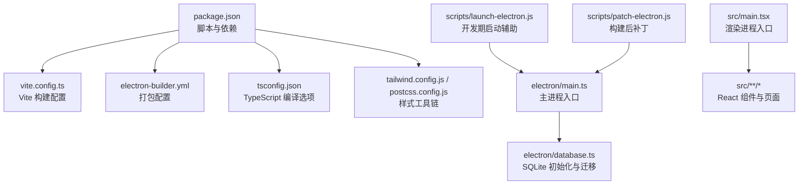
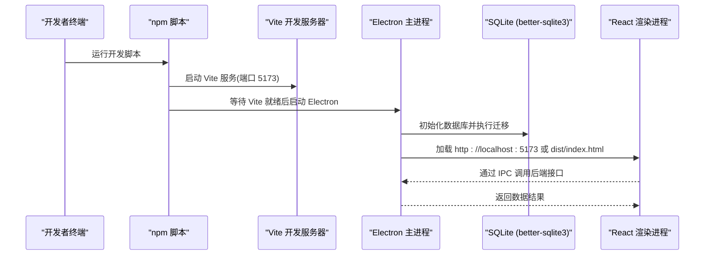
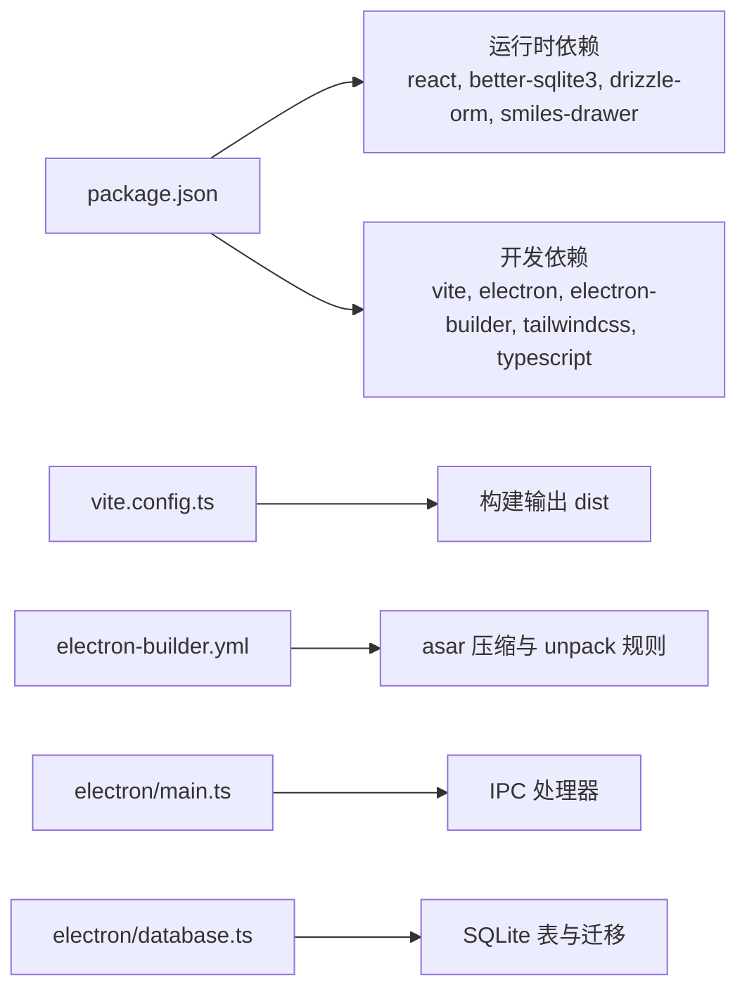

# 快速开始

<cite>
**本文引用的文件**   
- [package.json](file://package.json)
- [vite.config.ts](file://vite.config.ts)
- [tsconfig.json](file://tsconfig.json)
- [tailwind.config.js](file://tailwind.config.js)
- [postcss.config.js](file://postcss.config.js)
- [electron-builder.yml](file://electron-builder.yml)
- [config.json](file://config.json)
- [electron/main.ts](file://electron/main.ts)
- [electron/database.ts](file://electron/database.ts)
- [src/main.tsx](file://src/main.tsx)
- [scripts/launch-electron.js](file://scripts/launch-electron.js)
- [scripts/patch-electron.js](file://scripts/patch-electron.js)
</cite>

## 目录
1. [简介](#简介)
2. [项目结构](#项目结构)
3. [核心组件](#核心组件)
4. [架构总览](#架构总览)
5. [详细组件分析](#详细组件分析)
6. [依赖分析](#依赖分析)
7. [性能与构建优化](#性能与构建优化)
8. [故障排查指南](#故障排查指南)
9. [结论](#结论)
10. [附录：命令速查](#附录命令速查)

## 简介
LabNote 是一款基于 Electron + React + TypeScript 的化学实验记录桌面应用。它提供项目管理、实验记录、试剂库、标签、模板、小部件窗口等能力，数据持久化使用 SQLite（better-sqlite3），前端通过 Vite 构建，打包分发使用 electron-builder。

本“快速开始”文档面向新用户，帮助你从克隆仓库到成功运行应用，涵盖环境要求、开发环境搭建、依赖安装配置、开发与生产构建、打包分发流程，以及常见问题的解决方案。

## 项目结构
- 根目录包含应用元信息、构建配置、脚本和源码目录。
- electron 目录为 Electron 主进程代码，负责窗口管理、IPC、数据库初始化与迁移、菜单与协议注册等。
- src 目录为 React 渲染进程代码，入口在 main.tsx，页面与组件按功能模块组织。
- scripts 目录包含开发期启动辅助脚本与构建后补丁脚本。
- public 目录存放静态资源（如 Ketcher 化学结构编辑器）。
- config.json 用于默认数据存储路径配置；实际运行时用户数据路径由 Electron 主进程根据系统用户目录生成并持久化。

图表来源
- [package.json:1-39](file://package.json#L1-L39)
- [vite.config.ts:1-26](file://vite.config.ts#L1-L26)
- [electron-builder.yml:1-52](file://electron-builder.yml#L1-L52)
- [tsconfig.json:1-26](file://tsconfig.json#L1-L26)
- [tailwind.config.js:1-50](file://tailwind.config.js#L1-L50)
- [postcss.config.js:1-7](file://postcss.config.js#L1-L7)
- [electron/main.ts:1-132](file://electron/main.ts#L1-L132)
- [electron/database.ts:1-120](file://electron/database.ts#L1-L120)
- [src/main.tsx:1-14](file://src/main.tsx#L1-L14)
- [scripts/launch-electron.js:1-59](file://scripts/launch-electron.js#L1-L59)
- [scripts/patch-electron.js:1-49](file://scripts/patch-electron.js#L1-L49)

章节来源
- [package.json:1-39](file://package.json#L1-L39)
- [vite.config.ts:1-26](file://vite.config.ts#L1-L26)
- [electron-builder.yml:1-52](file://electron-builder.yml#L1-L52)
- [tsconfig.json:1-26](file://tsconfig.json#L1-L26)
- [tailwind.config.js:1-50](file://tailwind.config.js#L1-L50)
- [postcss.config.js:1-7](file://postcss.config.js#L1-L7)
- [electron/main.ts:1-132](file://electron/main.ts#L1-L132)
- [electron/database.ts:1-120](file://electron/database.ts#L1-L120)
- [src/main.tsx:1-14](file://src/main.tsx#L1-L14)
- [scripts/launch-electron.js:1-59](file://scripts/launch-electron.js#L1-L59)
- [scripts/patch-electron.js:1-49](file://scripts/patch-electron.js#L1-L49)

## 核心组件
- 主进程（Electron）
  - 窗口管理：创建主窗口与小部件窗口，处理显示、置顶、嵌入桌面等。
  - IPC 通信：暴露给渲染进程的 API，包括项目、实验、标签、模板、试剂等 CRUD。
  - 数据库：初始化 better-sqlite3，执行建表与迁移，支持 WAL 模式与外键约束。
  - 协议与图片：自定义 labnote:// 协议安全读取 images 目录。
  - 菜单：提供选择数据库位置、退出、开发者工具等菜单项。
- 渲染进程（React）
  - 入口：main.tsx 挂载 React 应用并使用 HashRouter。
  - 页面与组件：位于 src/pages 与 src/components，实现业务界面。
- 构建与打包
  - Vite：前端构建与开发服务器，输出到 dist。
  - TypeScript：编译 Node/Electron 侧代码到 dist-electron。
  - electron-builder：打包为安装包或目录分发，asar 压缩，按需排除开发依赖。

章节来源
- [electron/main.ts:100-132](file://electron/main.ts#L100-L132)
- [electron/database.ts:1-120](file://electron/database.ts#L1-120)
- [src/main.tsx:1-14](file://src/main.tsx#L1-14)
- [vite.config.ts:13-25](file://vite.config.ts#L13-L25)
- [electron-builder.yml:1-52](file://electron-builder.yml#L1-L52)

## 架构总览
下图展示了开发环境与生产环境的整体流程：开发时 Vite 提供本地服务，Electron 加载该服务；生产时 Electron 直接加载构建产物。

图表来源
- [package.json:6-12](file://package.json#L6-L12)
- [vite.config.ts:13-25](file://vite.config.ts#L13-L25)
- [electron/main.ts:122-132](file://electron/main.ts#L122-L132)
- [electron/database.ts:1-120](file://electron/database.ts#L1-120)

## 详细组件分析

### 环境要求与准备
- 操作系统
  - Windows：官方打包目标为 NSIS x64，推荐使用 Windows 10/11 64 位。
  - macOS/Linux：可参考 electron-builder 的通用说明进行扩展，但当前配置仅显式声明了 Windows 目标。
- Node.js 与 npm
  - 建议使用较新的 LTS 版本（Node 18+），以兼容 ESNext 模块解析与 Vite 5。
  - 若遇到原生模块编译问题，请确保已安装 Python 与 C++ 构建工具链（Windows 推荐 Visual Studio Build Tools）。
- 磁盘空间
  - 构建与打包会生成 dist、dist-electron、release 等目录，建议预留足够空间。

章节来源
- [electron-builder.yml:6-10](file://electron-builder.yml#L6-L10)
- [vite.config.ts:1-12](file://vite.config.ts#L1-L12)
- [tsconfig.json:1-26](file://tsconfig.json#L1-L26)

### 开发环境搭建步骤
1. 克隆仓库
   - 将项目克隆到本地工作目录。
2. 安装依赖
   - 在项目根目录执行依赖安装命令。
3. 首次运行
   - 执行开发脚本，自动启动 Vite 开发服务器并在 Electron 中打开应用。
   - 首次启动会自动创建默认数据存储目录（通常为“文档/LabNoteData”），后续可在菜单中选择新位置。
4. 验证
   - 确认主窗口正常显示，菜单可用，数据库文件出现在默认数据目录。

章节来源
- [package.json:6-12](file://package.json#L6-L12)
- [electron/main.ts:84-98](file://electron/main.ts#L84-L98)
- [config.json:1-3](file://config.json#L1-L3)

### 依赖安装与配置
- 关键依赖
  - 运行时：react、react-dom、react-router-dom、better-sqlite3、drizzle-orm、smiles-drawer。
  - 开发时：typescript、vite、@vitejs/plugin-react、electron、electron-builder、concurrently、wait-on、tailwindcss、autoprefixer、postcss、drizzle-kit。
- 构建产物
  - 渲染产物输出到 dist，Electron 侧产物输出到 dist-electron。
- 别名与路径
  - tsconfig 与 vite.config 均配置 @ 指向 src 目录，便于统一导入。

章节来源
- [package.json:14-37](file://package.json#L14-L37)
- [vite.config.ts:8-12](file://vite.config.ts#L8-L12)
- [tsconfig.json:18-22](file://tsconfig.json#L18-L22)

### 开发模式启动
- 启动命令
  - 使用开发脚本一键启动：同时编译 Node 侧 TS、启动 Vite、等待服务就绪后启动 Electron。
- 环境变量
  - 开发模式下 Electron 优先加载 Vite 开发服务器地址（可通过环境变量覆盖）。
- 开发体验
  - 支持热重载、开发者工具、强制重新加载等。

章节来源
- [package.json:6-12](file://package.json#L6-L12)
- [electron/main.ts:122-132](file://electron/main.ts#L122-L132)

### 生产环境构建
- 构建前端
  - 使用 Vite 构建 React 应用，输出到 dist，启用 esbuild 压缩与手动分包。
- 构建 Electron 侧
  - 使用 TypeScript 编译 electron 目录到 dist-electron。
- 完整构建
  - 先构建前端，再构建 Electron 侧，顺序不可颠倒。

章节来源
- [vite.config.ts:13-25](file://vite.config.ts#L13-L25)
- [package.json:8-10](file://package.json#L8-L10)

### 应用打包与分发
- 打包为目录（调试/测试）
  - 构建完成后打包为目录形式，便于检查产物结构与大小。
- 打包为安装包
  - 构建完成后使用 electron-builder 生成安装包（NSIS）。
- 打包配置要点
  - 输出目录 release，产物命名包含版本号。
  - 启用 asar 压缩，但保留 better-sqlite3 与 ketcher 静态资源不被压缩。
  - 排除开发依赖与源文件，减小包体。
  - 下载镜像：Electron 二进制可从国内镜像下载，加速构建。

章节来源
- [package.json:11-12](file://package.json#L11-L12)
- [electron-builder.yml:1-52](file://electron-builder.yml#L1-L52)

### 数据存储与迁移
- 数据目录
  - 默认存储在“文档/LabNoteData”，首次启动自动创建并写入配置。
  - 支持在菜单中选择新的数据存储目录，并动态切换数据库连接。
- 数据库初始化
  - 使用 better-sqlite3，开启 WAL 模式与外键约束。
  - 自动建表与字段迁移，保证向后兼容。
- 预置数据
  - 首次启动时插入预设模块模板（表征数据、理论计算、安全信息、参考文献、物料清单）。

章节来源
- [electron/main.ts:84-98](file://electron/main.ts#L84-L98)
- [electron/database.ts:13-120](file://electron/database.ts#L13-L120)
- [electron/database.ts:179-257](file://electron/database.ts#L179-L257)

### 小部件窗口与桌面嵌入（Windows）
- 小部件窗口
  - 无边框透明窗口，支持拖拽调整大小，点击聚焦后取消置顶并推至底层。
- 桌面嵌入
  - 通过 PowerShell 调用 user32.dll 将窗口父级设置为桌面容器，使其仅在桌面可见时显示。
- 交互
  - 通过 IPC 控制小部件的开关、导航到主窗口指定路由、刷新数据等。

章节来源
- [electron/main.ts:145-237](file://electron/main.ts#L145-L237)
- [electron/main.ts:239-288](file://electron/main.ts#L239-L288)

## 依赖分析
- 运行时依赖
  - React 生态：react、react-dom、react-router-dom。
  - 数据库：better-sqlite3（原生模块）、drizzle-orm（类型定义与查询构建）。
  - 化学结构：smiles-drawer。
- 开发依赖
  - 构建与打包：vite、@vitejs/plugin-react、electron、electron-builder。
  - 并发与等待：concurrently、wait-on。
  - 样式：tailwindcss、autoprefixer、postcss。
  - 类型与语言：typescript、@types/*。
  - 数据库工具：drizzle-kit。

图表来源
- [package.json:14-37](file://package.json#L14-L37)
- [vite.config.ts:13-25](file://vite.config.ts#L13-L25)
- [electron-builder.yml:42-52](file://electron-builder.yml#L42-L52)
- [electron/main.ts:395-800](file://electron/main.ts#L395-L800)
- [electron/database.ts:18-155](file://electron/database.ts#L18-L155)

章节来源
- [package.json:14-37](file://package.json#L14-L37)
- [vite.config.ts:13-25](file://vite.config.ts#L13-L25)
- [electron-builder.yml:42-52](file://electron-builder.yml#L42-L52)
- [electron/main.ts:395-800](file://electron/main.ts#L395-L800)
- [electron/database.ts:18-155](file://electron/database.ts#L18-L155)

## 性能与构建优化
- 前端构建
  - 使用 esbuild 压缩，减少体积与提升速度。
  - 手动分包 vendor，将 react、react-dom、react-router-dom 独立打包，利于缓存。
- 打包体积
  - 通过 electron-builder 的 files 白名单与排除规则，剔除开发依赖与源文件。
  - asar 压缩进一步减小安装包体积。
- 数据库性能
  - 开启 WAL 模式，提高并发读写性能。
  - 合理索引与唯一约束，避免重复数据与冗余查询。

章节来源
- [vite.config.ts:13-25](file://vite.config.ts#L13-L25)
- [electron-builder.yml:22-41](file://electron-builder.yml#L22-L41)
- [electron/database.ts:13-15](file://electron/database.ts#L13-L15)

## 故障排查指南
- 无法找到 Electron 二进制或启动失败
  - 检查 node_modules 是否完整安装，必要时清理缓存后重装。
  - 若网络受限，确认 electron-builder 的下载镜像配置生效。
- 原生模块编译错误（better-sqlite3）
  - 安装 Python 与 C++ 构建工具链（Windows 推荐 Visual Studio Build Tools）。
  - 确保 Node.js 版本与平台 ABI 匹配。
- 开发模式端口占用
  - 修改 Vite 端口或释放占用端口后重试。
- 数据库路径权限不足
  - 确保对默认数据目录或自定义目录具有读写权限。
  - 通过菜单“选择数据库位置...”切换到有权限的路径。
- 打包后图标缺失或资源未包含
  - 检查 resources/icon.ico 是否存在。
  - 确认 electron-builder.yml 的 files 与 asarUnpack 规则正确。
- 构建产物过大
  - 检查是否误包含开发依赖或 .map 文件。
  - 确认 exclude 规则生效。

章节来源
- [electron-builder.yml:50-52](file://electron-builder.yml#L50-L52)
- [electron-builder.yml:10](file://electron-builder.yml#L10)
- [electron-builder.yml:42-52](file://electron-builder.yml#L42-L52)
- [electron/main.ts:306-336](file://electron/main.ts#L306-L336)

## 结论
通过以上步骤，你可以在本地完成 LabNote 的开发环境搭建、运行与打包分发。建议在开发阶段频繁使用开发模式进行迭代，在发布前执行完整构建与打包，并根据需要调整 electron-builder 的配置以满足不同平台的分发需求。

## 附录：命令速查
- 安装依赖
  - 在项目根目录执行依赖安装命令。
- 开发模式
  - 一键启动开发环境（Vite + Electron）。
- 构建
  - 构建前端与 Electron 侧产物。
- 打包
  - 打包为目录（调试/测试）。
  - 打包为安装包（NSIS）。

章节来源
- [package.json:6-12](file://package.json#L6-L12)