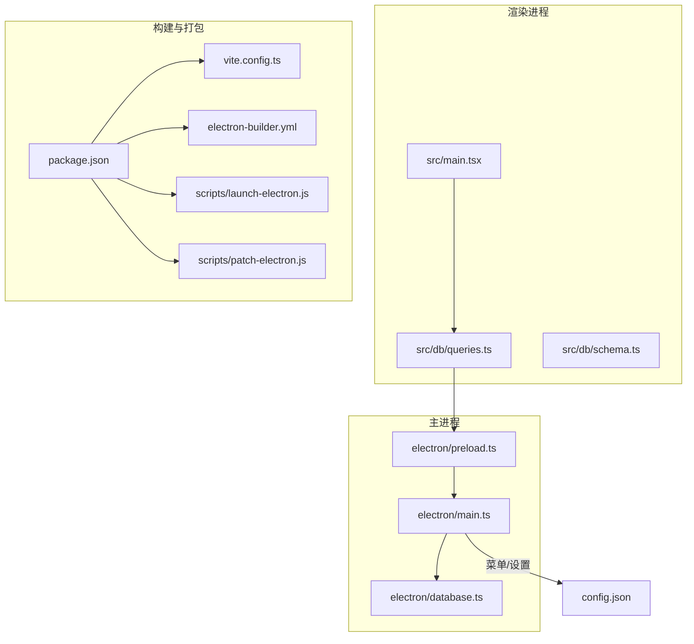
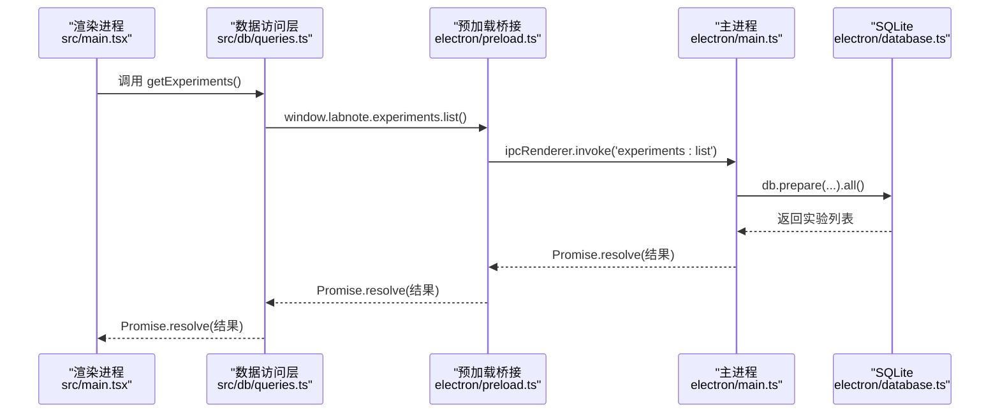
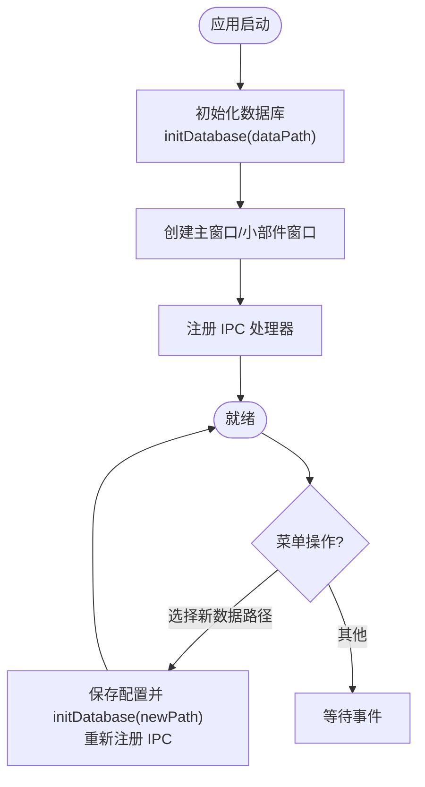
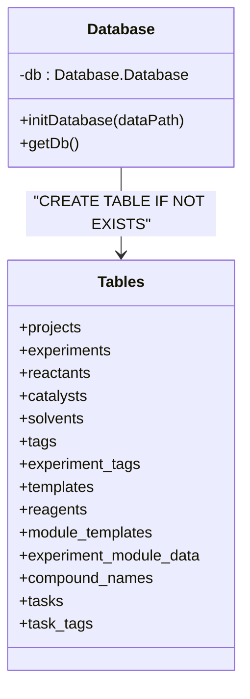
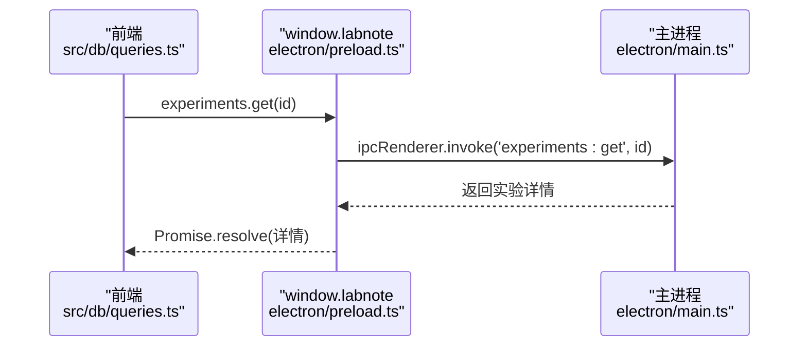
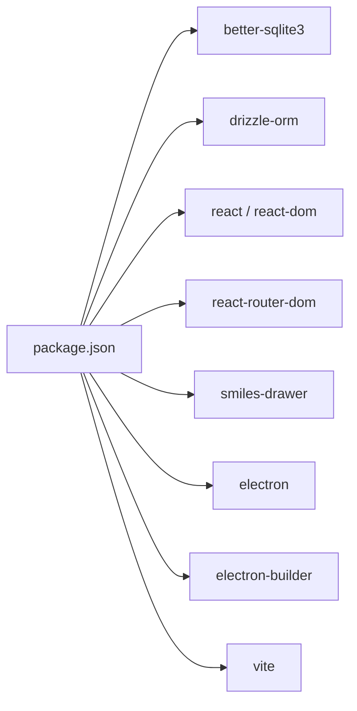

# 故障排除

<cite>
**本文引用的文件**   
- [package.json](file://package.json)
- [electron/main.ts](file://electron/main.ts)
- [electron/database.ts](file://electron/database.ts)
- [electron/preload.ts](file://electron/preload.ts)
- [src/db/schema.ts](file://src/db/schema.ts)
- [src/db/queries.ts](file://src/db/queries.ts)
- [src/main.tsx](file://src/main.tsx)
- [vite.config.ts](file://vite.config.ts)
- [electron-builder.yml](file://electron-builder.yml)
- [scripts/launch-electron.js](file://scripts/launch-electron.js)
- [scripts/patch-electron.js](file://scripts/patch-electron.js)
- [config.json](file://config.json)
</cite>

## 目录
1. [简介](#简介)
2. [项目结构](#项目结构)
3. [核心组件](#核心组件)
4. [架构总览](#架构总览)
5. [详细组件分析](#详细组件分析)
6. [依赖关系分析](#依赖关系分析)
7. [性能考虑](#性能考虑)
8. [故障排除指南](#故障排除指南)
9. [结论](#结论)
10. [附录](#附录)

## 简介
本指南面向 LabNote 用户与开发者，系统化整理安装、运行、数据库连接、文件权限等常见问题及解决方案；提供 Electron 调试、React DevTools 使用、日志分析技巧；并给出性能问题诊断与优化策略（内存泄漏检测、渲染性能优化、数据库查询优化）。文档同时说明错误日志格式与异常堆栈分析方法，以及社区支持与反馈流程。

## 项目结构
LabNote 采用 Electron + React + TypeScript 技术栈：
- 主进程负责窗口管理、IPC 路由、本地文件系统与 SQLite 数据库访问
- 预加载脚本通过 contextBridge 暴露安全 API 给渲染进程
- 渲染进程基于 React 与 HashRouter 组织页面
- 构建与打包由 Vite 与 electron-builder 完成

图示来源
- [electron/main.ts:1-132](file://electron/main.ts#L1-L132)
- [electron/database.ts:1-120](file://electron/database.ts#L1-L120)
- [electron/preload.ts:1-80](file://electron/preload.ts#L1-L80)
- [src/main.tsx:1-14](file://src/main.tsx#L1-L14)
- [src/db/queries.ts:1-30](file://src/db/queries.ts#L1-L30)
- [src/db/schema.ts:1-30](file://src/db/schema.ts#L1-L30)
- [package.json:1-13](file://package.json#L1-L13)
- [vite.config.ts:1-26](file://vite.config.ts#L1-L26)
- [electron-builder.yml:1-52](file://electron-builder.yml#L1-L52)
- [scripts/launch-electron.js:1-58](file://scripts/launch-electron.js#L1-L58)
- [scripts/patch-electron.js:1-48](file://scripts/patch-electron.js#L1-L48)

章节来源
- [package.json:1-13](file://package.json#L1-L13)
- [vite.config.ts:1-26](file://vite.config.ts#L1-L26)
- [electron-builder.yml:1-52](file://electron-builder.yml#L1-L52)

## 核心组件
- 主进程入口与窗口管理：创建主窗口与悬浮小部件窗口，处理菜单、协议与 IPC 路由
- 数据库初始化与迁移：WAL 模式、外键约束、表结构创建与增量迁移、预设模板填充
- 预加载桥接：将主进程能力以类型化 API 暴露给渲染进程
- 前端数据访问层：统一封装 window.labnote.* 调用，屏蔽 IPC 细节
- 构建与开发脚本：绕过 npm electron wrapper、补丁兼容、产物打包与资源剥离

章节来源
- [electron/main.ts:102-132](file://electron/main.ts#L102-L132)
- [electron/database.ts:6-120](file://electron/database.ts#L6-L120)
- [electron/preload.ts:82-165](file://electron/preload.ts#L82-L165)
- [src/db/queries.ts:23-30](file://src/db/queries.ts#L23-L30)
- [scripts/launch-electron.js:1-58](file://scripts/launch-electron.js#L1-L58)
- [scripts/patch-electron.js:1-48](file://scripts/patch-electron.js#L1-L48)

## 架构总览
下图展示从渲染进程到主进程再到数据库的完整调用链，以及关键错误点与日志位置。

图示来源
- [src/main.tsx:7-13](file://src/main.tsx#L7-L13)
- [src/db/queries.ts:56-58](file://src/db/queries.ts#L56-L58)
- [electron/preload.ts:96-108](file://electron/preload.ts#L96-L108)
- [electron/main.ts:461-468](file://electron/main.ts#L461-L468)
- [electron/database.ts:1-15](file://electron/database.ts#L1-L15)

## 详细组件分析

### 主进程与 IPC 路由
- 窗口生命周期：主窗口与小部件窗口分别创建，支持开发/生产环境 URL 切换
- 菜单功能：支持“选择数据库位置”动态迁移数据路径并重新初始化数据库
- 自定义协议：labnote://images/... 安全读取图片，防止路径穿越
- IPC 处理器：集中注册项目、实验、标签、模板、试剂、模块布局、任务等接口
- 事务与校验：实验写入使用事务，并在更新前校验外键引用，避免约束失败

图示来源
- [electron/main.ts:84-98](file://electron/main.ts#L84-L98)
- [electron/main.ts:102-132](file://electron/main.ts#L102-L132)
- [electron/main.ts:298-374](file://electron/main.ts#L298-L374)
- [electron/main.ts:378-391](file://electron/main.ts#L378-L391)
- [electron/main.ts:395-401](file://electron/main.ts#L395-L401)
- [electron/main.ts:306-336](file://electron/main.ts#L306-L336)

章节来源
- [electron/main.ts:102-132](file://electron/main.ts#L102-L132)
- [electron/main.ts:298-374](file://electron/main.ts#L298-L374)
- [electron/main.ts:378-391](file://electron/main.ts#L378-L391)
- [electron/main.ts:395-401](file://electron/main.ts#L395-L401)
- [electron/main.ts:306-336](file://electron/main.ts#L306-L336)

### 数据库初始化与迁移
- 存储路径：dataPath/labnote.db，默认位于系统“文档/LabNoteData”
- 运行时参数：开启 WAL 与外键约束
- 表结构：项目、实验、反应物、催化剂、溶剂、标签、模板、试剂、模块模板、实验模块数据、化合物名称缓存、任务与任务标签
- 迁移策略：按列名检查后增量添加字段；重建 tags 表以支持 (name, type) 唯一约束
- 预设数据：首次启动时插入内置模块模板

图示来源
- [electron/database.ts:6-15](file://electron/database.ts#L6-L15)
- [electron/database.ts:18-177](file://electron/database.ts#L18-L177)
- [electron/database.ts:262-314](file://electron/database.ts#L262-L314)

章节来源
- [electron/database.ts:6-15](file://electron/database.ts#L6-L15)
- [electron/database.ts:18-177](file://electron/database.ts#L18-L177)
- [electron/database.ts:262-314](file://electron/database.ts#L262-L314)

### 预加载桥接与前端数据访问
- 预加载：通过 contextBridge 暴露 labnote API，包含 app、images、projects、experiments、tags、templates、reagents、modules、compound、tasks、widget 等命名空间
- 前端访问层：统一封装 window.labnote.* 调用，若未加载则抛出明确错误提示

图示来源
- [electron/preload.ts:96-108](file://electron/preload.ts#L96-L108)
- [src/db/queries.ts:60-62](file://src/db/queries.ts#L60-L62)
- [electron/main.ts:470-493](file://electron/main.ts#L470-L493)

章节来源
- [electron/preload.ts:82-165](file://electron/preload.ts#L82-L165)
- [src/db/queries.ts:23-30](file://src/db/queries.ts#L23-L30)
- [src/db/queries.ts:60-62](file://src/db/queries.ts#L60-L62)
- [electron/main.ts:470-493](file://electron/main.ts#L470-L493)

### 构建与开发脚本
- 开发启动：scripts/launch-electron.js 临时重命名 npm electron wrapper，直接启动 electron.exe，退出后恢复
- 构建补丁：scripts/patch-electron.js 在 dist-electron/main.js 中注入兼容逻辑，解决 require("electron") 被拦截的问题
- 打包配置：electron-builder.yml 指定目标平台、asar 打包、按需 unpack better-sqlite3 与 ketcher 静态资源

章节来源
- [scripts/launch-electron.js:1-58](file://scripts/launch-electron.js#L1-L58)
- [scripts/patch-electron.js:1-48](file://scripts/patch-electron.js#L1-L48)
- [electron-builder.yml:1-52](file://electron-builder.yml#L1-L52)

## 依赖关系分析
- 运行时依赖：better-sqlite3（原生模块）、drizzle-orm（类型定义参考）、react/react-dom、react-router-dom、smiles-drawer
- 开发依赖：electron、electron-builder、vite、typescript、tailwindcss 等
- 构建产物：dist（渲染资源）、dist-electron（主进程编译产物）

图示来源
- [package.json:14-37](file://package.json#L14-L37)

章节来源
- [package.json:14-37](file://package.json#L14-L37)

## 性能考虑
- 数据库
  - 已启用 WAL 模式，提升并发读性能与崩溃恢复能力
  - 外键约束开启，保证数据一致性
  - 建议对高频查询字段建立索引（如 experiments.date、projects.name），减少全表扫描
- 渲染
  - 大列表分页或虚拟滚动，避免一次性渲染过多节点
  - 图片懒加载与缩略图缓存，降低内存占用
- 主进程
  - 批量写入使用事务，减少磁盘 I/O 次数
  - 避免在主线程执行阻塞 I/O，必要时拆分任务或使用 worker

[本节为通用指导，不直接分析具体文件]

## 故障排除指南

### 安装与环境问题
- 现象：npm install 报错或 native 模块编译失败
  - 排查要点：Node 版本与 better-sqlite3 兼容性；网络镜像配置；是否具备 C++ 构建工具链
  - 参考：构建镜像与打包配置
- 现象：Electron 无法启动或 require("electron") 被拦截
  - 排查要点：确认 scripts/launch-electron.js 与 scripts/patch-electron.js 是否生效；检查 dist-electron/main.js 是否被正确打补丁
- 现象：打包后运行异常
  - 排查要点：electron-builder.yml 中 asarUnpack 是否包含 better-sqlite3 与 ketcher 静态资源；确保 node_modules 未被误剔除

章节来源
- [package.json:1-13](file://package.json#L1-L13)
- [electron-builder.yml:42-52](file://electron-builder.yml#L42-L52)
- [scripts/launch-electron.js:1-58](file://scripts/launch-electron.js#L1-L58)
- [scripts/patch-electron.js:1-48](file://scripts/patch-electron.js#L1-L48)

### 运行时错误
- 现象：界面空白或白屏
  - 排查要点：Vite 开发服务器是否可用；主进程是否正确加载 devServerUrl 或 dist/index.html
- 现象：菜单项点击无响应
  - 排查要点：确认主进程菜单已注册；相关 ipcMain.handle 是否成功绑定
- 现象：小部件窗口无法显示或嵌入桌面失败
  - 排查要点：Windows PowerShell 脚本执行权限；窗口句柄获取与 SetParent 调用是否成功

章节来源
- [electron/main.ts:122-132](file://electron/main.ts#L122-L132)
- [electron/main.ts:298-374](file://electron/main.ts#L298-L374)
- [electron/main.ts:206-236](file://electron/main.ts#L206-L236)

### 数据库连接失败
- 现象：启动时报错无法打开数据库
  - 排查要点：dataPath 是否存在且可写；labnote.db 是否被占用；WAL 模式下 .wal/.shm 文件权限
- 现象：外键约束失败
  - 排查要点：写入前校验 project_id 是否存在；更新事务中先删除子表再插入
- 现象：迁移失败或字段缺失
  - 排查要点：检查 PRAGMA table_info 结果；确认迁移逻辑是否跳过已有列

章节来源
- [electron/database.ts:6-15](file://electron/database.ts#L6-L15)
- [electron/main.ts:495-577](file://electron/main.ts#L495-L577)
- [electron/main.ts:579-655](file://electron/main.ts#L579-L655)
- [electron/database.ts:262-314](file://electron/database.ts#L262-L314)

### 文件权限问题
- 现象：保存图片失败
  - 排查要点：images 目录是否创建成功；写入路径是否在 dataPath 下；base64 数据 URL 是否合法
- 现象：自定义协议 labnote://images/... 无法加载图片
  - 排查要点：协议处理器是否注册；路径解析是否越界；net.fetch 是否可用

章节来源
- [electron/main.ts:407-419](file://electron/main.ts#L407-L419)
- [electron/main.ts:378-391](file://electron/main.ts#L378-L391)

### 日志分析与异常堆栈
- 日志格式
  - 主进程日志前缀：[LabNote] ...
  - 小部件日志前缀：[widget] ...
  - 常见级别：console.log、console.warn、console.error
- 定位步骤
  - 在控制台过滤 [LabNote] 与 [widget] 关键字
  - 关注 FATAL 与 error 行，结合堆栈信息定位函数与行号
  - 对于事务失败，查看“transaction rolled back”前后日志，确认触发约束或数据完整性问题的语句
- 典型错误线索
  - “FATAL: Database not initialized, IPC handlers will not work”：数据库未初始化或路径无效
  - “Failed to move database”：迁移过程中 IO 或权限异常
  - “Invalid image data URL”：图片 base64 格式不正确

章节来源
- [electron/main.ts:397-401](file://electron/main.ts#L397-L401)
- [electron/main.ts:331-336](file://electron/main.ts#L331-L336)
- [electron/main.ts:408-419](file://electron/main.ts#L408-L419)
- [electron/main.ts:572-577](file://electron/main.ts#L572-L577)
- [electron/main.ts:650-655](file://electron/main.ts#L650-L655)

### 调试方法
- Electron 调试
  - 开发环境：主进程菜单“开发者工具”或快捷键打开；也可通过 widget:devtools 打开小部件窗口 DevTools
  - 生产环境：通过菜单“开发者工具”或调用 widget.devtools
- React DevTools
  - 在浏览器/DevTools 中安装 React DevTools 扩展，用于组件树与状态分析
- 前端数据访问层
  - 若出现 window.labnote is not available，检查 preload.js 是否加载、contextIsolation 与 nodeIntegration 配置

章节来源
- [electron/main.ts:343-352](file://electron/main.ts#L343-L352)
- [electron/main.ts:283-288](file://electron/main.ts#L283-L288)
- [src/db/queries.ts:23-30](file://src/db/queries.ts#L23-L30)
- [electron/main.ts:110-116](file://electron/main.ts#L110-L116)

### 性能问题诊断与优化
- 内存泄漏检测
  - 使用 Chrome DevTools Memory 面板进行 Heap Snapshot 对比，查找 DOM 引用与闭包残留
  - 关注长生命周期对象（如全局缓存、事件监听器）是否及时释放
- 渲染性能优化
  - 列表虚拟化、图片懒加载、减少不必要的重排与重绘
  - 合理拆分组件，避免在大型表单中频繁触发全量重渲染
- 数据库查询优化
  - 为常用筛选字段建立索引（如日期、项目名称、标签）
  - 避免 N+1 查询，尽量使用 JOIN 或批量获取
  - 使用事务批量写入，减少磁盘同步开销

[本节为通用指导，不直接分析具体文件]

### 错误日志格式与异常堆栈分析
- 日志前缀与级别
  - [LabNote]：主进程业务日志
  - [widget]：小部件相关日志
  - console.error/warn/log：分别对应错误、警告与一般信息
- 堆栈分析
  - 优先关注 Error 消息与调用栈中的文件名与行号
  - 事务回滚错误需结合前后日志，定位具体 SQL 语句与参数
- 快速定位清单
  - 数据库未初始化 → 检查 dataPath 与 initDatabase 调用
  - 外键约束失败 → 检查关联记录是否存在
  - 图片保存失败 → 检查 base64 格式与目录权限
  - 协议加载失败 → 检查 labnote:// 协议处理器与路径解析

章节来源
- [electron/main.ts:397-401](file://electron/main.ts#L397-L401)
- [electron/main.ts:572-577](file://electron/main.ts#L572-L577)
- [electron/main.ts:408-419](file://electron/main.ts#L408-L419)
- [electron/main.ts:378-391](file://electron/main.ts#L378-L391)

### 社区支持与问题反馈
- 反馈渠道
  - 提交 Issue：附上操作系统版本、Electron 版本、数据库路径与权限信息、关键日志片段
  - 复现步骤：最小化操作步骤与期望行为
- 收集信息清单
  - 应用版本与构建方式（开发/打包）
  - 数据路径与 labnote.db 大小
  - 控制台日志（过滤 [LabNote] 与 [widget]）
  - 截图或录屏（界面异常、弹窗错误）

[本节为通用指导，不直接分析具体文件]

## 结论
通过理解主进程与渲染进程的边界、IPC 通信机制、数据库初始化与迁移策略，以及完善的日志输出，可以快速定位大多数安装、运行与数据相关问题。配合 Electron 与 React DevTools 的调试能力，以及针对性能的诊断与优化建议，能够显著提升问题修复效率与应用稳定性。

## 附录

### 关键配置与路径
- 数据路径
  - 默认：系统“文档/LabNoteData”
  - 可通过菜单“选择数据库位置...”动态迁移
  - 配置文件：userData/config.json
- 构建与打包
  - 开发：Vite 服务 + Electron 直连
  - 打包：electron-builder 生成安装包，asar 打包，按需 unpack 原生模块与静态资源

章节来源
- [electron/main.ts:84-98](file://electron/main.ts#L84-L98)
- [electron/main.ts:306-336](file://electron/main.ts#L306-L336)
- [config.json:1-3](file://config.json#L1-L3)
- [electron-builder.yml:1-52](file://electron-builder.yml#L1-L52)