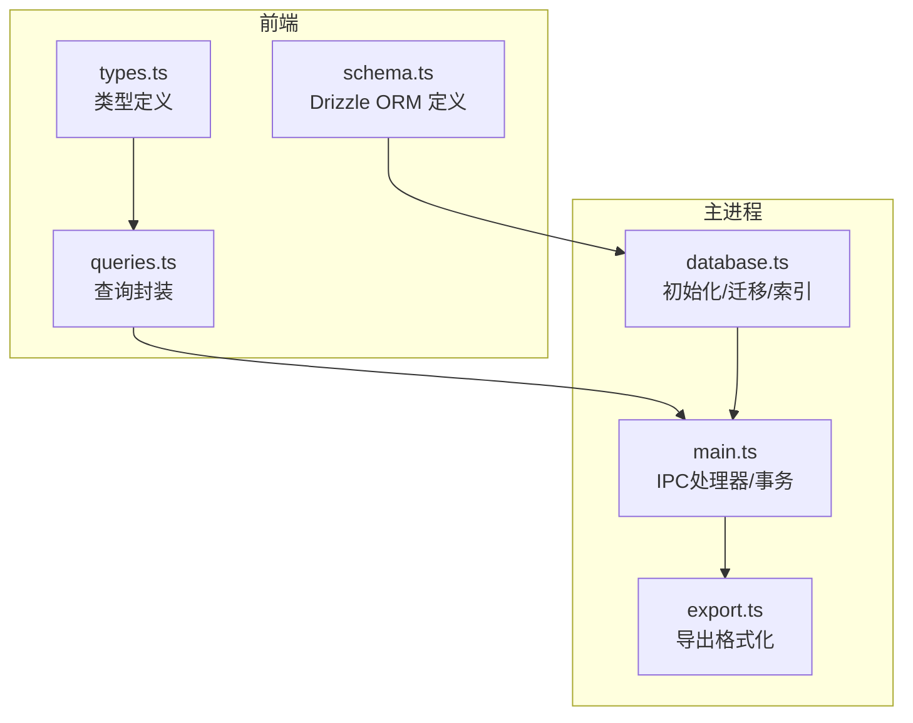
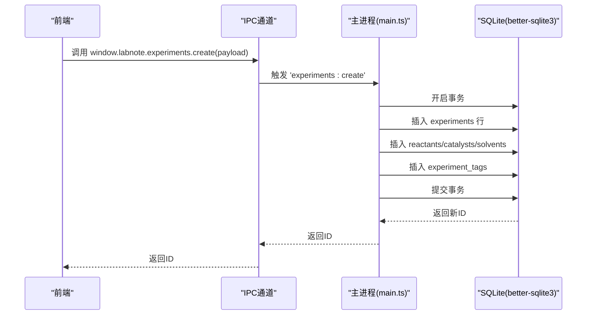
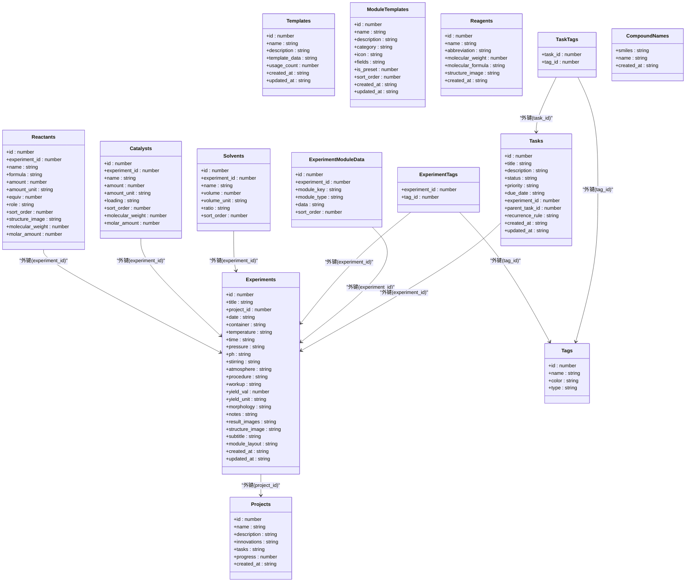
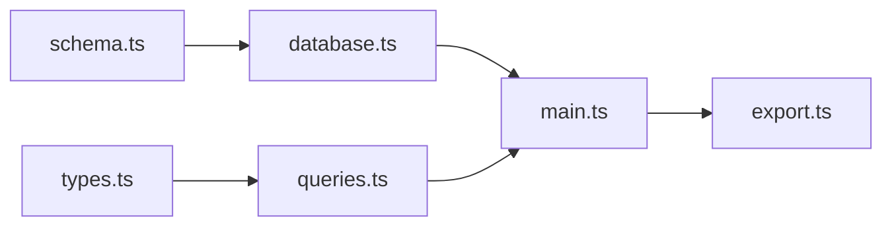

# 数据库设计

<cite>
**本文引用的文件列表**
- [schema.ts](file://src/db/schema.ts)
- [queries.ts](file://src/db/queries.ts)
- [database.ts](file://electron/database.ts)
- [main.ts](file://electron/main.ts)
- [types.ts](file://src/types.ts)
- [export.ts](file://electron/export.ts)
</cite>

## 目录
1. [简介](#简介)
2. [项目结构与数据库相关模块](#项目结构与数据库相关模块)
3. [核心数据模型](#核心数据模型)
4. [架构总览](#架构总览)
5. [组件与数据流详解](#组件与数据流详解)
6. [依赖关系分析](#依赖关系分析)
7. [性能与优化建议](#性能与优化建议)
8. [故障排查指南](#故障排查指南)
9. [结论](#结论)
10. [附录：SQL示例与TypeScript类型](#附录sql示例与typescript类型)

## 简介
本文件面向LabNote项目的SQLite数据库系统，提供完整数据模型文档。内容涵盖：
- 所有数据表的结构定义、字段类型、约束与索引
- 实体间关系映射（一对多、多对多）
- 数据访问层封装（IPC调用、事务处理、类型安全）
- 数据迁移策略与版本管理
- 数据完整性保障、备份与恢复思路
- 性能优化建议与常见问题排查
- 具体SQL查询示例与TypeScript类型说明

## 项目结构与数据库相关模块
- 前端类型与查询辅助：src/db/schema.ts（Drizzle ORM定义）、src/db/queries.ts（前端查询封装）
- 主进程数据库初始化与迁移：electron/database.ts
- 主进程数据库操作与事务：electron/main.ts
- 类型定义：src/types.ts
- 导出格式化：electron/export.ts

图表来源
- [queries.ts:1-193](file://src/db/queries.ts#L1-L193)
- [types.ts:1-316](file://src/types.ts#L1-L316)
- [schema.ts:1-109](file://src/db/schema.ts#L1-L109)
- [database.ts:1-320](file://electron/database.ts#L1-L320)
- [main.ts:395-1046](file://electron/main.ts#L395-L1046)
- [export.ts:1-138](file://electron/export.ts#L1-L138)

章节来源
- [schema.ts:1-109](file://src/db/schema.ts#L1-L109)
- [queries.ts:1-193](file://src/db/queries.ts#L1-L193)
- [database.ts:1-320](file://electron/database.ts#L1-L320)
- [main.ts:395-1046](file://electron/main.ts#L395-L1046)
- [types.ts:1-316](file://src/types.ts#L1-L316)
- [export.ts:1-138](file://electron/export.ts#L1-L138)

## 核心数据模型
本节按表维度说明字段、类型、约束与索引，并解释实体关系。

- projects（项目）
  - 字段与类型
    - id: 整数，自增主键
    - name: 文本，非空
    - description: 文本
    - innovations: 文本，默认空字符串
    - tasks: 文本，默认空字符串
    - progress: 整数，默认0
    - created_at: 文本，默认当前时间戳
  - 约束
    - 主键：id
    - 非空：name
  - 索引
    - 无显式索引（可按需添加）

- experiments（实验）
  - 字段与类型
    - id: 整数，自增主键
    - title: 文本，非空
    - project_id: 整数，外键 references projects(id)，删除时设为NULL
    - date: 文文，非空
    - container, temperature, time, pressure, ph, stirring, atmosphere, procedure, workup: 文本
    - yield_val: 浮点数
    - yield_unit: 文本，默认“%”
    - morphology: 文本
    - notes: 文本
    - result_images: 文本
    - structure_image: 文本
    - subtitle: 文本，默认空字符串
    - module_layout: 文本
    - created_at, updated_at: 文本，默认当前时间戳
  - 约束
    - 主键：id
    - 外键：project_id -> projects(id) ON DELETE SET NULL
    - 非空：title, date
  - 索引
    - 无显式索引（可考虑在project_id上建立索引以加速筛选）

- reactants（反应物）
  - 字段与类型
    - id: 整数，自增主键
    - experiment_id: 整数，非空，外键 references experiments(id)，级联删除
    - name: 文本，非空
    - formula: 文本
    - amount: 浮点数
    - amount_unit: 文本
    - equiv: 浮点数
    - role: 文本
    - sort_order: 整数
    - structure_image: 文本
    - molecular_weight: 浮点数
    - molar_amount: 浮点数
  - 约束
    - 主键：id
    - 外键：experiment_id -> experiments(id) ON DELETE CASCADE
    - 非空：experiment_id, name
  - 索引
    - 无显式索引

- catalysts（催化剂）
  - 字段与类型
    - id: 整数，自增主键
    - experiment_id: 整数，非空，外键 references experiments(id)，级联删除
    - name: 文本，非空
    - amount: 浮点数
    - amount_unit: 文本
    - loading: 文本（保留字段）
    - sort_order: 整数
    - molecular_weight: 浮点数
    - molar_amount: 浮点数
  - 约束
    - 主键：id
    - 外键：experiment_id -> experiments(id) ON DELETE CASCADE
    - 非空：experiment_id, name
  - 索引
    - 无显式索引

- solvents（溶剂）
  - 字段与类型
    - id: 整数，自增主键
    - experiment_id: 整数，非空，外键 references experiments(id)，级联删除
    - name: 文本，非空
    - volume: 浮点数
    - volume_unit: 文本
    - ratio: 文本
    - sort_order: 整数
  - 约束
    - 主键：id
    - 外键：experiment_id -> experiments(id) ON DELETE CASCADE
    - 非空：experiment_id, name
  - 索引
    - 无显式索引

- tags（标签）
  - 字段与类型
    - id: 整数，自增主键
    - name: 文本，非空
    - color: 文本，默认蓝色
    - type: 文本，默认“experiment”，非空
  - 约束
    - 主键：id
    - 唯一：(name, type) 组合唯一
  - 索引
    - 无显式索引（唯一约束会隐含索引）

- experiment_tags（实验-标签关联表）
  - 字段与类型
    - experiment_id: 整数，非空
    - tag_id: 整数，非空
  - 约束
    - 复合主键：(experiment_id, tag_id)
    - 外键：experiment_id -> experiments(id) ON DELETE CASCADE
    - 外键：tag_id -> tags(id) ON DELETE CASCADE
  - 索引
    - 无显式索引

- templates（模板）
  - 字段与类型
    - id: 整数，自增主键
    - name: 文本，非空
    - description: 文本
    - template_data: 文本，非空
    - usage_count: 整数，默认0
    - created_at, updated_at: 文本，默认当前时间戳
  - 约束
    - 主键：id
    - 非空：name, template_data
  - 索引
    - 无显式索引

- module_templates（模块模板）
  - 字段与类型
    - id: 整数，自增主键
    - name: 文本，非空
    - description: 文本
    - category: 文本，默认“custom”，非空
    - icon: 文本
    - fields: 文本，默认空数组字符串，非空
    - is_preset: 整数，默认0，非空
    - sort_order: 整数，默认0，非空
    - created_at, updated_at: 文本，默认当前时间戳
  - 约束
    - 主键：id
    - 非空：name, category, fields, is_preset, sort_order
  - 索引
    - 无显式索引

- experiment_module_data（实验-模块数据）
  - 字段与类型
    - id: 整数，自增主键
    - experiment_id: 整数，非空，外键 references experiments(id)，级联删除
    - module_key: 文本，非空
    - module_type: 文本，默认“custom”，非空
    - data: 文本，默认空对象字符串，非空
    - sort_order: 整数，默认0，非空
  - 约束
    - 主键：id
    - 外键：experiment_id -> experiments(id) ON DELETE CASCADE
    - 非空：experiment_id, module_key, module_type, data, sort_order
  - 索引
    - 唯一索引：(experiment_id, module_key)

- reagents（试剂库）
  - 字段与类型
    - id: 整数，自增主键
    - name: 文本，非空，唯一
    - abbreviation: 文本，默认空字符串
    - molecular_weight: 浮点数
    - molecular_formula: 文本，默认空字符串
    - structure_image: 文本
    - created_at: 文本，默认当前时间戳
  - 约束
    - 主键：id
    - 唯一：name
    - 非空：name
  - 索引
    - 无显式索引

- tasks（任务/待办/日历）
  - 字段与类型
    - id: 整数，自增主键
    - title: 文本，非空
    - description: 文本，默认空字符串
    - status: 文本，默认“todo”，检查值域
    - priority: 文本，默认“medium”，检查值域
    - due_date: 文本
    - experiment_id: 整数，外键 references experiments(id)，删除时设为NULL
    - parent_task_id: 整数，外键 references tasks(id)，级联删除
    - recurrence_rule: 文本
    - created_at, updated_at: 文本，默认当前时间戳
  - 约束
    - 主键：id
    - 外键：experiment_id -> experiments(id) ON DELETE SET NULL
    - 外键：parent_task_id -> tasks(id) ON DELETE CASCADE
    - 检查：status ∈ {todo,in_progress,done, cancelled}
    - 检查：priority ∈ {low,medium,high,urgent}
  - 索引
    - 无显式索引

- task_tags（任务-标签关联表）
  - 字段与类型
    - task_id: 整数，非空
    - tag_id: 整数，非空
  - 约束
    - 复合主键：(task_id, tag_id)
    - 外键：task_id -> tasks(id) ON DELETE CASCADE
    - 外键：tag_id -> tags(id) ON DELETE CASCADE
  - 索引
    - 无显式索引

- compound_names（PubChem名称缓存）
  - 字段与类型
    - smiles: 文本，主键
    - name: 文本，非空
    - created_at: 文本，默认当前时间戳
  - 约束
    - 主键：smiles
  - 索引
    - 无显式索引

章节来源
- [database.ts:18-177](file://electron/database.ts#L18-L177)
- [database.ts:259-260](file://electron/database.ts#L259-L260)

## 架构总览
- 数据库引擎：better-sqlite3
- 初始化流程：应用启动时初始化数据库，设置WAL模式、外键开关、用户版本号，创建/迁移表结构，建立唯一索引
- 访问方式：前端通过IPC调用window.labnote.*接口，主进程执行SQL并返回结果
- 事务：关键写入使用事务确保一致性（如实验创建/更新、自定义模块保存）

图表来源
- [main.ts:495-577](file://electron/main.ts#L495-L577)
- [queries.ts:64-74](file://src/db/queries.ts#L64-L74)

章节来源
- [main.ts:395-1046](file://electron/main.ts#L395-L1046)
- [database.ts:6-320](file://electron/database.ts#L6-L320)

## 组件与数据流详解

### 数据访问层与ORM封装
- 前端类型与查询封装
  - schema.ts：使用Drizzle ORM定义各表结构，便于类型推断与查询构建（仅用于类型参考）
  - queries.ts：前端查询函数，统一通过window.labnote.* IPC接口访问，提供类型提示
- 主进程数据库操作
  - database.ts：初始化数据库、创建表、迁移列、重建唯一索引、建立唯一索引
  - main.ts：注册IPC处理器，执行SQL、事务、查询组合数据（实验详情、任务等）

图表来源
- [schema.ts:1-109](file://src/db/schema.ts#L1-L109)
- [database.ts:18-177](file://electron/database.ts#L18-L177)

章节来源
- [schema.ts:1-109](file://src/db/schema.ts#L1-L109)
- [queries.ts:1-193](file://src/db/queries.ts#L1-L193)
- [types.ts:1-316](file://src/types.ts#L1-L316)
- [database.ts:18-177](file://electron/database.ts#L18-L177)
- [main.ts:421-1046](file://electron/main.ts#L421-L1046)

### 关系映射与索引设计
- 一对一/一对多
  - projects 1 —— n experiments（外键：experiments.project_id）
  - experiments 1 —— n reactants/catalysts/solvents（外键：各自experiment_id）
  - experiments 1 —— n experiment_module_data（外键：experiment_id）
  - experiments 1 —— n experiment_tags（多对多中间表）
  - tasks 1 —— n task_tags（多对多中间表）
- 多对多
  - experiments ↔ tags：通过 experiment_tags 关联
  - tasks ↔ tags：通过 task_tags 关联
- 索引
  - 实验-模块数据：唯一索引 (experiment_id, module_key)
  - 标签：唯一索引 (name, type)
  - 主进程初始化时已创建上述索引

章节来源
- [database.ts:95-99](file://electron/database.ts#L95-L99)
- [database.ts:149-154](file://electron/database.ts#L149-L154)
- [database.ts:259-260](file://electron/database.ts#L259-L260)

### 查询构建器与事务处理
- 查询构建器
  - schema.ts 使用 Drizzle ORM 的 sqliteTable 定义表结构，提供类型安全的查询能力（仅类型参考）
- 事务处理
  - 实验创建/更新：使用 db.transaction 包裹插入主表与子表、标签、模块数据，失败自动回滚
  - 自定义模块保存：同样使用事务，先清空旧数据再批量插入
- 数据验证
  - 写入前校验外键存在性（如project_id），避免外键约束失败

章节来源
- [schema.ts:1-109](file://src/db/schema.ts#L1-L109)
- [main.ts:507-577](file://electron/main.ts#L507-L577)
- [main.ts:810-823](file://electron/main.ts#L810-L823)

### 数据迁移策略与版本管理
- 迁移策略
  - 启动时扫描表结构，逐项检查缺失列并增量添加
  - 对标签表进行重构：从单一name唯一改为(name,type)复合唯一，兼容历史数据
  - 创建唯一索引：实验-模块数据的复合唯一索引
- 版本管理
  - 使用 PRAGMA user_version = 0 作为初始版本标记
  - 通过迁移脚本逐步演进，避免破坏现有数据

章节来源
- [database.ts:16](file://electron/database.ts#L16)
- [database.ts:262-314](file://electron/database.ts#L262-L314)

### 数据完整性保障
- 外键约束
  - 实验与项目、实验与子实体、实验与标签、任务与父任务、任务与标签均配置外键
- 检查约束
  - 标签类型、任务状态与优先级采用CHECK约束限定取值范围
- 唯一约束
  - 标签(name,type)、试剂(name)、实验-模块数据(experiment_id,module_key)唯一
- 事务一致性
  - 关键写入使用事务，确保原子性

章节来源
- [database.ts:28-48](file://electron/database.ts#L28-L48)
- [database.ts:158-170](file://electron/database.ts#L158-L170)

### 备份与恢复机制
- 备份
  - 数据库文件位于用户数据目录下的“labnote.db”，可直接复制该文件进行备份
  - 可通过菜单“选择数据库位置”切换到新的存储路径，实现物理迁移
- 恢复
  - 将备份的labnote.db复制回原路径或新的数据目录，重启应用即可恢复
- 注意
  - 应用关闭后再移动数据库文件，避免并发写入导致损坏

章节来源
- [main.ts:304-336](file://electron/main.ts#L304-L336)
- [database.ts:6-16](file://electron/database.ts#L6-L16)

## 依赖关系分析
- 前端依赖
  - queries.ts 依赖 types.ts 中的类型定义
  - schema.ts 依赖 drizzle-orm（仅类型层面）
- 主进程依赖
  - database.ts 依赖 better-sqlite3
  - main.ts 依赖 database.ts 并注册大量IPC处理器
- 导出依赖
  - export.ts 依赖 main.ts 中的导出接口

图表来源
- [queries.ts:8-21](file://src/db/queries.ts#L8-L21)
- [types.ts:233-316](file://src/types.ts#L233-L316)
- [schema.ts:1-2](file://src/db/schema.ts#L1-L2)
- [database.ts:1-2](file://electron/database.ts#L1-L2)
- [main.ts:6](file://electron/main.ts#L6)

章节来源
- [queries.ts:1-193](file://src/db/queries.ts#L1-L193)
- [types.ts:1-316](file://src/types.ts#L1-L316)
- [schema.ts:1-109](file://src/db/schema.ts#L1-L109)
- [database.ts:1-320](file://electron/database.ts#L1-L320)
- [main.ts:1-1114](file://electron/main.ts#L1-L1114)

## 性能与优化建议
- 索引优化
  - 在高频过滤字段上建立索引：如experiments.project_id、tasks.status/priority/due_date、experiment_tags.tag_id、task_tags.tag_id
- 查询优化
  - 使用 LIMIT 和分页（如实验列表、任务列表）减少一次性载入
  - 避免 SELECT *，明确指定所需列
- 事务批处理
  - 批量插入/更新时使用事务，减少提交次数
- WAL模式
  - 已启用WAL模式，适合高并发读写场景
- 外键与约束
  - 合理使用外键与检查约束，避免脏数据进入数据库

[本节为通用建议，不直接分析具体文件]

## 故障排查指南
- “window.labnote is not available”
  - 现象：前端调用查询时抛出错误
  - 排查：确认preload.js已正确注入，且主进程已注册IPC处理器
- “数据库未初始化”
  - 现象：IPC处理器无法工作
  - 排查：确认initDatabase(dataPath)已成功执行
- “外键约束失败”
  - 现象：插入实验时报错
  - 排查：检查project_id是否存在；主进程已在写入前做校验，若仍失败请查看日志
- “标签重复”
  - 现象：创建同名标签报唯一约束冲突
  - 排查：标签唯一性由(name,type)决定，确保type不同或使用新type
- “迁移失败”
  - 现象：启动时报错或字段缺失
  - 排查：检查PRAGMA table_info输出，确认迁移脚本是否执行

章节来源
- [queries.ts:23-30](file://src/db/queries.ts#L23-L30)
- [main.ts:499-505](file://electron/main.ts#L499-L505)
- [database.ts:292-314](file://electron/database.ts#L292-L314)

## 结论
LabNote的SQLite数据库设计遵循清晰的一对多与多对多关系，结合事务与外键约束保障数据一致性。主进程负责数据库初始化、迁移与事务控制，前端通过IPC进行类型安全的访问。建议后续在高频查询字段上补充索引，并完善备份策略与监控告警，持续提升可用性与性能。

[本节为总结性内容，不直接分析具体文件]

## 附录：SQL示例与TypeScript类型

### 常用SQL示例
- 列出项目及其实验数量
  - 示例路径：[main.ts:422-428](file://electron/main.ts#L422-L428)
- 获取实验详情（含反应物、催化剂、溶剂、标签、自定义模块）
  - 示例路径：[main.ts:470-493](file://electron/main.ts#L470-L493)
- 实验创建（事务包裹）
  - 示例路径：[main.ts:507-577](file://electron/main.ts#L507-L577)
- 实验更新（事务包裹）
  - 示例路径：[main.ts:591-655](file://electron/main.ts#L591-L655)
- 自定义模块保存（事务包裹）
  - 示例路径：[main.ts:810-823](file://electron/main.ts#L810-L823)
- 任务列表（支持过滤）
  - 示例路径：[main.ts:836-880](file://electron/main.ts#L836-L880)
- 获取任务详情（含标签与子任务）
  - 示例路径：[main.ts:882-904](file://electron/main.ts#L882-L904)

### TypeScript类型定义说明
- 实体类型
  - Project、Experiment、ExperimentDetail、Reactant、Catalyst、Solvent、Tag、Template、Task、ModuleTemplate、ExperimentModuleData、ModuleLayoutItem、StandardModuleDef
  - 示例路径：[types.ts:2-103](file://src/types.ts#L2-L103)、[types.ts:134-201](file://src/types.ts#L134-L201)
- IPC接口类型
  - window.labnote.* 下各模块方法签名（projects/experiments/tags/templates/reagents/modules/tasks/compound/widget）
  - 示例路径：[types.ts:233-316](file://src/types.ts#L233-L316)

章节来源
- [main.ts:421-1046](file://electron/main.ts#L421-L1046)
- [types.ts:1-316](file://src/types.ts#L1-L316)