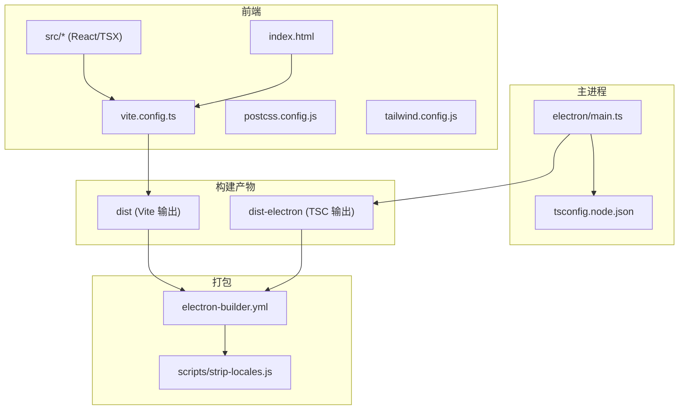
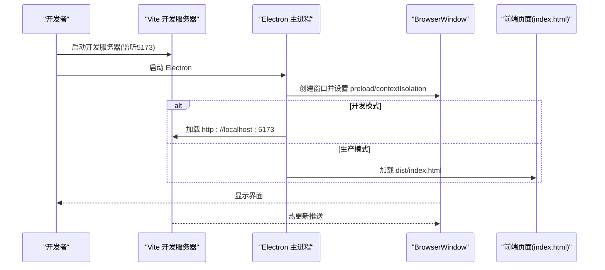
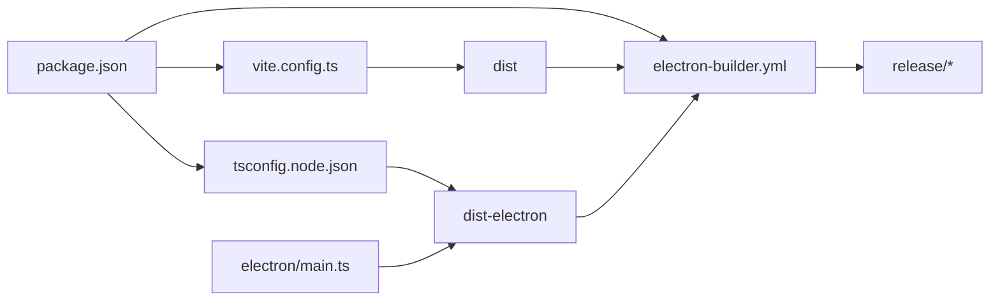

# 构建与部署

<cite>
**本文引用的文件**
- [package.json](file://package.json)
- [vite.config.ts](file://vite.config.ts)
- [electron-builder.yml](file://electron-builder.yml)
- [tsconfig.json](file://tsconfig.json)
- [tsconfig.node.json](file://tsconfig.node.json)
- [postcss.config.js](file://postcss.config.js)
- [tailwind.config.js](file://tailwind.config.js)
- [index.html](file://index.html)
- [electron/main.ts](file://electron/main.ts)
- [scripts/launch-electron.js](file://scripts/launch-electron.js)
- [scripts/patch-electron.js](file://scripts/patch-electron.js)
- [scripts/strip-locales.js](file://scripts/strip-locales.js)
</cite>

## 目录
1. [简介](#简介)
2. [项目结构](#项目结构)
3. [核心组件](#核心组件)
4. [架构总览](#架构总览)
5. [详细组件分析](#详细组件分析)
6. [依赖关系分析](#依赖关系分析)
7. [性能考虑](#性能考虑)
8. [故障排除指南](#故障排除指南)
9. [结论](#结论)
10. [附录](#附录)

## 简介
本指南面向LabNote项目的开发者与维护者，提供从开发到生产、从本地打包到跨平台分发的完整构建与部署说明。内容覆盖：
- 开发环境构建流程、热重载配置与调试技巧
- 生产环境构建优化、资源压缩与代码分割策略
- 跨平台打包（Windows、macOS、Linux）配置要点
- 应用签名、代码验证与安全加固建议
- 持续集成、自动化测试与发布流程建议
- 常见构建问题与部署陷阱的排查方法

## 项目结构
本项目采用 Electron + Vite + React + TypeScript 技术栈，前端由 Vite 构建输出至 dist，Electron 主进程由 TypeScript 编译至 dist-electron，最终通过 electron-builder 打包为各平台安装包或可执行文件。

图表来源
- [vite.config.ts:1-26](file://vite.config.ts#L1-L26)
- [electron/main.ts:1-132](file://electron/main.ts#L1-L132)
- [electron-builder.yml:1-52](file://electron-builder.yml#L1-L52)
- [tsconfig.node.json:1-18](file://tsconfig.node.json#L1-L18)
- [postcss.config.js:1-7](file://postcss.config.js#L1-L7)
- [tailwind.config.js:1-50](file://tailwind.config.js#L1-L50)
- [index.html:1-13](file://index.html#L1-L13)

章节来源
- [package.json:1-39](file://package.json#L1-L39)
- [vite.config.ts:1-26](file://vite.config.ts#L1-L26)
- [electron-builder.yml:1-52](file://electron-builder.yml#L1-L52)
- [tsconfig.json:1-26](file://tsconfig.json#L1-L26)
- [tsconfig.node.json:1-18](file://tsconfig.node.json#L1-L18)
- [postcss.config.js:1-7](file://postcss.config.js#L1-L7)
- [tailwind.config.js:1-50](file://tailwind.config.js#L1-L50)
- [index.html:1-13](file://index.html#L1-L13)

## 核心组件
- 脚本入口与命令
  - 开发：并行启动 Vite 开发服务器与 Electron，等待前端就绪后加载页面
  - 构建：先构建渲染进程（Vite），再编译主进程（TypeScript）
  - 打包：调用 electron-builder 生成安装包或目录分发
- 构建工具链
  - Vite：负责前端资源构建、按需分包与压缩
  - TypeScript：分别对渲染端与主进程进行类型检查与编译
  - PostCSS + Tailwind：样式处理与原子化 CSS 生成
- 打包器
  - electron-builder：统一多平台打包、asar 打包、语言包裁剪、图标与安装器配置

章节来源
- [package.json:6-13](file://package.json#L6-L13)
- [vite.config.ts:13-24](file://vite.config.ts#L13-L24)
- [tsconfig.node.json:1-18](file://tsconfig.node.json#L1-L18)
- [postcss.config.js:1-7](file://postcss.config.js#L1-L7)
- [tailwind.config.js:1-50](file://tailwind.config.js#L1-L50)
- [electron-builder.yml:1-52](file://electron-builder.yml#L1-L52)

## 架构总览
下图展示了开发模式下的关键交互：Vite 提供热更新服务，Electron 主进程在开发模式下加载远程地址，在生产模式下加载本地构建产物。

图表来源
- [electron/main.ts:102-132](file://electron/main.ts#L102-L132)
- [index.html:1-13](file://index.html#L1-L13)

章节来源
- [electron/main.ts:102-132](file://electron/main.ts#L102-L132)
- [index.html:1-13](file://index.html#L1-L13)

## 详细组件分析

### 开发环境与热重载
- 启动流程
  - 使用并发工具同时运行 Vite 与 Electron，并通过等待机制确保前端就绪后再打开窗口
  - 开发模式下通过环境变量注入 Vite 开发服务器地址，避免硬编码
- 热重载
  - Vite 提供模块热替换，Electron 窗口在开发模式下直接连接开发服务器，实现即时刷新
- 调试技巧
  - 主进程：在终端查看日志；必要时在主进程代码中启用断点
  - 渲染进程：通过菜单“开发者工具”或快捷键打开 DevTools
  - 自定义小部件窗口：提供 IPC 触发 DevTools 的能力，便于调试独立窗口

章节来源
- [package.json:7](file://package.json#L7)
- [electron/main.ts:122-127](file://electron/main.ts#L122-L127)
- [electron/main.ts:283-288](file://electron/main.ts#L283-L288)
- [scripts/launch-electron.js:1-59](file://scripts/launch-electron.js#L1-L59)

### 生产构建与优化
- 构建顺序
  - 先构建渲染层（Vite），再编译主进程（TypeScript），最后打包
- 资源压缩
  - 使用 esbuild 作为压缩器，提升构建速度
- 代码分割
  - 将 React 生态库拆分至 vendor chunk，提高缓存命中率与加载性能
- 输出目录
  - 渲染产物输出至 dist，主进程产物输出至 dist-electron

章节来源
- [package.json:9-10](file://package.json#L9-L10)
- [vite.config.ts:13-24](file://vite.config.ts#L13-L24)
- [tsconfig.node.json:6](file://tsconfig.node.json#L6)

### 跨平台打包配置
- 通用配置
  - 应用标识、产品名称、输出目录、asar 打包开关
  - 仅打包必要文件，剔除源码、map 与构建期依赖
  - 针对原生模块与第三方静态资源设置 asarUnpack
- Windows
  - 目标：NSIS 安装包，x64 架构
  - 安装器行为：允许选择安装路径、创建桌面与开始菜单快捷方式
  - 图标：resources/icon.ico
- macOS / Linux
  - 当前未显式声明 target，electron-builder 会使用默认平台目标
  - 如需指定，可在 win/mac/linux 节点下添加 target 列表
- 语言包裁剪
  - afterPack 钩子仅保留 zh-CN 与 en 相关语言包，减小体积
- Electron 下载镜像
  - 配置国内镜像加速下载

章节来源
- [electron-builder.yml:1-52](file://electron-builder.yml#L1-L52)
- [scripts/strip-locales.js:1-28](file://scripts/strip-locales.js#L1-L28)

### 安全加固与完整性校验
- 安全基线
  - 启用 contextIsolation，禁用 nodeIntegration，减少渲染进程攻击面
  - 使用 preload 暴露最小 API 给渲染进程
- 协议与路径访问
  - 自定义协议 labnote://images/... 时严格校验解析后的绝对路径，防止路径穿越
- 数据路径管理
  - 首次启动自动创建默认数据目录，支持用户后续迁移数据库位置
- 代码签名与公证（建议）
  - Windows：建议使用 Authenticode 签名，配合 NSIS 安装器选项启用证书提示
  - macOS：需配置签名证书与公证，建议在 CI 中完成签名与 notarize 流程
  - Linux：可使用 gpg 签名 RPM/DEB 包，并在仓库中提供校验和
- 完整性校验（建议）
  - 发布产物附带 SHA-256 校验文件，供用户或安装器校验

章节来源
- [electron/main.ts:110-116](file://electron/main.ts#L110-L116)
- [electron/main.ts:378-391](file://electron/main.ts#L378-L391)
- [electron/main.ts:84-98](file://electron/main.ts#L84-L98)

### 持续集成、自动化测试与发布（建议）
- 流水线阶段
  - 依赖安装与缓存
  - 类型检查与单元测试（可选）
  - 构建渲染与主进程
  - 多平台打包（Windows/macOS/Linux）
  - 产物上传与发布（GitHub Releases 等）
- 缓存策略
  - 缓存 node_modules 与 Vite 缓存目录，缩短构建时间
- 签名与公证
  - 在 CI 中读取受保护的证书与密钥，完成签名与公证
- 版本与变更日志
  - 根据 Git 标签自动生成版本号与变更日志，写入 electron-builder 配置

[本节为概念性指导，不直接分析具体文件]

## 依赖关系分析
- 构建依赖
  - Vite、@vitejs/plugin-react、PostCSS、Tailwind、TypeScript、electron-builder、electron
- 运行时依赖
  - React、react-router-dom、better-sqlite3、drizzle-orm、smiles-drawer
- 构建产物与打包
  - Vite 输出至 dist，TSC 输出至 dist-electron，electron-builder 合并并打包

图表来源
- [package.json:1-39](file://package.json#L1-L39)
- [vite.config.ts:1-26](file://vite.config.ts#L1-L26)
- [tsconfig.node.json:1-18](file://tsconfig.node.json#L1-L18)
- [electron-builder.yml:1-52](file://electron-builder.yml#L1-L52)
- [electron/main.ts:1-132](file://electron/main.ts#L1-L132)

章节来源
- [package.json:14-37](file://package.json#L14-L37)
- [electron-builder.yml:22-47](file://electron-builder.yml#L22-L47)

## 性能考虑
- 构建性能
  - 使用 esbuild 压缩与并行任务，显著缩短构建时间
  - 合理配置缓存目录，CI 中复用缓存
- 运行时性能
  - 将大型库拆分为独立 chunk，利用浏览器缓存
  - 按需引入与懒加载页面，减少首屏体积
- 包体优化
  - 剔除构建期依赖与无用语言包
  - 对原生模块（如 better-sqlite3）保持 unpack，避免运行时解包开销

章节来源
- [vite.config.ts:16-22](file://vite.config.ts#L16-L22)
- [electron-builder.yml:22-47](file://electron-builder.yml#L22-L47)
- [scripts/strip-locales.js:14-26](file://scripts/strip-locales.js#L14-L26)

## 故障排除指南
- 开发模式无法连接 Vite
  - 确认环境变量已正确注入开发服务器地址
  - 检查端口占用与服务是否启动
- 主进程报错 require('electron') 被 npm wrapper 拦截
  - 使用内置补丁脚本在构建后修复 require 行为
  - 或使用专用启动脚本绕过 npm wrapper
- 打包体积过大
  - 检查 files 白名单与 asarUnpack 配置，避免打包多余文件
  - 使用 afterPack 钩子裁剪语言包
- 原生模块构建失败
  - 确认 npmRebuild 开启，且系统具备必要的编译工具链
  - 若无需重建，可关闭 npmRebuild 并使用预编译二进制
- 图标或安装器问题
  - 确认 resources/icon.ico 存在且路径正确
  - 检查 NSIS 配置项是否符合预期

章节来源
- [electron/main.ts:122-127](file://electron/main.ts#L122-L127)
- [scripts/patch-electron.js:1-49](file://scripts/patch-electron.js#L1-L49)
- [scripts/launch-electron.js:1-59](file://scripts/launch-electron.js#L1-L59)
- [electron-builder.yml:10-18](file://electron-builder.yml#L10-L18)
- [electron-builder.yml:22-47](file://electron-builder.yml#L22-L47)
- [electron-builder.yml:48-52](file://electron-builder.yml#L48-L52)

## 结论
通过合理的构建与打包配置，LabNote 能够在开发环境下高效迭代，在生产环境下获得良好的性能与体积表现。结合安全加固与持续集成实践，可以稳定地将应用交付到 Windows、macOS 与 Linux 平台。

## 附录

### 常用命令速查
- 开发：启动 Vite 与 Electron，支持热重载
- 构建：先构建渲染层，再编译主进程
- 打包：生成安装包或目录分发

章节来源
- [package.json:6-13](file://package.json#L6-L13)

### 配置文件要点清单
- Vite
  - base、alias、outDir、minify、manualChunks
- TypeScript
  - 渲染端 tsconfig.json 与主进程 tsconfig.node.json 分离
- electron-builder
  - appId、productName、directories.output、win.target、nsis.*、files、asar、asarUnpack、afterPack、npmRebuild、electronDownload.mirror

章节来源
- [vite.config.ts:1-26](file://vite.config.ts#L1-L26)
- [tsconfig.json:1-26](file://tsconfig.json#L1-L26)
- [tsconfig.node.json:1-18](file://tsconfig.node.json#L1-L18)
- [electron-builder.yml:1-52](file://electron-builder.yml#L1-L52)