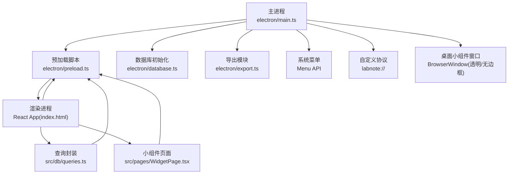
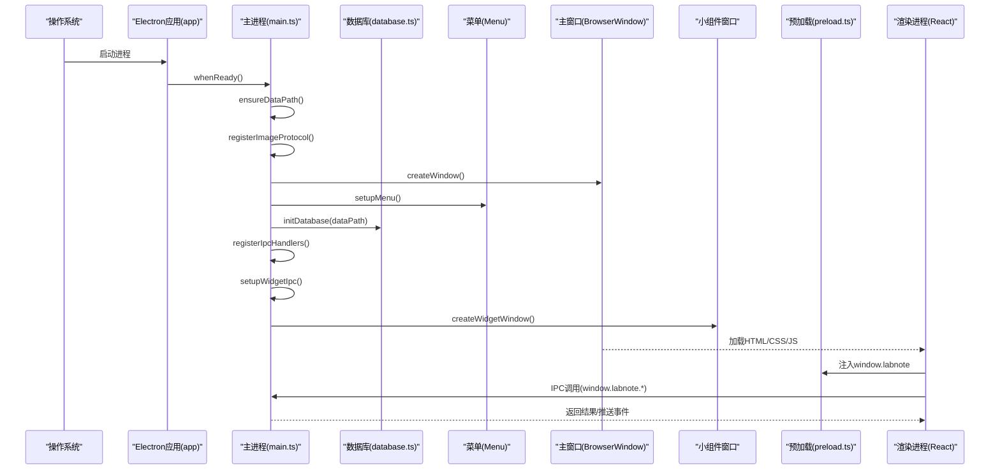
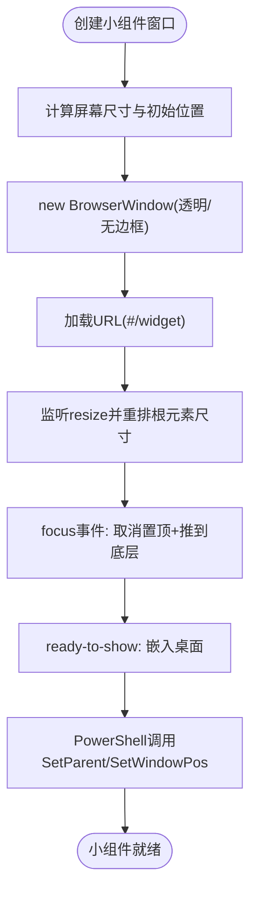
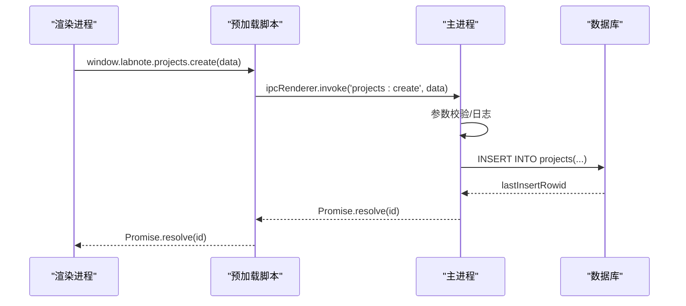
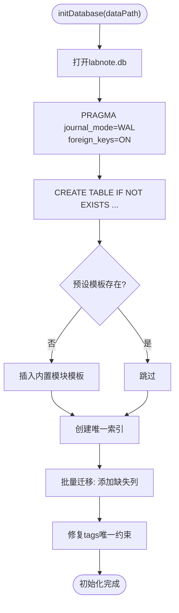
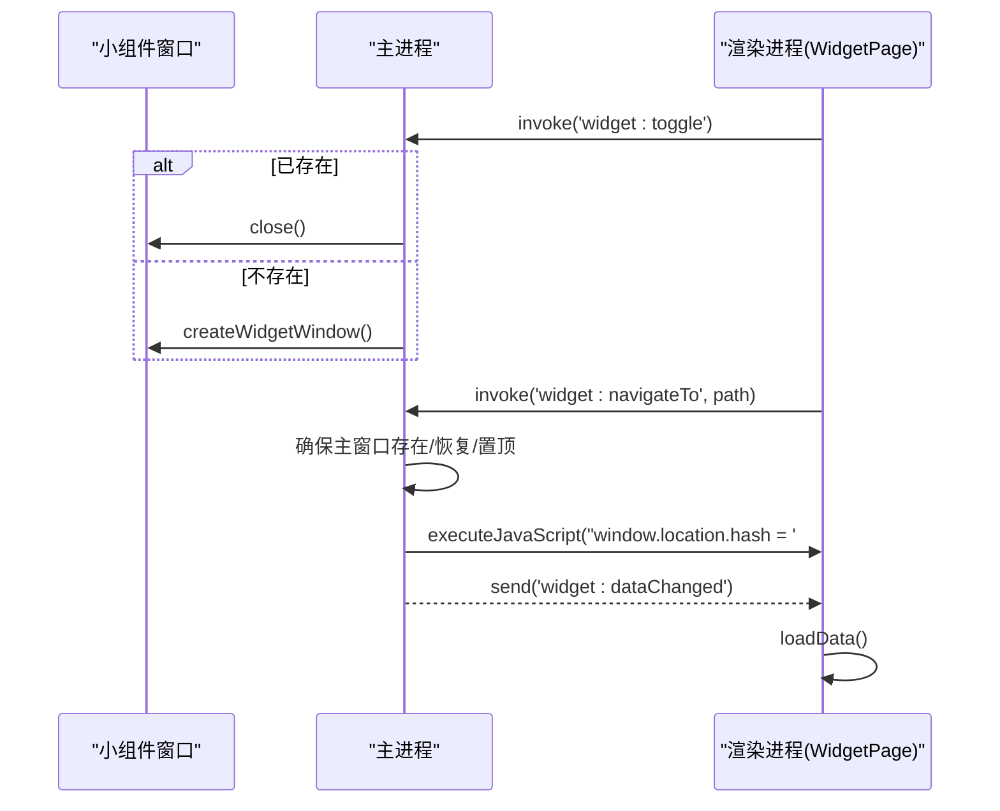
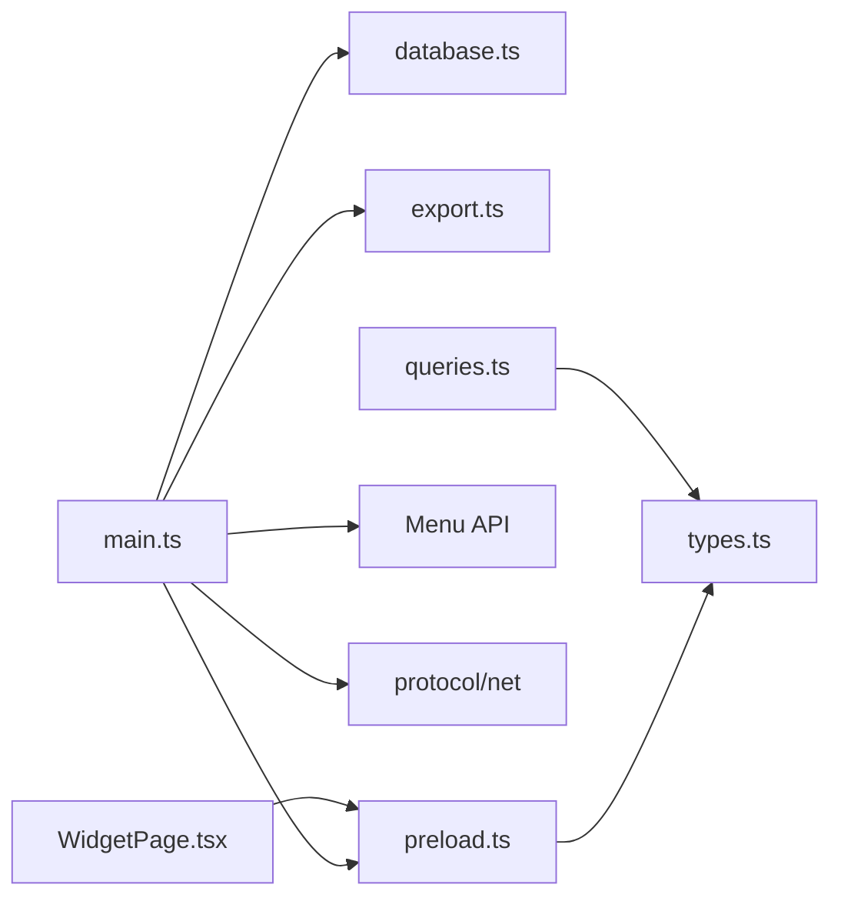

# Electron主进程架构

<cite>
**本文引用的文件**   
- [electron/main.ts](file://electron/main.ts)
- [electron/preload.ts](file://electron/preload.ts)
- [electron/database.ts](file://electron/database.ts)
- [electron/export.ts](file://electron/export.ts)
- [src/pages/WidgetPage.tsx](file://src/pages/WidgetPage.tsx)
- [src/db/queries.ts](file://src/db/queries.ts)
- [src/types.ts](file://src/types.ts)
- [index.html](file://index.html)
- [package.json](file://package.json)
</cite>

## 目录
1. [简介](#简介)
2. [项目结构](#项目结构)
3. [核心组件](#核心组件)
4. [架构总览](#架构总览)
5. [详细组件分析](#详细组件分析)
6. [依赖关系分析](#依赖关系分析)
7. [性能考量](#性能考量)
8. [故障排查指南](#故障排查指南)
9. [结论](#结论)
10. [附录](#附录)

## 简介
本文件面向LabNote项目的Electron主进程，系统性阐述其启动流程、生命周期管理、窗口创建与控制机制；深入解析IPC通信（预加载脚本安全隔离、消息协议、错误处理）；说明数据库初始化、文件系统操作与菜单系统集成；解释桌面小组件实现原理（将窗口嵌入Windows桌面的技术细节）；并给出主进程与渲染进程的交互模式、安全考虑与性能优化策略。文档同时提供代码级图示与最佳实践建议，帮助读者快速理解并扩展主进程能力。

## 项目结构
- 主进程入口位于 electron/main.ts，负责应用生命周期、窗口管理、菜单、自定义协议、IPC路由与桌面小组件。
- 预加载脚本 electron/preload.ts 通过 contextBridge 暴露最小化API给渲染进程，确保上下文隔离与Node集成关闭。
- 数据库初始化与迁移在 electron/database.ts 中完成，基于 better-sqlite3，包含WAL模式、外键约束、表结构与增量迁移。
- 导出功能在 electron/export.ts 中实现，用于生成实验章节文本。
- 渲染侧页面 src/pages/WidgetPage.tsx 为桌面小组件的UI，通过 window.labnote.widget.* 与主进程交互。
- 数据访问封装 src/db/queries.ts 仅作为类型与调用代理，实际DB访问全部走IPC。
- 类型定义 src/types.ts 统一前后端接口契约。
- 应用入口 index.html 由Vite构建产物加载。
- 打包与运行配置 package.json 指定 main 指向 dist-electron/main.js。

图表来源
- [electron/main.ts:102-132](file://electron/main.ts#L102-L132)
- [electron/preload.ts:1-165](file://electron/preload.ts#L1-L165)
- [electron/database.ts:1-320](file://electron/database.ts#L1-L320)
- [electron/export.ts:1-138](file://electron/export.ts#L1-L138)
- [src/pages/WidgetPage.tsx:1-304](file://src/pages/WidgetPage.tsx#L1-L304)
- [src/db/queries.ts:1-193](file://src/db/queries.ts#L1-L193)
- [index.html:1-13](file://index.html#L1-L13)

章节来源
- [electron/main.ts:102-132](file://electron/main.ts#L102-L132)
- [electron/preload.ts:1-165](file://electron/preload.ts#L1-L165)
- [electron/database.ts:1-320](file://electron/database.ts#L1-L320)
- [electron/export.ts:1-138](file://electron/export.ts#L1-L138)
- [src/pages/WidgetPage.tsx:1-304](file://src/pages/WidgetPage.tsx#L1-L304)
- [src/db/queries.ts:1-193](file://src/db/queries.ts#L1-L193)
- [index.html:1-13](file://index.html#L1-L13)
- [package.json:1-39](file://package.json#L1-L39)

## 核心组件
- 应用生命周期与单实例锁：使用 app.requestSingleInstanceLock 保证单例运行，second-instance事件聚焦已有窗口。
- 数据路径管理：首次启动自动选择默认数据目录，支持用户通过菜单动态切换，持久化到配置文件。
- 窗口管理：主窗口与小组件窗口分别创建，主窗口启用预加载与安全选项；小组件窗口透明、无边框、可调整大小，并在Windows下嵌入桌面。
- IPC路由：集中注册所有handle处理器，包括项目、实验、标签、模板、试剂、任务、模块模板等CRUD与导出。
- 自定义协议：labnote://images/* 安全读取图片资源，防止路径穿越。
- 菜单系统：File菜单提供“选择数据库位置”、“退出”，View菜单提供开发者工具与缩放控制，Help菜单显示关于信息。
- 桌面小组件：独立窗口承载小组件UI，支持打开主窗口、导航到指定路由、刷新数据、开发工具开关。

章节来源
- [electron/main.ts:1048-1114](file://electron/main.ts#L1048-L1114)
- [electron/main.ts:84-98](file://electron/main.ts#L84-L98)
- [electron/main.ts:102-132](file://electron/main.ts#L102-L132)
- [electron/main.ts:145-237](file://electron/main.ts#L145-L237)
- [electron/main.ts:298-374](file://electron/main.ts#L298-L374)
- [electron/main.ts:378-391](file://electron/main.ts#L378-L391)
- [electron/main.ts:395-1046](file://electron/main.ts#L395-L1046)

## 架构总览
下图展示主进程启动顺序与各子系统协作关系。

图表来源
- [electron/main.ts:1068-1109](file://electron/main.ts#L1068-L1109)
- [electron/main.ts:102-132](file://electron/main.ts#L102-L132)
- [electron/main.ts:298-374](file://electron/main.ts#L298-L374)
- [electron/main.ts:378-391](file://electron/main.ts#L378-L391)
- [electron/database.ts:6-120](file://electron/database.ts#L6-L120)
- [electron/preload.ts:1-165](file://electron/preload.ts#L1-L165)
- [index.html:1-13](file://index.html#L1-L13)

## 详细组件分析

### 启动流程与生命周期管理
- 单实例锁：app.requestSingleInstanceLock 确保只运行一个实例；若重复启动则激活已有窗口。
- whenReady阶段：
  - 确定数据路径（ensureDataPath），首次启动写入默认路径并保存配置。
  - 注册自定义协议（registerImageProtocol）。
  - 创建主窗口（createWindow），设置webPreferences：preload、contextIsolation=true、nodeIntegration=false。
  - 设置菜单（setupMenu）。
  - 初始化数据库（initDatabase），开启WAL与外键约束，执行建表与迁移。
  - 注册IPC处理器（registerIpcHandlers）与小组件IPC（setupWidgetIpc）。
  - 创建小组件窗口（createWidgetWindow）。
- activate事件：当Dock点击或无窗口时重建主窗口。
- window-all-closed：非macOS平台关闭窗口即退出。

章节来源
- [electron/main.ts:1048-1114](file://electron/main.ts#L1048-L1114)
- [electron/main.ts:84-98](file://electron/main.ts#L84-L98)
- [electron/main.ts:102-132](file://electron/main.ts#L102-L132)
- [electron/database.ts:6-120](file://electron/database.ts#L6-L120)

### 窗口创建与控制机制
- 主窗口：
  - 尺寸与最小尺寸设定，标题与背景色。
  - webPreferences启用预加载与上下文隔离，禁用Node集成。
  - ready-to-show后显示窗口，避免白屏闪烁。
  - 开发环境加载Vite dev server URL，生产环境加载dist/index.html。
- 小组件窗口：
  - 透明、无边框、跳过任务栏、可调整大小。
  - 根据屏幕工作区计算初始位置，右下角附近。
  - resize事件触发内容重排，确保嵌入桌面后布局正确。
  - focus事件取消置顶并调用pushWidgetToBottom。
  - ready-to-show后通过PowerShell调用user32.dll将窗口父级设置为桌面WorkerW/Progman，实现“嵌入桌面”。

图表来源
- [electron/main.ts:145-237](file://electron/main.ts#L145-L237)
- [electron/main.ts:136-143](file://electron/main.ts#L136-L143)

章节来源
- [electron/main.ts:102-132](file://electron/main.ts#L102-L132)
- [electron/main.ts:145-237](file://electron/main.ts#L145-L237)

### IPC通信机制与安全隔离
- 预加载脚本：
  - 通过 contextBridge.exposeInMainWorld('labnote', api) 暴露最小API集合。
  - 所有方法内部使用 ipcRenderer.invoke 调用主进程handle，返回Promise。
  - 提供 widget.onDataChanged 订阅主进程推送的事件，返回取消订阅函数。
- 主进程IPC：
  - 集中注册 handle 处理器，按命名空间组织：app、images、projects、experiments、tags、templates、reagents、modules、compound、tasks、widget。
  - 每个处理器负责参数校验、数据库操作、事务处理、错误抛出。
  - 事件推送：主进程向小组件窗口发送 'widget:dataChanged'，渲染侧监听并刷新数据。
- 安全策略：
  - nodeIntegration=false，禁止渲染进程直接访问Node API。
  - contextIsolation=true，隔离全局对象。
  - 自定义协议 labnote:// 限制在dataPath目录下，拒绝路径穿越。
  - 图片保存仅接受data:image/*;base64格式，随机文件名存储于images子目录。

图表来源
- [electron/preload.ts:82-165](file://electron/preload.ts#L82-L165)
- [electron/main.ts:430-441](file://electron/main.ts#L430-L441)
- [electron/main.ts:378-391](file://electron/main.ts#L378-L391)

章节来源
- [electron/preload.ts:1-165](file://electron/preload.ts#L1-L165)
- [electron/main.ts:395-1046](file://electron/main.ts#L395-L1046)
- [electron/main.ts:378-391](file://electron/main.ts#L378-L391)

### 数据库初始化流程与迁移
- 连接与配置：
  - 使用better-sqlite3打开labnote.db，开启WAL模式与外键约束。
- 建表：
  - 基础表：projects、experiments、reactants、catalysts、solvents、tags、experiment_tags、templates、reagents。
  - 模块化实验表：module_templates、experiment_module_data。
  - 化合物名称缓存表：compound_names。
  - 任务与日历表：tasks、task_tags。
- 种子数据：
  - 若预设模块模板为空，插入若干内置模板（表征数据、理论计算、安全信息、参考文献、物料清单）。
- 索引与唯一约束：
  - experiment_module_data(experiment_id, module_key)唯一索引。
  - tags(name, type)复合唯一约束，兼容同名不同类别的标签。
- 增量迁移：
  - 批量检查列是否存在，不存在则ALTER TABLE ADD COLUMN。
  - 修复tags表的UNIQUE约束，重建表以支持(name,type)组合唯一。

图表来源
- [electron/database.ts:6-120](file://electron/database.ts#L6-L120)
- [electron/database.ts:179-257](file://electron/database.ts#L179-L257)
- [electron/database.ts:259-314](file://electron/database.ts#L259-L314)

章节来源
- [electron/database.ts:6-120](file://electron/database.ts#L6-L120)
- [electron/database.ts:179-257](file://electron/database.ts#L179-L257)
- [electron/database.ts:259-314](file://electron/database.ts#L259-L314)

### 文件系统操作与图片协议
- 数据路径：
  - ensureDataPath优先读取配置中的dataPath，否则使用Documents/LabNoteData并创建目录。
  - 菜单项“选择数据库位置...”允许用户重新选择并热更新dataPath，随后重新初始化数据库与IPC。
- 图片保存：
  - images:save接收dataUrl，解析base64与扩展名，生成UUID文件名，保存到images子目录。
- 自定义协议：
  - labnote://images/filename.png 映射到dataPath/images/filename.png，使用net.fetch读取，严格校验路径前缀防止穿越。

章节来源
- [electron/main.ts:84-98](file://electron/main.ts#L84-L98)
- [electron/main.ts:306-336](file://electron/main.ts#L306-L336)
- [electron/main.ts:407-419](file://electron/main.ts#L407-L419)
- [electron/main.ts:378-391](file://electron/main.ts#L378-L391)

### 菜单系统集成
- File菜单：
  - “选择数据库位置...”：弹出目录选择对话框，更新配置与内存dataPath，重新初始化数据库与IPC，通知渲染进程路径变更。
  - “退出”：标准quit角色。
- View菜单：
  - 重载、强制重载、开发者工具、重置缩放、放大缩小。
- Help菜单：
  - “关于 LabNote”：显示版本与描述。

章节来源
- [electron/main.ts:298-374](file://electron/main.ts#L298-L374)

### 桌面小组件实现原理
- 窗口特性：透明、无边框、跳过任务栏、可调整大小，适合悬浮于桌面。
- 嵌入桌面：
  - 使用PowerShell调用user32.dll的FindWindow/FindWindowEx/SetParent/SetWindowPos，将窗口父级设为WorkerW或Progman，使其仅在桌面可见。
  - focus事件触发时取消置顶并调用pushWidgetToBottom，避免遮挡其他窗口。
- 渲染交互：
  - WidgetPage通过window.labnote.widget.*与主进程交互，如toggle、openMain、navigateTo、devtools。
  - 监听widget:dataChanged事件，拉取最新任务与实验数据。

图表来源
- [electron/main.ts:241-288](file://electron/main.ts#L241-L288)
- [electron/main.ts:145-237](file://electron/main.ts#L145-L237)
- [src/pages/WidgetPage.tsx:106-110](file://src/pages/WidgetPage.tsx#L106-L110)

章节来源
- [electron/main.ts:145-237](file://electron/main.ts#L145-L237)
- [electron/main.ts:241-288](file://electron/main.ts#L241-L288)
- [src/pages/WidgetPage.tsx:1-304](file://src/pages/WidgetPage.tsx#L1-L304)

### 主进程与渲染进程交互模式
- 请求-响应：
  - 渲染进程通过window.labnote.*调用ipcRenderer.invoke，主进程handle返回Promise结果。
- 事件推送：
  - 主进程通过webContents.send推送'widget:dataChanged'，渲染进程监听并刷新。
- 类型契约：
  - src/types.ts声明Window.labnote接口，确保前后端一致。
  - src/db/queries.ts封装调用，仅作为类型提示与便捷方法。

章节来源
- [src/types.ts:233-315](file://src/types.ts#L233-L315)
- [src/db/queries.ts:1-193](file://src/db/queries.ts#L1-L193)
- [electron/preload.ts:1-165](file://electron/preload.ts#L1-L165)

### 安全考虑
- 上下文隔离与Node集成关闭：
  - preload脚本通过contextBridge暴露最小API，避免直接访问Node与DOM全局。
- 协议白名单与路径校验：
  - labnote://协议仅允许访问dataPath下的images目录，拒绝路径穿越。
- 输入校验与事务保护：
  - 关键写操作使用db.transaction包裹，失败回滚，避免部分写入导致的数据不一致。
- 权限最小化：
  - 小组件窗口skipTaskbar、transparent、frame:false，减少攻击面。

章节来源
- [electron/main.ts:102-132](file://electron/main.ts#L102-L132)
- [electron/main.ts:378-391](file://electron/main.ts#L378-L391)
- [electron/main.ts:507-577](file://electron/main.ts#L507-L577)

### 性能优化策略
- 并行初始化：
  - 先创建窗口加载前端资源，再初始化数据库与注册IPC，缩短首屏时间。
- WAL模式：
  - 提升并发读写性能，降低锁竞争。
- 批量迁移：
  - 一次性查询表结构，按需ADD COLUMN，避免多次PRAGMA调用。
- 事件驱动刷新：
  - 小组件通过事件推送而非轮询，减少不必要的网络与IO开销。
- 图片存储：
  - 使用UUID文件名避免冲突，images子目录便于管理与清理。

章节来源
- [electron/main.ts:1068-1109](file://electron/main.ts#L1068-L1109)
- [electron/database.ts:13-14](file://electron/database.ts#L13-L14)
- [electron/database.ts:280-290](file://electron/database.ts#L280-L290)
- [electron/main.ts:277-288](file://electron/main.ts#L277-L288)

## 依赖关系分析
- 主进程依赖：
  - Electron API：app、BrowserWindow、ipcMain、dialog、protocol、net、Menu。
  - Node模块：path、fs、crypto、child_process（PowerShell调用）、url。
  - 第三方库：better-sqlite3。
- 渲染进程依赖：
  - React、React Router DOM。
  - 通过window.labnote访问主进程能力。
- 构建与打包：
  - Vite构建前端，TypeScript编译主进程，electron-builder打包。

图表来源
- [electron/main.ts:1-8](file://electron/main.ts#L1-L8)
- [electron/database.ts:1-2](file://electron/database.ts#L1-L2)
- [electron/export.ts:1-31](file://electron/export.ts#L1-L31)
- [electron/preload.ts:1-2](file://electron/preload.ts#L1-L2)
- [src/db/queries.ts:1-22](file://src/db/queries.ts#L1-L22)
- [src/pages/WidgetPage.tsx:1-6](file://src/pages/WidgetPage.tsx#L1-L6)
- [package.json:1-39](file://package.json#L1-L39)

章节来源
- [electron/main.ts:1-8](file://electron/main.ts#L1-L8)
- [electron/database.ts:1-2](file://electron/database.ts#L1-L2)
- [electron/export.ts:1-31](file://electron/export.ts#L1-L31)
- [electron/preload.ts:1-2](file://electron/preload.ts#L1-L2)
- [src/db/queries.ts:1-22](file://src/db/queries.ts#L1-L22)
- [src/pages/WidgetPage.tsx:1-6](file://src/pages/WidgetPage.tsx#L1-L6)
- [package.json:1-39](file://package.json#L1-L39)

## 性能考量
- 首屏优化：窗口创建与数据库初始化并行进行，减少等待。
- 数据库性能：WAL模式提升并发读写；合理索引与唯一约束提高查询效率。
- 事件驱动：小组件通过事件推送刷新，避免频繁轮询。
- 资源管理：图片文件按UUID命名，避免冲突与重复写入；images目录集中管理。
- 迁移策略：批量检测与增量迁移，避免全量重建带来的性能损耗。

[本节为通用指导，不直接分析具体文件]

## 故障排查指南
- 数据库未初始化：
  - 现象：IPC处理器无法工作，控制台报错提示数据库未初始化。
  - 排查：确认initDatabase是否成功执行，检查dataPath与labnote.db权限。
- 图片协议403：
  - 现象：labnote://images/...返回Forbidden。
  - 排查：确认请求路径是否在dataPath下，检查resolve后的前缀校验逻辑。
- 小组件无法嵌入桌面：
  - 现象：PowerShell脚本执行失败，控制台打印错误。
  - 排查：检查user32.dll调用权限、当前用户权限、Windows版本兼容性。
- 菜单切换数据库失败：
  - 现象：showOpenDialog选择新路径后迁移失败。
  - 排查：检查新路径可写性、initDatabase异常信息、IPC重新注册是否成功。

章节来源
- [electron/main.ts:395-401](file://electron/main.ts#L395-L401)
- [electron/main.ts:378-391](file://electron/main.ts#L378-L391)
- [electron/main.ts:231-235](file://electron/main.ts#L231-L235)
- [electron/main.ts:306-336](file://electron/main.ts#L306-L336)

## 结论
LabNote的主进程采用清晰的模块化设计：启动流程并行化以提升用户体验，IPC通过预加载脚本安全隔离，数据库初始化与迁移稳健可靠，菜单与协议完善系统能力，桌面小组件通过Windows原生API实现沉浸式体验。整体架构兼顾安全性、性能与可扩展性，为后续功能迭代提供了坚实基础。

[本节为总结，不直接分析具体文件]

## 附录
- 最佳实践建议：
  - 新增IPC处理器时，遵循命名空间约定与参数校验，必要时使用事务保护。
  - 对敏感操作增加日志与错误上报，便于定位问题。
  - 小组件窗口保持最小权限，避免不必要的系统调用。
  - 定期评估数据库迁移策略，确保向后兼容。
- 参考代码片段路径：
  - 主进程启动与窗口创建：[electron/main.ts:1068-1109](file://electron/main.ts#L1068-L1109)、[electron/main.ts:102-132](file://electron/main.ts#L102-L132)
  - 预加载脚本API暴露：[electron/preload.ts:82-165](file://electron/preload.ts#L82-L165)
  - 数据库初始化与迁移：[electron/database.ts:6-120](file://electron/database.ts#L6-L120)、[electron/database.ts:259-314](file://electron/database.ts#L259-L314)
  - 自定义协议与图片保存：[electron/main.ts:378-391](file://electron/main.ts#L378-L391)、[electron/main.ts:407-419](file://electron/main.ts#L407-L419)
  - 小组件窗口与桌面嵌入：[electron/main.ts:145-237](file://electron/main.ts#L145-L237)
  - 小组件页面交互：[src/pages/WidgetPage.tsx:106-110](file://src/pages/WidgetPage.tsx#L106-L110)
  - 类型契约与查询封装：[src/types.ts:233-315](file://src/types.ts#L233-L315)、[src/db/queries.ts:1-193](file://src/db/queries.ts#L1-L193)