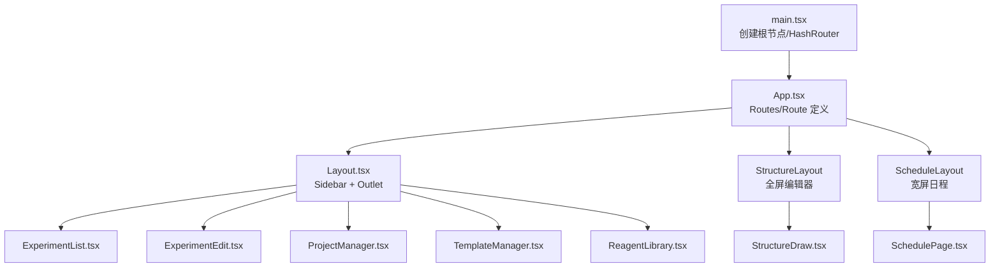
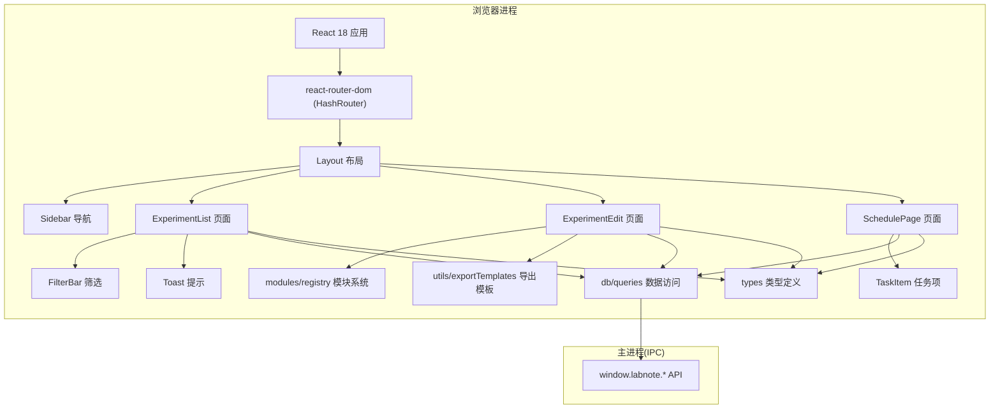
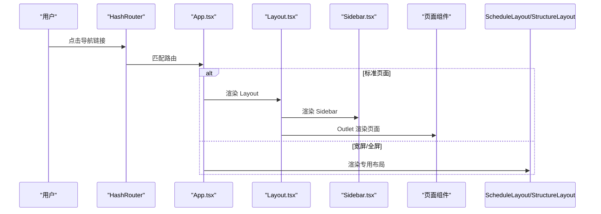
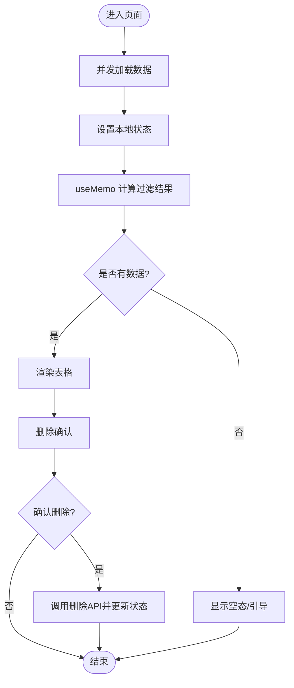
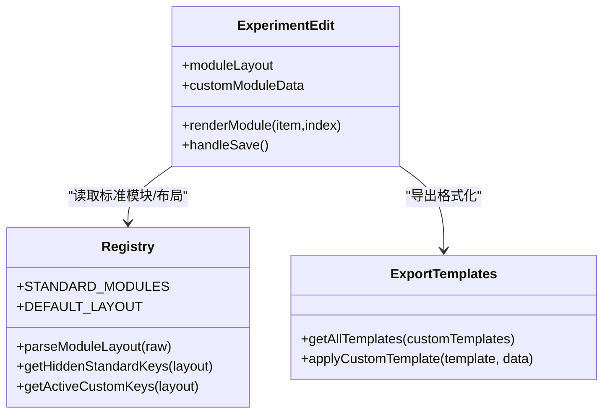
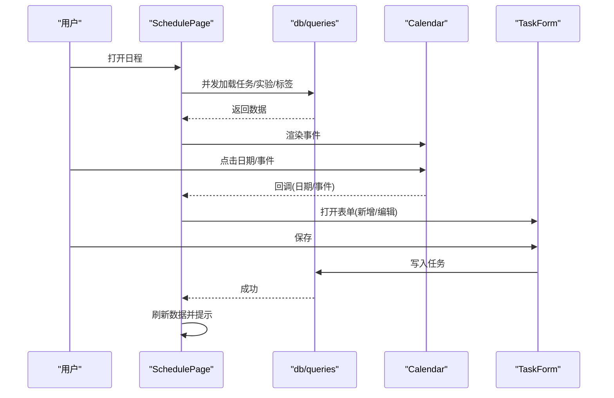
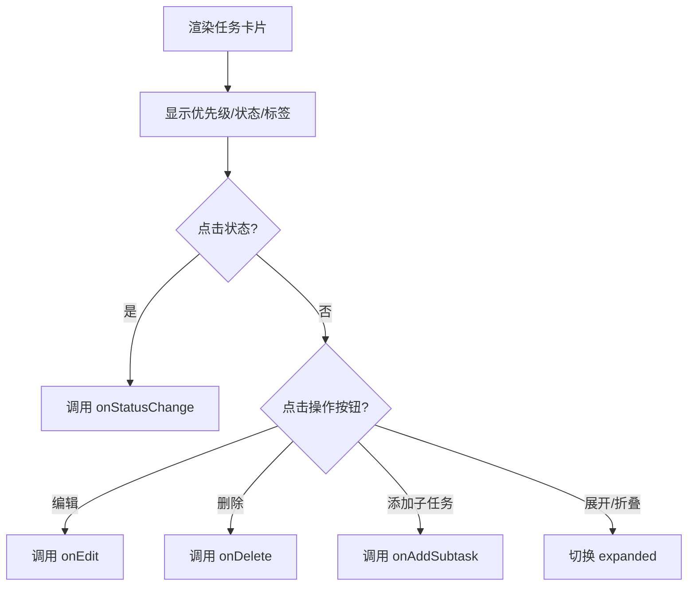
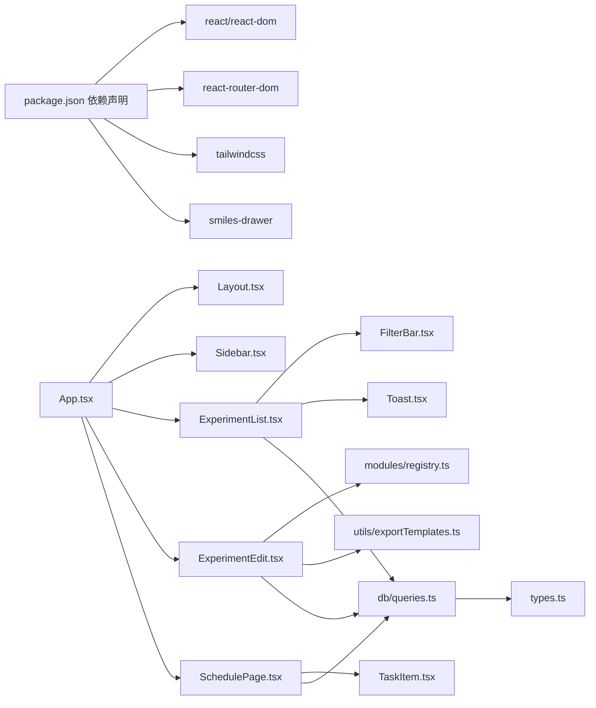

# React前端架构

<cite>
**本文引用的文件**   
- [src/main.tsx](file://src/main.tsx)
- [src/App.tsx](file://src/App.tsx)
- [src/components/Layout.tsx](file://src/components/Layout.tsx)
- [src/components/Sidebar.tsx](file://src/components/Sidebar.tsx)
- [src/pages/ExperimentList.tsx](file://src/pages/ExperimentList.tsx)
- [src/pages/ExperimentEdit.tsx](file://src/pages/ExperimentEdit.tsx)
- [src/pages/SchedulePage.tsx](file://src/pages/SchedulePage.tsx)
- [src/components/FilterBar.tsx](file://src/components/FilterBar.tsx)
- [src/components/TaskItem.tsx](file://src/components/TaskItem.tsx)
- [src/components/Toast.tsx](file://src/components/Toast.tsx)
- [src/modules/registry.ts](file://src/modules/registry.ts)
- [src/db/queries.ts](file://src/db/queries.ts)
- [src/types.ts](file://src/types.ts)
- [src/utils/exportTemplates.ts](file://src/utils/exportTemplates.ts)
- [package.json](file://package.json)
</cite>

## 目录
1. [简介](#简介)
2. [项目结构](#项目结构)
3. [核心组件](#核心组件)
4. [架构总览](#架构总览)
5. [详细组件分析](#详细组件分析)
6. [依赖关系分析](#依赖关系分析)
7. [性能考量](#性能考量)
8. [故障排查指南](#故障排查指南)
9. [结论](#结论)
10. [附录](#附录)

## 简介
本文件为 LabNote 项目的 React 前端应用架构设计文档。该应用基于 React 18、TypeScript、Vite 与 Electron，采用 HashRouter 进行路由管理，使用模块化布局（Sidebar + 主内容区）组织页面，并通过 window.labnote IPC 桥接访问后端能力（数据库、文件系统、桌面小组件等）。文档覆盖组件层次结构、路由系统、状态管理模式、布局系统、模块系统、类型系统、生命周期与事件处理、性能优化策略以及开发规范建议。

## 项目结构
- 入口与路由
  - 应用入口在 src/main.tsx，挂载 React 根节点并包裹 HashRouter。
  - 路由定义集中在 src/App.tsx，通过 Routes/Route 组合不同页面与布局。
- 布局系统
  - 通用布局：src/components/Layout.tsx 提供 Sidebar + Outlet 的主框架。
  - 特殊布局：App.tsx 内定义 StructureLayout（全屏编辑器）、ScheduleLayout（宽屏日程）。
- 页面与功能模块
  - pages 下包含实验列表、编辑、项目管理、模板库、试剂库、日程、结构式绘制、Widget 等页面。
  - components 提供可复用 UI 组件（侧边栏、筛选栏、任务项、提示框等）。
  - modules 提供“实验模块”系统的注册表与工具函数。
  - db/queries.ts 封装对 window.labnote.* 的调用，统一数据访问层。
  - types.ts 集中定义领域模型与全局扩展接口。
  - utils/exportTemplates.ts 提供导出模板引擎与内置样式。

图表来源
- [src/main.tsx:1-14](file://src/main.tsx#L1-L14)
- [src/App.tsx:1-64](file://src/App.tsx#L1-L64)
- [src/components/Layout.tsx:1-16](file://src/components/Layout.tsx#L1-L16)
- [src/components/Sidebar.tsx:1-123](file://src/components/Sidebar.tsx#L1-L123)
- [src/pages/ExperimentList.tsx:1-252](file://src/pages/ExperimentList.tsx#L1-L252)
- [src/pages/ExperimentEdit.tsx:1-800](file://src/pages/ExperimentEdit.tsx#L1-L800)
- [src/pages/SchedulePage.tsx:1-473](file://src/pages/SchedulePage.tsx#L1-L473)

章节来源
- [src/main.tsx:1-14](file://src/main.tsx#L1-L14)
- [src/App.tsx:1-64](file://src/App.tsx#L1-L64)
- [src/components/Layout.tsx:1-16](file://src/components/Layout.tsx#L1-L16)
- [src/components/Sidebar.tsx:1-123](file://src/components/Sidebar.tsx#L1-L123)
- [src/pages/ExperimentList.tsx:1-252](file://src/pages/ExperimentList.tsx#L1-L252)
- [src/pages/ExperimentEdit.tsx:1-800](file://src/pages/ExperimentEdit.tsx#L1-L800)
- [src/pages/SchedulePage.tsx:1-473](file://src/pages/SchedulePage.tsx#L1-L473)

## 核心组件
- 路由与布局
  - App.tsx 负责路由装配与多布局切换；Layout.tsx 提供标准左右布局；Sidebar.tsx 提供导航与快捷操作。
- 页面组件
  - ExperimentList.tsx 展示实验列表、筛选与删除确认；ExperimentEdit.tsx 承载复杂表单、模块系统与导出；SchedulePage.tsx 整合任务与日历视图。
- 通用组件
  - FilterBar.tsx 提供搜索与多维筛选；TaskItem.tsx 渲染任务卡片与子任务；Toast.tsx 提供轻量消息提示。
- 模块系统
  - registry.ts 定义标准模块、默认布局与解析工具，支撑实验编辑页的可插拔模块布局。
- 数据访问
  - queries.ts 封装 window.labnote.* 调用，统一类型约束与错误提示。
- 类型系统
  - types.ts 定义领域模型与全局扩展，确保跨组件的类型安全。

章节来源
- [src/App.tsx:1-64](file://src/App.tsx#L1-L64)
- [src/components/Layout.tsx:1-16](file://src/components/Layout.tsx#L1-L16)
- [src/components/Sidebar.tsx:1-123](file://src/components/Sidebar.tsx#L1-L123)
- [src/pages/ExperimentList.tsx:1-252](file://src/pages/ExperimentList.tsx#L1-L252)
- [src/pages/ExperimentEdit.tsx:1-800](file://src/pages/ExperimentEdit.tsx#L1-L800)
- [src/pages/SchedulePage.tsx:1-473](file://src/pages/SchedulePage.tsx#L1-L473)
- [src/components/FilterBar.tsx:1-85](file://src/components/FilterBar.tsx#L1-L85)
- [src/components/TaskItem.tsx:1-135](file://src/components/TaskItem.tsx#L1-L135)
- [src/components/Toast.tsx:1-53](file://src/components/Toast.tsx#L1-L53)
- [src/modules/registry.ts:1-124](file://src/modules/registry.ts#L1-L124)
- [src/db/queries.ts:1-193](file://src/db/queries.ts#L1-L193)
- [src/types.ts:1-316](file://src/types.ts#L1-L316)

## 架构总览
整体采用“路由驱动 + 布局容器 + 页面组件 + 通用组件 + 数据访问层 + 类型系统”的分层模式。Electron 预加载脚本暴露 window.labnote.* API，前端通过 queries.ts 统一调用，避免直接耦合 IPC。

图表来源
- [src/main.tsx:1-14](file://src/main.tsx#L1-L14)
- [src/App.tsx:1-64](file://src/App.tsx#L1-L64)
- [src/components/Layout.tsx:1-16](file://src/components/Layout.tsx#L1-L16)
- [src/components/Sidebar.tsx:1-123](file://src/components/Sidebar.tsx#L1-L123)
- [src/pages/ExperimentList.tsx:1-252](file://src/pages/ExperimentList.tsx#L1-L252)
- [src/pages/ExperimentEdit.tsx:1-800](file://src/pages/ExperimentEdit.tsx#L1-L800)
- [src/pages/SchedulePage.tsx:1-473](file://src/pages/SchedulePage.tsx#L1-L473)
- [src/components/FilterBar.tsx:1-85](file://src/components/FilterBar.tsx#L1-L85)
- [src/components/TaskItem.tsx:1-135](file://src/components/TaskItem.tsx#L1-L135)
- [src/components/Toast.tsx:1-53](file://src/components/Toast.tsx#L1-L53)
- [src/modules/registry.ts:1-124](file://src/modules/registry.ts#L1-L124)
- [src/db/queries.ts:1-193](file://src/db/queries.ts#L1-L193)
- [src/types.ts:1-316](file://src/types.ts#L1-L316)
- [src/utils/exportTemplates.ts:1-367](file://src/utils/exportTemplates.ts#L1-L367)

## 详细组件分析

### 路由与布局系统
- 路由配置
  - 使用 react-router-dom 的 Routes/Route 组合页面；部分页面使用懒加载提升首屏性能。
  - 支持三种布局：标准 Layout（含 Sidebar）、ScheduleLayout（宽屏日程）、StructureLayout（全屏结构式编辑器），以及无布局的 Widget 页面。
- 布局实现
  - Layout.tsx 使用 flex 布局，左侧 Sidebar，右侧 main 区域通过 Outlet 渲染子路由。
  - Sidebar.tsx 维护导航项数组，结合 NavLink 高亮当前路径，并提供新建实验与桌面小组件开关。

图表来源
- [src/main.tsx:1-14](file://src/main.tsx#L1-L14)
- [src/App.tsx:1-64](file://src/App.tsx#L1-L64)
- [src/components/Layout.tsx:1-16](file://src/components/Layout.tsx#L1-L16)
- [src/components/Sidebar.tsx:1-123](file://src/components/Sidebar.tsx#L1-L123)

章节来源
- [src/App.tsx:1-64](file://src/App.tsx#L1-L64)
- [src/components/Layout.tsx:1-16](file://src/components/Layout.tsx#L1-L16)
- [src/components/Sidebar.tsx:1-123](file://src/components/Sidebar.tsx#L1-L123)

### 实验列表页面（ExperimentList）
- 数据加载
  - 使用 useEffect 触发一次性加载，Promise.all 并发获取实验、课题、标签及实验-标签映射。
- 过滤逻辑
  - 使用 useMemo 计算 filtered 结果，支持关键词、课题、标签、日期范围等多维筛选。
- 交互与反馈
  - 删除操作通过 ConfirmDialog 二次确认；使用 Toast 提示成功或失败。
- 组件通信
  - 将筛选状态与回调函数以 props 形式传递给 FilterBar。

图表来源
- [src/pages/ExperimentList.tsx:1-252](file://src/pages/ExperimentList.tsx#L1-L252)
- [src/components/FilterBar.tsx:1-85](file://src/components/FilterBar.tsx#L1-L85)
- [src/components/Toast.tsx:1-53](file://src/components/Toast.tsx#L1-L53)

章节来源
- [src/pages/ExperimentList.tsx:1-252](file://src/pages/ExperimentList.tsx#L1-L252)
- [src/components/FilterBar.tsx:1-85](file://src/components/FilterBar.tsx#L1-L85)
- [src/components/Toast.tsx:1-53](file://src/components/Toast.tsx#L1-L53)

### 实验编辑页面（ExperimentEdit）
- 模块系统
  - 通过 registry.ts 的标准模块定义与默认布局，动态渲染各模块区块；支持隐藏/展开/拖拽排序。
  - 自定义模块由 ModuleTemplate 驱动，支持从模板库选择并注入字段。
- 数据流
  - 新增/编辑模式共用同一组件；根据 URL 参数判断是否为新实验或模板编辑。
  - 保存时聚合 form、反应物、催化剂、溶剂、标签、模块布局与自定义模块数据，提交到后端。
- 导出模板
  - 集成 exportTemplates.ts 的内置样式与自定义模板，生成符合期刊风格的文本。
- 图片与结构式
  - 支持粘贴/选择图片，持久化存储；结构式绘制通过懒加载与全屏布局隔离。

图表来源
- [src/modules/registry.ts:1-124](file://src/modules/registry.ts#L1-L124)
- [src/utils/exportTemplates.ts:1-367](file://src/utils/exportTemplates.ts#L1-L367)
- [src/pages/ExperimentEdit.tsx:1-800](file://src/pages/ExperimentEdit.tsx#L1-L800)

章节来源
- [src/pages/ExperimentEdit.tsx:1-800](file://src/pages/ExperimentEdit.tsx#L1-L800)
- [src/modules/registry.ts:1-124](file://src/modules/registry.ts#L1-L124)
- [src/utils/exportTemplates.ts:1-367](file://src/utils/exportTemplates.ts#L1-L367)

### 日程页面（SchedulePage）
- 数据与过滤
  - 并发加载任务、实验、标签与实验-标签关联；按状态、日期范围、标签过滤父级任务。
- 日历联动
  - 将任务与实验转换为 CalendarEvent，支持点击查看详情、拖拽移动任务日期。
- 交互流程
  - 打开 TaskForm 进行新增/编辑；保存后刷新数据并提示。

图表来源
- [src/pages/SchedulePage.tsx:1-473](file://src/pages/SchedulePage.tsx#L1-L473)
- [src/db/queries.ts:1-193](file://src/db/queries.ts#L1-L193)

章节来源
- [src/pages/SchedulePage.tsx:1-473](file://src/pages/SchedulePage.tsx#L1-L473)
- [src/db/queries.ts:1-193](file://src/db/queries.ts#L1-L193)

### 任务项组件（TaskItem）
- 职责
  - 渲染单个任务卡片，支持优先级点、状态切换、子任务展开、编辑与删除。
- 状态与事件
  - 内部维护展开状态；通过回调向父组件传递状态变更、编辑、删除与添加子任务请求。

图表来源
- [src/components/TaskItem.tsx:1-135](file://src/components/TaskItem.tsx#L1-L135)

章节来源
- [src/components/TaskItem.tsx:1-135](file://src/components/TaskItem.tsx#L1-L135)

### 提示系统（Toast）
- 设计
  - useToast Hook 管理 toasts 列表，提供 showToast/removeToast；ToastContainer 渲染固定位置的消息队列。
- 生命周期
  - 每个 ToastItem 使用定时器自动移除，避免内存泄漏。

章节来源
- [src/components/Toast.tsx:1-53](file://src/components/Toast.tsx#L1-L53)

## 依赖关系分析
- 外部依赖
  - React 18、react-router-dom、TailwindCSS、smiles-drawer 等。
- 内部依赖
  - 页面组件依赖通用组件与数据访问层；模块系统独立于具体页面，仅被编辑页引用；类型定义贯穿全栈。

图表来源
- [package.json:1-39](file://package.json#L1-L39)
- [src/App.tsx:1-64](file://src/App.tsx#L1-L64)
- [src/components/Layout.tsx:1-16](file://src/components/Layout.tsx#L1-L16)
- [src/components/Sidebar.tsx:1-123](file://src/components/Sidebar.tsx#L1-L123)
- [src/pages/ExperimentList.tsx:1-252](file://src/pages/ExperimentList.tsx#L1-L252)
- [src/pages/ExperimentEdit.tsx:1-800](file://src/pages/ExperimentEdit.tsx#L1-L800)
- [src/pages/SchedulePage.tsx:1-473](file://src/pages/SchedulePage.tsx#L1-L473)
- [src/components/FilterBar.tsx:1-85](file://src/components/FilterBar.tsx#L1-L85)
- [src/components/TaskItem.tsx:1-135](file://src/components/TaskItem.tsx#L1-L135)
- [src/components/Toast.tsx:1-53](file://src/components/Toast.tsx#L1-L53)
- [src/modules/registry.ts:1-124](file://src/modules/registry.ts#L1-L124)
- [src/db/queries.ts:1-193](file://src/db/queries.ts#L1-L193)
- [src/types.ts:1-316](file://src/types.ts#L1-L316)
- [src/utils/exportTemplates.ts:1-367](file://src/utils/exportTemplates.ts#L1-L367)

章节来源
- [package.json:1-39](file://package.json#L1-L39)
- [src/db/queries.ts:1-193](file://src/db/queries.ts#L1-L193)
- [src/types.ts:1-316](file://src/types.ts#L1-L316)

## 性能考量
- 路由懒加载
  - 结构式编辑器等重型页面使用 lazy 加载，减少初始包体与首屏时间。
- 数据并发与缓存
  - 列表页使用 Promise.all 并发拉取数据；利用 useMemo 缓存过滤结果，避免重复计算。
- 渲染优化
  - 列表项使用稳定 key；大表单拆分模块区块，按需渲染；拖拽排序使用原生 DragEvent 降低合成事件开销。
- 资源与样式
  - 使用 Tailwind 原子类减少自定义 CSS；静态资源通过 Vite 构建优化。

[本节为通用指导，不直接分析具体文件]

## 故障排查指南
- window.labnote 不可用
  - 若出现 window.labnote is not available 的错误，检查 preload 脚本是否正确加载与注入。
- 数据加载失败
  - 查看控制台错误日志；确认 IPC 通道与后端服务可用；必要时增加重试与降级提示。
- 模板/模块解析异常
  - 检查 module_layout JSON 格式与字段校验；确保 fields 字段为合法 JSON 字符串。
- 导出模板为空
  - 确认所选模板存在且占位符正确；检查输入数据是否为空或缺失关键字段。

章节来源
- [src/db/queries.ts:1-193](file://src/db/queries.ts#L1-L193)
- [src/modules/registry.ts:1-124](file://src/modules/registry.ts#L1-L124)
- [src/utils/exportTemplates.ts:1-367](file://src/utils/exportTemplates.ts#L1-L367)

## 结论
LabNote 前端采用清晰的分层与模块化设计：路由驱动页面、布局容器统一框架、通用组件提升复用性、模块系统增强可扩展性、类型系统保障一致性。通过并发加载、懒加载与稳定的渲染策略，兼顾了用户体验与可维护性。建议在后续迭代中继续完善错误边界、单元测试与可视化监控，进一步提升健壮性与可观测性。

[本节为总结，不直接分析具体文件]

## 附录
- 开发规范建议
  - 组件职责单一，尽量保持纯函数与受控状态；复杂逻辑下沉至 hooks 或工具函数。
  - 对外暴露的 API（如 window.labnote.*）需严格类型约束，避免 any。
  - 所有异步操作需有错误捕获与用户提示；关键路径增加日志埋点。
  - 使用 TypeScript 严格模式，优先使用 interface/type 明确数据结构。
  - 样式优先使用 Tailwind 原子类，必要时抽取公共样式并命名清晰。
  - 路由与布局分离，新增页面遵循现有布局约定，避免破坏整体视觉一致性。

[本节为通用指导，不直接分析具体文件]