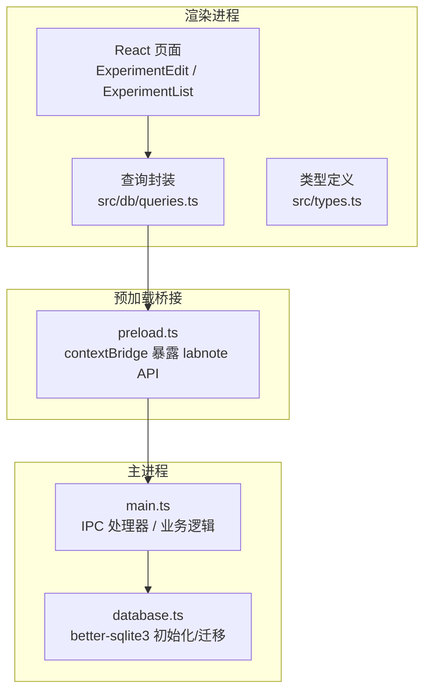
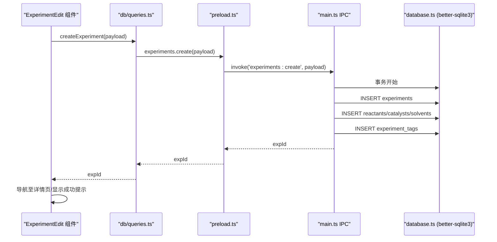
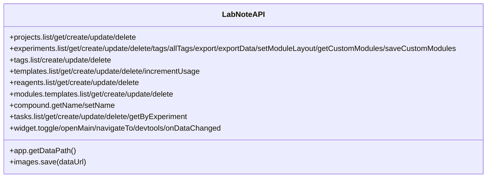
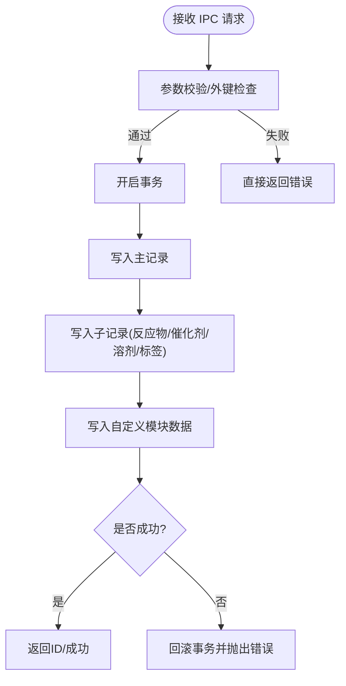
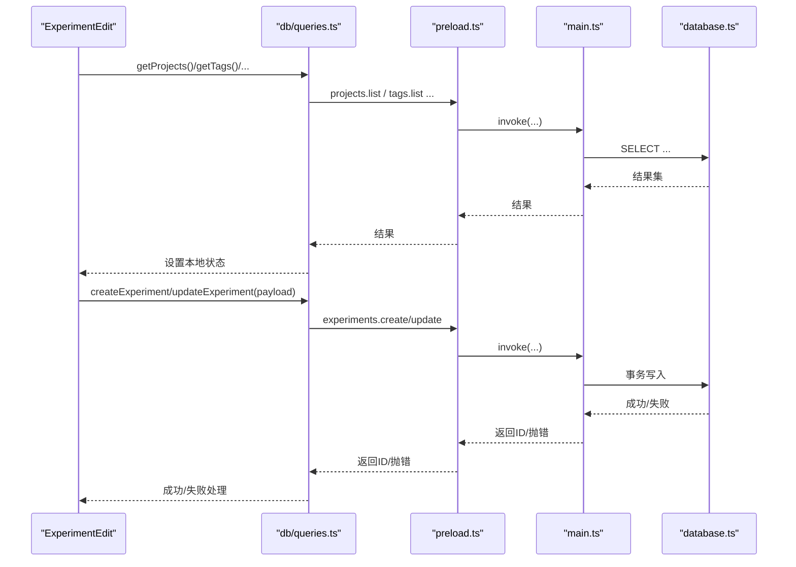
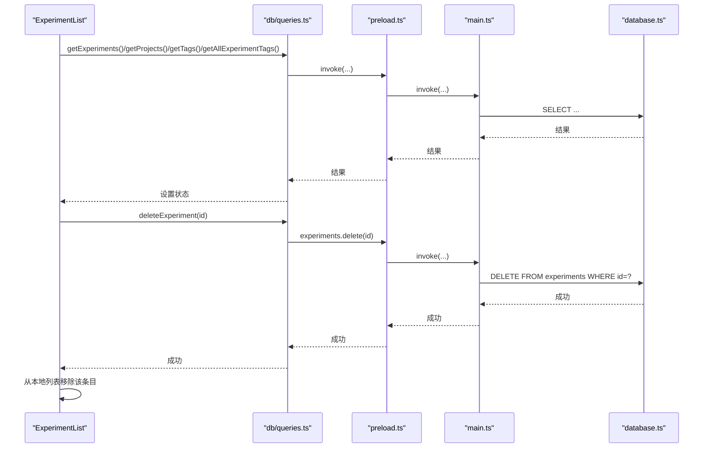
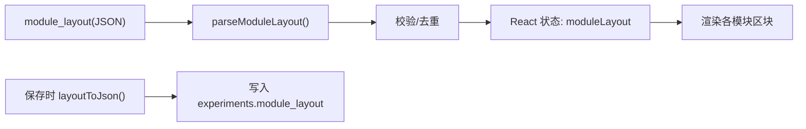
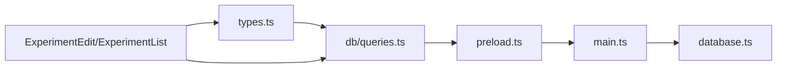

# 数据流设计

<cite>
**本文引用的文件**   
- [electron/main.ts](file://electron/main.ts)
- [electron/preload.ts](file://electron/preload.ts)
- [electron/database.ts](file://electron/database.ts)
- [src/db/queries.ts](file://src/db/queries.ts)
- [src/types.ts](file://src/types.ts)
- [src/pages/ExperimentEdit.tsx](file://src/pages/ExperimentEdit.tsx)
- [src/pages/ExperimentList.tsx](file://src/pages/ExperimentList.tsx)
- [src/modules/registry.ts](file://src/modules/registry.ts)
</cite>

## 目录
1. [引言](#引言)
2. [项目结构](#项目结构)
3. [核心组件](#核心组件)
4. [架构总览](#架构总览)
5. [详细组件分析](#详细组件分析)
6. [依赖关系分析](#依赖关系分析)
7. [性能与一致性](#性能与一致性)
8. [故障排查指南](#故障排查指南)
9. [结论](#结论)
10. [附录：IPC 协议定义](#附录ipc-协议定义)

## 引言
本文件面向 LabNote 的数据流设计与实现，聚焦从用户交互到数据库持久化的完整路径。内容涵盖：
- 用户输入处理、前端校验、状态更新
- IPC 请求/响应模式与错误传播
- 主进程与渲染进程间的数据交换
- 数据库事务与查询结果组装
- 缓存策略、实时更新机制与数据一致性保证
- 关键数据处理节点的代码级图示与示例路径

## 项目结构
LabNote 采用 Electron + React 的桌面应用架构：
- 主进程（Electron）负责窗口管理、文件系统访问、SQLite 数据库操作与 IPC 路由
- 预加载脚本暴露安全 API 给渲染进程
- 渲染进程（React）负责 UI、表单校验、状态管理与调用 IPC API
- 数据库使用 better-sqlite3，开启 WAL 模式并启用外键约束

**图表来源**
- [electron/main.ts:395-800](file://electron/main.ts#L395-L800)
- [electron/preload.ts:82-165](file://electron/preload.ts#L82-L165)
- [electron/database.ts:1-120](file://electron/database.ts#L1-L120)
- [src/db/queries.ts:1-193](file://src/db/queries.ts#L1-L193)
- [src/types.ts:1-316](file://src/types.ts#L1-L316)

**章节来源**
- [electron/main.ts:1-120](file://electron/main.ts#L1-L120)
- [electron/database.ts:1-120](file://electron/database.ts#L1-L120)
- [src/db/queries.ts:1-40](file://src/db/queries.ts#L1-L40)
- [src/types.ts:1-120](file://src/types.ts#L1-L120)

## 核心组件
- 预加载桥接层：将 window.labnote.* 方法映射到 ipcRenderer.invoke，统一请求通道
- 主进程 IPC 处理器：按命名空间组织（projects、experiments、tags、templates、reagents、tasks、modules、compound、widget），执行 SQL 并返回结果
- 数据库层：WAL 模式、外键约束、表结构创建与增量迁移、事务封装
- 前端查询封装：对 window.labnote.* 进行类型化封装，供页面组件调用
- 页面组件：实验编辑与列表页，负责表单校验、状态维护、并发加载与错误提示

**章节来源**
- [electron/preload.ts:82-165](file://electron/preload.ts#L82-L165)
- [electron/main.ts:395-800](file://electron/main.ts#L395-L800)
- [electron/database.ts:1-120](file://electron/database.ts#L1-L120)
- [src/db/queries.ts:1-193](file://src/db/queries.ts#L1-L193)
- [src/pages/ExperimentEdit.tsx:1-120](file://src/pages/ExperimentEdit.tsx#L1-L120)
- [src/pages/ExperimentList.tsx:1-60](file://src/pages/ExperimentList.tsx#L1-L60)

## 架构总览
下图展示一次“保存实验”的端到端数据流：从表单提交到数据库事务写入，再到成功回调与 UI 刷新。

**图表来源**
- [src/pages/ExperimentEdit.tsx:398-453](file://src/pages/ExperimentEdit.tsx#L398-L453)
- [src/db/queries.ts:64-74](file://src/db/queries.ts#L64-L74)
- [electron/preload.ts:96-109](file://electron/preload.ts#L96-L109)
- [electron/main.ts:495-577](file://electron/main.ts#L495-L577)
- [electron/database.ts:1-120](file://electron/database.ts#L1-L120)

## 详细组件分析

### 1) 预加载桥接与 IPC 协议
- 通过 contextBridge.exposeInMainWorld 暴露 labnote API，所有方法基于 ipcRenderer.invoke 发起请求
- 命名规范：模块名:动作（如 experiments:list、experiments:create）
- 返回值：Promise<T>；异常会沿 Promise 链回传到调用方
- 事件通道：widget:dataChanged 用于跨窗口推送数据变更通知

**图表来源**
- [electron/preload.ts:3-80](file://electron/preload.ts#L3-L80)
- [electron/preload.ts:82-165](file://electron/preload.ts#L82-L165)

**章节来源**
- [electron/preload.ts:1-165](file://electron/preload.ts#L1-L165)

### 2) 主进程 IPC 处理器与数据库事务
- 所有写操作均使用 better-sqlite3 的 db.transaction 包裹，确保多表写入原子性
- 外键约束开启，插入前校验关联 ID（如 project_id）避免 FK 失败
- 读操作按需 JOIN 或二次查询聚合子实体（reactants、catalysts、solvents、tags、custom_modules）
- 图片资源通过自定义协议 labnote://images/{filename} 提供安全访问

**图表来源**
- [electron/main.ts:495-577](file://electron/main.ts#L495-L577)
- [electron/main.ts:579-655](file://electron/main.ts#L579-L655)
- [electron/database.ts:13-15](file://electron/database.ts#L13-L15)

**章节来源**
- [electron/main.ts:395-800](file://electron/main.ts#L395-L800)
- [electron/database.ts:1-120](file://electron/database.ts#L1-L120)

### 3) 前端数据流：实验编辑页
- 加载阶段：并行获取项目、标签、试剂库、模块模板；若为编辑模式则拉取实验详情并填充表单
- 校验阶段：必填字段校验，错误信息绑定到对应字段
- 构建负载：合并基础表单、子实体数组、标签 ID、模块布局与自定义模块数据
- 保存阶段：新建时调用 createExperiment，更新时调用 updateExperiment；成功后导航或提示
- 导出阶段：先确保已存在实验记录，再调用 exportData 获取结构化数据，结合模板格式化输出

**图表来源**
- [src/pages/ExperimentEdit.tsx:265-368](file://src/pages/ExperimentEdit.tsx#L265-L368)
- [src/pages/ExperimentEdit.tsx:398-453](file://src/pages/ExperimentEdit.tsx#L398-L453)
- [src/db/queries.ts:64-74](file://src/db/queries.ts#L64-L74)
- [electron/preload.ts:96-109](file://electron/preload.ts#L96-L109)
- [electron/main.ts:495-577](file://electron/main.ts#L495-L577)

**章节来源**
- [src/pages/ExperimentEdit.tsx:1-120](file://src/pages/ExperimentEdit.tsx#L1-L120)
- [src/pages/ExperimentEdit.tsx:265-368](file://src/pages/ExperimentEdit.tsx#L265-L368)
- [src/pages/ExperimentEdit.tsx:398-453](file://src/pages/ExperimentEdit.tsx#L398-L453)

### 4) 前端数据流：实验列表页
- 加载阶段：并行获取实验列表、项目、标签、以及实验-标签映射
- 过滤阶段：在内存中根据关键词、项目、标签、日期范围筛选
- 删除流程：确认后调用 deleteExperiment，成功后从本地列表移除

**图表来源**
- [src/pages/ExperimentList.tsx:30-55](file://src/pages/ExperimentList.tsx#L30-L55)
- [src/pages/ExperimentList.tsx:76-92](file://src/pages/ExperimentList.tsx#L76-L92)
- [src/db/queries.ts:56-74](file://src/db/queries.ts#L56-L74)
- [electron/preload.ts:96-109](file://electron/preload.ts#L96-L109)
- [electron/main.ts:657-659](file://electron/main.ts#L657-L659)

**章节来源**
- [src/pages/ExperimentList.tsx:1-120](file://src/pages/ExperimentList.tsx#L1-L120)

### 5) 模块系统与布局
- 标准模块定义与默认布局在 registry 中集中管理
- 解析与序列化布局 JSON，去重与合法性校验
- 自定义模块以 module_key 标识，数据以 JSON 文本存储于 experiment_module_data

**图表来源**
- [src/modules/registry.ts:64-96](file://src/modules/registry.ts#L64-L96)
- [src/modules/registry.ts:98-100](file://src/modules/registry.ts#L98-L100)
- [electron/main.ts:798-800](file://electron/main.ts#L798-L800)

**章节来源**
- [src/modules/registry.ts:1-124](file://src/modules/registry.ts#L1-L124)

## 依赖关系分析
- 渲染进程依赖 preload 暴露的 labnote API
- 查询封装依赖 window.labnote，不直接访问 Node/Electron
- 主进程依赖 database.ts 提供的数据库实例与初始化能力
- 页面组件依赖 types.ts 的类型定义，保持前后端数据结构一致

**图表来源**
- [src/types.ts:1-316](file://src/types.ts#L1-L316)
- [src/db/queries.ts:1-193](file://src/db/queries.ts#L1-L193)
- [electron/preload.ts:1-165](file://electron/preload.ts#L1-L165)
- [electron/main.ts:1-120](file://electron/main.ts#L1-L120)
- [electron/database.ts:1-120](file://electron/database.ts#L1-L120)

**章节来源**
- [src/types.ts:1-120](file://src/types.ts#L1-L120)
- [src/db/queries.ts:1-40](file://src/db/queries.ts#L1-L40)
- [electron/preload.ts:1-40](file://electron/preload.ts#L1-L40)
- [electron/main.ts:1-60](file://electron/main.ts#L1-L60)
- [electron/database.ts:1-60](file://electron/database.ts#L1-L60)

## 性能与一致性
- 并发读取：页面加载使用 Promise.all 并行获取多类数据，减少首屏等待
- 事务写入：所有复杂写操作使用 db.transaction 包裹，保证多表写入原子性与一致性
- 外键约束：开启 foreign_keys=ON，并在写入前校验关联 ID，避免 FK 失败导致脏数据
- WAL 模式：journal_mode=WAL 提升并发读性能，降低锁竞争
- 索引与唯一约束：experiment_module_data 上建立唯一索引，防止重复模块数据
- 增量迁移：启动时检测列缺失并自动 ALTER TABLE，兼容历史版本
- 实时通知：主进程通过 widget:dataChanged 事件向小部件窗口推送数据变更，支持跨窗口同步

**章节来源**
- [electron/database.ts:13-15](file://electron/database.ts#L13-L15)
- [electron/database.ts:259-261](file://electron/database.ts#L259-L261)
- [electron/database.ts:280-290](file://electron/database.ts#L280-L290)
- [electron/main.ts:277-294](file://electron/main.ts#L277-L294)
- [src/pages/ExperimentList.tsx:30-55](file://src/pages/ExperimentList.tsx#L30-L55)

## 故障排查指南
- 数据库未初始化：主进程注册 IPC 时会检查数据库实例，若未初始化将打印致命日志并拒绝服务
- 外键失败：当传入的 project_id 不存在时，主进程将其置空以避免 FK 约束失败
- 事务回滚：任何子记录写入失败都会触发回滚，上层捕获错误并提示用户
- 图片协议：labnote://images 路径需经过 dataPath 白名单校验，防止路径穿越
- 小部件通信：widget:dataChanged 事件需在渲染进程正确订阅与注销监听器

**章节来源**
- [electron/main.ts:395-401](file://electron/main.ts#L395-L401)
- [electron/main.ts:498-505](file://electron/main.ts#L498-L505)
- [electron/main.ts:573-577](file://electron/main.ts#L573-L577)
- [electron/main.ts:378-391](file://electron/main.ts#L378-L391)
- [electron/preload.ts:157-161](file://electron/preload.ts#L157-L161)

## 结论
LabNote 的数据流以 IPC 为核心枢纽，将前端 UI 与后端 SQLite 解耦。通过严格的类型定义、事务化写入与外键约束，保证了数据的一致性与完整性；借助 WAL 与并行加载优化了性能；通过事件通道实现了跨窗口的实时通知。整体架构清晰、可扩展性强，适合持续演进。

## 附录：IPC 协议定义
以下列出主要 IPC 通道及其职责（仅描述，不包含具体实现细节）：
- app:getDataPath → 返回当前数据存储路径
- images:save → 保存 base64 图片到磁盘，返回文件名
- projects:list/get/create/update/delete → 项目管理 CRUD
- experiments:list/get/create/update/delete → 实验记录 CRUD
- experiments:tags/experiments:allTags → 实验标签查询
- experiments:export/experiments:exportData → 导出实验报告或原始数据
- experiments:setModuleLayout → 保存模块布局
- experiments:getCustomModules/experiments:saveCustomModules → 自定义模块数据读写
- tags/list/create/update/delete → 标签管理
- templates/list/get/create/update/delete/increment-usage → 模板管理
- reagents/list/get/create/update/delete → 试剂库管理
- modules:templates/list/get/create/update/delete → 模块模板管理
- compound:getName/setName → 化合物名称缓存
- tasks/list/get/create/update/delete/getByExperiment → 任务管理
- widget:toggle/openMain/navigateTo/devtools → 小部件控制
- widget:onDataChanged → 订阅数据变更事件

**章节来源**
- [electron/preload.ts:3-80](file://electron/preload.ts#L3-L80)
- [electron/preload.ts:82-165](file://electron/preload.ts#L82-L165)
- [electron/main.ts:404-800](file://electron/main.ts#L404-L800)