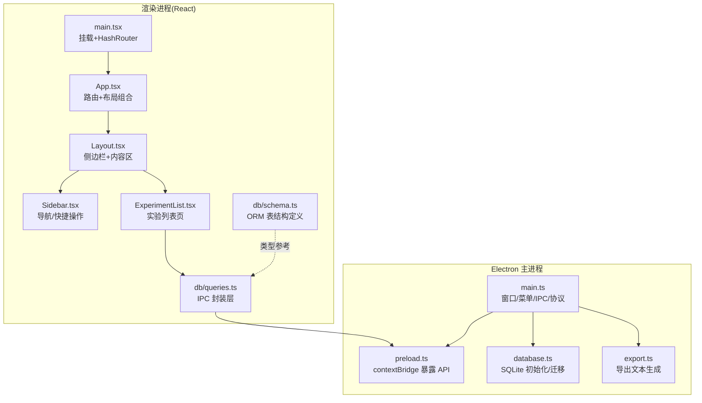
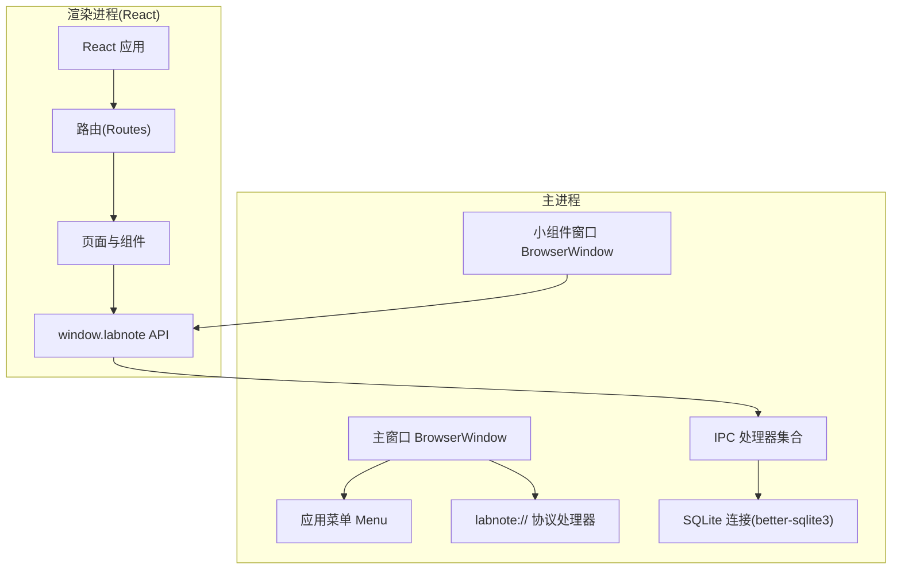
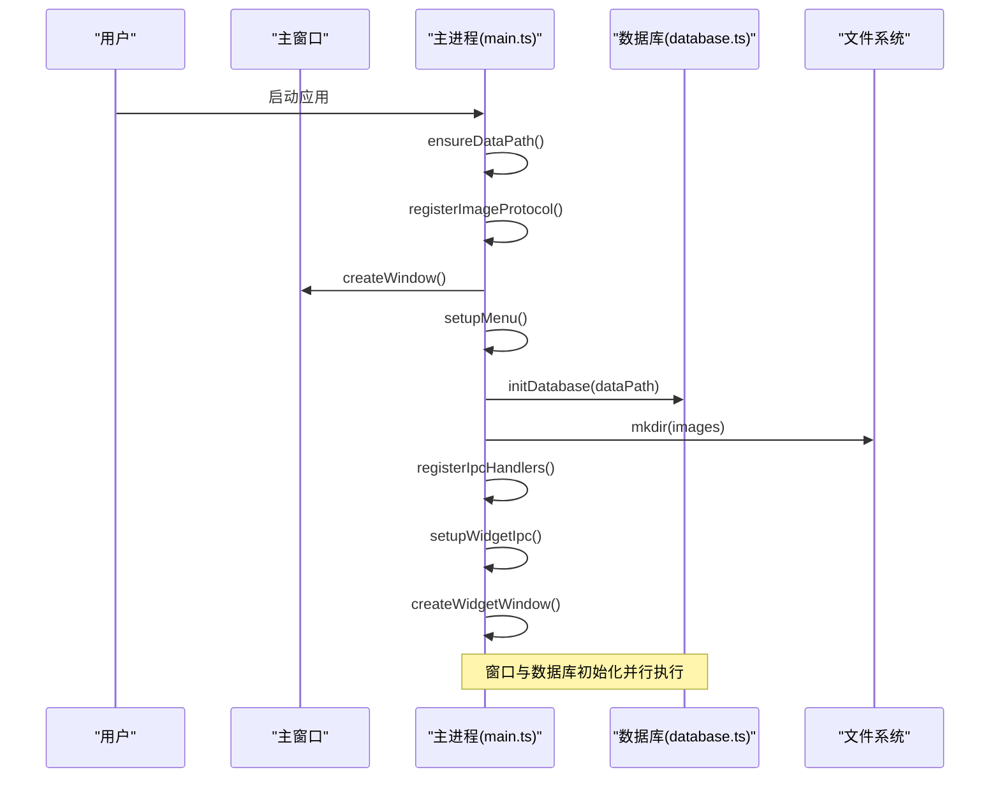
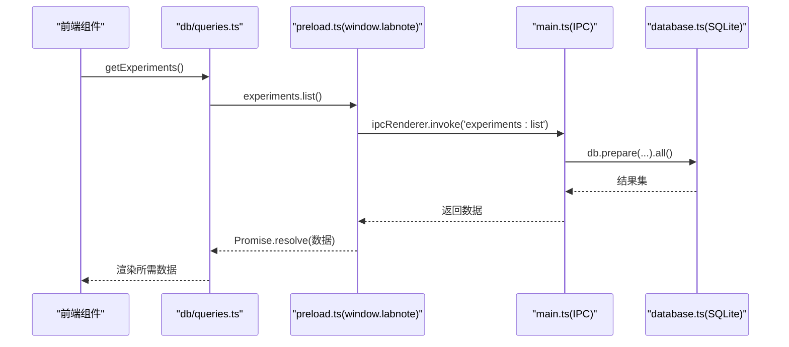
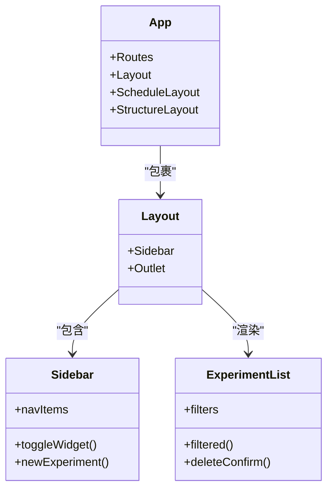
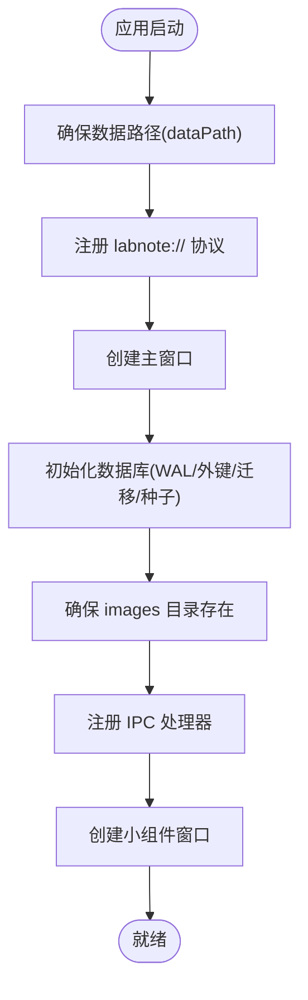
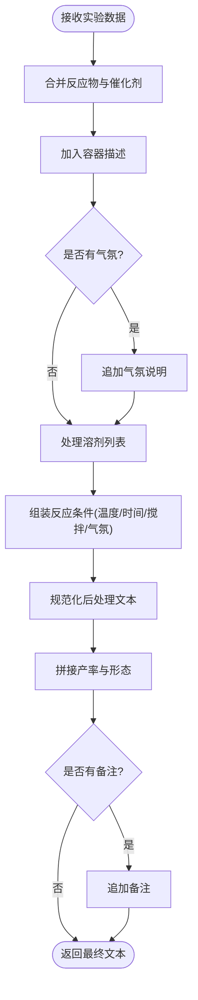
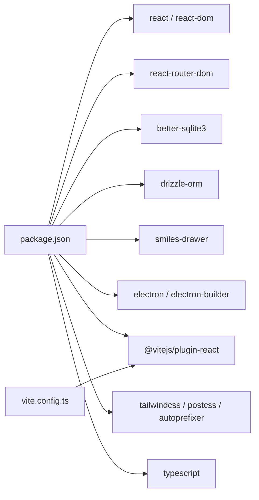

# 整体架构概览

<cite>
**本文引用的文件**
- [package.json](file://package.json)
- [vite.config.ts](file://vite.config.ts)
- [electron/main.ts](file://electron/main.ts)
- [electron/preload.ts](file://electron/preload.ts)
- [electron/database.ts](file://electron/database.ts)
- [electron/export.ts](file://electron/export.ts)
- [src/main.tsx](file://src/main.tsx)
- [src/App.tsx](file://src/App.tsx)
- [src/components/Layout.tsx](file://src/components/Layout.tsx)
- [src/components/Sidebar.tsx](file://src/components/Sidebar.tsx)
- [src/pages/ExperimentList.tsx](file://src/pages/ExperimentList.tsx)
- [src/db/schema.ts](file://src/db/schema.ts)
- [src/db/queries.ts](file://src/db/queries.ts)
</cite>

## 目录
1. [简介](#简介)
2. [项目结构](#项目结构)
3. [核心组件](#核心组件)
4. [架构总览](#架构总览)
5. [详细组件分析](#详细组件分析)
6. [依赖关系分析](#依赖关系分析)
7. [性能考量](#性能考量)
8. [故障排查指南](#故障排查指南)
9. [结论](#结论)
10. [附录](#附录)

## 简介
LabNote 是一款基于 Electron + React + TypeScript 的桌面化学实验记录软件。系统采用主进程与渲染进程分离的架构，通过预加载脚本暴露安全的 IPC API；前端使用 React 路由组织页面，结合侧边栏布局与模块化实验数据模型；后端以 SQLite（better-sqlite3）作为本地数据库，并通过自定义协议访问文件系统图片资源。整体设计强调安全性、可维护性与可扩展性，支持课题管理、实验记录、模板库、试剂库、任务与日程、以及桌面小组件等能力。

## 项目结构
- 应用入口与打包配置
  - package.json：定义应用名称、版本、启动入口、构建脚本与依赖。
  - vite.config.ts：Vite 构建配置，包含别名、分包策略与输出目录。
- 主进程与系统层
  - electron/main.ts：主进程逻辑，窗口管理、菜单、IPC 处理、图像协议、数据路径与初始化流程。
  - electron/preload.ts：预加载脚本，通过 contextBridge 暴露 window.labnote API。
  - electron/database.ts：SQLite 初始化、表结构创建与迁移、模块模板种子数据。
  - electron/export.ts：将实验数据格式化为期刊风格文本。
- 渲染进程与前端
  - src/main.tsx：React 根挂载与 HashRouter 初始化。
  - src/App.tsx：路由与布局组合，包括常规布局、宽屏日程、无框小组件、全屏结构式编辑器。
  - src/components/Layout.tsx：通用布局容器（侧边栏 + 内容区）。
  - src/components/Sidebar.tsx：导航与快捷操作（新建实验、打开小组件）。
  - src/pages/ExperimentList.tsx：实验列表页，含筛选、删除确认、标签展示等。
  - src/db/schema.ts：Drizzle ORM 表结构定义（用于类型参考与迁移工具）。
  - src/db/queries.ts：查询封装层，统一通过 window.labnote.* 调用 IPC。

图表来源
- [electron/main.ts](file://electron/main.ts)
- [electron/preload.ts](file://electron/preload.ts)
- [electron/database.ts](file://electron/database.ts)
- [electron/export.ts](file://electron/export.ts)
- [src/main.tsx](file://src/main.tsx)
- [src/App.tsx](file://src/App.tsx)
- [src/components/Layout.tsx](file://src/components/Layout.tsx)
- [src/components/Sidebar.tsx](file://src/components/Sidebar.tsx)
- [src/pages/ExperimentList.tsx](file://src/pages/ExperimentList.tsx)
- [src/db/schema.ts](file://src/db/schema.ts)
- [src/db/queries.ts](file://src/db/queries.ts)

章节来源
- [package.json:1-39](file://package.json#L1-L39)
- [vite.config.ts:1-26](file://vite.config.ts#L1-L26)

## 核心组件
- 主进程（electron/main.ts）
  - 职责：应用生命周期、单实例锁、窗口管理（主窗口与小组件）、菜单、自定义协议、数据路径选择与持久化、IPC 处理器注册、数据库初始化与迁移、通知小组件刷新。
  - 关键流程：确保数据路径 → 注册 labnote:// 协议 → 创建窗口 → 初始化菜单 → 并行初始化数据库 → 确保 images 目录 → 注册 IPC 与小组件 IPC → 创建小组件窗口。
- 预加载脚本（electron/preload.ts）
  - 职责：通过 contextBridge 暴露安全 API（app、images、projects、experiments、tags、templates、reagents、modules、compound、tasks、widget），屏蔽 Node/Electron 原生对象。
- 数据库层（electron/database.ts）
  - 职责：WAL 模式与外键开启、表结构创建、字段迁移、预设模块模板种子、唯一索引与约束修复。
- 导出服务（electron/export.ts）
  - 职责：将实验数据转换为期刊风格的“实验部分”文本，便于论文撰写。
- 前端入口与路由（src/main.tsx, src/App.tsx）
  - 职责：挂载 React 根节点，使用 HashRouter；按页面需求组合不同布局（常规、宽屏、无框、全屏）。
- 布局与导航（src/components/Layout.tsx, src/components/Sidebar.tsx）
  - 职责：提供统一的侧边栏导航与内容区域；集成“桌面小组件”开关与“新建实验”快捷入口。
- 查询封装（src/db/queries.ts）
  - 职责：为各业务模块提供统一的异步查询方法，内部通过 window.labnote.* 调用 IPC，保证类型一致与错误提示友好。

章节来源
- [electron/main.ts:1068-1109](file://electron/main.ts#L1068-L1109)
- [electron/preload.ts:82-165](file://electron/preload.ts#L82-L165)
- [electron/database.ts:6-315](file://electron/database.ts#L6-L315)
- [electron/export.ts:55-137](file://electron/export.ts#L55-L137)
- [src/main.tsx:1-14](file://src/main.tsx#L1-L14)
- [src/App.tsx:43-63](file://src/App.tsx#L43-L63)
- [src/components/Layout.tsx:1-16](file://src/components/Layout.tsx#L1-L16)
- [src/components/Sidebar.tsx:61-122](file://src/components/Sidebar.tsx#L61-L122)
- [src/db/queries.ts:23-30](file://src/db/queries.ts#L23-L30)

## 架构总览
下图展示了 LabNote 的整体架构：主进程负责系统级能力与数据持久化，渲染进程专注 UI 与交互，二者通过预加载脚本提供的安全 API 进行通信。

图表来源
- [electron/main.ts:102-132](file://electron/main.ts#L102-L132)
- [electron/main.ts:145-237](file://electron/main.ts#L145-L237)
- [electron/main.ts:298-374](file://electron/main.ts#L298-L374)
- [electron/main.ts:378-391](file://electron/main.ts#L378-L391)
- [electron/main.ts:395-1046](file://electron/main.ts#L395-L1046)
- [electron/preload.ts:82-165](file://electron/preload.ts#L82-L165)
- [src/App.tsx:43-63](file://src/App.tsx#L43-L63)

## 详细组件分析

### 主进程与窗口管理
- 单实例锁与二次实例激活：防止重复启动，并在已有实例时聚焦主窗口。
- 数据路径管理：首次启动默认指向用户文档目录下的 LabNoteData，后续可通过菜单动态切换并热重载数据库。
- 窗口体系：
  - 主窗口：标准窗口，开发环境加载 Vite 开发服务器，生产环境加载 dist/index.html。
  - 小组件窗口：无边框、透明、置顶控制、嵌入 Windows 桌面（PowerShell 调用 user32.dll），支持从主窗口导航到指定路由。
- 菜单：提供“选择数据库位置”、“退出”、“开发者工具”、“缩放”等功能。
- 图像协议：labnote://images/... 映射到 dataPath/images 目录，并进行路径穿越防护。

图表来源
- [electron/main.ts:1068-1109](file://electron/main.ts#L1068-L1109)
- [electron/main.ts:84-98](file://electron/main.ts#L84-L98)
- [electron/main.ts:378-391](file://electron/main.ts#L378-L391)
- [electron/database.ts:6-315](file://electron/database.ts#L6-L315)

章节来源
- [electron/main.ts:1050-1114](file://electron/main.ts#L1050-L1114)
- [electron/main.ts:102-132](file://electron/main.ts#L102-L132)
- [electron/main.ts:145-237](file://electron/main.ts#L145-L237)
- [electron/main.ts:298-374](file://electron/main.ts#L298-L374)
- [electron/main.ts:378-391](file://electron/main.ts#L378-L391)

### 进程间通信（IPC）机制
- 安全边界：渲染进程无法直接访问 Node/Electron，所有能力通过 preload.ts 暴露的 window.labnote API。
- 通道命名规范：按领域划分，如 projects:*、experiments:*、tags:*、templates:*、reagents:*、modules:*、compound:*、tasks:*、widget:*、app:*、images:*。
- 事务与一致性：对复杂写入（如实验创建/更新、自定义模块保存）使用 better-sqlite3 的事务包装，失败自动回滚。
- 事件推送：主进程在数据变更后向小组件发送 widget:dataChanged 事件，驱动小组件刷新。

图表来源
- [src/db/queries.ts:56-58](file://src/db/queries.ts#L56-L58)
- [electron/preload.ts:96-109](file://electron/preload.ts#L96-L109)
- [electron/main.ts:461-468](file://electron/main.ts#L461-L468)
- [electron/database.ts:6-315](file://electron/database.ts#L6-L315)

章节来源
- [electron/preload.ts:82-165](file://electron/preload.ts#L82-L165)
- [electron/main.ts:395-1046](file://electron/main.ts#L395-L1046)
- [src/db/queries.ts:23-30](file://src/db/queries.ts#L23-L30)

### 前端应用架构（React）
- 路由与布局
  - HashRouter：适配 Electron 本地加载场景。
  - App.tsx 中根据页面特性组合不同布局：常规 Layout、ScheduleLayout（宽屏）、StructureLayout（全屏）、WidgetPage（小组件专用）。
- 组件层次
  - Layout.tsx：左侧 Sidebar + 右侧 Outlet 内容区。
  - Sidebar.tsx：导航项（全部实验、日程、课题管理、模板库、试剂库、结构式绘制）与快捷操作（新建实验、桌面小组件）。
  - ExperimentList.tsx：列表页，聚合项目、标签、实验数据，支持搜索、日期范围、标签与课题筛选，并提供删除确认与 Toast 反馈。
- 状态管理
  - 当前采用组件内 useState/useEffect 管理页面状态，配合 useMemo 做过滤计算，适合中小型应用。
  - 未来可按需引入全局状态库（如 Zustand/Redux）以增强跨页面共享能力。

图表来源
- [src/App.tsx:43-63](file://src/App.tsx#L43-L63)
- [src/components/Layout.tsx:1-16](file://src/components/Layout.tsx#L1-L16)
- [src/components/Sidebar.tsx:61-122](file://src/components/Sidebar.tsx#L61-L122)
- [src/pages/ExperimentList.tsx:10-120](file://src/pages/ExperimentList.tsx#L10-L120)

章节来源
- [src/main.tsx:1-14](file://src/main.tsx#L1-L14)
- [src/App.tsx:43-63](file://src/App.tsx#L43-L63)
- [src/components/Layout.tsx:1-16](file://src/components/Layout.tsx#L1-L16)
- [src/components/Sidebar.tsx:61-122](file://src/components/Sidebar.tsx#L61-L122)
- [src/pages/ExperimentList.tsx:10-120](file://src/pages/ExperimentList.tsx#L10-L120)

### 数据持久化策略（SQLite + 文件系统）
- 数据库
  - 引擎：better-sqlite3，启用 WAL 模式与外键约束，提升并发读性能与数据一致性。
  - 表结构：项目、实验、反应物、催化剂、溶剂、标签、模板、试剂、模块模板、实验模块数据、化合物名称缓存、任务与任务标签等。
  - 迁移：启动时检测字段缺失并增量添加；修复 tags 唯一约束，改为 (name, type) 复合唯一。
  - 种子数据：首次启动注入预设模块模板（表征数据、理论计算、安全信息、参考文献、物料清单）。
- 文件系统
  - 数据根目录：默认位于用户文档/LabNoteData，支持运行时切换。
  - 图片存储：dataPath/images 下按随机文件名存放 base64 解码后的图片；通过 labnote:// 协议安全访问。
  - 配置：应用 userData 目录下 config.json 保存 dataPath。

图表来源
- [electron/main.ts:1068-1109](file://electron/main.ts#L1068-L1109)
- [electron/database.ts:6-315](file://electron/database.ts#L6-L315)
- [electron/main.ts:378-391](file://electron/main.ts#L378-L391)

章节来源
- [electron/database.ts:6-315](file://electron/database.ts#L6-L315)
- [electron/main.ts:84-98](file://electron/main.ts#L84-L98)
- [electron/main.ts:378-391](file://electron/main.ts#L378-L391)

### 导出功能（实验部分文本）
- 输入：实验标题、容器、温度、时间、气氛、搅拌、步骤、后处理、产率、形态、备注、反应物/催化剂/溶剂列表。
- 输出：符合英文期刊风格的段落文本，自动拼接试剂、条件、后处理与结果描述。

图表来源
- [electron/export.ts:55-137](file://electron/export.ts#L55-L137)

章节来源
- [electron/export.ts:55-137](file://electron/export.ts#L55-L137)

## 依赖关系分析
- 运行时依赖
  - better-sqlite3：高性能本地 SQLite 绑定。
  - drizzle-orm：类型化 ORM 定义（主要用于 schema 与迁移工具）。
  - react/react-dom：UI 框架。
  - react-router-dom：客户端路由。
  - smiles-drawer：SMILES 结构式解析与渲染。
- 开发依赖
  - electron/electron-builder：桌面应用开发与打包。
  - vite/@vitejs/plugin-react：现代前端构建与 React 插件。
  - tailwindcss/postcss/autoprefixer：样式与构建链。
  - typescript：类型系统。

图表来源
- [package.json:14-37](file://package.json#L14-L37)
- [vite.config.ts:1-26](file://vite.config.ts#L1-L26)

章节来源
- [package.json:14-37](file://package.json#L14-L37)
- [vite.config.ts:1-26](file://vite.config.ts#L1-L26)

## 性能考量
- 启动优化
  - 窗口创建与数据库初始化并行执行，缩短首屏等待时间。
  - 迁移元数据批量查询，减少 PRAGMA table_info 调用次数。
- 数据库优化
  - WAL 模式提升并发读取性能。
  - 外键约束保障数据一致性。
  - 事务包裹复杂写入，避免中间态不一致。
- 前端构建
  - Vite 手动分包（vendor）减小主包体积，加速加载。
  - 懒加载结构式编辑器页面，按需加载重型依赖。
- 图片访问
  - 自定义协议 labnote:// 避免跨域问题，同时限制路径穿越。

[本节为通用指导，不直接分析具体文件]

## 故障排查指南
- 数据库未初始化导致 IPC 不可用
  - 现象：渲染进程调用 window.labnote.* 报错或无响应。
  - 排查：检查主进程日志是否打印“Database not initialized”，确认 initDatabase 成功执行。
- 数据库迁移失败
  - 现象：新增字段不生效或唯一约束冲突。
  - 排查：查看迁移日志，确认 ALTER TABLE 与重建 tags 表的执行顺序。
- 图片无法显示
  - 现象：labnote://images/... 返回 403 或空白。
  - 排查：确认 dataPath 正确、images 目录存在、请求路径未越权。
- 小组件无法打开或刷新
  - 现象：点击“桌面小组件”无反应或数据不更新。
  - 排查：检查 widget IPC 是否注册、notifyWidget 是否被调用、小组件窗口是否销毁。

章节来源
- [electron/main.ts:395-401](file://electron/main.ts#L395-L401)
- [electron/database.ts:262-315](file://electron/database.ts#L262-L315)
- [electron/main.ts:378-391](file://electron/main.ts#L378-L391)
- [electron/main.ts:290-294](file://electron/main.ts#L290-L294)

## 结论
LabNote 采用清晰的 Electron 多进程架构与 React 前端分层设计，通过预加载脚本实现安全可控的 IPC 通信；以 SQLite 为核心持久化方案，辅以文件系统存储图片与配置；通过模块化实验数据模型与模板机制，满足化学实验记录的复杂需求。系统在启动性能、数据一致性与扩展性方面做了多项权衡与优化，适合作为科研团队的本地化工具平台。

[本节为总结性内容，不直接分析具体文件]

## 附录
- 技术栈选择理由
  - Electron：跨平台桌面应用，原生能力丰富（窗口、菜单、文件系统、协议）。
  - React + Vite：现代化前端生态，快速迭代与良好 DX。
  - better-sqlite3：高性能同步 SQLite 绑定，简化事务与迁移。
  - Drizzle ORM：类型化表结构定义，利于迁移与代码可读性。
  - TailwindCSS：原子化样式，提高 UI 开发效率。
- 架构决策权衡
  - 主进程集中 IPC 与数据访问，降低渲染进程复杂度与安全风险。
  - 使用 HashRouter 适配本地文件加载，避免跨域与部署复杂性。
  - 小组件独立窗口，兼顾桌面可见性与轻量交互。
  - 自定义协议访问图片，平衡安全与便捷。

[本节为概念性内容，不直接分析具体文件]