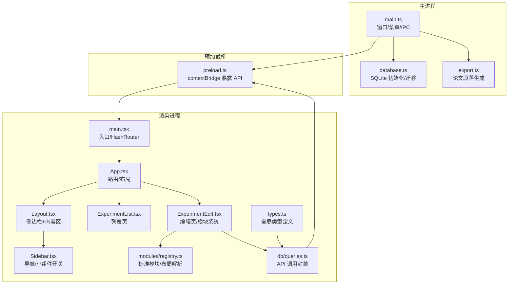
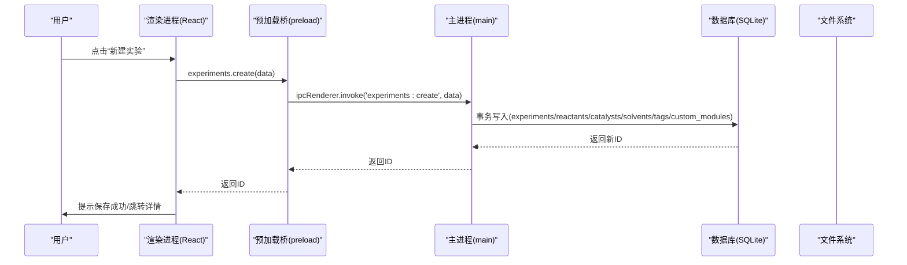
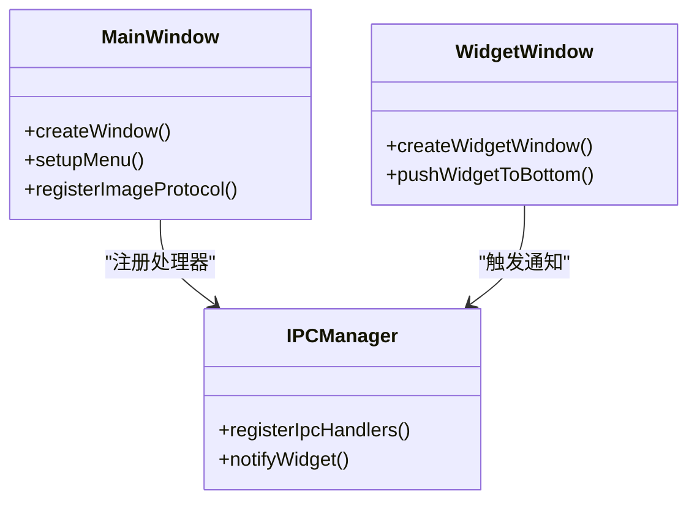
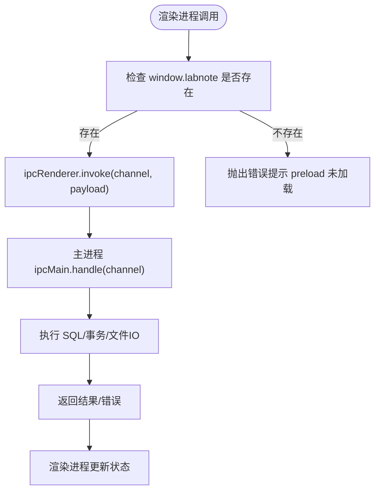
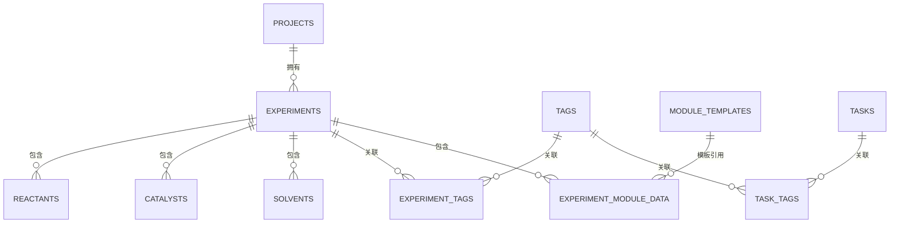
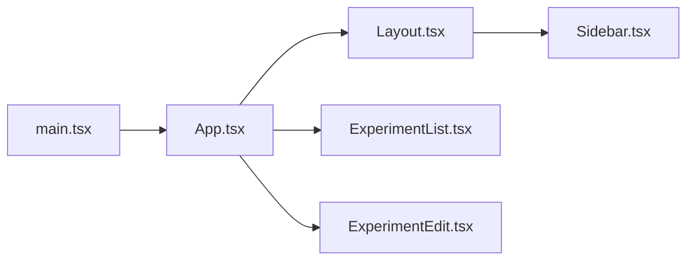
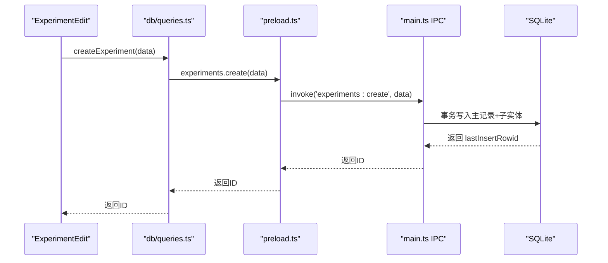
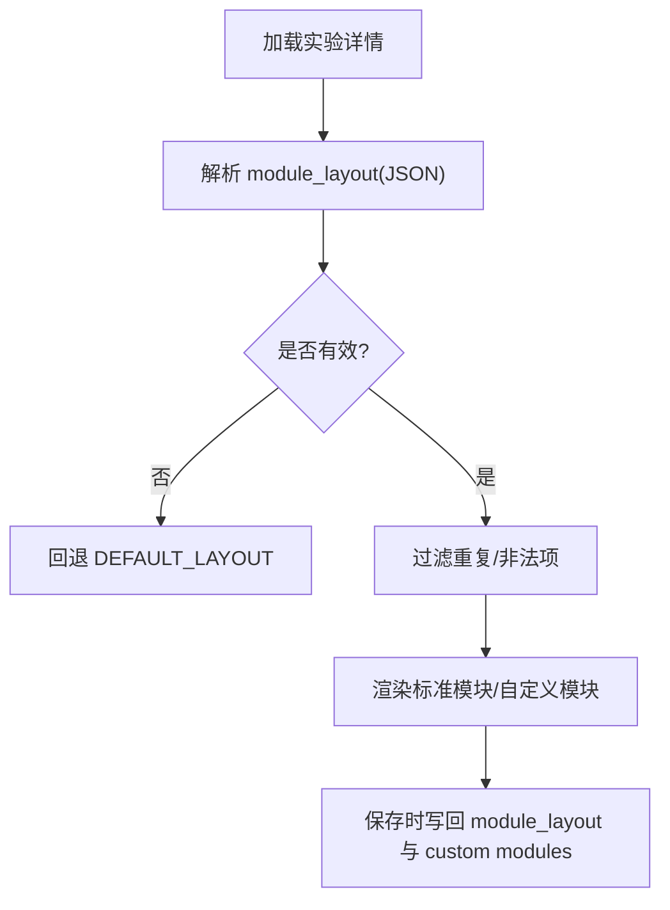
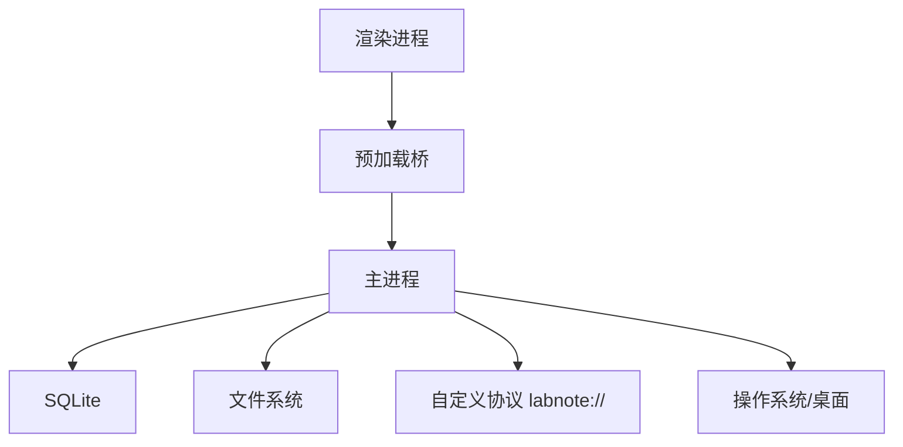
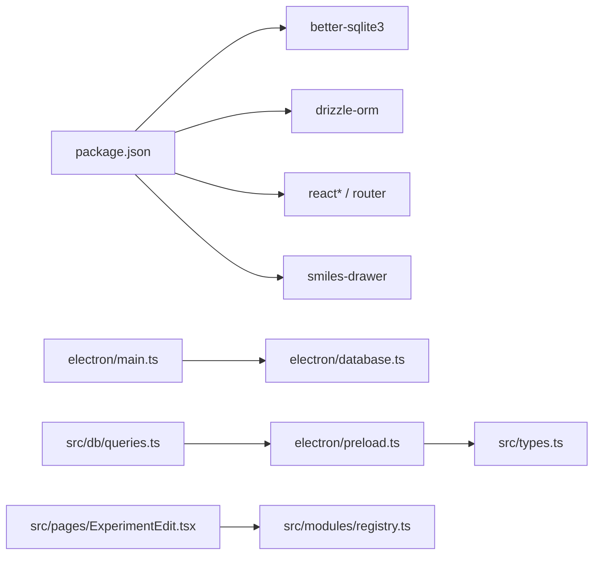

# 架构设计

<cite>
**本文引用的文件**   
- [package.json](file://package.json)
- [electron/main.ts](file://electron/main.ts)
- [electron/preload.ts](file://electron/preload.ts)
- [electron/database.ts](file://electron/database.ts)
- [electron/export.ts](file://electron/export.ts)
- [src/main.tsx](file://src/main.tsx)
- [src/App.tsx](file://src/App.tsx)
- [src/components/Layout.tsx](file://src/components/Layout.tsx)
- [src/components/Sidebar.tsx](file://src/components/Sidebar.tsx)
- [src/pages/ExperimentList.tsx](file://src/pages/ExperimentList.tsx)
- [src/pages/ExperimentEdit.tsx](file://src/pages/ExperimentEdit.tsx)
- [src/modules/registry.ts](file://src/modules/registry.ts)
- [src/db/queries.ts](file://src/db/queries.ts)
- [src/types.ts](file://src/types.ts)
</cite>

## 目录
1. [简介](#简介)
2. [项目结构](#项目结构)
3. [核心组件](#核心组件)
4. [架构总览](#架构总览)
5. [详细组件分析](#详细组件分析)
6. [依赖关系分析](#依赖关系分析)
7. [性能考量](#性能考量)
8. [故障排查指南](#故障排查指南)
9. [结论](#结论)
10. [附录](#附录)

## 简介
LabNote 是一款基于 Electron + React + TypeScript 的桌面端化学实验记录软件。系统采用主进程与渲染进程分离的架构，通过 IPC 暴露安全 API；前端使用 React 路由组织页面，结合模块化“模块布局”机制实现可插拔的实验记录结构。数据持久化由 SQLite（better-sqlite3）提供，支持事务、迁移与增量字段扩展。应用还包含桌面小组件窗口、图片协议访问、模板导出等能力。

## 项目结构
整体工程分为三层：
- 主进程层（Electron）：负责窗口管理、IPC 处理、数据库初始化与迁移、文件系统与协议注册。
- 预加载桥接层（preload）：将主进程能力以类型安全的 API 暴露给渲染进程。
- 渲染进程层（React/Vite）：页面、组件、模块注册表、查询封装与 UI 交互。

图表来源
- [electron/main.ts:100-132](file://electron/main.ts#L100-L132)
- [electron/database.ts:6-120](file://electron/database.ts#L6-L120)
- [electron/export.ts:55-137](file://electron/export.ts#L55-L137)
- [electron/preload.ts:82-164](file://electron/preload.ts#L82-L164)
- [src/main.tsx:1-14](file://src/main.tsx#L1-L14)
- [src/App.tsx:43-63](file://src/App.tsx#L43-L63)
- [src/components/Layout.tsx:4-15](file://src/components/Layout.tsx#L4-L15)
- [src/components/Sidebar.tsx:61-122](file://src/components/Sidebar.tsx#L61-L122)
- [src/pages/ExperimentList.tsx:10-55](file://src/pages/ExperimentList.tsx#L10-L55)
- [src/pages/ExperimentEdit.tsx:67-122](file://src/pages/ExperimentEdit.tsx#L67-L122)
- [src/modules/registry.ts:7-75](file://src/modules/registry.ts#L7-L75)
- [src/db/queries.ts:23-30](file://src/db/queries.ts#L23-L30)
- [src/types.ts:233-315](file://src/types.ts#L233-L315)

章节来源
- [package.json:1-39](file://package.json#L1-L39)
- [electron/main.ts:100-132](file://electron/main.ts#L100-L132)
- [src/main.tsx:1-14](file://src/main.tsx#L1-L14)

## 核心组件
- 主进程（main.ts）
  - 窗口管理：主窗口与无边框小组件窗口创建、显示、置顶、嵌入桌面。
  - 配置与数据路径：首次启动默认数据目录，支持用户选择并热切换数据库位置。
  - 自定义协议：labnote://images/ 安全读取本地图片资源。
  - IPC 处理器：统一注册所有业务接口（项目、实验、标签、模板、试剂、任务、模块布局等）。
  - 菜单与快捷键：文件/视图/帮助菜单，含“选择数据库位置”、“开发者工具”等。
- 预加载桥（preload.ts）
  - 通过 contextBridge 暴露 window.labnote.* API，严格限定能力边界。
  - 将 IPC 通道映射为 Promise 风格方法，供渲染进程直接调用。
- 数据库（database.ts）
  - 使用 better-sqlite3 打开 WAL 模式，开启外键约束。
  - 自动建表与增量迁移（ALTER TABLE），确保向后兼容。
  - 内置预设模块模板种子数据。
- 渲染入口与路由（main.tsx, App.tsx）
  - Vite 开发服务器直连或打包后 index.html。
  - HashRouter 路由，按功能划分页面与布局（常规布局、宽屏日程、全屏结构式绘制、无边框小组件）。
- 页面与组件
  - ExperimentList：列表展示、筛选、删除确认、跳转编辑。
  - ExperimentEdit：表单编辑、模块布局、自定义模块数据、图片粘贴/拖拽、导出/模板。
  - Layout/Sidebar：通用框架与导航。
- 模块系统（modules/registry.ts）
  - 标准模块定义与默认布局，支持隐藏/排序与去重校验。
  - 自定义模板解析与激活键映射。
- 查询封装（db/queries.ts）
  - 面向前端的函数式 API，内部委托 window.labnote.*。
- 类型定义（types.ts）
  - 全局 Window.labnote 类型声明，前后端契约一致。

章节来源
- [electron/main.ts:296-374](file://electron/main.ts#L296-L374)
- [electron/preload.ts:82-164](file://electron/preload.ts#L82-L164)
- [electron/database.ts:6-120](file://electron/database.ts#L6-L120)
- [src/main.tsx:1-14](file://src/main.tsx#L1-L14)
- [src/App.tsx:43-63](file://src/App.tsx#L43-L63)
- [src/components/Layout.tsx:4-15](file://src/components/Layout.tsx#L4-L15)
- [src/components/Sidebar.tsx:61-122](file://src/components/Sidebar.tsx#L61-L122)
- [src/pages/ExperimentList.tsx:10-55](file://src/pages/ExperimentList.tsx#L10-L55)
- [src/pages/ExperimentEdit.tsx:67-122](file://src/pages/ExperimentEdit.tsx#L67-L122)
- [src/modules/registry.ts:7-75](file://src/modules/registry.ts#L7-L75)
- [src/db/queries.ts:23-30](file://src/db/queries.ts#L23-L30)
- [src/types.ts:233-315](file://src/types.ts#L233-L315)

## 架构总览
系统遵循“主进程控制 + 渲染进程呈现 + 预加载桥隔离”的经典 Electron 架构。渲染进程仅能访问白名单 API，所有数据库与文件系统操作在主进程完成，保证安全性与一致性。

图表来源
- [electron/main.ts:495-577](file://electron/main.ts#L495-L577)
- [electron/preload.ts:96-109](file://electron/preload.ts#L96-L109)
- [src/db/queries.ts:64-66](file://src/db/queries.ts#L64-L66)
- [src/pages/ExperimentEdit.tsx:67-122](file://src/pages/ExperimentEdit.tsx#L67-L122)

## 详细组件分析

### 主进程与窗口管理
- 主窗口与小组件窗口分别独立创建，小组件窗口无边框、透明、可嵌入 Windows 桌面，支持缩放与焦点行为控制。
- 通过 IPC 在两个窗口间通信：切换显隐、打开主窗口、导航到指定路由、刷新数据。
- 菜单项支持动态切换数据库目录，并在切换后重新初始化数据库与 IPC 处理器。

图表来源
- [electron/main.ts:100-132](file://electron/main.ts#L100-L132)
- [electron/main.ts:145-237](file://electron/main.ts#L145-L237)
- [electron/main.ts:296-374](file://electron/main.ts#L296-L374)
- [electron/main.ts:378-391](file://electron/main.ts#L378-L391)
- [electron/main.ts:395-401](file://electron/main.ts#L395-L401)

章节来源
- [electron/main.ts:100-132](file://electron/main.ts#L100-L132)
- [electron/main.ts:145-237](file://electron/main.ts#L145-L237)
- [electron/main.ts:296-374](file://electron/main.ts#L296-L374)
- [electron/main.ts:378-391](file://electron/main.ts#L378-L391)
- [electron/main.ts:395-401](file://electron/main.ts#L395-L401)

### IPC 通信机制
- 预加载桥集中定义 LabNoteAPI 接口，将 IPC 通道包装为 Promise 方法，避免渲染进程直接操作 Node/Electron。
- 主进程根据 getDb() 获取当前数据库实例，注册各业务 IPC 处理器；当数据路径变更时，重建数据库连接并重新注册处理器。
- 双向事件：invoke（请求-响应）用于读写数据；send/on（事件）用于跨窗口推送（如 widget:dataChanged）。

图表来源
- [electron/preload.ts:82-164](file://electron/preload.ts#L82-L164)
- [electron/main.ts:395-401](file://electron/main.ts#L395-L401)
- [src/db/queries.ts:23-30](file://src/db/queries.ts#L23-L30)

章节来源
- [electron/preload.ts:82-164](file://electron/preload.ts#L82-L164)
- [electron/main.ts:395-401](file://electron/main.ts#L395-L401)
- [src/db/queries.ts:23-30](file://src/db/queries.ts#L23-L30)

### 数据库设计与迁移
- 核心实体：projects、experiments、reactants、catalysts、solvents、tags、experiment_tags、templates、reagents、module_templates、experiment_module_data、compound_names、tasks、task_tags。
- 启用 WAL 与外键约束，保障并发与一致性。
- 增量迁移策略：运行时检测列缺失并 ALTER TABLE 添加；对 tags 唯一索引进行重构，允许同名不同 type。
- 预设模块模板种子：首次无数据时插入若干内置模块模板。

图表来源
- [electron/database.ts:18-177](file://electron/database.ts#L18-L177)
- [electron/database.ts:122-145](file://electron/database.ts#L122-L145)
- [electron/database.ts:179-257](file://electron/database.ts#L179-L257)
- [electron/database.ts:285-314](file://electron/database.ts#L285-L314)

章节来源
- [electron/database.ts:6-120](file://electron/database.ts#L6-L120)
- [electron/database.ts:179-257](file://electron/database.ts#L179-L257)
- [electron/database.ts:285-314](file://electron/database.ts#L285-L314)

### 前端分层与路由设计
- 入口：main.tsx 使用 HashRouter 包裹 App。
- 路由：App.tsx 定义多布局路由，包括常规布局、宽屏日程、无边框小组件、全屏结构式编辑器。
- 布局：Layout.tsx 提供侧边栏+内容区；Sidebar.tsx 提供导航与小组件开关。
- 页面：ExperimentList.tsx 负责列表与筛选；ExperimentEdit.tsx 承载复杂编辑逻辑与模块系统。

图表来源
- [src/main.tsx:1-14](file://src/main.tsx#L1-L14)
- [src/App.tsx:43-63](file://src/App.tsx#L43-L63)
- [src/components/Layout.tsx:4-15](file://src/components/Layout.tsx#L4-L15)
- [src/components/Sidebar.tsx:61-122](file://src/components/Sidebar.tsx#L61-L122)
- [src/pages/ExperimentList.tsx:10-55](file://src/pages/ExperimentList.tsx#L10-L55)
- [src/pages/ExperimentEdit.tsx:67-122](file://src/pages/ExperimentEdit.tsx#L67-L122)

章节来源
- [src/main.tsx:1-14](file://src/main.tsx#L1-L14)
- [src/App.tsx:43-63](file://src/App.tsx#L43-L63)
- [src/components/Layout.tsx:4-15](file://src/components/Layout.tsx#L4-L15)
- [src/components/Sidebar.tsx:61-122](file://src/components/Sidebar.tsx#L61-L122)
- [src/pages/ExperimentList.tsx:10-55](file://src/pages/ExperimentList.tsx#L10-L55)
- [src/pages/ExperimentEdit.tsx:67-122](file://src/pages/ExperimentEdit.tsx#L67-L122)

### 数据流设计（从交互到数据库）
以“新建实验”为例，完整链路如下：
- 用户在 ExperimentEdit 中填写表单并提交。
- 调用 db/queries.ts 的 createExperiment，内部通过 window.labnote.experiments.create 发起 IPC。
- 主进程接收 'experiments:create'，校验 project_id 有效性，执行事务写入主记录及子实体（反应物、催化剂、溶剂、标签、自定义模块数据）。
- 返回新 ID，渲染进程更新状态并提示成功。

图表来源
- [src/pages/ExperimentEdit.tsx:67-122](file://src/pages/ExperimentEdit.tsx#L67-L122)
- [src/db/queries.ts:64-66](file://src/db/queries.ts#L64-L66)
- [electron/preload.ts:96-109](file://electron/preload.ts#L96-L109)
- [electron/main.ts:495-577](file://electron/main.ts#L495-L577)

章节来源
- [src/pages/ExperimentEdit.tsx:67-122](file://src/pages/ExperimentEdit.tsx#L67-L122)
- [src/db/queries.ts:64-66](file://src/db/queries.ts#L64-L66)
- [electron/preload.ts:96-109](file://electron/preload.ts#L96-L109)
- [electron/main.ts:495-577](file://electron/main.ts#L495-L577)

### 模块化系统与插件化架构
- 标准模块：在 registry.ts 中声明（基本信息、反应条件、反应物、催化剂、溶剂、步骤、后处理、结果、标签），支持 required 标记与分类。
- 模块布局：每个实验可维护 module_layout（JSON），决定可见性与顺序；解析器会去重与校验。
- 自定义模块：通过 module_templates 定义字段 schema，experiment_module_data 存储具体数据；支持预设模板与用户自建。
- 渲染机制：ExperimentEdit 根据 layout 渲染 SectionHeader 与各模块表单，支持折叠、隐藏、新增自定义模块。

图表来源
- [src/modules/registry.ts:77-96](file://src/modules/registry.ts#L77-L96)
- [src/modules/registry.ts:102-123](file://src/modules/registry.ts#L102-L123)
- [electron/database.ts:122-145](file://electron/database.ts#L122-L145)
- [electron/main.ts:797-800](file://electron/main.ts#L797-L800)
- [src/pages/ExperimentEdit.tsx:87-122](file://src/pages/ExperimentEdit.tsx#L87-L122)

章节来源
- [src/modules/registry.ts:7-75](file://src/modules/registry.ts#L7-L75)
- [src/modules/registry.ts:77-96](file://src/modules/registry.ts#L77-L96)
- [src/modules/registry.ts:102-123](file://src/modules/registry.ts#L102-L123)
- [electron/database.ts:122-145](file://electron/database.ts#L122-L145)
- [electron/main.ts:797-800](file://electron/main.ts#L797-L800)
- [src/pages/ExperimentEdit.tsx:87-122](file://src/pages/ExperimentEdit.tsx#L87-L122)

### 系统边界与组件交互图
- 外部边界：文件系统（图片、数据目录）、Windows 桌面（小组件嵌入）、浏览器协议（labnote://images）。
- 内部边界：渲染进程不可直接访问 Node/Electron，必须通过 window.labnote。
- 组件交互：Sidebar 控制导航与小组件；ExperimentList 与 ExperimentEdit 通过 queries.ts 与 IPC 交互；模块系统驱动表单渲染与数据持久化。

图表来源
- [electron/main.ts:378-391](file://electron/main.ts#L378-L391)
- [electron/main.ts:145-237](file://electron/main.ts#L145-L237)
- [electron/preload.ts:82-164](file://electron/preload.ts#L82-L164)

章节来源
- [electron/main.ts:378-391](file://electron/main.ts#L378-L391)
- [electron/main.ts:145-237](file://electron/main.ts#L145-L237)
- [electron/preload.ts:82-164](file://electron/preload.ts#L82-L164)

## 依赖关系分析
- 构建与运行
  - package.json 定义 main 入口为 dist-electron/main.js，开发脚本并行启动 Vite 与 Electron。
- 运行时依赖
  - better-sqlite3：主进程内同步数据库访问。
  - drizzle-orm：类型参考（实际查询走 IPC）。
  - react/react-dom/react-router-dom：前端框架与路由。
  - smiles-drawer：结构式可视化（在结构式绘制页面使用）。
- 组件耦合
  - 渲染进程与主进程通过 preload.ts 解耦，db/queries.ts 作为中间层屏蔽 IPC 细节。
  - 模块系统通过 registry.ts 与 types.ts 形成稳定契约，便于扩展。

图表来源
- [package.json:14-21](file://package.json#L14-L21)
- [electron/main.ts:395-401](file://electron/main.ts#L395-L401)
- [electron/database.ts:6-120](file://electron/database.ts#L6-L120)
- [electron/preload.ts:82-164](file://electron/preload.ts#L82-L164)
- [src/db/queries.ts:23-30](file://src/db/queries.ts#L23-L30)
- [src/modules/registry.ts:7-75](file://src/modules/registry.ts#L7-L75)

章节来源
- [package.json:1-39](file://package.json#L1-L39)
- [electron/main.ts:395-401](file://electron/main.ts#L395-L401)
- [electron/database.ts:6-120](file://electron/database.ts#L6-L120)
- [electron/preload.ts:82-164](file://electron/preload.ts#L82-L164)
- [src/db/queries.ts:23-30](file://src/db/queries.ts#L23-L30)
- [src/modules/registry.ts:7-75](file://src/modules/registry.ts#L7-L75)

## 性能考量
- 数据库
  - WAL 模式提升并发读性能；事务批量写入减少磁盘 IO。
  - 迁移阶段一次性 PRAGMA table_info 缓存列信息，降低多次查询开销。
- 渲染
  - 懒加载结构式编辑器，减少首屏体积。
  - 列表页使用 useMemo 做筛选计算，避免频繁重排。
- IPC
  - 聚合型接口（如 experiments:get 返回完整详情）减少往返次数。
  - 小组件通过事件推送刷新，避免轮询。
- 图片
  - 自定义协议按需读取本地图片，避免大对象序列化传输。

[本节为通用指导，不直接分析具体文件]

## 故障排查指南
- 常见问题
  - window.labnote 不可用：检查 preload.js 是否正确加载与 contextIsolation 设置。
  - 数据库迁移失败：查看控制台日志，确认数据目录权限与 SQLite 版本兼容性。
  - 小组件无法嵌入桌面：Windows 下 PowerShell 脚本需具备执行权限；关注错误日志。
  - 图片无法加载：确认 labnote://images/ 路径未被路径穿越绕过，且文件存在于 images 目录。
- 定位建议
  - 使用主进程菜单“开发者工具”调试渲染进程。
  - 在关键 IPC 处理器处增加日志输出，追踪参数与异常堆栈。
  - 使用“选择数据库位置”切换数据目录，验证迁移与数据完整性。

章节来源
- [electron/main.ts:296-374](file://electron/main.ts#L296-L374)
- [electron/main.ts:378-391](file://electron/main.ts#L378-L391)
- [electron/main.ts:145-237](file://electron/main.ts#L145-L237)
- [src/db/queries.ts:23-30](file://src/db/queries.ts#L23-L30)

## 结论
LabNote 通过清晰的进程边界与类型化的 IPC 契约，实现了高内聚、低耦合的桌面应用架构。模块化系统使实验记录结构具备高度可扩展性；数据库迁移与事务保障了数据的稳健演进。未来可在以下方向继续优化：
- 引入更细粒度的缓存与增量同步策略，提升大数据量下的列表与筛选性能。
- 扩展模块系统至插件化加载（动态导入），支持第三方模块生态。
- 增强错误上报与诊断能力，完善跨平台小组件兼容性。

[本节为总结性内容，不直接分析具体文件]

## 附录
- 导出能力
  - 主进程提供论文实验段落的文本生成，格式化试剂、溶剂、条件与后处理描述，便于复制粘贴。

章节来源
- [electron/export.ts:55-137](file://electron/export.ts#L55-L137)
- [electron/main.ts:762-795](file://electron/main.ts#L762-L795)