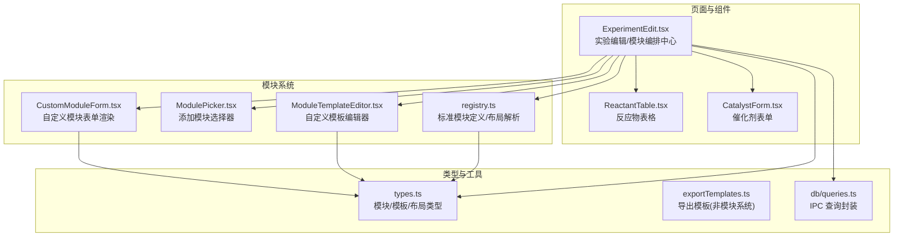
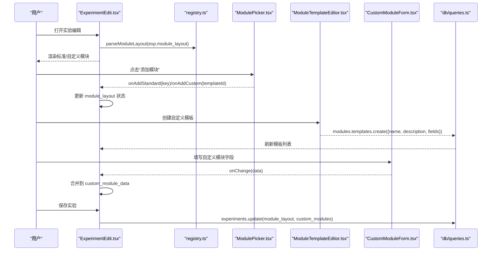
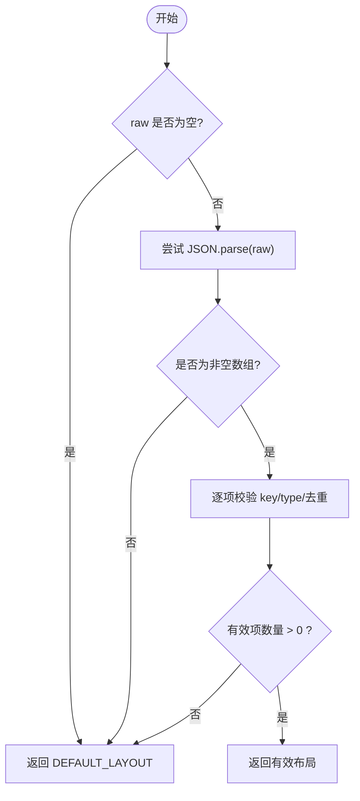
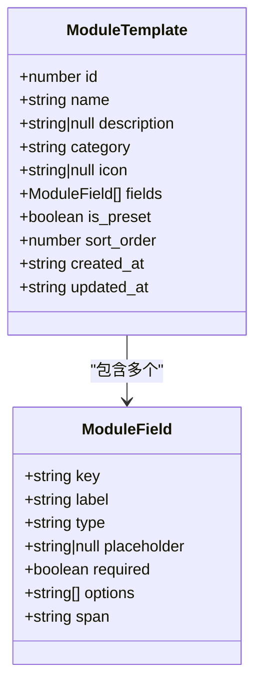
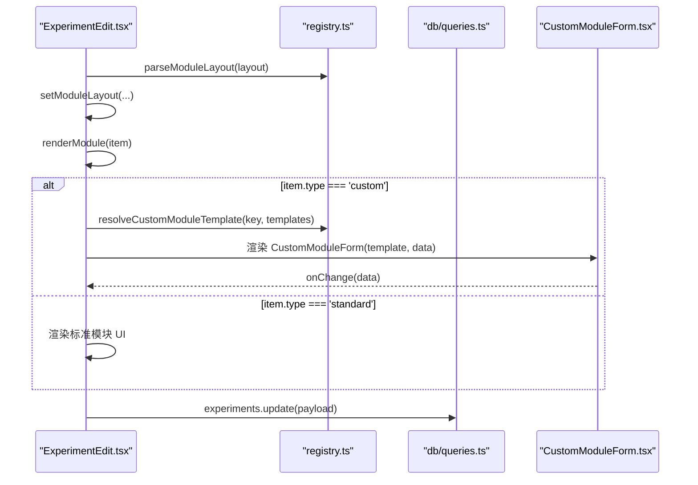
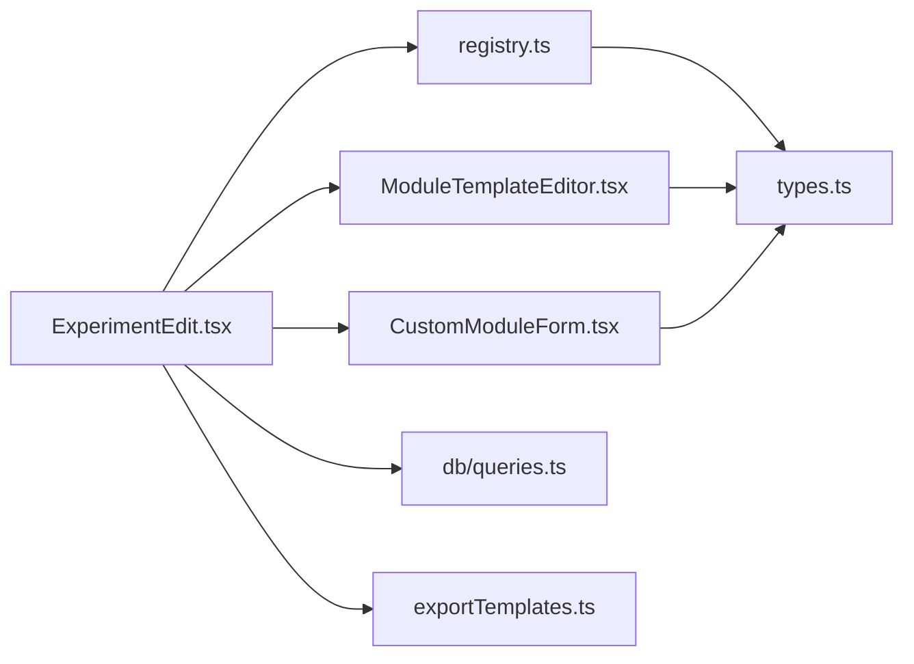

# 模块化系统设计

<cite>
**本文引用的文件**   
- [src/modules/registry.ts](file://src/modules/registry.ts)
- [src/modules/ModulePicker.tsx](file://src/modules/ModulePicker.tsx)
- [src/modules/ModuleTemplateEditor.tsx](file://src/modules/ModuleTemplateEditor.tsx)
- [src/modules/CustomModuleForm.tsx](file://src/modules/CustomModuleForm.tsx)
- [src/types.ts](file://src/types.ts)
- [src/pages/ExperimentEdit.tsx](file://src/pages/ExperimentEdit.tsx)
- [src/components/ReactantTable.tsx](file://src/components/ReactantTable.tsx)
- [src/components/CatalystForm.tsx](file://src/components/CatalystForm.tsx)
- [src/utils/exportTemplates.ts](file://src/utils/exportTemplates.ts)
- [src/db/queries.ts](file://src/db/queries.ts)
</cite>

## 目录
1. [引言](#引言)
2. [项目结构](#项目结构)
3. [核心组件](#核心组件)
4. [架构总览](#架构总览)
5. [详细组件分析](#详细组件分析)
6. [依赖关系分析](#依赖关系分析)
7. [性能与可扩展性](#性能与可扩展性)
8. [故障排查指南](#故障排查指南)
9. [结论](#结论)
10. [附录：模块开发指南与最佳实践](#附录模块开发指南与最佳实践)

## 引言
本设计文档围绕 LabNote 的“模块化实验记录系统”展开，重点阐述以下目标：
- 动态模块注册与渲染机制：标准模块与自定义模板的统一编排、布局解析与渲染。
- 字段系统与模板管理：字段类型扩展、模板定义、布局管理与持久化。
- 模块化实验记录设计理念：标准模块（反应物、催化剂、溶剂等）与自定义模块的组合使用。
- 模块模板编辑器工作原理：模板定义、字段配置、布局管理。
- 插件化架构：支持第三方模块扩展、模块间依赖管理、版本兼容性处理。
- 模块开发指南与最佳实践：帮助开发者快速理解并扩展模块系统。

## 项目结构
LabNote 前端采用 React + TypeScript 组织，模块化系统主要分布在 modules 目录，配合 types 定义全局数据结构，页面层 ExperimentEdit 作为模块系统的编排中心。

图表来源
- [src/modules/registry.ts:1-124](file://src/modules/registry.ts#L1-L124)
- [src/modules/ModulePicker.tsx:1-150](file://src/modules/ModulePicker.tsx#L1-L150)
- [src/modules/ModuleTemplateEditor.tsx:1-257](file://src/modules/ModuleTemplateEditor.tsx#L1-L257)
- [src/modules/CustomModuleForm.tsx:1-242](file://src/modules/CustomModuleForm.tsx#L1-L242)
- [src/pages/ExperimentEdit.tsx:1-800](file://src/pages/ExperimentEdit.tsx#L1-L800)
- [src/components/ReactantTable.tsx:1-383](file://src/components/ReactantTable.tsx#L1-L383)
- [src/components/CatalystForm.tsx:1-151](file://src/components/CatalystForm.tsx#L1-L151)
- [src/types.ts:157-201](file://src/types.ts#L157-L201)
- [src/utils/exportTemplates.ts:1-367](file://src/utils/exportTemplates.ts#L1-L367)
- [src/db/queries.ts:134-165](file://src/db/queries.ts#L134-L165)

章节来源
- [src/modules/registry.ts:1-124](file://src/modules/registry.ts#L1-L124)
- [src/types.ts:157-201](file://src/types.ts#L157-L201)
- [src/pages/ExperimentEdit.tsx:1-800](file://src/pages/ExperimentEdit.tsx#L1-L800)

## 核心组件
- 模块注册与布局解析（registry.ts）
  - 维护标准模块清单 STANDARD_MODULES，包含 key、name、category、required 等元信息。
  - 提供默认布局 DEFAULT_LAYOUT，以及解析/序列化布局的工具函数 parseModuleLayout/layoutToJson。
  - 提供隐藏标准模块键集合 getHiddenStandardKeys、激活自定义模块键集合 getActiveCustomKeys、根据 layout key 解析自定义模板 resolveCustomModuleTemplate。
- 模块选择器（ModulePicker.tsx）
  - 展示已隐藏的标准模块与可用自定义模板，支持搜索过滤、创建新模板入口。
  - 通过回调 onAddStandard/onAddCustom 通知父级更新布局。
- 自定义模板编辑器（ModuleTemplateEditor.tsx）
  - 可视化编辑模板名称、描述与字段定义；字段类型包括 text、number、textarea、select、image、structure。
  - 自动从 label 生成 key，支持 span 布局（半宽/全宽），保存时输出 fields JSON 字符串。
- 自定义模块表单渲染（CustomModuleForm.tsx）
  - 根据模板 fields 动态渲染输入控件，支持图片粘贴/上传、化学结构式绘制集成。
  - 通过 onChange 将数据回写至父级状态。
- 实验编辑页（ExperimentEdit.tsx）
  - 模块系统编排中心：加载/保存 module_layout 与 custom_modules_data，拖拽排序，折叠/隐藏模块，调用模板 API 创建/删除自定义模板。
  - 渲染标准模块（基本信息、条件、反应物、催化剂、溶剂、步骤、后处理、结果、标签）与自定义模块。
- 标准模块实现
  - 反应物（ReactantTable.tsx）、催化剂（CatalystForm.tsx）、溶剂（SolventForm.tsx，位于 components）。
- 类型定义（types.ts）
  - 定义 ModuleField、ModuleTemplate、ExperimentModuleData、ModuleLayoutItem、StandardModuleDef 等关键类型。
- 数据库/IPC 查询（db/queries.ts）
  - 对 window.labnote.* 进行封装，提供模块模板 CRUD 接口。

章节来源
- [src/modules/registry.ts:1-124](file://src/modules/registry.ts#L1-L124)
- [src/modules/ModulePicker.tsx:1-150](file://src/modules/ModulePicker.tsx#L1-L150)
- [src/modules/ModuleTemplateEditor.tsx:1-257](file://src/modules/ModuleTemplateEditor.tsx#L1-L257)
- [src/modules/CustomModuleForm.tsx:1-242](file://src/modules/CustomModuleForm.tsx#L1-L242)
- [src/pages/ExperimentEdit.tsx:1-800](file://src/pages/ExperimentEdit.tsx#L1-L800)
- [src/components/ReactantTable.tsx:1-383](file://src/components/ReactantTable.tsx#L1-L383)
- [src/components/CatalystForm.tsx:1-151](file://src/components/CatalystForm.tsx#L1-L151)
- [src/types.ts:157-201](file://src/types.ts#L157-L201)
- [src/db/queries.ts:134-165](file://src/db/queries.ts#L134-L165)

## 架构总览
模块系统由“声明式布局 + 运行时渲染”构成。布局以 ModuleLayoutItem[] 表示，每个条目指向一个标准模块或一个自定义模板实例。ExperimentEdit 负责：
- 读取/写入 module_layout 与 custom_modules_data。
- 根据 item.type 与 item.key 决定渲染路径。
- 为自定义模块解析模板 fields，驱动 CustomModuleForm 渲染。

图表来源
- [src/pages/ExperimentEdit.tsx:1-800](file://src/pages/ExperimentEdit.tsx#L1-L800)
- [src/modules/registry.ts:77-124](file://src/modules/registry.ts#L77-L124)
- [src/modules/ModulePicker.tsx:1-150](file://src/modules/ModulePicker.tsx#L1-L150)
- [src/modules/ModuleTemplateEditor.tsx:1-257](file://src/modules/ModuleTemplateEditor.tsx#L1-L257)
- [src/modules/CustomModuleForm.tsx:1-242](file://src/modules/CustomModuleForm.tsx#L1-L242)
- [src/db/queries.ts:134-165](file://src/db/queries.ts#L134-L165)

## 详细组件分析

### 模块注册与布局解析（registry.ts）
- 标准模块定义 STANDARD_MODULES：集中声明内置模块的元信息，便于统一管理与权限控制（如 required）。
- 布局解析 parseModuleLayout：
  - 校验数组项是否包含合法 key 与 type（standard/custom）。
  - 去重与容错，失败则回退到 DEFAULT_LAYOUT。
- 辅助函数：
  - getHiddenStandardKeys：返回当前未显示且非必需的标准模块键集合。
  - getActiveCustomKeys：提取当前布局中使用的自定义模板 id 集合。
  - resolveCustomModuleTemplate：将 layout 中的 custom:<id> 映射到实际模板对象。

图表来源
- [src/modules/registry.ts:77-96](file://src/modules/registry.ts#L77-L96)

章节来源
- [src/modules/registry.ts:1-124](file://src/modules/registry.ts#L1-L124)

### 模块选择器（ModulePicker.tsx）
- 功能要点：
  - 展示隐藏的标准模块与可添加的自定义模板。
  - 支持按名称/描述过滤自定义模板。
  - 提供“创建自定义模块模板”入口。
- 交互契约：
  - onAddStandard(key)、onAddCustom(templateId)、onCreateCustom()、onDeleteCustom(templateId?)、onClose()。

章节来源
- [src/modules/ModulePicker.tsx:1-150](file://src/modules/ModulePicker.tsx#L1-L150)

### 自定义模板编辑器（ModuleTemplateEditor.tsx）
- 字段类型枚举：text、number、textarea、select、image、structure。
- 字段编辑逻辑：
  - 自动从 label 生成 key（小写、仅保留字母数字与中文、去除首尾下划线）。
  - 当 type 切换为非 select 时清空 options。
  - 支持 span 布局（half/full）与 placeholder。
- 保存流程：
  - 校验 name 与至少一个字段。
  - 将 fields 序列化为 JSON 字符串，交由上层通过 IPC 持久化。

图表来源
- [src/types.ts:157-179](file://src/types.ts#L157-L179)

章节来源
- [src/modules/ModuleTemplateEditor.tsx:1-257](file://src/modules/ModuleTemplateEditor.tsx#L1-L257)
- [src/types.ts:157-179](file://src/types.ts#L157-L179)

### 自定义模块表单渲染（CustomModuleForm.tsx）
- 动态渲染：
  - 根据 template.fields 遍历渲染对应控件。
  - 支持图片粘贴/上传、双击预览、删除。
  - 支持结构式字段，集成结构绘制页面，回填 smiles/formula/molecularWeight/name。
- 数据回写：
  - onChange 将字段值合并到 data 对象，供父级保存。

章节来源
- [src/modules/CustomModuleForm.tsx:1-242](file://src/modules/CustomModuleForm.tsx#L1-L242)

### 实验编辑页（ExperimentEdit.tsx）——模块编排中心
- 模块布局管理：
  - 初始化：parseModuleLayout(exp.module_layout) 或 DEFAULT_LAYOUT。
  - 增删改：addStandardModule/addCustomModule/hideModule。
  - 拖拽排序：handleDragStart/handleDragOver/handleDrop。
- 自定义模板生命周期：
  - 创建：handleCreateModuleTemplate -> modules.templates.create -> 刷新模板列表。
  - 删除：handleDeleteModuleTemplate -> deleteModuleTemplate -> 清理布局与数据。
- 渲染策略：
  - renderModule(item, index) 根据 item.type 与 item.key 分支渲染标准模块或自定义模块。
  - 标准模块：basic_info、conditions、reactants、catalysts、solvents、procedure、workup、results、tags。
  - 自定义模块：resolveCustomModuleTemplate -> CustomModuleForm。
- 保存策略：
  - buildPayload 聚合 form、reactants/catalysts/solvents、module_layout、custom_modules。
  - 区分新建/更新/模板编辑三种模式。

图表来源
- [src/pages/ExperimentEdit.tsx:1-800](file://src/pages/ExperimentEdit.tsx#L1-L800)
- [src/modules/registry.ts:115-124](file://src/modules/registry.ts#L115-L124)
- [src/modules/CustomModuleForm.tsx:1-242](file://src/modules/CustomModuleForm.tsx#L1-L242)
- [src/db/queries.ts:60-74](file://src/db/queries.ts#L60-L74)

章节来源
- [src/pages/ExperimentEdit.tsx:1-800](file://src/pages/ExperimentEdit.tsx#L1-L800)

### 标准模块实现（反应物、催化剂、溶剂）
- 反应物（ReactantTable.tsx）
  - 表格形式维护多行反应物，支持分子式、MW、摩尔量、用量、单位、当量、角色、结构式。
  - 自动在 MW 与 molar_amount 之间换算 amount，支持单位切换时的联动计算。
  - 支持图片粘贴/上传与结构式绘制入口。
- 催化剂（CatalystForm.tsx）
  - 行内表单维护多行催化剂，支持 MW、molar_amount、用量、单位（g/mg/mol%）。
  - 同样具备基于 MW 的换算逻辑。
- 溶剂（SolventForm.tsx，位于 components）
  - 行内表单维护多行溶剂，支持体积、单位、比例。

章节来源
- [src/components/ReactantTable.tsx:1-383](file://src/components/ReactantTable.tsx#L1-L383)
- [src/components/CatalystForm.tsx:1-151](file://src/components/CatalystForm.tsx#L1-L151)

## 依赖关系分析
- 模块系统内部依赖
  - registry.ts 被 ExperimentEdit.tsx 与 ModulePicker.tsx 使用，提供标准模块清单与布局解析能力。
  - ModuleTemplateEditor.tsx 与 CustomModuleForm.tsx 共同依赖 types.ts 的 ModuleField/ModuleTemplate 定义。
  - ExperimentEdit.tsx 组合所有模块渲染逻辑，并通过 db/queries.ts 访问后端。
- 外部依赖
  - window.labnote.* 暴露 IPC 接口，用于实验、模板、试剂、任务等数据的读写。
  - exportTemplates.ts 提供导出模板（与模块系统解耦，但可在同一页面中使用）。

图表来源
- [src/modules/registry.ts:1-124](file://src/modules/registry.ts#L1-L124)
- [src/types.ts:157-201](file://src/types.ts#L157-L201)
- [src/pages/ExperimentEdit.tsx:1-800](file://src/pages/ExperimentEdit.tsx#L1-L800)
- [src/db/queries.ts:134-165](file://src/db/queries.ts#L134-L165)
- [src/utils/exportTemplates.ts:1-367](file://src/utils/exportTemplates.ts#L1-L367)

章节来源
- [src/modules/registry.ts:1-124](file://src/modules/registry.ts#L1-L124)
- [src/types.ts:157-201](file://src/types.ts#L157-L201)
- [src/pages/ExperimentEdit.tsx:1-800](file://src/pages/ExperimentEdit.tsx#L1-L800)
- [src/db/queries.ts:134-165](file://src/db/queries.ts#L134-L165)
- [src/utils/exportTemplates.ts:1-367](file://src/utils/exportTemplates.ts#L1-L367)

## 性能与可扩展性
- 性能特性
  - 布局解析 parseModuleLayout 在首次加载时执行，后续仅在用户操作时更新，避免频繁解析。
  - 自定义模块数据以 Record<string, any> 缓存于内存，按需渲染，减少不必要的重排。
  - 图片处理采用异步保存与懒加载，避免阻塞主线程。
- 可扩展性建议
  - 新增字段类型：在 ModuleField.type 联合类型中添加新类型，并在 CustomModuleForm 中补充渲染分支。
  - 新增标准模块：在 STANDARD_MODULES 中注册，并在 ExperimentEdit.renderModule 中增加分支。
  - 插件化扩展：可通过 window.labnote.modules.templates 接口注入第三方模板，无需修改核心代码。
  - 依赖与版本兼容：建议在 ModuleTemplate 中引入 version 字段（未来扩展），并在解析时做向后兼容处理。

[本节为通用指导，不直接分析具体文件]

## 故障排查指南
- 常见问题
  - 模块布局无法解析：检查 module_layout 是否为合法 JSON 数组，确保每项包含 string 类型的 key 与 type（standard/custom）。
  - 自定义模板字段为空：确认模板 fields 已正确保存为 JSON 字符串，且在加载时被 JSON.parse 还原。
  - 图片无法显示：确认图片存储路径前缀 labnote://images/ 是否正确，或回退到 data URL。
  - 结构式绘制无返回值：检查 onOpenStructureDraw 回调与全局结构绘制结果绑定。
- 定位方法
  - 在 ExperimentEdit 中打印 module_layout 与 custom_module_data 的变化。
  - 在 ModuleTemplateEditor 保存前后对比 fields JSON 内容。
  - 在 CustomModuleForm 的 onChange 处断点验证数据合并逻辑。

章节来源
- [src/modules/registry.ts:77-96](file://src/modules/registry.ts#L77-L96)
- [src/modules/ModuleTemplateEditor.tsx:107-129](file://src/modules/ModuleTemplateEditor.tsx#L107-L129)
- [src/modules/CustomModuleForm.tsx:44-46](file://src/modules/CustomModuleForm.tsx#L44-L46)
- [src/pages/ExperimentEdit.tsx:596-606](file://src/pages/ExperimentEdit.tsx#L596-L606)

## 结论
LabNote 的模块化系统通过“声明式布局 + 动态渲染”实现了高度灵活的实验记录编排。标准模块覆盖基础实验要素，自定义模板允许用户按需扩展字段与布局。模块模板编辑器简化了模板创建与维护，ExperimentEdit 作为编排中心统一管理模块生命周期与数据持久化。整体架构清晰、耦合度低，具备良好的可扩展性与可维护性。

[本节为总结，不直接分析具体文件]

## 附录：模块开发指南与最佳实践

### 新增标准模块
- 在 STANDARD_MODULES 中注册新模块的 key、name、category、required。
- 在 ExperimentEdit.renderModule 中为新 key 添加渲染分支，实现对应的 UI 与数据绑定。
- 如需默认可见，将其加入 DEFAULT_LAYOUT。

章节来源
- [src/modules/registry.ts:7-62](file://src/modules/registry.ts#L7-L62)
- [src/pages/ExperimentEdit.tsx:603-614](file://src/pages/ExperimentEdit.tsx#L603-L614)

### 新增自定义字段类型
- 在 types.ts 的 ModuleField.type 联合类型中添加新类型。
- 在 ModuleTemplateEditor.FIELD_TYPES 中新增选项。
- 在 CustomModuleForm 的 switch 分支中实现新类型的渲染与数据绑定。

章节来源
- [src/types.ts:158-166](file://src/types.ts#L158-L166)
- [src/modules/ModuleTemplateEditor.tsx:13-20](file://src/modules/ModuleTemplateEditor.tsx#L13-L20)
- [src/modules/CustomModuleForm.tsx:99-136](file://src/modules/CustomModuleForm.tsx#L99-L136)

### 模块间依赖与版本兼容
- 依赖管理：建议在 ModuleTemplate 中引入 depends_on 字段（未来扩展），在加载时校验依赖是否存在。
- 版本兼容：在 ModuleTemplate 中引入 version 字段，解析时根据版本进行迁移或降级处理。
- 向后兼容：在 parseModuleLayout 中对未知 type 进行忽略或回退策略。

[本节为概念性建议，不直接分析具体文件]

### 第三方模块扩展
- 通过 window.labnote.modules.templates 接口创建/更新/删除模板。
- 在 ExperimentEdit 中刷新模板列表，即可在 ModulePicker 中展示新模板。
- 建议在模板元信息中增加作者、许可证、适用场景等字段，便于社区共享。

章节来源
- [src/db/queries.ts:134-165](file://src/db/queries.ts#L134-L165)
- [src/pages/ExperimentEdit.tsx:554-568](file://src/pages/ExperimentEdit.tsx#L554-L568)

### 模块模板编辑器工作流
- 创建模板：填写名称/描述，定义字段（类型、占位符、span、选项），保存为 JSON 字符串。
- 编辑模板：加载已有 fields，修改后重新保存。
- 使用模板：在 ModulePicker 中选择并添加到当前实验布局。

章节来源
- [src/modules/ModuleTemplateEditor.tsx:68-129](file://src/modules/ModuleTemplateEditor.tsx#L68-L129)
- [src/modules/ModulePicker.tsx:75-131](file://src/modules/ModulePicker.tsx#L75-L131)