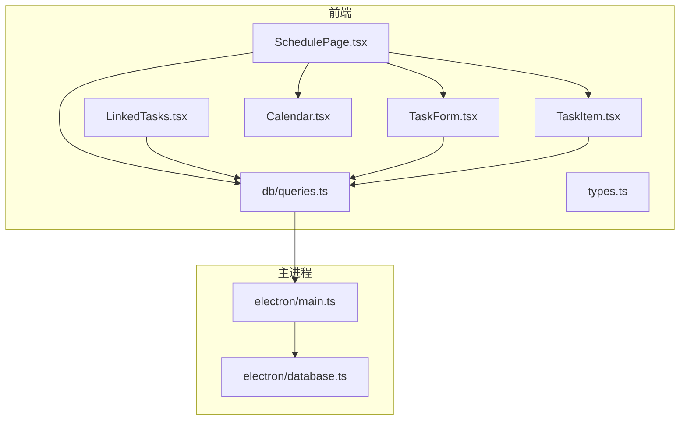
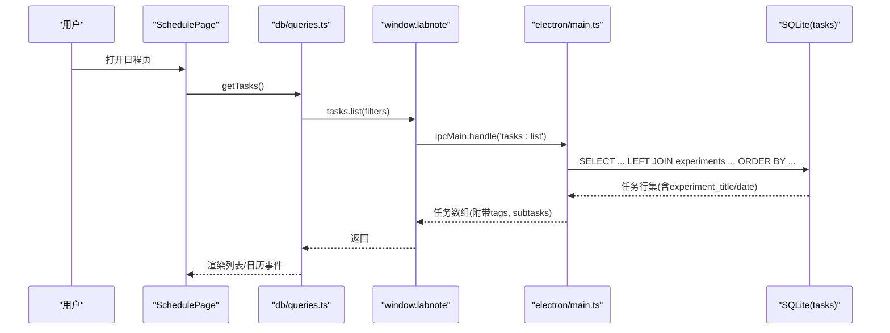
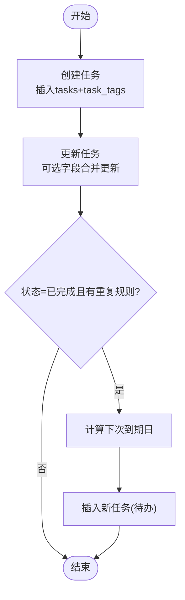
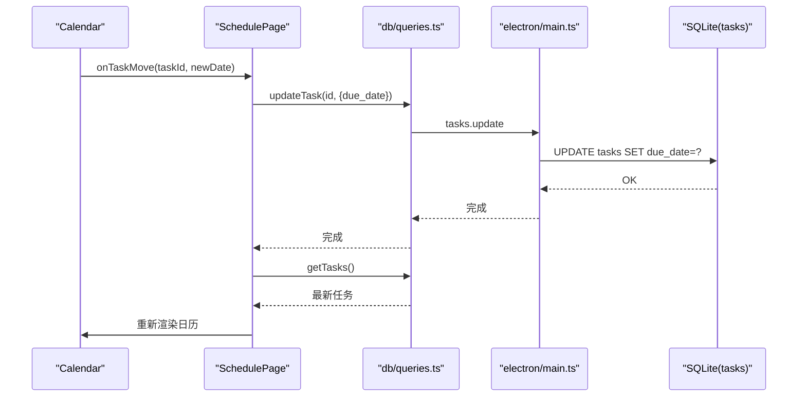
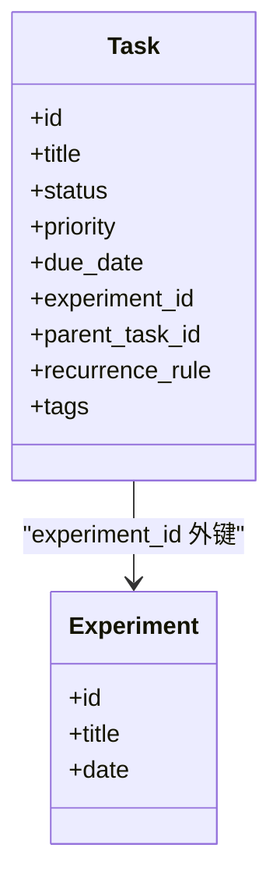
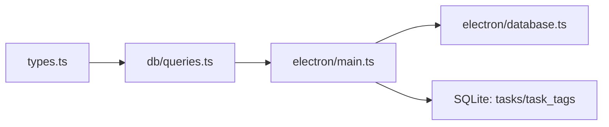

# 任务管理

<cite>
**本文引用的文件**   
- [src/pages/SchedulePage.tsx](file://src/pages/SchedulePage.tsx)
- [src/components/TaskForm.tsx](file://src/components/TaskForm.tsx)
- [src/components/TaskItem.tsx](file://src/components/TaskItem.tsx)
- [src/components/Calendar.tsx](file://src/components/Calendar.tsx)
- [src/components/LinkedTasks.tsx](file://src/components/LinkedTasks.tsx)
- [src/db/queries.ts](file://src/db/queries.ts)
- [src/types.ts](file://src/types.ts)
- [electron/main.ts](file://electron/main.ts)
- [electron/database.ts](file://electron/database.ts)
</cite>

## 目录
1. [简介](#简介)
2. [项目结构](#项目结构)
3. [核心组件](#核心组件)
4. [架构总览](#架构总览)
5. [详细组件分析](#详细组件分析)
6. [依赖关系分析](#依赖关系分析)
7. [性能与可扩展性](#性能与可扩展性)
8. [故障排查指南](#故障排查指南)
9. [结论](#结论)
10. [附录：最佳实践与工作流优化](#附录最佳实践与工作流优化)

## 简介
本文件围绕 LabNote 的任务管理功能进行系统化文档化，覆盖任务的创建、编辑、删除、状态流转；任务日历视图（日程安排、重复任务、拖拽改期）；优先级与截止日期管理；任务与实验记录的关联机制及完成状态同步；筛选、搜索与统计能力；并给出可落地的最佳实践与流程优化建议。

## 项目结构
任务管理相关的前端页面与组件集中在 src/pages 与 src/components，数据访问通过 src/db/queries.ts 封装，实际数据库操作由 electron/main.ts 的 IPC 处理函数执行，并在 electron/database.ts 中初始化 tasks 表结构。

图表来源
- [src/pages/SchedulePage.tsx:1-473](file://src/pages/SchedulePage.tsx#L1-L473)
- [src/components/TaskForm.tsx:1-441](file://src/components/TaskForm.tsx#L1-L441)
- [src/components/TaskItem.tsx:1-135](file://src/components/TaskItem.tsx#L1-L135)
- [src/components/Calendar.tsx:1-229](file://src/components/Calendar.tsx#L1-L229)
- [src/components/LinkedTasks.tsx:1-84](file://src/components/LinkedTasks.tsx#L1-L84)
- [src/db/queries.ts:167-193](file://src/db/queries.ts#L167-L193)
- [electron/main.ts:835-1007](file://electron/main.ts#L835-L1007)
- [electron/database.ts:156-177](file://electron/database.ts#L156-L177)

章节来源
- [src/pages/SchedulePage.tsx:1-473](file://src/pages/SchedulePage.tsx#L1-L473)
- [src/components/TaskForm.tsx:1-441](file://src/components/TaskForm.tsx#L1-L441)
- [src/components/TaskItem.tsx:1-135](file://src/components/TaskItem.tsx#L1-L135)
- [src/components/Calendar.tsx:1-229](file://src/components/Calendar.tsx#L1-L229)
- [src/components/LinkedTasks.tsx:1-84](file://src/components/LinkedTasks.tsx#L1-L84)
- [src/db/queries.ts:167-193](file://src/db/queries.ts#L167-L193)
- [electron/main.ts:835-1007](file://electron/main.ts#L835-L1007)
- [electron/database.ts:156-177](file://electron/database.ts#L156-L177)

## 核心组件
- 日程页（SchedulePage）：聚合任务列表、日历视图、筛选器、新建/编辑弹窗入口、日期详情面板。
- 任务表单（TaskForm）：支持新建/编辑任务，设置标题、描述、优先级、状态、截止日期、重复规则、关联实验、标签等。
- 任务项（TaskItem）：展示单条任务，支持快速切换状态、展开子任务、添加子任务、编辑与删除。
- 日历（Calendar）：月历渲染、事件聚合、任务拖拽改期、事件悬停提示、点击跳转。
- 关联任务（LinkedTasks）：在实验详情页内展示与该实验关联的任务，支持一键切换状态。

章节来源
- [src/pages/SchedulePage.tsx:1-473](file://src/pages/SchedulePage.tsx#L1-L473)
- [src/components/TaskForm.tsx:1-441](file://src/components/TaskForm.tsx#L1-L441)
- [src/components/TaskItem.tsx:1-135](file://src/components/TaskItem.tsx#L1-L135)
- [src/components/Calendar.tsx:1-229](file://src/components/Calendar.tsx#L1-L229)
- [src/components/LinkedTasks.tsx:1-84](file://src/components/LinkedTasks.tsx#L1-L84)

## 架构总览
任务管理采用“前端 React 组件 + IPC 调用 + SQLite”的分层架构。前端通过 queries.ts 暴露的 API 调用 window.labnote.tasks.*，IPC 在主进程中监听对应事件并执行 SQL，返回结果后更新 UI。

图表来源
- [src/pages/SchedulePage.tsx:76-93](file://src/pages/SchedulePage.tsx#L76-L93)
- [src/db/queries.ts:170-172](file://src/db/queries.ts#L170-L172)
- [electron/main.ts:835-880](file://electron/main.ts#L835-L880)
- [electron/database.ts:156-177](file://electron/database.ts#L156-L177)

## 详细组件分析

### 任务 CRUD 与状态管理
- 创建任务
  - 表单提交时，SchedulePage 调用 createTask，后端插入 tasks 表并写入 task_tags 多对多关系，随后通知桌面小组件刷新。
- 更新任务
  - 支持更新标题、描述、状态、优先级、截止日期、关联实验、父任务、重复规则与标签集合。
  - 当任务标记为“已完成”且存在重复规则时，自动计算下一个到期日并生成新任务（状态为待办）。
- 删除任务
  - 级联删除 task_tags 与 tasks 记录，并触发小组件刷新。
- 状态流转
  - 列表与日历均支持将任务状态在“待办/进行中/已完成/已取消”之间切换；任务项提供快捷勾选切换。

图表来源
- [electron/main.ts:906-991](file://electron/main.ts#L906-L991)
- [electron/main.ts:993-997](file://electron/main.ts#L993-L997)
- [src/components/TaskItem.tsx:29-33](file://src/components/TaskItem.tsx#L29-L33)

章节来源
- [src/pages/SchedulePage.tsx:199-213](file://src/pages/SchedulePage.tsx#L199-L213)
- [src/components/TaskForm.tsx:107-120](file://src/components/TaskForm.tsx#L107-L120)
- [src/components/TaskItem.tsx:29-33](file://src/components/TaskItem.tsx#L29-L33)
- [src/db/queries.ts:178-192](file://src/db/queries.ts#L178-L192)
- [electron/main.ts:906-991](file://electron/main.ts#L906-L991)
- [electron/main.ts:993-997](file://electron/main.ts#L993-L997)

### 任务日历视图与日程安排
- 事件聚合
  - 将任务与实验统一映射为 CalendarEvent，按日期分组显示。
- 拖拽改期
  - 任务事件支持拖拽到目标日期，触发 updateTask(due_date=newDate)，随后重新加载数据。
- 日期详情
  - 点击日期单元格弹出当日任务与实验清单，支持从详情进入编辑或实验详情。
- 重复任务
  - 重复规则由后端 computeNextRecurrence 解析，支持 daily/weekly/monthly 以及 every N days/weeks。

图表来源
- [src/components/Calendar.tsx:117-127](file://src/components/Calendar.tsx#L117-L127)
- [src/pages/SchedulePage.tsx:234-241](file://src/pages/SchedulePage.tsx#L234-L241)
- [src/db/queries.ts:182-184](file://src/db/queries.ts#L182-L184)
- [electron/main.ts:940-991](file://electron/main.ts#L940-L991)

章节来源
- [src/components/Calendar.tsx:1-229](file://src/components/Calendar.tsx#L1-L229)
- [src/pages/SchedulePage.tsx:123-156](file://src/pages/SchedulePage.tsx#L123-L156)
- [electron/main.ts:9-51](file://electron/main.ts#L9-L51)

### 任务优先级、截止日期与重复规则
- 优先级
  - 低/中/高/紧急，影响排序与视觉标识。
- 截止日期
  - 支持空值；列表与日历按日期过滤与展示。
- 重复规则
  - 仅在后端生效：当任务被标记为“已完成”时，根据规则自动生成下一次任务。

章节来源
- [src/types.ts:84-103](file://src/types.ts#L84-L103)
- [src/components/TaskForm.tsx:24-42](file://src/components/TaskForm.tsx#L24-L42)
- [electron/main.ts:9-51](file://electron/main.ts#L9-L51)
- [electron/main.ts:977-991](file://electron/main.ts#L977-L991)

### 任务与实验记录的关联与状态同步
- 关联机制
  - 任务通过 experiment_id 外键关联实验；查询时左连接获取实验标题与日期。
- 状态同步
  - LinkedTasks 在实验详情页直接切换任务状态，并立即拉取最新列表以保持一致。

图表来源
- [src/types.ts:84-103](file://src/types.ts#L84-L103)
- [electron/main.ts:835-880](file://electron/main.ts#L835-L880)

章节来源
- [src/components/LinkedTasks.tsx:14-39](file://src/components/LinkedTasks.tsx#L14-L39)
- [electron/main.ts:835-880](file://electron/main.ts#L835-L880)

### 筛选、搜索与统计
- 筛选维度
  - 状态筛选（全部/待办/已完成）
  - 日期范围（本周/本月/近30天/自定义区间）
  - 标签筛选（按任务标签）
  - 指定日期筛选（点击日历日期）
- 搜索
  - 当前任务列表未实现全文搜索；可在前端基于 title/description 扩展。
- 统计
  - 可通过前端 useMemo 汇总各状态数量、按标签计数等，便于仪表盘展示。

章节来源
- [src/pages/SchedulePage.tsx:95-109](file://src/pages/SchedulePage.tsx#L95-L109)
- [src/pages/SchedulePage.tsx:260-340](file://src/pages/SchedulePage.tsx#L260-L340)

## 依赖关系分析
- 前端类型定义
  - Task、TaskStatus、TaskPriority、CreateTaskInput、UpdateTaskInput 等集中定义于 types.ts，贯穿前后端交互。
- 数据访问层
  - queries.ts 仅做类型化封装，实际 IPC 调用 window.labnote.tasks.*。
- 主进程 IPC
  - main.ts 注册 tasks:* 系列处理器，执行 SQL 并组装 tags/subtasks 信息返回。
- 数据库模式
  - database.ts 初始化 tasks 与 task_tags 表，包含约束与默认值。

图表来源
- [src/types.ts:84-117](file://src/types.ts#L84-L117)
- [src/db/queries.ts:167-193](file://src/db/queries.ts#L167-L193)
- [electron/main.ts:835-1007](file://electron/main.ts#L835-L1007)
- [electron/database.ts:156-177](file://electron/database.ts#L156-L177)

章节来源
- [src/types.ts:84-117](file://src/types.ts#L84-L117)
- [src/db/queries.ts:167-193](file://src/db/queries.ts#L167-L193)
- [electron/main.ts:835-1007](file://electron/main.ts#L835-L1007)
- [electron/database.ts:156-177](file://electron/database.ts#L156-L177)

## 性能与可扩展性
- 排序策略
  - 后端按状态优先、截止日期升序、优先级降序、创建时间倒序排列，利于聚焦重要任务。
- 批量加载
  - 日程页一次性加载任务、实验、标签与实验-标签映射，减少多次往返。
- 可扩展点
  - 在前端增加全文检索（title/description/tags）。
  - 增加统计接口（如按状态/标签/实验维度的计数），供仪表盘使用。
  - 引入提醒机制（系统通知或桌面小组件弹窗），结合 due_date 与 recurrence_rule。

[本节为通用建议，不直接分析具体文件]

## 故障排查指南
- 无法加载任务
  - 检查 preload 是否注入 window.labnote；确认 IPC handlers 已注册。
- 保存失败
  - 查看控制台错误信息；确认 due_date 格式为 YYYY-MM-DD；确认 experiment_id 有效。
- 重复任务未生成
  - 确认任务状态已置为“已完成”，且 recurrence_rule 非空；检查 computeNextRecurrence 匹配的规则。
- 拖拽改期无效
  - 确认日历 onTaskMove 回调与 updateTask 调用链路正常；检查网络/IPC 响应。

章节来源
- [src/db/queries.ts:23-30](file://src/db/queries.ts#L23-L30)
- [electron/main.ts:940-991](file://electron/main.ts#L940-L991)
- [electron/main.ts:9-51](file://electron/main.ts#L9-L51)

## 结论
LabNote 的任务管理模块以清晰的组件分层与 IPC 数据通路实现了完整的任务生命周期管理，配合日历视图与重复任务机制，满足日常科研计划与实验排程需求。通过标签、优先级与截止日期等多维组织方式，用户可以高效地规划与追踪工作。后续可在搜索、统计与提醒方面进一步增强体验。

[本节为总结，不直接分析具体文件]

## 附录：最佳实践与工作流优化
- 任务建模
  - 使用父任务组织复杂工作，子任务细化执行步骤；为每个任务设定明确的截止日期与优先级。
- 标签体系
  - 建立统一的标签命名规范，按领域/阶段/角色分类，便于跨任务检索与统计。
- 日历排程
  - 利用拖拽改期快速调整计划；对周期性任务启用重复规则，减少重复录入。
- 与实验联动
  - 将实验关键里程碑作为任务节点，确保实验进度与任务状态一致。
- 提醒与复盘
  - 建议在每日/每周固定时间回顾任务看板，清理已完成任务，调整未完成任务的优先级与截止日期。

[本节为通用建议，不直接分析具体文件]