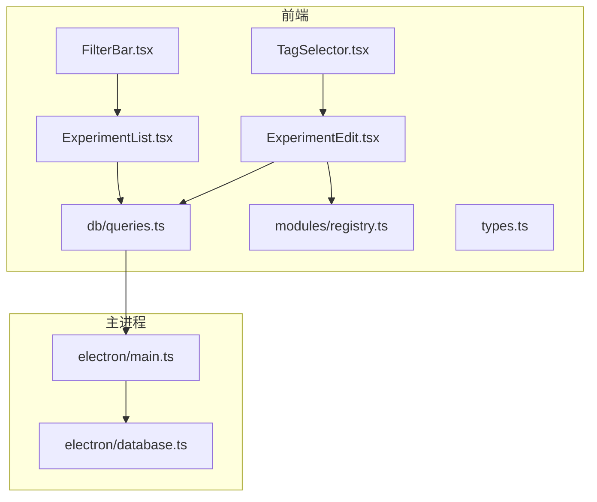
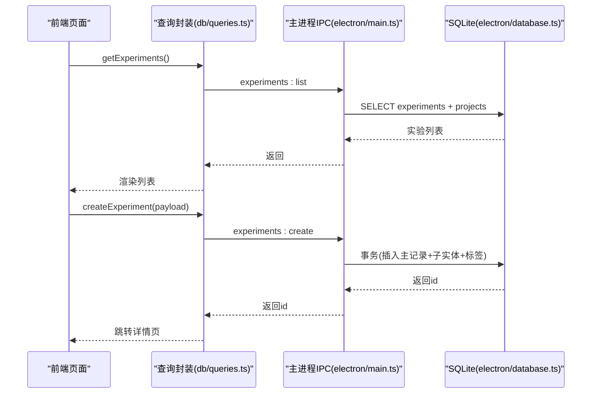
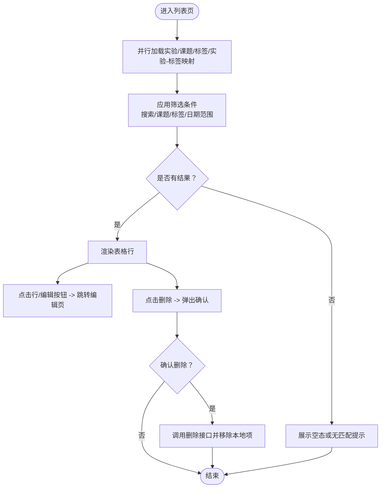
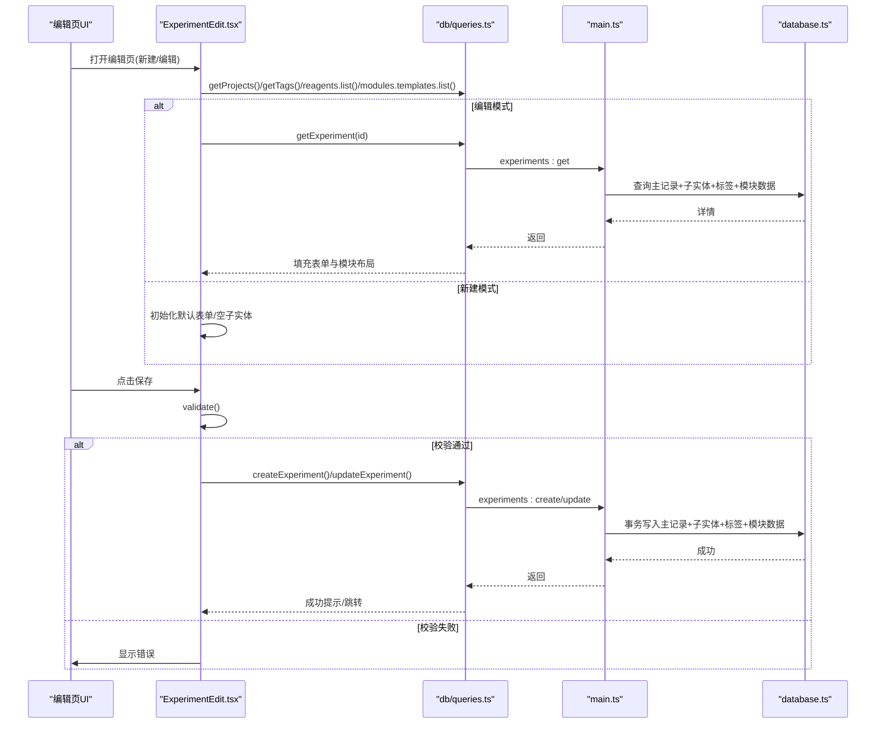
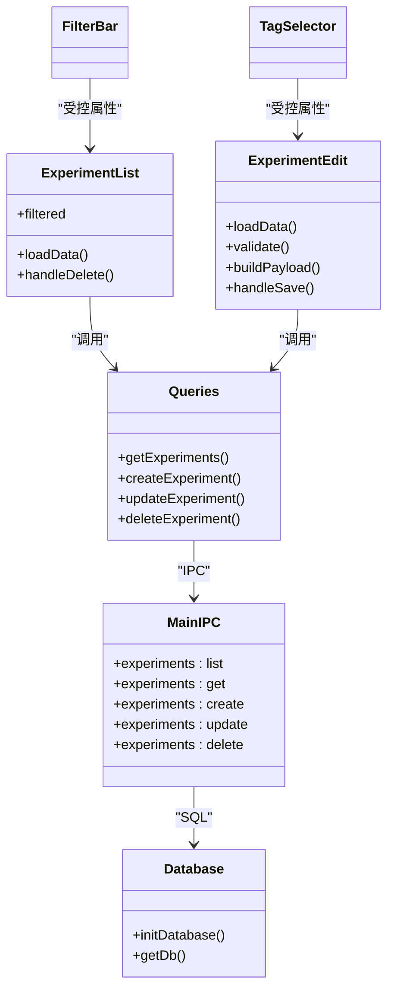

# 实验记录管理

<cite>
**本文引用的文件**   
- [src/pages/ExperimentList.tsx](file://src/pages/ExperimentList.tsx)
- [src/pages/ExperimentEdit.tsx](file://src/pages/ExperimentEdit.tsx)
- [src/components/FilterBar.tsx](file://src/components/FilterBar.tsx)
- [src/components/TagSelector.tsx](file://src/components/TagSelector.tsx)
- [src/db/schema.ts](file://src/db/schema.ts)
- [src/db/queries.ts](file://src/db/queries.ts)
- [src/types.ts](file://src/types.ts)
- [src/modules/registry.ts](file://src/modules/registry.ts)
- [electron/main.ts](file://electron/main.ts)
- [electron/database.ts](file://electron/database.ts)
</cite>

## 目录
1. [简介](#简介)
2. [项目结构](#项目结构)
3. [核心组件](#核心组件)
4. [架构总览](#架构总览)
5. [详细组件分析](#详细组件分析)
6. [依赖关系分析](#依赖关系分析)
7. [性能与扩展性](#性能与扩展性)
8. [故障排查指南](#故障排查指南)
9. [结论](#结论)
10. [附录：数据结构与接口定义](#附录数据结构与接口定义)

## 简介
本文件面向LabNote的“实验记录管理”功能，系统性阐述实验CRUD（增删改查）的实现原理、数据验证与约束规则、列表页筛选机制、编辑页表单处理与状态管理、数据库操作接口、错误处理与用户反馈机制，并提供扩展字段与自定义验证规则的实践路径。文档同时包含代码级架构图与流程图，帮助读者快速理解从前端到Electron主进程再到SQLite的数据流转。

## 项目结构
围绕实验记录管理的核心文件组织如下：
- 页面层：实验列表与编辑页面
- 组件层：筛选栏、标签选择器
- 类型与模块注册：统一类型定义、标准模块注册表
- 数据访问层：前端查询封装与IPC调用
- 主进程层：IPC处理器、数据库初始化与迁移、事务写入
- 数据库模式：Drizzle ORM模式定义与SQLite建表脚本

图表来源
- [src/pages/ExperimentList.tsx:1-252](file://src/pages/ExperimentList.tsx#L1-L252)
- [src/pages/ExperimentEdit.tsx:1-800](file://src/pages/ExperimentEdit.tsx#L1-L800)
- [src/components/FilterBar.tsx:1-85](file://src/components/FilterBar.tsx#L1-L85)
- [src/components/TagSelector.tsx:1-251](file://src/components/TagSelector.tsx#L1-L251)
- [src/modules/registry.ts:1-124](file://src/modules/registry.ts#L1-L124)
- [src/db/queries.ts:1-193](file://src/db/queries.ts#L1-L193)
- [src/types.ts:1-316](file://src/types.ts#L1-L316)
- [electron/main.ts:460-900](file://electron/main.ts#L460-L900)
- [electron/database.ts:1-320](file://electron/database.ts#L1-L320)

章节来源
- [src/pages/ExperimentList.tsx:1-252](file://src/pages/ExperimentList.tsx#L1-L252)
- [src/pages/ExperimentEdit.tsx:1-800](file://src/pages/ExperimentEdit.tsx#L1-L800)
- [src/components/FilterBar.tsx:1-85](file://src/components/FilterBar.tsx#L1-L85)
- [src/components/TagSelector.tsx:1-251](file://src/components/TagSelector.tsx#L1-L251)
- [src/db/queries.ts:1-193](file://src/db/queries.ts#L1-L193)
- [src/types.ts:1-316](file://src/types.ts#L1-L316)
- [src/modules/registry.ts:1-124](file://src/modules/registry.ts#L1-L124)
- [electron/main.ts:460-900](file://electron/main.ts#L460-L900)
- [electron/database.ts:1-320](file://electron/database.ts#L1-L320)

## 核心组件
- 实验列表页：负责加载实验清单、聚合课题与标签信息、提供搜索/课题/标签/日期范围筛选、删除确认与提示。
- 实验编辑页：负责新建/编辑实验、表单校验、多子实体（反应物/催化剂/溶剂/标签/模块布局/自定义模块数据）持久化、模板与导出能力。
- 筛选栏：提供搜索框、课题下拉、标签下拉、起止日期输入。
- 标签选择器：支持新增/编辑/删除标签，并在实验编辑页中多选绑定。
- 查询封装：统一通过window.labnote.* IPC接口访问主进程服务。
- 主进程IPC：实现experiments/list/get/create/update/delete等API，使用事务保证一致性。
- 数据库模式：定义experiments及关联表结构，并维护迁移逻辑。

章节来源
- [src/pages/ExperimentList.tsx:1-252](file://src/pages/ExperimentList.tsx#L1-L252)
- [src/pages/ExperimentEdit.tsx:1-800](file://src/pages/ExperimentEdit.tsx#L1-L800)
- [src/components/FilterBar.tsx:1-85](file://src/components/FilterBar.tsx#L1-L85)
- [src/components/TagSelector.tsx:1-251](file://src/components/TagSelector.tsx#L1-L251)
- [src/db/queries.ts:1-193](file://src/db/queries.ts#L1-L193)
- [electron/main.ts:460-900](file://electron/main.ts#L460-L900)
- [electron/database.ts:1-320](file://electron/database.ts#L1-L320)

## 架构总览
前端React组件通过查询封装调用window.labnote.* API，实际由Electron主进程的IPC处理器执行业务逻辑与数据库操作。实验创建/更新采用事务，确保主记录与子实体（反应物/催化剂/溶剂/标签/模块数据）的一致性。

图表来源
- [src/pages/ExperimentList.tsx:30-55](file://src/pages/ExperimentList.tsx#L30-L55)
- [src/pages/ExperimentEdit.tsx:400-453](file://src/pages/ExperimentEdit.tsx#L400-L453)
- [src/db/queries.ts:54-74](file://src/db/queries.ts#L54-L74)
- [electron/main.ts:495-577](file://electron/main.ts#L495-L577)
- [electron/database.ts:18-120](file://electron/database.ts#L18-L120)

## 详细组件分析

### 实验列表页（筛选与删除）
- 数据加载：并行获取实验、课题、标签、以及实验-标签映射，构建Map用于快速过滤。
- 筛选逻辑：
  - 文本搜索：匹配标题与课题名（不区分大小写）。
  - 课题筛选：按project_id精确匹配。
  - 标签筛选：基于已构建的实验-标签映射进行包含判断。
  - 日期范围：比较date字符串（YYYY-MM-DD）。
- 删除流程：弹出确认对话框，确认后调用删除接口并刷新本地列表；失败时显示错误提示。

图表来源
- [src/pages/ExperimentList.tsx:30-74](file://src/pages/ExperimentList.tsx#L30-L74)
- [src/pages/ExperimentList.tsx:76-92](file://src/pages/ExperimentList.tsx#L76-L92)
- [src/components/FilterBar.tsx:18-84](file://src/components/FilterBar.tsx#L18-L84)

章节来源
- [src/pages/ExperimentList.tsx:1-252](file://src/pages/ExperimentList.tsx#L1-L252)
- [src/components/FilterBar.tsx:1-85](file://src/components/FilterBar.tsx#L1-L85)

### 实验编辑页（表单、数据绑定与状态管理）
- 状态模型：
  - 基础表单字段：标题、副标题、日期、容器、温度、时间、压力、pH、搅拌、气氛、步骤、后处理、产率值/单位、形貌、备注、结果图片、结构式。
  - 子实体：反应物、催化剂、溶剂数组。
  - 标签：选中标签ID集合。
  - 模块系统：标准模块布局、自定义模块数据、折叠状态。
  - 模板与导出：保存为模板、导出为指定格式。
- 数据加载：
  - 新建：初始化默认表单与空子实体，支持从模板预填充。
  - 编辑：根据ID加载完整详情，包括子实体、标签、模块布局与自定义模块数据。
- 表单校验：必填字段（如标题、日期），错误对象集中管理，输入变更时自动清除对应错误。
- 保存流程：
  - 构建提交载荷：合并基础字段、过滤空子实体、序列化模块布局与自定义模块数据。
  - 新建/更新：分别调用create/update接口；若处于模板编辑模式则更新模板。
  - 成功提示与导航；失败捕获并提示。
- 图片与结构式：
  - 结果图片支持粘贴/选择文件，上传至本地images目录并通过labnote协议访问。
  - 结构式绘制后回填SMILES与名称，可自动填充标题。

图表来源
- [src/pages/ExperimentEdit.tsx:265-368](file://src/pages/ExperimentEdit.tsx#L265-L368)
- [src/pages/ExperimentEdit.tsx:377-453](file://src/pages/ExperimentEdit.tsx#L377-L453)
- [src/db/queries.ts:54-74](file://src/db/queries.ts#L54-L74)
- [electron/main.ts:495-655](file://electron/main.ts#L495-L655)
- [electron/database.ts:18-120](file://electron/database.ts#L18-L120)

章节来源
- [src/pages/ExperimentEdit.tsx:1-800](file://src/pages/ExperimentEdit.tsx#L1-L800)
- [src/db/queries.ts:1-193](file://src/db/queries.ts#L1-L193)
- [electron/main.ts:495-655](file://electron/main.ts#L495-L655)

### 筛选栏与标签选择器
- 筛选栏：将搜索、课题、标签、日期范围作为受控组件暴露给父组件，父组件在内存中进行过滤。
- 标签选择器：支持新增/编辑/删除标签，并在实验编辑页中多选绑定；新增/修改/删除后触发刷新回调以同步最新标签列表。

章节来源
- [src/components/FilterBar.tsx:1-85](file://src/components/FilterBar.tsx#L1-L85)
- [src/components/TagSelector.tsx:1-251](file://src/components/TagSelector.tsx#L1-L251)

### 模块系统与标准模块
- 标准模块定义：基本信息、反应条件、反应物、催化剂、溶剂、实验步骤、后处理、实验结果、标签。
- 默认布局：所有标准模块可见，顺序固定。
- 解析与校验：解析module_layout JSON，去重并仅保留合法项，非法回退到默认布局。
- 隐藏/添加：计算当前未显示的可选标准模块键，支持拖拽调整顺序。

章节来源
- [src/modules/registry.ts:1-124](file://src/modules/registry.ts#L1-L124)
- [src/pages/ExperimentEdit.tsx:88-261](file://src/pages/ExperimentEdit.tsx#L88-L261)

## 依赖关系分析
- 前端页面依赖查询封装，查询封装依赖window.labnote.*类型声明与实际IPC桥接。
- 主进程IPC直接操作better-sqlite3数据库，使用WAL模式与外键约束，确保并发与一致性。
- 数据库模式由initDatabase统一建表与迁移，Drizzle schema用于前端类型参考。

图表来源
- [src/pages/ExperimentList.tsx:1-252](file://src/pages/ExperimentList.tsx#L1-L252)
- [src/pages/ExperimentEdit.tsx:1-800](file://src/pages/ExperimentEdit.tsx#L1-L800)
- [src/components/FilterBar.tsx:1-85](file://src/components/FilterBar.tsx#L1-L85)
- [src/components/TagSelector.tsx:1-251](file://src/components/TagSelector.tsx#L1-L251)
- [src/db/queries.ts:1-193](file://src/db/queries.ts#L1-L193)
- [electron/main.ts:460-900](file://electron/main.ts#L460-L900)
- [electron/database.ts:1-320](file://electron/database.ts#L1-L320)

章节来源
- [src/types.ts:1-316](file://src/types.ts#L1-L316)
- [src/db/schema.ts:1-109](file://src/db/schema.ts#L1-L109)
- [electron/database.ts:1-320](file://electron/database.ts#L1-L320)

## 性能与扩展性
- 列表筛选在内存执行，适合中等规模数据；当数据量增长时可考虑后端分页与增量过滤。
- 标签映射在加载阶段一次性构建Map，避免重复遍历，提升筛选性能。
- 图片存储走本地文件系统并通过协议访问，避免大对象入库导致的数据库膨胀。
- 模块布局与自定义模块数据以JSON存储，便于扩展新字段与新模块类型，无需频繁变更表结构。

[本节为通用建议，不直接分析具体文件]

## 故障排查指南
- 无法加载数据：检查preload是否注入window.labnote；查看控制台错误日志。
- 保存失败：
  - 校验失败：确认标题与日期必填。
  - 外键约束：确保project_id存在，否则会被置空。
  - 事务异常：查看主进程日志中的事务回滚信息。
- 图片无法显示：确认labnote协议已注册且路径未被越权访问。
- 标签冲突：同名标签在不同type下允许共存；若出现唯一约束错误，检查迁移是否重建tags表。

章节来源
- [src/db/queries.ts:23-30](file://src/db/queries.ts#L23-L30)
- [electron/main.ts:495-577](file://electron/main.ts#L495-L577)
- [electron/main.ts:579-655](file://electron/main.ts#L579-L655)
- [electron/database.ts:292-314](file://electron/database.ts#L292-L314)

## 结论
LabNote的实验记录管理以清晰的层次划分与强一致的事务写入为核心，结合灵活的模块系统与模板机制，既满足日常实验记录的完整性，又具备良好的可扩展性。通过前端受控组件与内存筛选，用户体验流畅；通过IPC与SQLite的组合，保证了数据安全与性能。

[本节为总结性内容，不直接分析具体文件]

## 附录：数据结构与接口定义

### 数据库表与约束（节选）
- experiments：主记录，含标题、日期、条件、结果、图片、模块布局等字段，外键project_id引用projects。
- reactants/catalysts/solvents：子实体，均通过experiment_id级联删除。
- tags/experiment_tags：多对多关系，复合主键防止重复绑定。
- module_templates/experiment_module_data：模块模板与实例数据，支持JSON字段。
- 迁移：动态检测列缺失并ALTER TABLE，兼容历史版本。

章节来源
- [electron/database.ts:18-177](file://electron/database.ts#L18-L177)
- [electron/database.ts:262-314](file://electron/database.ts#L262-L314)
- [src/db/schema.ts:11-109](file://src/db/schema.ts#L11-L109)

### 前端类型与接口（节选）
- Experiment/ExperimentDetail：列表与详情视图的数据契约。
- CreateExperimentInput/UpdateExperimentInput：提交载荷类型，包含基础字段、子实体、标签、模块布局与自定义模块数据。
- ModuleTemplate/ModuleLayoutItem：模块系统与布局项定义。
- window.labnote.*：IPC方法签名，涵盖实验、标签、模板、试剂、任务等。

章节来源
- [src/types.ts:119-231](file://src/types.ts#L119-L231)
- [src/types.ts:233-316](file://src/types.ts#L233-L316)

### 关键API与调用路径
- 列表：experiments:list → SELECT e.*, p.name FROM experiments LEFT JOIN projects
- 详情：experiments:get → 主记录 + reactants/catalysts/solvents/tags/custom_modules
- 新建：experiments:create → 事务内插入主记录与子实体，再插入自定义模块数据
- 更新：experiments:update → 事务内更新主记录，删除旧子实体后批量插入新数据
- 删除：experiments:delete → 删除主记录（子实体因外键级联删除）

章节来源
- [electron/main.ts:461-493](file://electron/main.ts#L461-L493)
- [electron/main.ts:495-577](file://electron/main.ts#L495-L577)
- [electron/main.ts:579-655](file://electron/main.ts#L579-L655)
- [electron/main.ts:657-659](file://electron/main.ts#L657-L659)

### 如何扩展实验字段与自定义验证规则
- 扩展字段（数据库侧）：
  - 在initDatabase中添加新列的迁移逻辑（检测列是否存在并ALTER TABLE）。
  - 在主进程experiments:create/update语句中加入新字段映射。
- 扩展字段（前端侧）：
  - 在types.ts的CreateExperimentInput/UpdateExperimentInput与ExperimentDetail中添加字段。
  - 在ExperimentEdit.tsx的FormData与emptyForm中添加默认值，并在renderModule中增加对应输入控件。
  - 在validate中补充校验逻辑，在buildPayload中确保字段被序列化。
- 自定义验证规则：
  - 在validate函数中追加业务规则（例如数值范围、组合字段校验），并将错误写入errors对象。
  - 在表单控件上绑定错误提示样式与文案。
- 模块系统扩展：
  - 在STANDARD_MODULES中注册新的标准模块（如需内置）。
  - 通过module_templates创建自定义模块模板，并在ExperimentEdit中渲染对应的CustomModuleForm。

章节来源
- [electron/database.ts:262-290](file://electron/database.ts#L262-L290)
- [electron/main.ts:495-577](file://electron/main.ts#L495-L577)
- [electron/main.ts:579-655](file://electron/main.ts#L579-L655)
- [src/types.ts:203-231](file://src/types.ts#L203-L231)
- [src/pages/ExperimentEdit.tsx:377-453](file://src/pages/ExperimentEdit.tsx#L377-L453)
- [src/modules/registry.ts:7-62](file://src/modules/registry.ts#L7-L62)