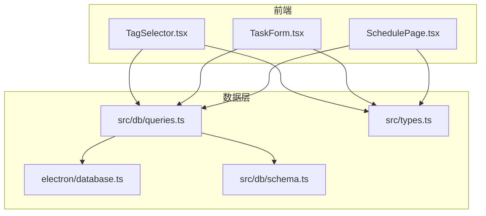
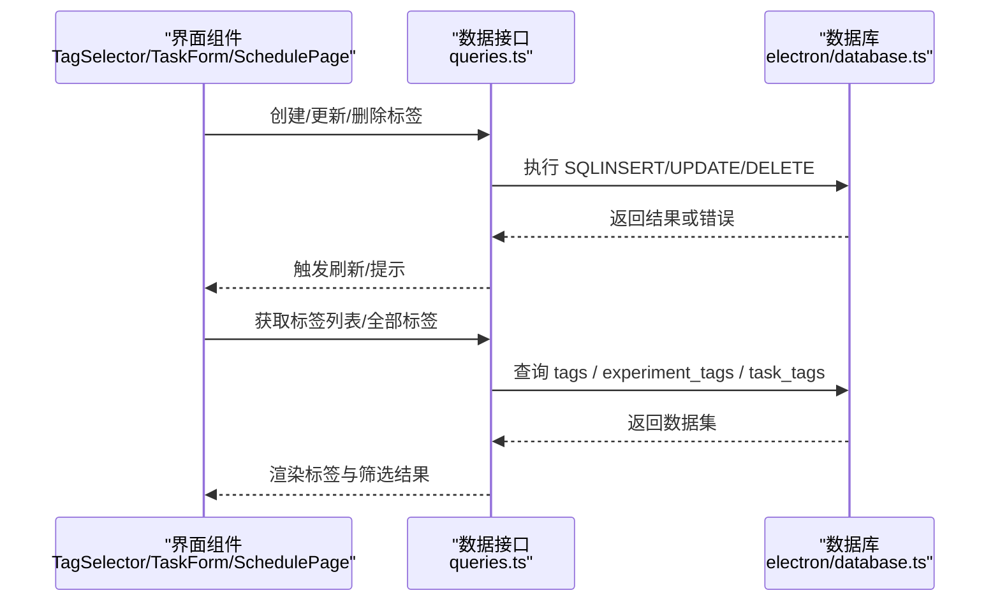
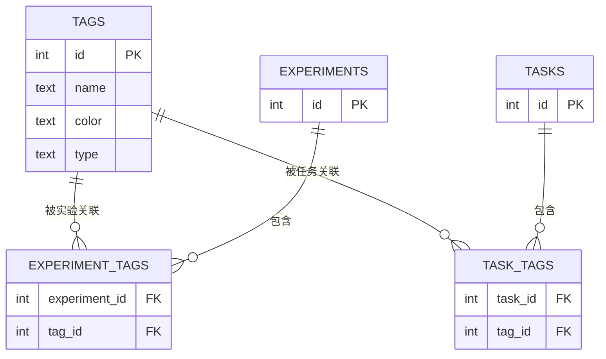
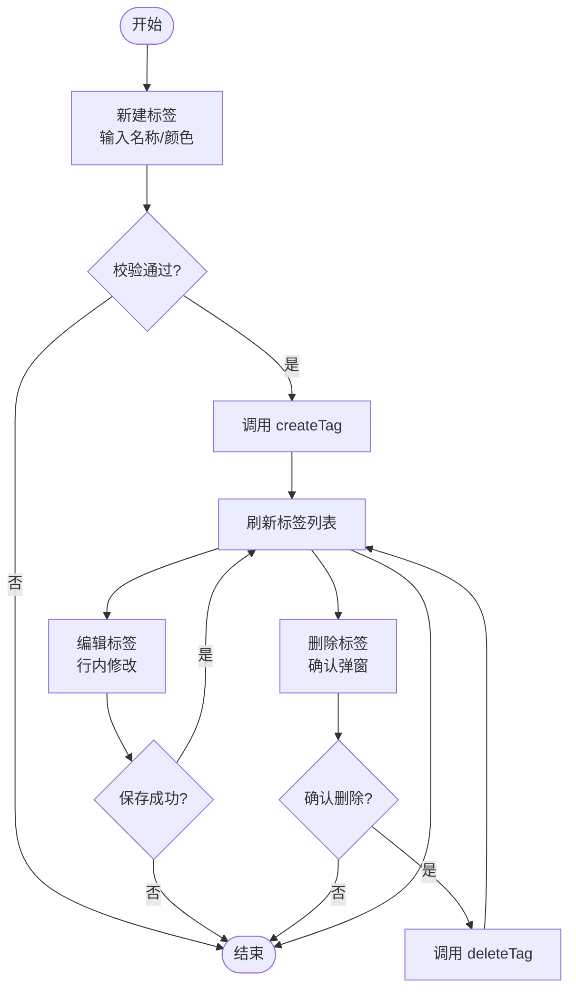
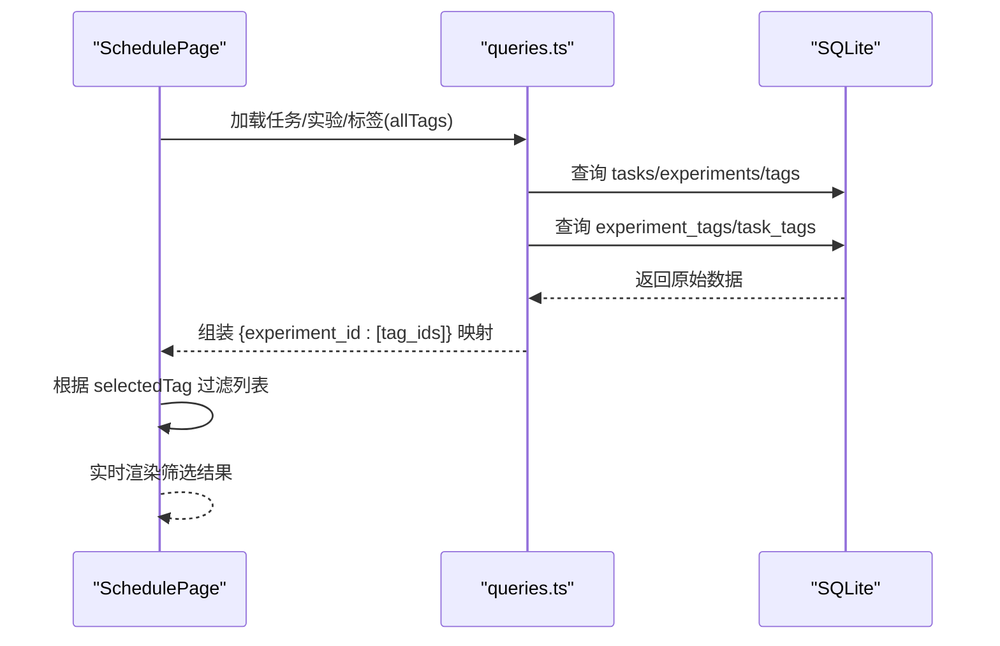
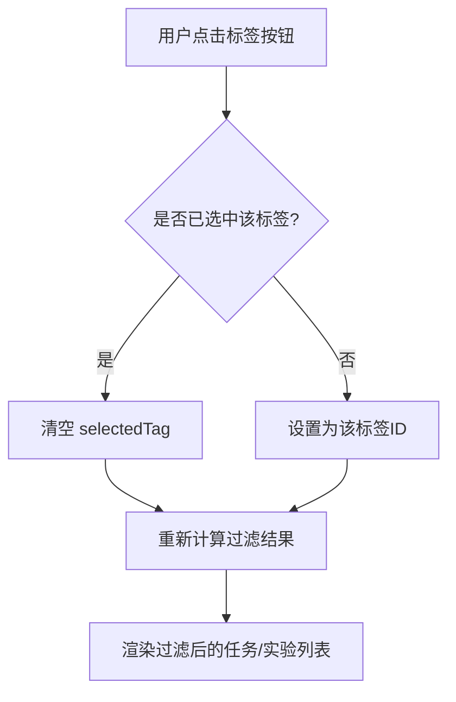
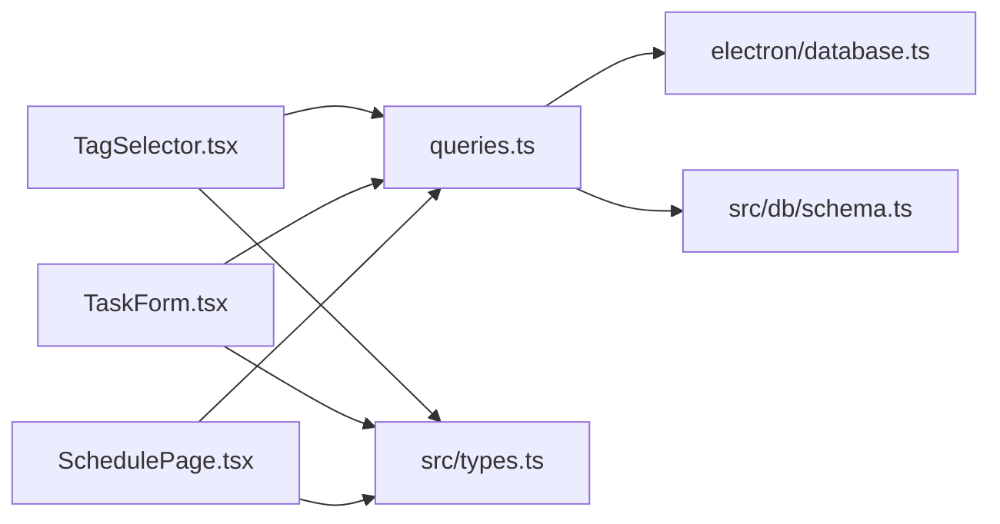

# 标签系统

<cite>
**本文引用的文件**   
- [TagSelector.tsx](file://src/components/TagSelector.tsx)
- [TaskForm.tsx](file://src/components/TaskForm.tsx)
- [SchedulePage.tsx](file://src/pages/SchedulePage.tsx)
- [database.ts](file://electron/database.ts)
- [schema.ts](file://src/db/schema.ts)
- [queries.ts](file://src/db/queries.ts)
- [types.ts](file://src/types.ts)
</cite>

## 目录
1. [简介](#简介)
2. [项目结构](#项目结构)
3. [核心组件](#核心组件)
4. [架构总览](#架构总览)
5. [详细组件分析](#详细组件分析)
6. [依赖关系分析](#依赖关系分析)
7. [性能考虑](#性能考虑)
8. [故障排查指南](#故障排查指南)
9. [结论](#结论)
10. [附录](#附录)

## 简介
本文件系统化梳理 LabNote 的标签系统，覆盖以下方面：
- 标签的创建、编辑、删除与分类管理（按类型区分）
- 标签与不同实体（实验、任务等）的多对多关联实现
- 颜色标记系统与视觉展示机制
- 筛选功能原理（含多标签组合筛选与实时过滤）
- 数据模型设计与数据库查询优化策略
- 扩展方法与自定义标签类型的实现指南

## 项目结构
标签系统涉及前端交互组件、后端持久化与类型定义三部分：
- 前端组件
  - TagSelector.tsx：通用标签选择与管理面板（支持新建、编辑、删除、多选）
  - TaskForm.tsx：任务表单中的标签模块（支持在任务上下文中快速创建与选择）
  - SchedulePage.tsx：日程页的标签筛选入口
- 数据层
  - electron/database.ts：SQLite 表结构与迁移（tags、experiment_tags、task_tags）
  - src/db/schema.ts：drizzle 风格的数据表声明（用于类型与查询构建）
  - src/db/queries.ts：标签相关 API 封装（createTag、updateTag、deleteTag、listTags、allTags）
- 类型定义
  - src/types.ts：Tag 类型定义及跨模块共享

图表来源
- [TagSelector.tsx:1-188](file://src/components/TagSelector.tsx#L1-L188)
- [TaskForm.tsx:287-440](file://src/components/TaskForm.tsx#L287-L440)
- [SchedulePage.tsx:321-340](file://src/pages/SchedulePage.tsx#L321-L340)
- [database.ts:87-176](file://electron/database.ts#L87-L176)
- [schema.ts:65-76](file://src/db/schema.ts#L65-L76)
- [queries.ts](file://src/db/queries.ts)
- [types.ts](file://src/types.ts)

章节来源
- [TagSelector.tsx:1-188](file://src/components/TagSelector.tsx#L1-L188)
- [TaskForm.tsx:287-440](file://src/components/TaskForm.tsx#L287-L440)
- [SchedulePage.tsx:321-340](file://src/pages/SchedulePage.tsx#L321-L340)
- [database.ts:87-176](file://electron/database.ts#L87-L176)
- [schema.ts:65-76](file://src/db/schema.ts#L65-L76)
- [queries.ts](file://src/db/queries.ts)
- [types.ts](file://src/types.ts)

## 核心组件
- 标签选择器（TagSelector）
  - 提供“新建标签”、“编辑标签”、“删除标签”、“多选绑定”能力
  - 内置预设色板，支持为标签设置颜色
  - 通过 onTagsRefresh 回调刷新父级列表
- 任务表单（TaskForm）
  - 在任务上下文中复用标签管理能力，支持快速创建并立即选择
  - 将选中标签 ID 随任务保存一并提交
- 日程筛选（SchedulePage）
  - 提供按标签筛选的按钮组，点击切换当前选中标签
  - 结合任务与实验数据，实现实时过滤显示

章节来源
- [TagSelector.tsx:1-188](file://src/components/TagSelector.tsx#L1-L188)
- [TaskForm.tsx:287-440](file://src/components/TaskForm.tsx#L287-L440)
- [SchedulePage.tsx:321-340](file://src/pages/SchedulePage.tsx#L321-L340)

## 架构总览
标签系统采用“前端组件 + 数据接口 + SQLite 存储”的分层架构。前端组件负责用户交互与状态管理；数据接口统一封装 CRUD 操作；SQLite 负责持久化与约束保证。

图表来源
- [TagSelector.tsx:1-188](file://src/components/TagSelector.tsx#L1-L188)
- [TaskForm.tsx:287-440](file://src/components/TaskForm.tsx#L287-L440)
- [SchedulePage.tsx:321-340](file://src/pages/SchedulePage.tsx#L321-L340)
- [database.ts:87-176](file://electron/database.ts#L87-L176)
- [queries.ts](file://src/db/queries.ts)

## 详细组件分析

### 数据模型与关系
- 标签表 tags
  - 字段：id、name、color、type（默认 'experiment'）
  - 约束：(name, type) 唯一，避免同名标签在不同类型下冲突
- 关联表
  - experiment_tags：实验与标签的多对多
  - task_tags：任务与标签的多对多
- 迁移与兼容性
  - 自动检测旧 tags.name 唯一索引，重建表以启用 (name, type) 复合唯一

图表来源
- [database.ts:87-176](file://electron/database.ts#L87-L176)
- [database.ts:277-314](file://electron/database.ts#L277-L314)
- [schema.ts:65-76](file://src/db/schema.ts#L65-L76)

章节来源
- [database.ts:87-176](file://electron/database.ts#L87-L176)
- [database.ts:277-314](file://electron/database.ts#L277-L314)
- [schema.ts:65-76](file://src/db/schema.ts#L65-L76)

### 标签生命周期（创建/编辑/删除）
- 创建
  - 用户在 TagSelector 或 TaskForm 输入名称与颜色，调用 createTag(type='experiment'|'task')
  - 成功后清空输入并触发 onTagsRefresh
- 编辑
  - 进入行内编辑模式，修改名称与颜色后保存
- 删除
  - 弹出确认框，确认后删除标签，已关联的实验/任务解绑（外键 ON DELETE CASCADE）

图表来源
- [TagSelector.tsx:35-82](file://src/components/TagSelector.tsx#L35-L82)
- [TaskForm.tsx:319-429](file://src/components/TaskForm.tsx#L319-L429)

章节来源
- [TagSelector.tsx:35-82](file://src/components/TagSelector.tsx#L35-L82)
- [TaskForm.tsx:319-429](file://src/components/TaskForm.tsx#L319-L429)

### 多对多关联与筛选流程
- 关联
  - 实验：experiment_tags(experiment_id, tag_id)
  - 任务：task_tags(task_id, tag_id)
- 筛选
  - 日程页根据 selectedTag 过滤任务与实验
  - 实验列表页使用 allTags() 聚合每个实验的标签集合，并在前端进行条件过滤

图表来源
- [SchedulePage.tsx:321-340](file://src/pages/SchedulePage.tsx#L321-L340)
- [database.ts:95-176](file://electron/database.ts#L95-L176)
- [queries.ts](file://src/db/queries.ts)

章节来源
- [SchedulePage.tsx:321-340](file://src/pages/SchedulePage.tsx#L321-L340)
- [database.ts:95-176](file://electron/database.ts#L95-L176)
- [queries.ts](file://src/db/queries.ts)

### 颜色标记与视觉展示
- 预设色板
  - 组件内维护一组常用颜色，便于快速选择
- 展示规则
  - 选中态：背景色使用标签颜色，文字白色
  - 未选中态：边框灰色，悬停高亮
  - 列表项中显示小圆点标识颜色，增强识别度

章节来源
- [TagSelector.tsx:5-9](file://src/components/TagSelector.tsx#L5-L9)
- [TagSelector.tsx:144-188](file://src/components/TagSelector.tsx#L144-L188)
- [TaskForm.tsx:374-416](file://src/components/TaskForm.tsx#L374-L416)

### 筛选逻辑与实时过滤
- 单标签筛选
  - 点击标签按钮切换 selectedTag，再次点击取消
- 多条件组合
  - 日程页同时支持状态、时间范围、标签等多维筛选
  - 前端基于本地数据进行过滤，实现即时反馈

图表来源
- [SchedulePage.tsx:321-340](file://src/pages/SchedulePage.tsx#L321-L340)

章节来源
- [SchedulePage.tsx:321-340](file://src/pages/SchedulePage.tsx#L321-L340)

## 依赖关系分析
- 组件依赖
  - TagSelector.tsx 依赖 queries.ts 的 createTag/updateTag/deleteTag 与 types.ts 的 Tag
  - TaskForm.tsx 复用相同接口，并在任务保存时附带 tag_ids
  - SchedulePage.tsx 依赖 queries.ts 的 list/allTags 接口
- 数据层依赖
  - queries.ts 依赖 electron/database.ts 提供的数据库实例与 drizzle schema
  - database.ts 负责建表、迁移与外键约束

图表来源
- [TagSelector.tsx:1-188](file://src/components/TagSelector.tsx#L1-L188)
- [TaskForm.tsx:287-440](file://src/components/TaskForm.tsx#L287-L440)
- [SchedulePage.tsx:321-340](file://src/pages/SchedulePage.tsx#L321-L340)
- [database.ts:87-176](file://electron/database.ts#L87-L176)
- [schema.ts:65-76](file://src/db/schema.ts#L65-L76)
- [queries.ts](file://src/db/queries.ts)
- [types.ts](file://src/types.ts)

章节来源
- [TagSelector.tsx:1-188](file://src/components/TagSelector.tsx#L1-L188)
- [TaskForm.tsx:287-440](file://src/components/TaskForm.tsx#L287-L440)
- [SchedulePage.tsx:321-340](file://src/pages/SchedulePage.tsx#L321-L340)
- [database.ts:87-176](file://electron/database.ts#L87-L176)
- [schema.ts:65-76](file://src/db/schema.ts#L65-L76)
- [queries.ts](file://src/db/queries.ts)
- [types.ts](file://src/types.ts)

## 性能考虑
- 前端过滤
  - 当前筛选在前端完成，适合中小规模数据；若数据量增长，建议在后端增加按标签过滤的查询参数
- 数据库索引
  - 建议在 experiment_tags(tag_id)、task_tags(tag_id) 上建立索引以提升筛选与聚合查询性能
- 批量操作
  - 对于大量标签的初始化或迁移，建议使用事务与批处理减少 IO 次数

[本节为通用指导，不直接分析具体文件]

## 故障排查指南
- 标签重复
  - 现象：创建同名标签失败
  - 原因：(name, type) 唯一约束
  - 解决：更换名称或调整 type
- 删除后仍显示
  - 现象：删除标签后列表未刷新
  - 原因：未触发 onTagsRefresh
  - 解决：确保删除成功后调用刷新回调
- 筛选无效
  - 现象：点击标签无变化
  - 原因：selectedTag 状态未正确切换
  - 解决：检查事件处理与状态更新逻辑

章节来源
- [TagSelector.tsx:35-82](file://src/components/TagSelector.tsx#L35-L82)
- [TaskForm.tsx:319-429](file://src/components/TaskForm.tsx#L319-L429)
- [SchedulePage.tsx:321-340](file://src/pages/SchedulePage.tsx#L321-L340)

## 结论
LabNote 的标签系统通过清晰的组件分层与稳健的数据库设计，实现了灵活的标签管理与筛选能力。其多对多关联、颜色可视化与前端实时过滤共同构成了良好的用户体验。未来可在后端查询与索引层面进一步优化，以支撑更大规模的数据场景。

[本节为总结性内容，不直接分析具体文件]

## 附录

### 扩展与自定义标签类型指南
- 新增实体类型
  - 在 database.ts 中为新实体添加关联表（如 reagent_tags），并定义外键约束
  - 在 schema.ts 中补充 drizzle 表声明
  - 在 queries.ts 中新增对应实体的标签 API（listByType、createForEntity 等）
  - 在组件中复用 TagSelector 或扩展新组件，传入 type 参数
- 类型安全
  - 在 types.ts 中扩展 Tag 的 type 枚举值，确保前后端一致
- 迁移兼容
  - 参考现有迁移逻辑，确保旧版本数据库平滑升级

章节来源
- [database.ts:87-176](file://electron/database.ts#L87-L176)
- [schema.ts:65-76](file://src/db/schema.ts#L65-L76)
- [queries.ts](file://src/db/queries.ts)
- [types.ts](file://src/types.ts)