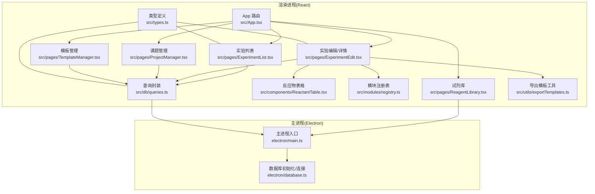
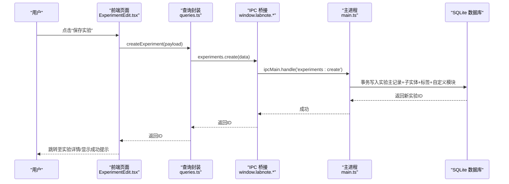
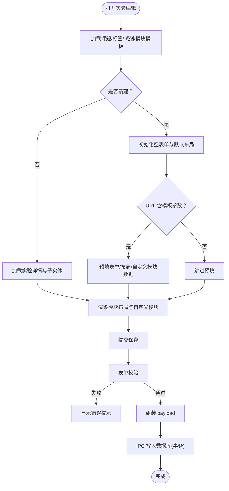
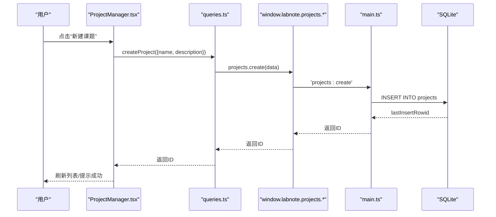
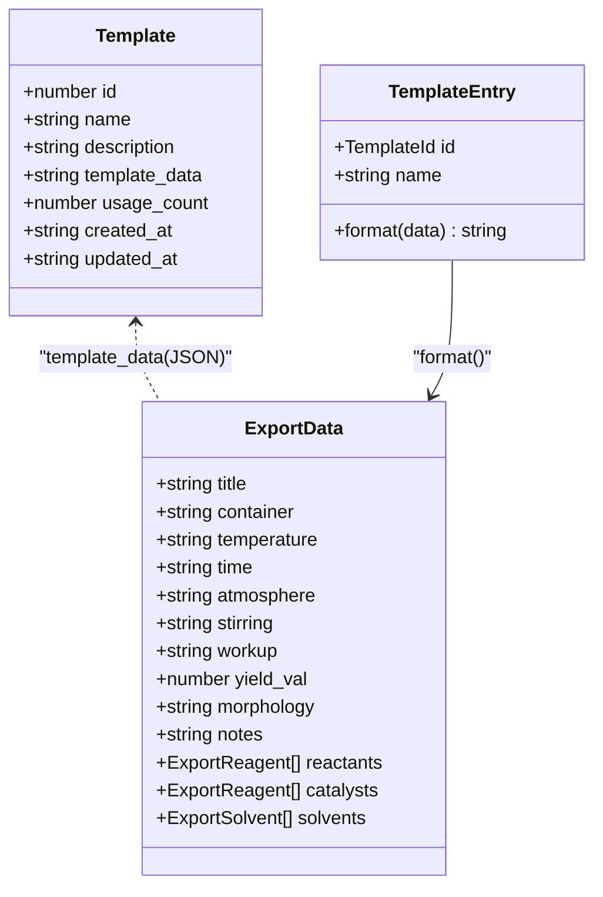
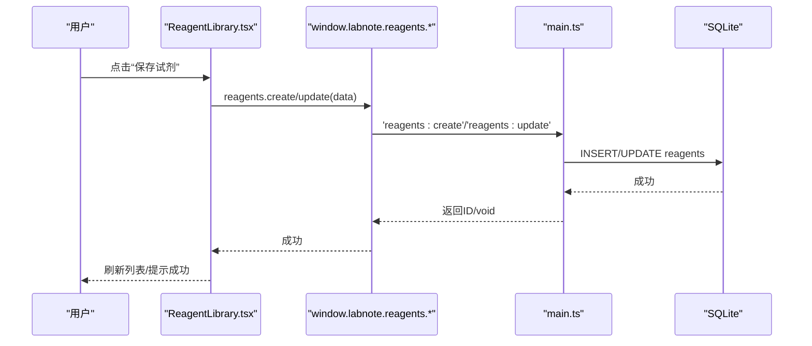
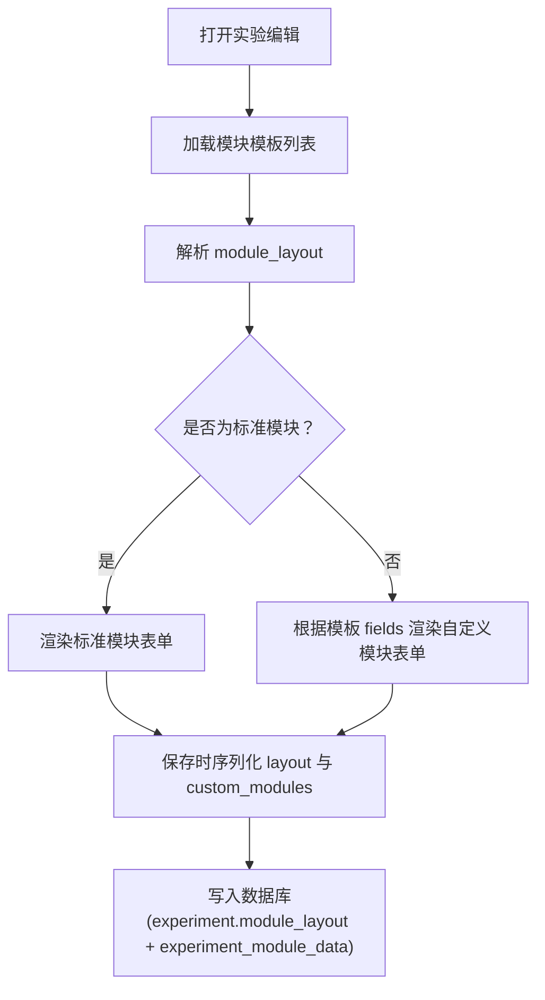
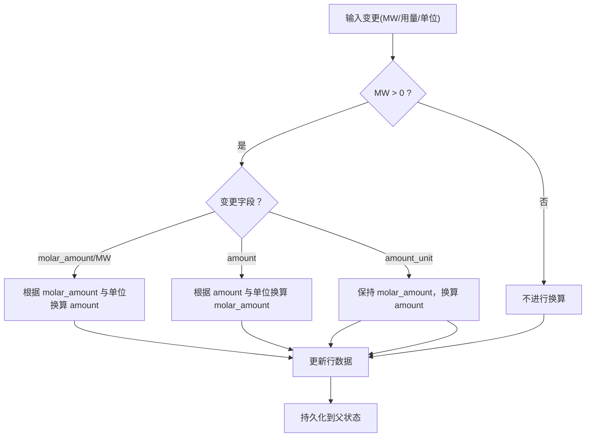
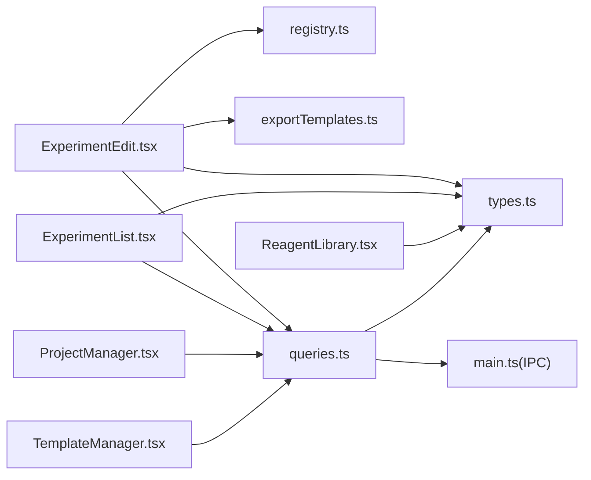

# 核心功能模块

<cite>
**本文引用的文件**   
- [src/App.tsx](file://src/App.tsx)
- [src/types.ts](file://src/types.ts)
- [config.json](file://config.json)
- [package.json](file://package.json)
- [src/pages/ExperimentList.tsx](file://src/pages/ExperimentList.tsx)
- [src/pages/ExperimentEdit.tsx](file://src/pages/ExperimentEdit.tsx)
- [src/pages/ProjectManager.tsx](file://src/pages/ProjectManager.tsx)
- [src/pages/TemplateManager.tsx](file://src/pages/TemplateManager.tsx)
- [src/pages/ReagentLibrary.tsx](file://src/pages/ReagentLibrary.tsx)
- [src/db/schema.ts](file://src/db/schema.ts)
- [src/db/queries.ts](file://src/db/queries.ts)
- [src/modules/registry.ts](file://src/modules/registry.ts)
- [src/components/ReactantTable.tsx](file://src/components/ReactantTable.tsx)
- [src/utils/exportTemplates.ts](file://src/utils/exportTemplates.ts)
- [electron/main.ts](file://electron/main.ts)
</cite>

## 目录
1. [简介](#简介)
2. [项目结构](#项目结构)
3. [核心组件](#核心组件)
4. [架构总览](#架构总览)
5. [详细组件分析](#详细组件分析)
6. [依赖关系分析](#依赖关系分析)
7. [性能考量](#性能考量)
8. [故障排查指南](#故障排查指南)
9. [结论](#结论)
10. [附录](#附录)

## 简介
LabNote 是一款面向化学实验记录的桌面应用，基于 Electron + React + TypeScript 构建。其核心能力包括：
- 实验记录管理：创建、编辑、筛选与删除实验条目，支持结构化字段（反应物、催化剂、溶剂等）、标签、结果图片与结构式绘制。
- 项目管理：对课题进行增删改查，并与实验建立关联。
- 模板系统：将常用实验条件保存为模板，快速复用；同时提供导出模板（ACS/JACS/Angewandte 风格）与自定义占位符模板。
- 试剂库管理：集中维护试剂信息（名称、简称、分子量、分子式、结构图），在实验中可快速选择并自动填充。
- 模块化布局：通过“标准模块 + 自定义模块”的组合，灵活组织实验详情页的区块与顺序。

本文件从系统架构、数据流、业务逻辑、配置项与扩展点等维度，全面解析上述功能的实现原理与使用方法，并提供使用示例与最佳实践，帮助开发者快速理解与二次开发。

## 项目结构
前端采用路由驱动的页面组织方式，核心页面位于 src/pages，通用组件位于 src/components，数据库模式与查询封装位于 src/db，模块注册表位于 src/modules，工具函数位于 src/utils。Electron 主进程负责 IPC、本地文件系统与 SQLite 数据库访问。

图表来源
- [src/App.tsx:43-63](file://src/App.tsx#L43-L63)
- [src/pages/ExperimentList.tsx:1-252](file://src/pages/ExperimentList.tsx#L1-L252)
- [src/pages/ExperimentEdit.tsx:1-800](file://src/pages/ExperimentEdit.tsx#L1-L800)
- [src/pages/ProjectManager.tsx:1-202](file://src/pages/ProjectManager.tsx#L1-L202)
- [src/pages/TemplateManager.tsx:1-149](file://src/pages/TemplateManager.tsx#L1-L149)
- [src/pages/ReagentLibrary.tsx:1-357](file://src/pages/ReagentLibrary.tsx#L1-L357)
- [src/components/ReactantTable.tsx:1-383](file://src/components/ReactantTable.tsx#L1-L383)
- [src/modules/registry.ts:1-124](file://src/modules/registry.ts#L1-L124)
- [src/db/queries.ts:1-193](file://src/db/queries.ts#L1-L193)
- [src/utils/exportTemplates.ts:1-367](file://src/utils/exportTemplates.ts#L1-L367)
- [electron/main.ts:1-800](file://electron/main.ts#L1-L800)

章节来源
- [src/App.tsx:43-63](file://src/App.tsx#L43-L63)
- [package.json:1-39](file://package.json#L1-L39)
- [config.json:1-3](file://config.json#L1-L3)

## 核心组件
- 路由与布局
  - 统一入口 App 定义页面路由与不同布局（常规布局、日程宽屏布局、无侧边栏的结构编辑器全屏布局）。
- 实验列表
  - 加载实验、课题、标签与实验-标签映射，支持关键词搜索、按课题/标签/日期范围筛选，支持删除确认与提示。
- 实验编辑/详情
  - 表单驱动的数据录入，支持基础信息、反应条件、反应物/催化剂/溶剂、步骤、后处理、结果、标签、模块布局与自定义模块数据；支持模板预填充、保存为模板、导出文本。
- 课题管理
  - 课题的增删改查，展示实验数量统计，支持进入课题详情。
- 模板管理
  - 模板列表、预览关键信息、使用/编辑/删除操作；新建空白实验入口。
- 试剂库
  - 试剂信息的增删改查，支持结构式绘制或图片粘贴/上传，并在实验中作为选择源。
- 模块注册表
  - 定义标准模块集合与默认布局，提供布局解析、隐藏模块获取、自定义模块键解析等工具。
- 查询封装
  - 统一的 window.labnote.* API 调用封装，屏蔽 IPC 细节，提供类型化方法。
- 导出模板工具
  - 内置 ACS/JACS/Angewandte 三种期刊风格模板，以及自定义占位符模板引擎。

章节来源
- [src/App.tsx:43-63](file://src/App.tsx#L43-L63)
- [src/pages/ExperimentList.tsx:1-252](file://src/pages/ExperimentList.tsx#L1-L252)
- [src/pages/ExperimentEdit.tsx:1-800](file://src/pages/ExperimentEdit.tsx#L1-L800)
- [src/pages/ProjectManager.tsx:1-202](file://src/pages/ProjectManager.tsx#L1-L202)
- [src/pages/TemplateManager.tsx:1-149](file://src/pages/TemplateManager.tsx#L1-L149)
- [src/pages/ReagentLibrary.tsx:1-357](file://src/pages/ReagentLibrary.tsx#L1-L357)
- [src/modules/registry.ts:1-124](file://src/modules/registry.ts#L1-L124)
- [src/db/queries.ts:1-193](file://src/db/queries.ts#L1-L193)
- [src/utils/exportTemplates.ts:1-367](file://src/utils/exportTemplates.ts#L1-L367)

## 架构总览
LabNote 采用前后端分离的桌面应用架构：
- 渲染进程（React）：负责 UI 交互、状态管理与用户流程。
- 主进程（Electron）：暴露 IPC 接口，访问本地文件系统与 SQLite 数据库，提供安全边界。
- 数据层：Drizzle ORM 模式定义 + better-sqlite3 持久化。
- 资源存储：图片等资源以文件形式保存在 dataPath/images 下，并通过自定义协议 labnote://images/ 访问。

图表来源
- [src/pages/ExperimentEdit.tsx:398-453](file://src/pages/ExperimentEdit.tsx#L398-L453)
- [src/db/queries.ts:64-74](file://src/db/queries.ts#L64-L74)
- [src/types.ts:249-262](file://src/types.ts#L249-L262)
- [electron/main.ts:495-577](file://electron/main.ts#L495-L577)

## 详细组件分析

### 实验记录管理
- 功能特性
  - 列表页：多条件筛选（标题/课题/标签/日期范围）、空态引导、删除确认。
  - 编辑/详情页：表单校验、批量子实体（反应物/催化剂/溶剂）维护、标签绑定、结果图片管理、结构式绘制集成、模块布局与自定义模块数据、模板预填充与保存为模板、导出文本。
- 数据模型
  - 实验主表与子表（反应物、催化剂、溶剂）、标签及多对多关系、自定义模块数据表。
- 关键流程
  - 新建/更新：前端组装 payload → queries.ts → window.labnote.experiments.* → main.ts 事务写入 → 返回结果。
  - 模板预填充：根据 URL 参数 template=xxx 读取模板 JSON，回填表单、模块布局与自定义模块数据。
  - 导出：调用 exportData 获取结构化数据，再结合 exportTemplates.ts 的模板生成最终文本。
- 用户操作流程
  - 新建实验：进入 /experiments/new → 填写表单 → 可选“保存为模板”→ 保存成功跳转详情。
  - 使用模板：在模板库点击“使用”，跳转到 /experiments/new?template=xxx 自动预填。
  - 导出文本：在详情页点击导出，选择预设或自定义模板，生成文本。
- 配置选项
  - 模块布局：通过 module_layout 控制可见性与顺序，支持拖拽调整。
  - 自定义模块：基于模块模板动态渲染表单字段。
- 扩展点
  - 新增标准模块：在 registry.ts 中注册 STANDARD_MODULES 与默认布局。
  - 新增导出模板：在 exportTemplates.ts 中添加新的 format 函数并注册到模板集。
- 错误处理
  - 表单校验失败不保存；保存异常捕获并 toast 提示；删除前弹窗确认。

图表来源
- [src/pages/ExperimentEdit.tsx:265-368](file://src/pages/ExperimentEdit.tsx#L265-L368)
- [src/pages/ExperimentEdit.tsx:377-453](file://src/pages/ExperimentEdit.tsx#L377-L453)
- [src/modules/registry.ts:77-96](file://src/modules/registry.ts#L77-L96)
- [electron/main.ts:495-577](file://electron/main.ts#L495-L577)

章节来源
- [src/pages/ExperimentList.tsx:1-252](file://src/pages/ExperimentList.tsx#L1-L252)
- [src/pages/ExperimentEdit.tsx:1-800](file://src/pages/ExperimentEdit.tsx#L1-L800)
- [src/db/schema.ts:11-31](file://src/db/schema.ts#L11-L31)
- [src/db/schema.ts:33-63](file://src/db/schema.ts#L33-L63)
- [src/db/schema.ts:65-76](file://src/db/schema.ts#L65-L76)
- [src/db/schema.ts:101-108](file://src/db/schema.ts#L101-L108)
- [src/db/queries.ts:54-74](file://src/db/queries.ts#L54-L74)
- [src/types.ts:119-155](file://src/types.ts#L119-L155)
- [src/types.ts:202-231](file://src/types.ts#L202-L231)
- [src/types.ts:249-262](file://src/types.ts#L249-L262)
- [src/modules/registry.ts:1-124](file://src/modules/registry.ts#L1-L124)
- [electron/main.ts:460-655](file://electron/main.ts#L460-L655)

### 项目管理
- 功能特性
  - 课题的增删改查，卡片式展示，包含实验数量统计与创建时间。
- 数据模型
  - projects 表，外键被实验引用（ON DELETE SET NULL）。
- 用户操作流程
  - 新建课题：输入名称与描述 → 保存 → 刷新列表。
  - 编辑/删除：点击对应按钮，确认后执行。
- 错误处理
  - 创建失败时 toast 提示；删除前弹窗确认。

图表来源
- [src/pages/ProjectManager.tsx:41-56](file://src/pages/ProjectManager.tsx#L41-L56)
- [src/db/queries.ts:42-48](file://src/db/queries.ts#L42-L48)
- [electron/main.ts:430-441](file://electron/main.ts#L430-L441)

章节来源
- [src/pages/ProjectManager.tsx:1-202](file://src/pages/ProjectManager.tsx#L1-L202)
- [src/db/schema.ts:4-9](file://src/db/schema.ts#L4-L9)
- [src/db/queries.ts:34-52](file://src/db/queries.ts#L34-L52)
- [electron/main.ts:422-458](file://electron/main.ts#L422-L458)

### 模板系统
- 功能特性
  - 模板库：查看、使用、编辑、删除；支持“保存为模板”将当前实验条件持久化。
  - 导出模板：内置 ACS/JACS/Angewandte 风格，支持自定义占位符模板。
- 数据模型
  - templates 表，包含 name/description/template_data/usage_count 等。
- 用户操作流程
  - 保存为模板：在实验编辑页点击“保存为模板”，命名后写入模板库。
  - 使用模板：在模板库点击“使用”，跳转到实验编辑并预填。
  - 导出：选择模板样式，生成文本。
- 扩展点
  - 新增导出模板：在 exportTemplates.ts 中新增格式函数并注册。
  - 自定义占位符：使用 {{title}}/{{cond}}/{{result}} 等宏进行替换。

图表来源
- [src/db/schema.ts:78-86](file://src/db/schema.ts#L78-L86)
- [src/utils/exportTemplates.ts:18-32](file://src/utils/exportTemplates.ts#L18-L32)
- [src/utils/exportTemplates.ts:336-367](file://src/utils/exportTemplates.ts#L336-L367)

章节来源
- [src/pages/TemplateManager.tsx:1-149](file://src/pages/TemplateManager.tsx#L1-L149)
- [src/pages/ExperimentEdit.tsx:455-528](file://src/pages/ExperimentEdit.tsx#L455-L528)
- [src/db/schema.ts:78-86](file://src/db/schema.ts#L78-L86)
- [src/db/queries.ts:94-118](file://src/db/queries.ts#L94-L118)
- [src/utils/exportTemplates.ts:1-367](file://src/utils/exportTemplates.ts#L1-L367)
- [electron/main.ts:683-717](file://electron/main.ts#L683-L717)

### 试剂库管理
- 功能特性
  - 试剂信息维护（名称、简称、分子量、分子式、结构图），支持结构式绘制与图片粘贴/上传。
  - 在实验编辑页可从试剂库选择，自动填充相关字段。
- 数据模型
  - reagents 表，包含 name/abbreviation/molecular_weight/molecular_formula/structure_image。
- 用户操作流程
  - 新建/编辑试剂：填写基本信息，可选择结构式图片或绘制 SMILES。
  - 在实验中“从试剂库选择”：弹出选择器，选中后自动填充。
- 错误处理
  - 保存失败时提示；删除前确认。

图表来源
- [src/pages/ReagentLibrary.tsx:56-72](file://src/pages/ReagentLibrary.tsx#L56-L72)
- [electron/main.ts:728-749](file://electron/main.ts#L728-L749)

章节来源
- [src/pages/ReagentLibrary.tsx:1-357](file://src/pages/ReagentLibrary.tsx#L1-L357)
- [src/db/schema.ts:101-108](file://src/db/schema.ts#L101-L108)
- [src/types.ts:43-51](file://src/types.ts#L43-L51)
- [electron/main.ts:719-749](file://electron/main.ts#L719-L749)

### 模块系统与布局
- 设计要点
  - 标准模块：basic_info、conditions、reactants、catalysts、solvents、procedure、workup、results、tags。
  - 默认布局：所有标准模块可见且有序。
  - 自定义模块：基于模块模板（fields 定义）动态渲染表单，并以 module_key 标识。
- 数据结构
  - module_layout：数组，每项包含 key 与 type（standard/custom）。
  - experiment_module_data：存储每个实验的自定义模块数据。
- 用户操作流程
  - 添加/隐藏模块：在编辑页通过模块选择器添加标准或自定义模块，拖拽排序，隐藏非必需模块。
  - 自定义模块模板：在编辑页内创建/编辑/删除模块模板。
- 扩展点
  - 新增标准模块：在 registry.ts 注册定义与默认布局。
  - 新增自定义模块模板：通过 modules.templates.* API 创建。

图表来源
- [src/modules/registry.ts:7-75](file://src/modules/registry.ts#L7-L75)
- [src/modules/registry.ts:77-96](file://src/modules/registry.ts#L77-L96)
- [src/pages/ExperimentEdit.tsx:87-127](file://src/pages/ExperimentEdit.tsx#L87-L127)
- [electron/main.ts:797-800](file://electron/main.ts#L797-L800)

章节来源
- [src/modules/registry.ts:1-124](file://src/modules/registry.ts#L1-L124)
- [src/pages/ExperimentEdit.tsx:87-127](file://src/pages/ExperimentEdit.tsx#L87-L127)
- [src/db/schema.ts:88-99](file://src/db/schema.ts#L88-L99)
- [src/db/schema.ts:101-108](file://src/db/schema.ts#L101-L108)
- [src/types.ts:157-194](file://src/types.ts#L157-L194)
- [src/types.ts:284-292](file://src/types.ts#L284-L292)

### 反应物计算与图片处理
- 摩尔量与用量换算
  - 支持 g/mg/mol/mmol 单位转换，当 MW 或 molar_amount 变化时自动重算 amount；单位切换时联动计算。
- 结构式图片
  - 支持 SMILES 渲染与图片粘贴/上传；通过 IPC 保存图片到 dataPath/images，并使用 labnote://images/ 协议访问。
- 用户体验
  - 行级操作（添加/删除）、双击放大图片、悬停删除按钮。

图表来源
- [src/components/ReactantTable.tsx:23-45](file://src/components/ReactantTable.tsx#L23-L45)
- [src/components/ReactantTable.tsx:91-132](file://src/components/ReactantTable.tsx#L91-L132)
- [src/components/ReactantTable.tsx:70-88](file://src/components/ReactantTable.tsx#L70-L88)
- [electron/main.ts:407-419](file://electron/main.ts#L407-L419)
- [electron/main.ts:378-391](file://electron/main.ts#L378-L391)

章节来源
- [src/components/ReactantTable.tsx:1-383](file://src/components/ReactantTable.tsx#L1-L383)
- [electron/main.ts:378-419](file://electron/main.ts#L378-L419)

## 依赖关系分析
- 组件耦合
  - ExperimentEdit 强依赖 registry（模块定义）、exportTemplates（导出）、queries（数据访问）、types（类型）。
  - ExperimentList 依赖 FilterBar、StructureImage、Toast、queries。
  - ProjectManager/TemplateManager/ReagentLibrary 各自独立，但共享 types 与 queries。
- 外部依赖
  - Electron IPC 与 better-sqlite3 用于本地持久化。
  - smiles-drawer 用于结构式渲染（由 StructureImage 组件间接使用）。
- 潜在循环
  - 前端模块间通过路由与状态隔离，未见直接循环导入；IPC 层与前端通过 window.labnote.* 解耦。

图表来源
- [src/pages/ExperimentEdit.tsx:1-31](file://src/pages/ExperimentEdit.tsx#L1-L31)
- [src/pages/ExperimentList.tsx:1-8](file://src/pages/ExperimentList.tsx#L1-L8)
- [src/pages/ProjectManager.tsx:1-6](file://src/pages/ProjectManager.tsx#L1-L6)
- [src/pages/TemplateManager.tsx:1-6](file://src/pages/TemplateManager.tsx#L1-L6)
- [src/pages/ReagentLibrary.tsx:1-6](file://src/pages/ReagentLibrary.tsx#L1-L6)
- [src/db/queries.ts:1-21](file://src/db/queries.ts#L1-L21)
- [src/types.ts:1-316](file://src/types.ts#L1-L316)
- [electron/main.ts:1-8](file://electron/main.ts#L1-L8)

章节来源
- [src/pages/ExperimentEdit.tsx:1-31](file://src/pages/ExperimentEdit.tsx#L1-L31)
- [src/pages/ExperimentList.tsx:1-8](file://src/pages/ExperimentList.tsx#L1-L8)
- [src/pages/ProjectManager.tsx:1-6](file://src/pages/ProjectManager.tsx#L1-L6)
- [src/pages/TemplateManager.tsx:1-6](file://src/pages/TemplateManager.tsx#L1-L6)
- [src/pages/ReagentLibrary.tsx:1-6](file://src/pages/ReagentLibrary.tsx#L1-L6)
- [src/db/queries.ts:1-21](file://src/db/queries.ts#L1-L21)
- [src/types.ts:1-316](file://src/types.ts#L1-L316)
- [electron/main.ts:1-8](file://electron/main.ts#L1-L8)

## 性能考量
- 列表筛选在前端内存中进行，适合中小规模数据；若实验数量增长，建议在后端增加索引与分页。
- 图片保存走 IPC 落盘，避免在渲染进程持有大对象；labnote://images/ 协议按需加载，减少内存占用。
- 模块布局与自定义模块数据以 JSON 字符串存储，注意合理拆分与压缩策略。
- 导出模板格式化在前端进行，避免频繁 IPC 往返。

[本节为通用指导，无需源码引用]

## 故障排查指南
- 常见问题
  - window.labnote 不可用：检查 preload.js 是否正确注入；控制台会输出错误提示。
  - 图片无法显示：确认 dataPath 配置正确，labnote://images/ 协议已注册，路径未越权。
  - 外键约束失败：确保 project_id 存在，否则会被置空。
  - 数据库迁移失败：菜单中选择“选择数据库位置...”后重新初始化。
- 定位方法
  - 查看控制台日志（如 “[LabNote] experiments:create called...”）。
  - 使用开发者工具调试 IPC 请求与响应。
  - 检查 config.json 中的 dataPath 与实际目录一致性。

章节来源
- [src/db/queries.ts:23-30](file://src/db/queries.ts#L23-L30)
- [electron/main.ts:378-391](file://electron/main.ts#L378-L391)
- [electron/main.ts:495-505](file://electron/main.ts#L495-L505)
- [electron/main.ts:306-336](file://electron/main.ts#L306-L336)
- [config.json:1-3](file://config.json#L1-L3)

## 结论
LabNote 的核心模块围绕“实验记录—项目管理—模板—试剂库—模块系统”形成闭环，通过清晰的类型定义、查询封装与 IPC 边界，实现了高内聚低耦合的前后端协作。模块系统与导出模板提供了良好的扩展性，便于团队定制工作流与论文写作格式。建议在后续迭代中关注大数据量下的查询优化与图片资源管理策略。

[本节为总结，无需源码引用]

## 附录
- 配置选项
  - dataPath：数据存储根目录，可通过菜单“选择数据库位置...”更改。
  - 模块布局：module_layout 控制标准/自定义模块的可见性与顺序。
  - 导出模板：内置 ACS/JACS/Angewandte，支持自定义占位符模板。
- 最佳实践
  - 在实验编辑页先保存为模板，再复用，提高录入效率。
  - 在试剂库维护常用试剂，减少重复录入。
  - 合理使用标签与课题分类，提升检索效率。
  - 导出前检查条件与结果完整性，确保文本质量。

[本节为补充说明，无需源码引用]