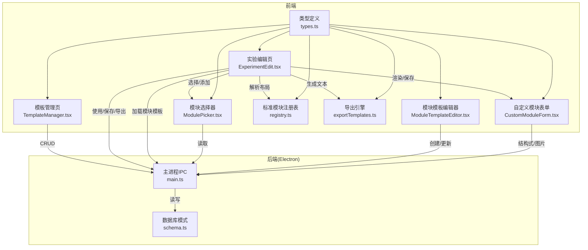
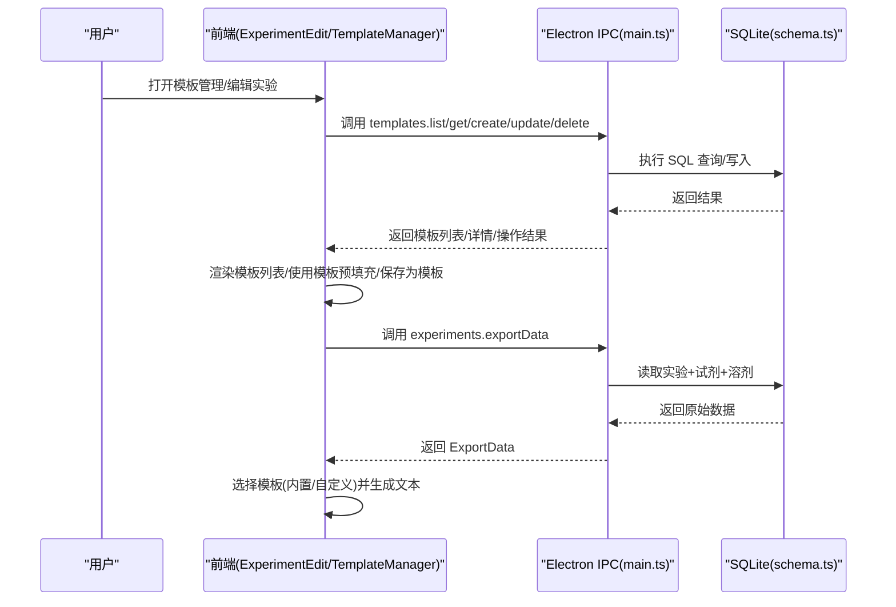
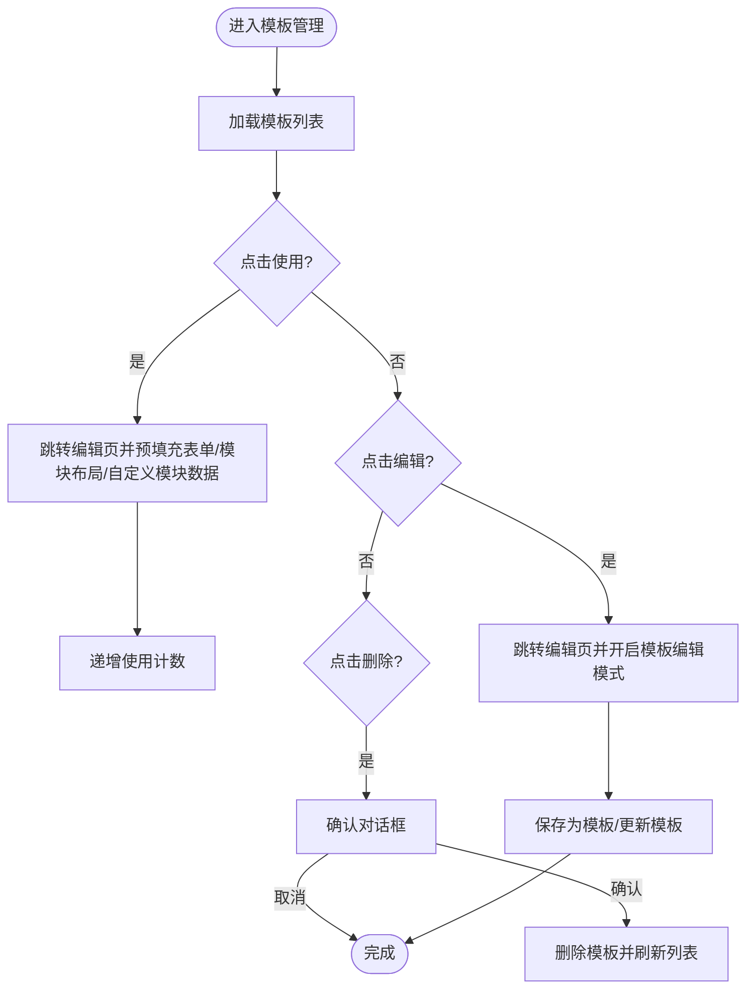
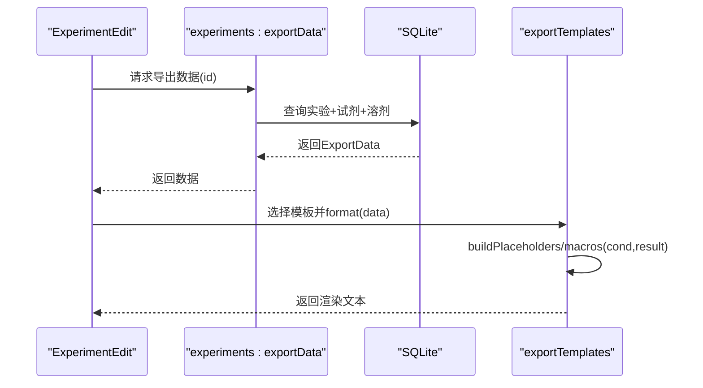
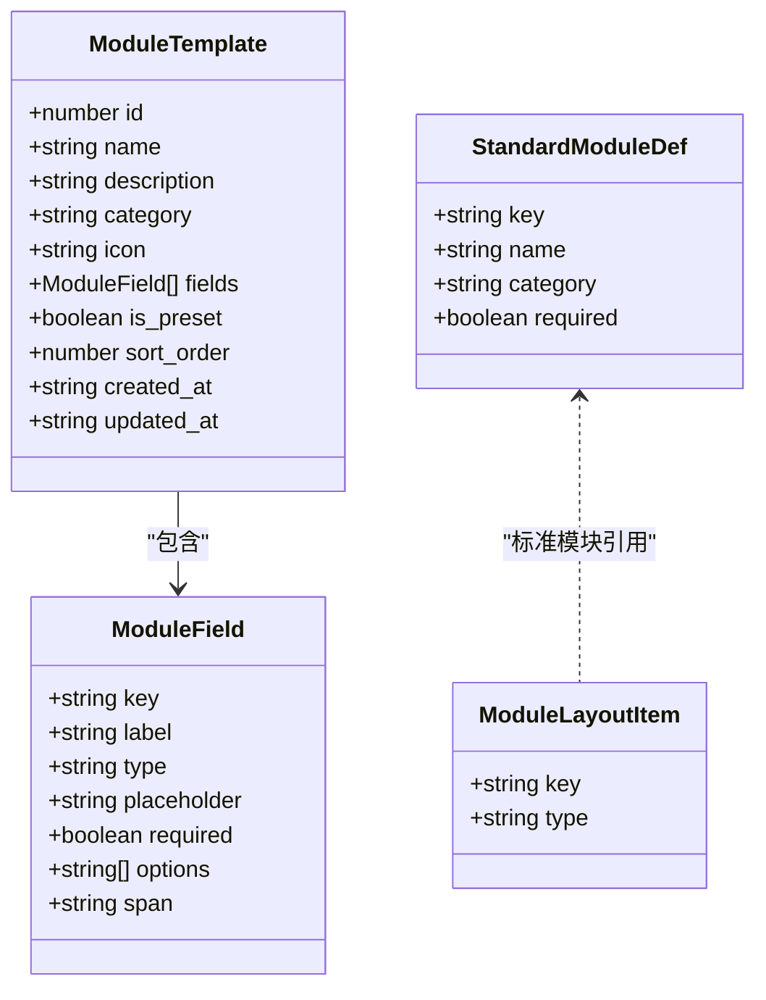
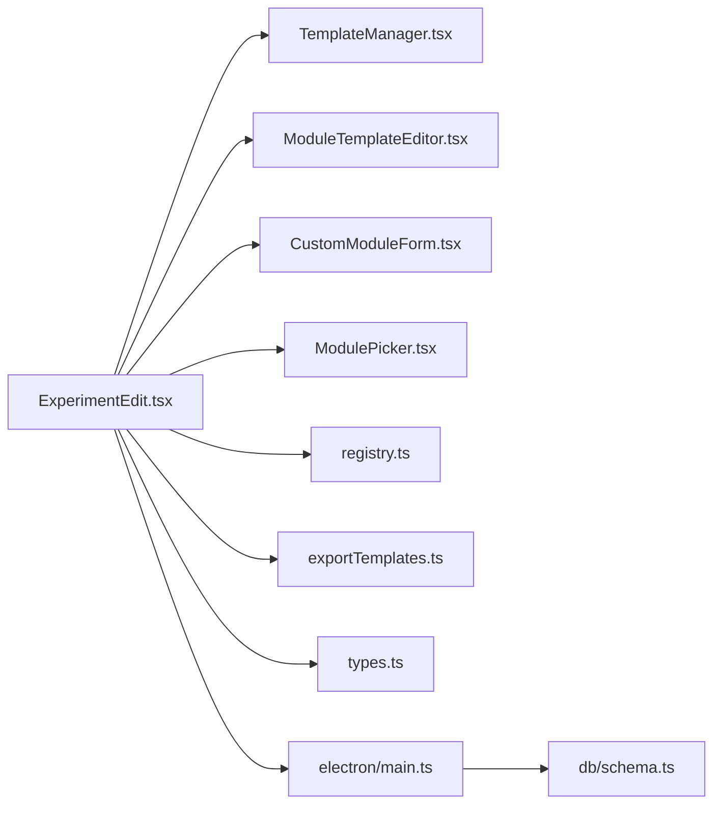

# 模板系统

<cite>
**本文引用的文件**   
- [src/pages/TemplateManager.tsx](file://src/pages/TemplateManager.tsx)
- [src/pages/ExperimentEdit.tsx](file://src/pages/ExperimentEdit.tsx)
- [src/modules/ModuleTemplateEditor.tsx](file://src/modules/ModuleTemplateEditor.tsx)
- [src/modules/CustomModuleForm.tsx](file://src/modules/CustomModuleForm.tsx)
- [src/modules/ModulePicker.tsx](file://src/modules/ModulePicker.tsx)
- [src/modules/registry.ts](file://src/modules/registry.ts)
- [src/utils/exportTemplates.ts](file://src/utils/exportTemplates.ts)
- [src/types.ts](file://src/types.ts)
- [src/db/schema.ts](file://src/db/schema.ts)
- [electron/main.ts](file://electron/main.ts)
</cite>

## 目录
1. [简介](#简介)
2. [项目结构](#项目结构)
3. [核心组件](#核心组件)
4. [架构总览](#架构总览)
5. [详细组件分析](#详细组件分析)
6. [依赖关系分析](#依赖关系分析)
7. [性能与最佳实践](#性能与最佳实践)
8. [故障排查指南](#故障排查指南)
9. [结论](#结论)
10. [附录：自定义模板开发指南](#附录自定义模板开发指南)

## 简介
本文件系统化阐述 LabNote 的“模板系统”，涵盖两类模板：
- 实验模板（预设模板）：用于快速复用实验条件、试剂、溶剂、标签及模块布局等，支持创建、编辑、删除、使用与导入导出。
- 模块模板（动态表单）：用于定义可复用的实验数据块（如表征数据、安全信息），支持字段类型扩展、可视化编辑器、运行时渲染与持久化。

同时说明模板数据结构、渲染引擎（导出文本生成）、动态表单机制、版本与兼容性策略，以及自定义模板开发与性能优化建议。

## 项目结构
模板系统涉及前端页面、模块编辑器、导出引擎、类型定义、数据库模式与 Electron IPC 层。关键文件如下：
- 页面与交互：模板管理页、实验编辑页（含模板保存/使用/导出）
- 模块系统：模块选择器、模块模板编辑器、自定义模块表单、标准模块注册表
- 导出引擎：内置期刊风格模板与占位符替换引擎
- 类型与模式：全局类型定义、Drizzle ORM 模式
- 后端能力：Electron 主进程 IPC 处理模板 CRUD、模块模板 CRUD、实验数据导出

图表来源
- [src/pages/TemplateManager.tsx:1-149](file://src/pages/TemplateManager.tsx#L1-L149)
- [src/pages/ExperimentEdit.tsx:1-800](file://src/pages/ExperimentEdit.tsx#L1-L800)
- [src/modules/ModuleTemplateEditor.tsx:1-257](file://src/modules/ModuleTemplateEditor.tsx#L1-L257)
- [src/modules/CustomModuleForm.tsx:1-242](file://src/modules/CustomModuleForm.tsx#L1-L242)
- [src/modules/ModulePicker.tsx:1-150](file://src/modules/ModulePicker.tsx#L1-L150)
- [src/modules/registry.ts:1-124](file://src/modules/registry.ts#L1-L124)
- [src/utils/exportTemplates.ts:1-367](file://src/utils/exportTemplates.ts#L1-L367)
- [src/types.ts:1-316](file://src/types.ts#L1-L316)
- [src/db/schema.ts:1-109](file://src/db/schema.ts#L1-L109)
- [electron/main.ts:1-1114](file://electron/main.ts#L1-L1114)

章节来源
- [src/pages/TemplateManager.tsx:1-149](file://src/pages/TemplateManager.tsx#L1-L149)
- [src/pages/ExperimentEdit.tsx:1-800](file://src/pages/ExperimentEdit.tsx#L1-L800)
- [src/modules/ModuleTemplateEditor.tsx:1-257](file://src/modules/ModuleTemplateEditor.tsx#L1-L257)
- [src/modules/CustomModuleForm.tsx:1-242](file://src/modules/CustomModuleForm.tsx#L1-L242)
- [src/modules/ModulePicker.tsx:1-150](file://src/modules/ModulePicker.tsx#L1-L150)
- [src/modules/registry.ts:1-124](file://src/modules/registry.ts#L1-L124)
- [src/utils/exportTemplates.ts:1-367](file://src/utils/exportTemplates.ts#L1-L367)
- [src/types.ts:1-316](file://src/types.ts#L1-L316)
- [src/db/schema.ts:1-109](file://src/db/schema.ts#L1-L109)
- [electron/main.ts:1-1114](file://electron/main.ts#L1-L1114)

## 核心组件
- 模板管理页：展示所有实验模板，支持预览、使用、编辑、删除；提供新建空白实验入口。
- 实验编辑页：承载模板的使用与保存逻辑，支持从模板预填充表单、将当前实验保存为模板、按模板导出论文段落。
- 模块模板编辑器：可视化定义模块字段（文本、数字、长文本、下拉、图片、化学结构式），自动生成 key、校验必填项。
- 自定义模块表单：根据模块模板动态渲染表单，支持图片粘贴/上传、结构式绘制回调。
- 模块选择器：在实验中隐藏/显示标准模块，或添加已创建的自定义模块模板。
- 标准模块注册表：维护内置模块定义、默认布局、布局解析与去重、隐藏/激活键集合计算。
- 导出引擎：内置 ACS/JACS/Angewandte 三种期刊风格模板，支持自定义占位符模板与宏（cond/result）。
- 类型与模式：统一前后端类型，定义实验模板、模块模板、布局项、导出数据模型等；ORM 模式定义持久化结构。
- Electron IPC：暴露模板、模块模板、实验数据的增删改查与导出接口，负责事务写入与一致性。

章节来源
- [src/pages/TemplateManager.tsx:1-149](file://src/pages/TemplateManager.tsx#L1-L149)
- [src/pages/ExperimentEdit.tsx:1-800](file://src/pages/ExperimentEdit.tsx#L1-L800)
- [src/modules/ModuleTemplateEditor.tsx:1-257](file://src/modules/ModuleTemplateEditor.tsx#L1-L257)
- [src/modules/CustomModuleForm.tsx:1-242](file://src/modules/CustomModuleForm.tsx#L1-L242)
- [src/modules/ModulePicker.tsx:1-150](file://src/modules/ModulePicker.tsx#L1-L150)
- [src/modules/registry.ts:1-124](file://src/modules/registry.ts#L1-L124)
- [src/utils/exportTemplates.ts:1-367](file://src/utils/exportTemplates.ts#L1-L367)
- [src/types.ts:1-316](file://src/types.ts#L1-L316)
- [src/db/schema.ts:1-109](file://src/db/schema.ts#L1-L109)
- [electron/main.ts:1-1114](file://electron/main.ts#L1-L1114)

## 架构总览
模板系统采用“前端 UI + 后端 IPC + SQLite”的分层架构。前端通过 window.labnote.* API 调用 IPC，IPC 再访问本地 SQLite 数据库。模板数据以 JSON 字符串形式存储于 templates 表，模块模板以 fields JSON 数组存储于 module_templates 表，实验中的模块布局与数据分别存储在 experiments.module_layout 与 experiment_module_data 表中。

图表来源
- [src/pages/TemplateManager.tsx:1-149](file://src/pages/TemplateManager.tsx#L1-L149)
- [src/pages/ExperimentEdit.tsx:1-800](file://src/pages/ExperimentEdit.tsx#L1-L800)
- [electron/main.ts:683-717](file://electron/main.ts#L683-L717)
- [electron/main.ts:779-795](file://electron/main.ts#L779-L795)
- [src/db/schema.ts:78-99](file://src/db/schema.ts#L78-L99)

## 详细组件分析

### 实验模板（预设模板）管理
- 功能要点
  - 列表展示：名称、描述、使用次数、更新时间、基于 template_data 的简要预览。
  - 使用模板：跳转到实验编辑页并携带 templateId，自动预填充 form/catalysts/solvents/tag_ids/module_layout/custom_modules_data。
  - 编辑模板：进入编辑模式时，标题与小标题映射到模板名与描述，保存后回写模板数据。
  - 删除模板：二次确认后删除，并刷新列表。
  - 保存为模板：将当前实验条件打包为 JSON 存入 templates 表，包含 form、catalysts、solvents、tag_ids、module_layout、custom_modules_data。
  - 使用计数：使用模板时递增 usage_count。

- 数据结构
  - Template：id、name、description、template_data(JSON)、usage_count、created_at、updated_at。
  - template_data 示例结构（由保存逻辑构建）：
    - form：容器、温度、时间、压力、pH、搅拌、气氛、步骤、后处理、产率单位、结构式等。
    - catalysts/solvents/tag_ids：关联数据。
    - module_layout：模块布局（JSON 数组）。
    - custom_modules_data：自定义模块数据映射。

- 关键流程
  - 使用模板预填充：从 URL 参数获取 templateId，读取模板数据，合并到表单状态，并递增使用计数。
  - 保存为模板：校验表单，构造 template_data JSON，调用 createTemplate。
  - 编辑模板：URL 带 edit_template 参数时，标题/小标题映射到模板元信息，保存时更新模板记录。

图表来源
- [src/pages/TemplateManager.tsx:16-42](file://src/pages/TemplateManager.tsx#L16-L42)
- [src/pages/ExperimentEdit.tsx:326-366](file://src/pages/ExperimentEdit.tsx#L326-L366)
- [src/pages/ExperimentEdit.tsx:457-499](file://src/pages/ExperimentEdit.tsx#L457-L499)
- [electron/main.ts:683-717](file://electron/main.ts#L683-L717)

章节来源
- [src/pages/TemplateManager.tsx:1-149](file://src/pages/TemplateManager.tsx#L1-L149)
- [src/pages/ExperimentEdit.tsx:326-366](file://src/pages/ExperimentEdit.tsx#L326-L366)
- [src/pages/ExperimentEdit.tsx:457-499](file://src/pages/ExperimentEdit.tsx#L457-L499)
- [src/types.ts:73-81](file://src/types.ts#L73-L81)
- [src/db/schema.ts:78-86](file://src/db/schema.ts#L78-L86)
- [electron/main.ts:683-717](file://electron/main.ts#L683-L717)

### 模板导出与渲染引擎
- 内置模板
  - ACS Style：完整叙述体，包含合成头、试剂加入顺序、气氛置换、溶剂、反应条件、后处理、产率与形态、备注。
  - JACS Style：简洁倒装句，强调条件与结果。
  - Angewandte Style：冒号分隔标题，紧凑表达。
- 自定义模板
  - 支持占位符 {{key}} 替换，内置宏 cond（条件段）与 result（结果段）。
  - 自定义模板保存在 localStorage，可通过 getAllTemplates 与内置模板合并呈现。
- 数据源
  - 通过 experiments:exportData 获取实验原始数据（标题、容器、温度、时间、气氛、搅拌、后处理、产率、形态、备注、反应物/催化剂/溶剂）。
- 渲染流程
  - 选择模板（内置/自定义）→ 构建占位符映射 → 正则替换 → 清理多余空格 → 输出文本。

图表来源
- [src/pages/ExperimentEdit.tsx:503-528](file://src/pages/ExperimentEdit.tsx#L503-L528)
- [electron/main.ts:779-795](file://electron/main.ts#L779-L795)
- [src/utils/exportTemplates.ts:56-120](file://src/utils/exportTemplates.ts#L56-L120)
- [src/utils/exportTemplates.ts:301-334](file://src/utils/exportTemplates.ts#L301-L334)
- [src/utils/exportTemplates.ts:346-366](file://src/utils/exportTemplates.ts#L346-L366)

章节来源
- [src/utils/exportTemplates.ts:1-367](file://src/utils/exportTemplates.ts#L1-L367)
- [src/pages/ExperimentEdit.tsx:503-528](file://src/pages/ExperimentEdit.tsx#L503-L528)
- [electron/main.ts:779-795](file://electron/main.ts#L779-L795)

### 模块模板与动态表单
- 模块模板定义
  - ModuleField：key、label、type(text/number/textarea/select/image/structure)、placeholder、required、options、span(full/half)。
  - ModuleTemplate：id、name、description、category、icon、fields(JSON)、is_preset、sort_order、时间戳。
- 可视化编辑器
  - 支持新增/删除字段、自动生成 key（从 label 推导）、清空非 select 类型的 options、基础校验（名称与至少一个字段）。
- 运行时渲染
  - CustomModuleForm 根据 fields 动态渲染输入控件，支持图片粘贴/上传、结构式绘制回调。
- 布局与可见性
  - registry.ts 维护 STANDARD_MODULES 与 DEFAULT_LAYOUT，提供 parseModuleLayout、getHiddenStandardKeys、getActiveCustomKeys、resolveCustomModuleTemplate。
- 生命周期
  - 在 ExperimentEdit 中加载模块模板、初始化布局、渲染各模块、保存自定义模块数据。

图表来源
- [src/types.ts:158-179](file://src/types.ts#L158-L179)
- [src/modules/registry.ts:7-62](file://src/modules/registry.ts#L7-L62)
- [src/modules/registry.ts:77-96](file://src/modules/registry.ts#L77-L96)
- [src/modules/ModuleTemplateEditor.tsx:13-20](file://src/modules/ModuleTemplateEditor.tsx#L13-L20)
- [src/modules/CustomModuleForm.tsx:1-242](file://src/modules/CustomModuleForm.tsx#L1-L242)

章节来源
- [src/types.ts:158-179](file://src/types.ts#L158-L179)
- [src/modules/ModuleTemplateEditor.tsx:1-257](file://src/modules/ModuleTemplateEditor.tsx#L1-L257)
- [src/modules/CustomModuleForm.tsx:1-242](file://src/modules/CustomModuleForm.tsx#L1-L242)
- [src/modules/ModulePicker.tsx:1-150](file://src/modules/ModulePicker.tsx#L1-L150)
- [src/modules/registry.ts:1-124](file://src/modules/registry.ts#L1-L124)
- [src/pages/ExperimentEdit.tsx:87-127](file://src/pages/ExperimentEdit.tsx#L87-L127)
- [src/pages/ExperimentEdit.tsx:552-587](file://src/pages/ExperimentEdit.tsx#L552-L587)
- [src/db/schema.ts:88-99](file://src/db/schema.ts#L88-L99)
- [electron/main.ts:1009-1045](file://electron/main.ts#L1009-L1045)

### 模板版本控制与兼容性策略
- 版本控制现状
  - 当前未实现显式的模板版本号字段；模板更新会覆盖旧数据，但保留 updated_at 时间戳。
- 兼容性处理
  - 模块布局解析具备容错：当 module_layout 为空或非法时回退到 DEFAULT_LAYOUT；对重复项进行去重；仅接受标准或自定义类型。
  - 自定义模块数据在保存时过滤空对象，避免冗余。
  - 导出引擎对中文标点进行规范化，并对首字母大写进行修正，提升跨语言一致性。
- 建议增强
  - 为模板引入 version 字段与迁移脚本，在升级时自动转换旧格式。
  - 为 module_layout 增加 schema 校验与最小可用集检查（例如必须包含 basic_info）。
  - 为导出模板引入语义化版本，并在渲染前做兼容降级。

章节来源
- [src/modules/registry.ts:77-96](file://src/modules/registry.ts#L77-L96)
- [src/pages/ExperimentEdit.tsx:346-355](file://src/pages/ExperimentEdit.tsx#L346-L355)
- [src/utils/exportTemplates.ts:87-97](file://src/utils/exportTemplates.ts#L87-L97)
- [src/db/schema.ts:78-86](file://src/db/schema.ts#L78-L86)

## 依赖关系分析
- 组件耦合
  - ExperimentEdit 高度聚合：承担模板使用/保存、模块布局管理、导出、自定义模块数据持久化。
  - TemplateManager 轻量：仅负责模板列表与删除。
  - ModuleTemplateEditor 与 CustomModuleForm 解耦：前者定义 schema，后者消费 schema 渲染。
  - exportTemplates 纯函数库：无副作用，易于测试与扩展。
- 外部依赖
  - Electron IPC：封装所有数据库访问，保证单实例与事务一致性。
  - Drizzle ORM 模式：定义表结构与约束，确保数据完整性。
- 潜在循环
  - 未发现直接循环依赖；模块注册表与编辑器/表单之间通过 types 解耦。

图表来源
- [src/pages/ExperimentEdit.tsx:1-800](file://src/pages/ExperimentEdit.tsx#L1-L800)
- [src/pages/TemplateManager.tsx:1-149](file://src/pages/TemplateManager.tsx#L1-L149)
- [src/modules/ModuleTemplateEditor.tsx:1-257](file://src/modules/ModuleTemplateEditor.tsx#L1-L257)
- [src/modules/CustomModuleForm.tsx:1-242](file://src/modules/CustomModuleForm.tsx#L1-L242)
- [src/modules/ModulePicker.tsx:1-150](file://src/modules/ModulePicker.tsx#L1-L150)
- [src/modules/registry.ts:1-124](file://src/modules/registry.ts#L1-L124)
- [src/utils/exportTemplates.ts:1-367](file://src/utils/exportTemplates.ts#L1-L367)
- [src/types.ts:1-316](file://src/types.ts#L1-L316)
- [electron/main.ts:1-1114](file://electron/main.ts#L1-L1114)
- [src/db/schema.ts:1-109](file://src/db/schema.ts#L1-L109)

章节来源
- [src/pages/ExperimentEdit.tsx:1-800](file://src/pages/ExperimentEdit.tsx#L1-L800)
- [src/pages/TemplateManager.tsx:1-149](file://src/pages/TemplateManager.tsx#L1-L149)
- [src/modules/ModuleTemplateEditor.tsx:1-257](file://src/modules/ModuleTemplateEditor.tsx#L1-L257)
- [src/modules/CustomModuleForm.tsx:1-242](file://src/modules/CustomModuleForm.tsx#L1-L242)
- [src/modules/ModulePicker.tsx:1-150](file://src/modules/ModulePicker.tsx#L1-L150)
- [src/modules/registry.ts:1-124](file://src/modules/registry.ts#L1-L124)
- [src/utils/exportTemplates.ts:1-367](file://src/utils/exportTemplates.ts#L1-L367)
- [src/types.ts:1-316](file://src/types.ts#L1-L316)
- [electron/main.ts:1-1114](file://electron/main.ts#L1-L1114)
- [src/db/schema.ts:1-109](file://src/db/schema.ts#L1-L109)

## 性能与最佳实践
- 渲染性能
  - 模块布局解析与去重在加载时一次性完成，避免重复计算。
  - 自定义模块数据仅在存在有效字段时保存，减少冗余。
- 导出性能
  - 导出文本生成使用正则批量替换，复杂度与模板长度线性相关；建议保持模板简洁，避免过多嵌套占位符。
- 用户体验
  - 模板预览基于 JSON 片段提取关键字段，避免全量解析大对象。
  - 模块编辑器在失焦时同步选项数组，降低频繁状态切换开销。
- 最佳实践
  - 模板命名规范：明确用途与适用范围，便于检索。
  - 模块模板设计：优先使用 text/number/textarea/select，谨慎使用 image/structure，以减少存储与渲染成本。
  - 布局精简：仅启用必要模块，减少表单体积与提交负载。
  - 导出模板：尽量复用内置宏 cond/result，减少重复逻辑。

[本节为通用指导，不直接分析具体文件]

## 故障排查指南
- 无法加载模板列表
  - 检查 preload 是否注入 window.labnote；确认 IPC handlers 已注册。
- 模板使用无效
  - 确认 URL 参数 templateId 正确；查看模板 template_data 是否为合法 JSON。
- 模块模板无法保存
  - 检查 fields JSON 是否符合 ModuleField 定义；确保至少有一个字段且 label 非空。
- 导出文本为空
  - 确认实验数据完整（标题、试剂、溶剂等）；检查所选模板是否存在。
- 模块布局异常
  - 若 module_layout 损坏，系统将回退到默认布局；请检查保存时的序列化过程。

章节来源
- [src/db/queries.ts:23-30](file://src/db/queries.ts#L23-L30)
- [src/pages/ExperimentEdit.tsx:326-366](file://src/pages/ExperimentEdit.tsx#L326-L366)
- [src/modules/ModuleTemplateEditor.tsx:107-129](file://src/modules/ModuleTemplateEditor.tsx#L107-L129)
- [src/pages/ExperimentEdit.tsx:503-528](file://src/pages/ExperimentEdit.tsx#L503-L528)
- [src/modules/registry.ts:77-96](file://src/modules/registry.ts#L77-L96)

## 结论
LabNote 的模板系统围绕“实验模板”和“模块模板”两大支柱构建，既满足快速复用实验条件的效率需求，又提供灵活的动态表单能力以适配多样化记录场景。通过清晰的类型定义、稳健的布局解析与可扩展的导出引擎，系统在易用性与可维护性之间取得良好平衡。建议在后续迭代中引入模板版本管理与迁移机制，进一步增强长期演进能力。

[本节为总结，不直接分析具体文件]

## 附录：自定义模板开发指南

### 创建新的实验模板
- 路径参考
  - 保存为模板逻辑：[src/pages/ExperimentEdit.tsx:457-499](file://src/pages/ExperimentEdit.tsx#L457-L499)
  - 模板数据结构：[src/types.ts:73-81](file://src/types.ts#L73-L81)
  - 后端接口：[electron/main.ts:692-713](file://electron/main.ts#L692-L713)
- 步骤
  - 在实验编辑页填写所需条件，点击“保存为模板”。
  - 系统会将 form、catalysts、solvents、tag_ids、module_layout、custom_modules_data 序列化为 JSON 并持久化。
  - 在模板管理页可使用该模板预填充新实验。

### 创建新的模块模板（动态表单）
- 路径参考
  - 编辑器：[src/modules/ModuleTemplateEditor.tsx:1-257](file://src/modules/ModuleTemplateEditor.tsx#L1-L257)
  - 运行时渲染：[src/modules/CustomModuleForm.tsx:1-242](file://src/modules/CustomModuleForm.tsx#L1-L242)
  - 选择器与注册表：[src/modules/ModulePicker.tsx:1-150](file://src/modules/ModulePicker.tsx#L1-L150), [src/modules/registry.ts:1-124](file://src/modules/registry.ts#L1-L124)
  - 后端接口：[electron/main.ts:1009-1045](file://electron/main.ts#L1009-L1045)
- 步骤
  - 在实验编辑页打开“添加模块”，选择“创建自定义模块模板”。
  - 定义字段（名称、类型、占位提示、是否必填、选项、宽度）。
  - 保存后，可在同一实验中添加该模块，并按字段录入数据。
  - 数据随实验一起保存，下次打开时恢复。

### 扩展字段类型
- 现有类型：text、number、textarea、select、image、structure。
- 扩展方式
  - 在 ModuleTemplateEditor 的 FIELD_TYPES 中新增类型映射。
  - 在 CustomModuleForm 的 switch 分支中实现对应渲染逻辑（如富文本、颜色选择器等）。
  - 在 types.ts 中更新 ModuleField.type 联合类型。
  - 如需持久化特殊结构，确保 JSON 序列化兼容。

### 自定义导出模板
- 路径参考
  - 内置模板与宏：[src/utils/exportTemplates.ts:122-275](file://src/utils/exportTemplates.ts#L122-L275)
  - 自定义模板存储与渲染：[src/utils/exportTemplates.ts:277-334](file://src/utils/exportTemplates.ts#L277-L334)
  - 模板入口与组合：[src/utils/exportTemplates.ts:346-366](file://src/utils/exportTemplates.ts#L346-L366)
- 步骤
  - 在实验编辑页打开导出对话框，选择“自定义模板”。
  - 编写模板文本，使用 {{title}}、{{reactants}}、{{solvents}}、{{cond}}、{{result}} 等占位符。
  - 保存后，可在导出时选择该模板生成文本。

章节来源
- [src/pages/ExperimentEdit.tsx:457-499](file://src/pages/ExperimentEdit.tsx#L457-L499)
- [src/types.ts:73-81](file://src/types.ts#L73-L81)
- [electron/main.ts:692-713](file://electron/main.ts#L692-L713)
- [src/modules/ModuleTemplateEditor.tsx:1-257](file://src/modules/ModuleTemplateEditor.tsx#L1-L257)
- [src/modules/CustomModuleForm.tsx:1-242](file://src/modules/CustomModuleForm.tsx#L1-L242)
- [src/modules/ModulePicker.tsx:1-150](file://src/modules/ModulePicker.tsx#L1-L150)
- [src/modules/registry.ts:1-124](file://src/modules/registry.ts#L1-L124)
- [electron/main.ts:1009-1045](file://electron/main.ts#L1009-L1045)
- [src/utils/exportTemplates.ts:122-366](file://src/utils/exportTemplates.ts#L122-L366)