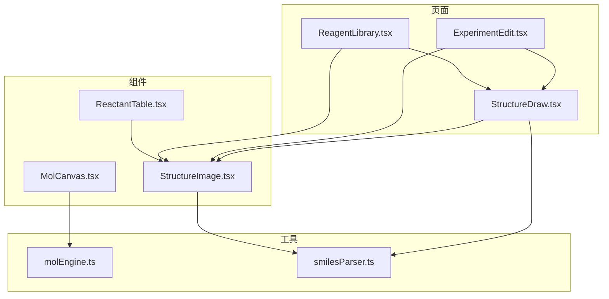
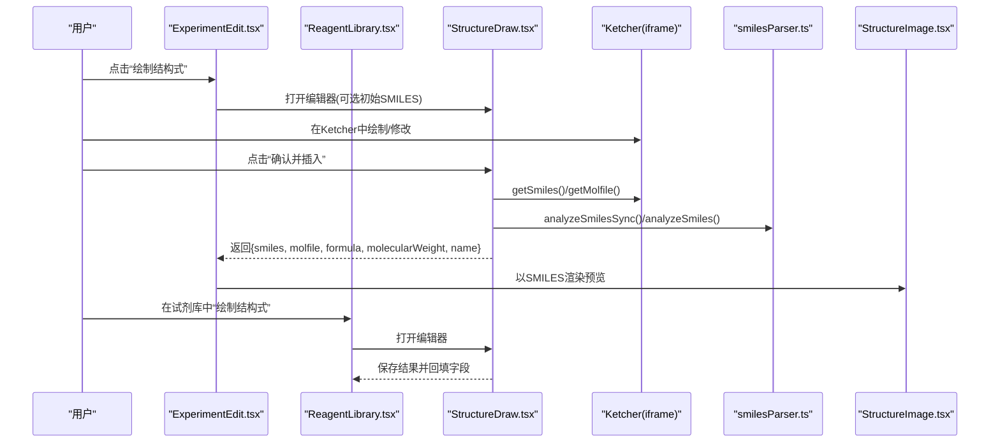
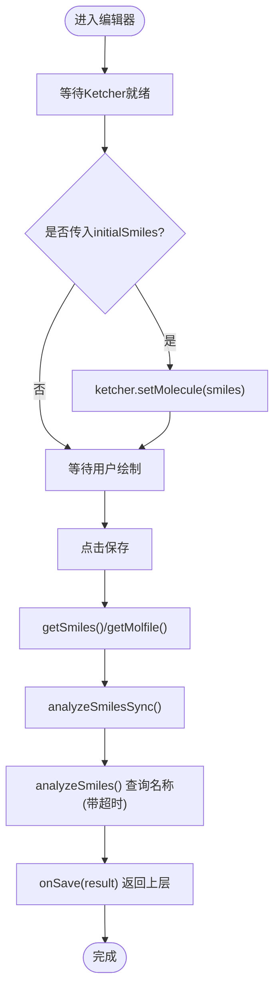
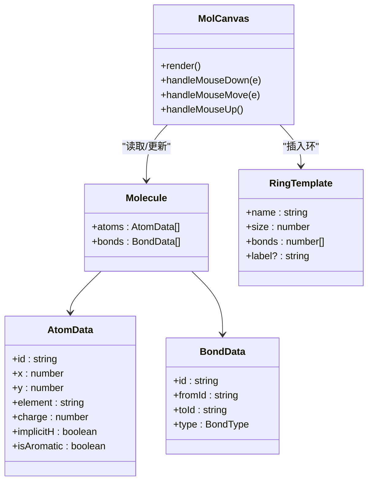
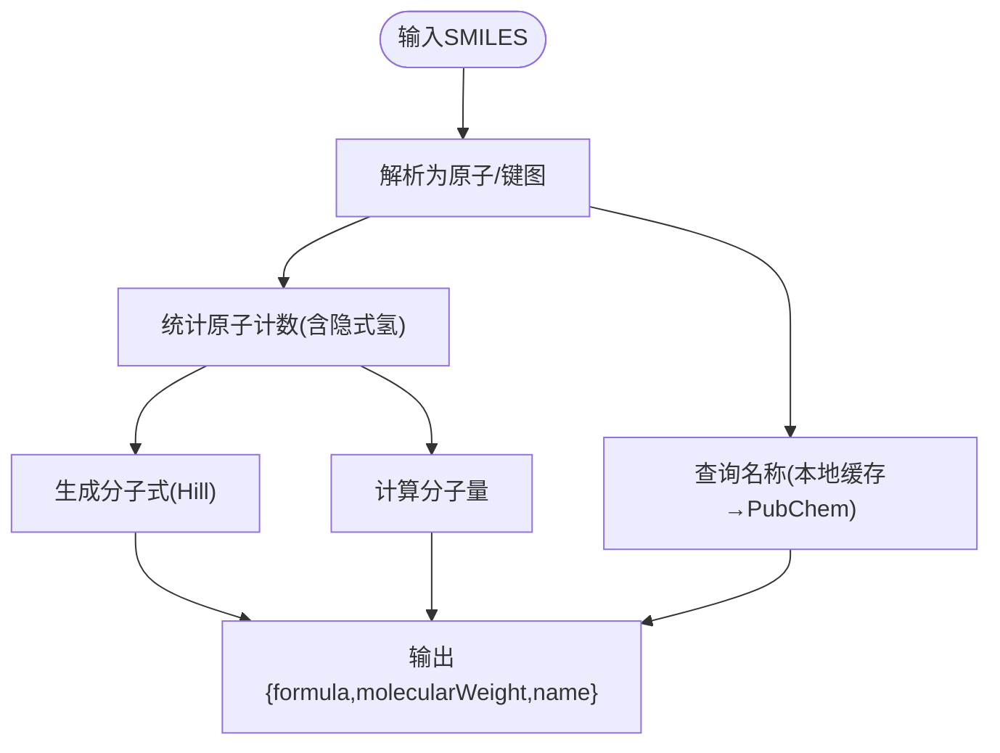
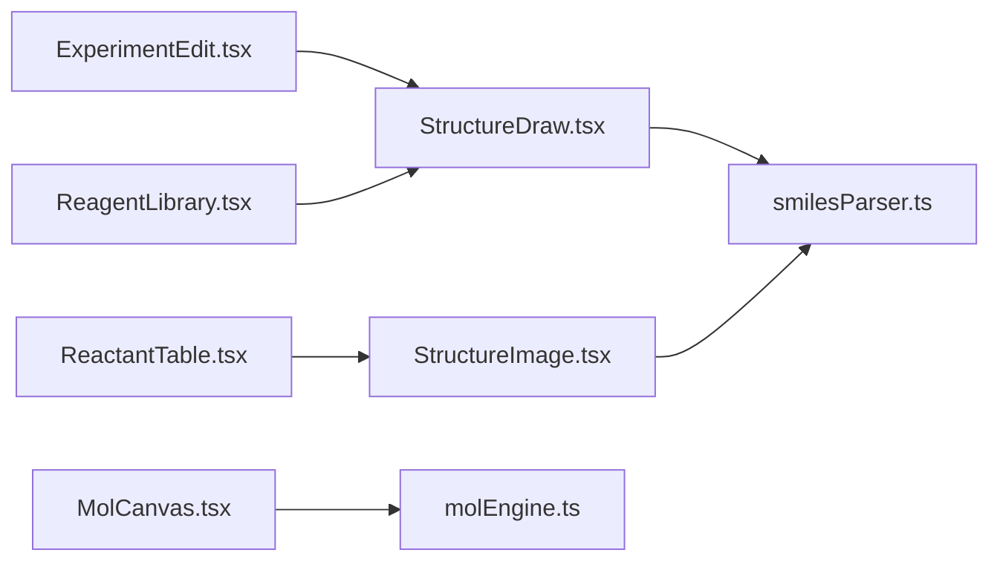
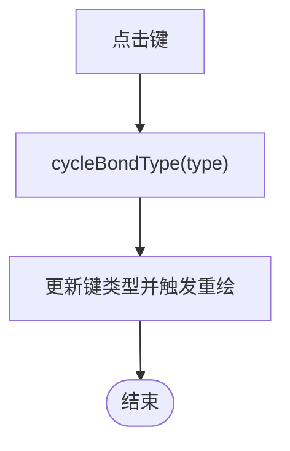

# 结构式编辑器

<cite>
**本文引用的文件**
- [src/components/MolCanvas.tsx](file://src/components/MolCanvas.tsx)
- [src/utils/molEngine.ts](file://src/utils/molEngine.ts)
- [src/pages/StructureDraw.tsx](file://src/pages/StructureDraw.tsx)
- [src/utils/smilesParser.ts](file://src/utils/smilesParser.ts)
- [src/components/StructureImage.tsx](file://src/components/StructureImage.tsx)
- [src/pages/ExperimentEdit.tsx](file://src/pages/ExperimentEdit.tsx)
- [src/pages/ReagentLibrary.tsx](file://src/pages/ReagentLibrary.tsx)
- [src/components/ReactantTable.tsx](file://src/components/ReactantTable.tsx)
</cite>

## 目录
1. [简介](#简介)
2. [项目结构](#项目结构)
3. [核心组件](#核心组件)
4. [架构总览](#架构总览)
5. [详细组件分析](#详细组件分析)
6. [依赖关系分析](#依赖关系分析)
7. [性能考虑](#性能考虑)
8. [故障排查指南](#故障排查指南)
9. [结论](#结论)
10. [附录](#附录)

## 简介
本文件面向 LabNote 的结构式编辑器功能，系统性说明以下方面：
- 化学结构式的绘制、编辑与保存流程
- SMILES 解析与转换机制（分子式、分子量、名称查询）
- 结构式到图像的渲染过程（smiles-drawer 与 Ketcher）
- 分子画布组件的实现（绘图工具、交互响应）
- 结构式数据的存储格式与版本兼容策略
- 在实验记录与试剂库中的集成使用方法
- 性能优化技巧与常见问题解决方案

## 项目结构
LabNote 的结构式相关代码主要分布在以下位置：
- 页面层：结构式编辑器入口与集成点
  - src/pages/StructureDraw.tsx：基于 iframe 嵌入 Ketcher 的完整编辑器页面
  - src/pages/ExperimentEdit.tsx：实验记录页中集成结构式编辑与预览
  - src/pages/ReagentLibrary.tsx：试剂库中录入/编辑结构式
- 组件层：通用结构与渲染
  - src/components/MolCanvas.tsx：自研 Canvas 分子画布（原子/键/环模板/交互）
  - src/components/StructureImage.tsx：SMILES → SVG 预览组件（悬停放大）
  - src/components/ReactantTable.tsx：反应物表格，支持结构式粘贴/上传/绘制
- 工具层：数据模型与算法
  - src/utils/molEngine.ts：分子数据结构、图操作、简易 SMILES 生成器
  - src/utils/smilesParser.ts：SMILES 解析、隐式氢计算、分子式/分子量、PubChem 命名查询



图表来源
- [src/pages/StructureDraw.tsx:1-289](file://src/pages/StructureDraw.tsx#L1-L289)
- [src/pages/ExperimentEdit.tsx:660-714](file://src/pages/ExperimentEdit.tsx#L660-L714)
- [src/pages/ReagentLibrary.tsx:248-357](file://src/pages/ReagentLibrary.tsx#L248-L357)
- [src/components/MolCanvas.tsx:1-404](file://src/components/MolCanvas.tsx#L1-L404)
- [src/components/StructureImage.tsx:1-173](file://src/components/StructureImage.tsx#L1-L173)
- [src/components/ReactantTable.tsx:1-383](file://src/components/ReactantTable.tsx#L1-L383)
- [src/utils/molEngine.ts:1-279](file://src/utils/molEngine.ts#L1-L279)
- [src/utils/smilesParser.ts:1-359](file://src/utils/smilesParser.ts#L1-L359)

章节来源
- [src/pages/StructureDraw.tsx:1-289](file://src/pages/StructureDraw.tsx#L1-L289)
- [src/pages/ExperimentEdit.tsx:660-714](file://src/pages/ExperimentEdit.tsx#L660-L714)
- [src/pages/ReagentLibrary.tsx:248-357](file://src/pages/ReagentLibrary.tsx#L248-L357)
- [src/components/MolCanvas.tsx:1-404](file://src/components/MolCanvas.tsx#L1-L404)
- [src/components/StructureImage.tsx:1-173](file://src/components/StructureImage.tsx#L1-L173)
- [src/components/ReactantTable.tsx:1-383](file://src/components/ReactantTable.tsx#L1-L383)
- [src/utils/molEngine.ts:1-279](file://src/utils/molEngine.ts#L1-L279)
- [src/utils/smilesParser.ts:1-359](file://src/utils/smilesParser.ts#L1-L359)

## 核心组件
- 结构式编辑器页面（Ketcher 集成）
  - 通过 iframe 加载 Ketcher，提供复制 SMILES/Molfile、刷新信息、清空画布、保存并返回等功能
  - 自动从 PubChem 查询化合物名，超时降级处理
- 结构式预览组件（SMILES → SVG）
  - 使用 smiles-drawer 动态加载并渲染为 SVG，支持悬停放大弹窗
  - 失败时回退显示 SMILES 文本
- 自研分子画布（Canvas）
  - 实现原子/键/环模板插入、拖拽、键型切换、橡皮擦等交互
  - 内置简化版 SMILES 生成器与序列化/反序列化
- SMILES 解析与属性计算
  - 解析 SMILES 构建原子/键图，计算隐式氢、分子式（Hill 系统）、分子量
  - 通过本地缓存或 PubChem PUG REST API 获取 IUPAC 名称

章节来源
- [src/pages/StructureDraw.tsx:1-289](file://src/pages/StructureDraw.tsx#L1-L289)
- [src/components/StructureImage.tsx:1-173](file://src/components/StructureImage.tsx#L1-L173)
- [src/components/MolCanvas.tsx:1-404](file://src/components/MolCanvas.tsx#L1-L404)
- [src/utils/molEngine.ts:1-279](file://src/utils/molEngine.ts#L1-L279)
- [src/utils/smilesParser.ts:1-359](file://src/utils/smilesParser.ts#L1-L359)

## 架构总览
整体架构分为三层：
- 页面层：负责用户交互与状态管理，调用组件与工具函数
- 组件层：封装可复用的 UI 能力（编辑器、预览、表格）
- 工具层：提供数据模型、解析与渲染逻辑



图表来源
- [src/pages/ExperimentEdit.tsx:660-714](file://src/pages/ExperimentEdit.tsx#L660-L714)
- [src/pages/ReagentLibrary.tsx:248-357](file://src/pages/ReagentLibrary.tsx#L248-L357)
- [src/pages/StructureDraw.tsx:76-169](file://src/pages/StructureDraw.tsx#L76-L169)
- [src/utils/smilesParser.ts:336-359](file://src/utils/smilesParser.ts#L336-L359)
- [src/components/StructureImage.tsx:37-81](file://src/components/StructureImage.tsx#L37-L81)

## 详细组件分析

### 结构式编辑器页面（Ketcher 集成）
- 初始化与等待 Ketcher 就绪
  - 通过轮询 contentWindow.ketcher 确保 API 可用
  - 支持传入 initialSmiles 设置初始结构
- 信息面板
  - 同步计算分子式与分子量
  - 异步查询 PubChem 名称，带超时保护
- 保存流程
  - 获取 SMILES 与 Molfile
  - 组合结果对象并通过回调 onSave 返回上层
- 清空画布
  - 为避免复杂结构 setMolecule('') 导致卡死，采用重载 iframe 的方式



图表来源
- [src/pages/StructureDraw.tsx:46-169](file://src/pages/StructureDraw.tsx#L46-L169)
- [src/utils/smilesParser.ts:336-359](file://src/utils/smilesParser.ts#L336-L359)

章节来源
- [src/pages/StructureDraw.tsx:1-289](file://src/pages/StructureDraw.tsx#L1-L289)

### 结构式预览组件（SMILES → SVG）
- 动态导入 smiles-drawer，避免首屏体积过大
- 渲染小图并在悬停时预渲染大图，弹出定位智能避让窗口边界
- 渲染失败时降级显示 SMILES 文本，提升鲁棒性

```mermaid
classDiagram
class StructureImage {
+props : smiles, width, height, hoverZoom, hoverWidth, hoverHeight
+renderSmiles(w,h) : Promise<string>
+handleMouseEnter(e)
+handleMouseLeave()
}
class SmilesDrawer {
+parse(smiles, onTree, onError)
+SvgDrawer({width,height})
+draw(tree, theme)
}
StructureImage --> SmilesDrawer : "动态加载并调用"
```

图表来源
- [src/components/StructureImage.tsx:37-81](file://src/components/StructureImage.tsx#L37-L81)

章节来源
- [src/components/StructureImage.tsx:1-173](file://src/components/StructureImage.tsx#L1-L173)

### 自研分子画布（Canvas）
- 数据结构
  - AtomData/BondData/Molecule 定义原子、键与分子
  - ToolType 定义选择、单/双/三键、楔形键、波浪键、原子、橡皮擦、环等工具
- 渲染
  - 背景网格、键（含楔形/波浪/双/三键）、原子（碳原子默认不标C，非碳元素白底标签）
- 交互
  - 选择工具：拖动原子、点击键切换键型
  - 原子工具：点击空白添加原子，点击已有原子替换元素
  - 键工具：两击原子连线，支持多种键型
  - 橡皮擦：删除原子/键
  - 环模板：在点击处插入环骨架
- 历史与不可变更新
  - 所有变更通过创建新 Molecule 对象触发重绘，便于撤销/重做扩展



图表来源
- [src/components/MolCanvas.tsx:1-404](file://src/components/MolCanvas.tsx#L1-L404)
- [src/utils/molEngine.ts:1-279](file://src/utils/molEngine.ts#L1-L279)

章节来源
- [src/components/MolCanvas.tsx:1-404](file://src/components/MolCanvas.tsx#L1-L404)
- [src/utils/molEngine.ts:1-279](file://src/utils/molEngine.ts#L1-L279)

### SMILES 解析与属性计算
- 解析器
  - 支持分支、环闭合、键符（- = # :）、方向键、方括号原子（同位素/电荷/显式氢）、有机子集小写芳香标记
- 隐式氢计算
  - 标准化合价表 + 键级总和 + 形式电荷调整
- 分子式与分子量
  - Hill 系统排序（C/H优先），按原子量求和
- 名称查询
  - 优先本地 SQLite 缓存；否则调用 PubChem PUG REST API；失败或超时无影响主流程



图表来源
- [src/utils/smilesParser.ts:54-213](file://src/utils/smilesParser.ts#L54-L213)
- [src/utils/smilesParser.ts:227-295](file://src/utils/smilesParser.ts#L227-L295)
- [src/utils/smilesParser.ts:297-334](file://src/utils/smilesParser.ts#L297-L334)

章节来源
- [src/utils/smilesParser.ts:1-359](file://src/utils/smilesParser.ts#L1-L359)

### 结构式数据的存储格式与版本兼容
- 自研引擎数据
  - JSON 序列化/反序列化 Molecule（atoms/bonds），反序列化对缺失字段容错
- 编辑器导出
  - SMILES 字符串与 Molfile 文本作为持久化格式
- 兼容性策略
  - 反序列化时对缺失字段提供默认值
  - 解析器对未知字符跳过，保证健壮性
  - 名称查询失败不影响主流程

章节来源
- [src/utils/molEngine.ts:267-279](file://src/utils/molEngine.ts#L267-L279)
- [src/utils/smilesParser.ts:54-213](file://src/utils/smilesParser.ts#L54-L213)

### 集成使用方法（实验记录与试剂库）
- 实验记录页
  - 基础信息模块右侧提供“绘制结构式”按钮，支持编辑已有结构式
  - 保存后自动回填标题（若未填写且名称可用）
- 试剂库
  - 新建/编辑表单支持“绘制结构式”，保存后回填分子式、分子量与名称
- 反应物表格
  - 支持粘贴图片、上传文件、直接绘制/编辑结构式，预览 SMILES 或图片

章节来源
- [src/pages/ExperimentEdit.tsx:660-714](file://src/pages/ExperimentEdit.tsx#L660-L714)
- [src/pages/ReagentLibrary.tsx:248-357](file://src/pages/ReagentLibrary.tsx#L248-L357)
- [src/components/ReactantTable.tsx:141-167](file://src/components/ReactantTable.tsx#L141-L167)

## 依赖关系分析
- 页面与组件耦合
  - ExperimentEdit/ReagentLibrary 均依赖 StructureDraw 进行编辑，依赖 StructureImage 进行预览
- 组件与工具解耦
  - StructureImage 仅依赖 smiles-drawer 与 SMILES 字符串
  - MolCanvas 依赖 molEngine 的数据模型与图操作
- 外部服务
  - PubChem PUG REST API 用于名称查询，具备超时与错误降级



图表来源
- [src/pages/ExperimentEdit.tsx:660-714](file://src/pages/ExperimentEdit.tsx#L660-L714)
- [src/pages/ReagentLibrary.tsx:248-357](file://src/pages/ReagentLibrary.tsx#L248-L357)
- [src/components/ReactantTable.tsx:1-383](file://src/components/ReactantTable.tsx#L1-L383)
- [src/components/StructureImage.tsx:1-173](file://src/components/StructureImage.tsx#L1-L173)
- [src/components/MolCanvas.tsx:1-404](file://src/components/MolCanvas.tsx#L1-L404)
- [src/utils/molEngine.ts:1-279](file://src/utils/molEngine.ts#L1-L279)
- [src/utils/smilesParser.ts:1-359](file://src/utils/smilesParser.ts#L1-L359)

## 性能考虑
- 懒加载与按需引入
  - StructureImage 动态 import smiles-drawer，减少首屏体积
  - StructureDraw 使用 lazy 加载，仅在需要时渲染
- 渲染优化
  - 预览组件预渲染大图，避免悬停时卡顿
  - 画布渲染使用 requestAnimationFrame 思想（当前通过 useEffect 触发），可在大数据量时进一步节流
- 网络请求
  - PubChem 名称查询带超时保护，避免阻塞保存流程
- 内存与稳定性
  - 清空画布采用重载 iframe，避免复杂结构 setMolecule('') 导致的内部状态异常

[本节为通用指导，无需具体文件引用]

## 故障排查指南
- Ketcher 初始化失败
  - 现象：编辑器长时间加载或无法获取 ketcher API
  - 排查：检查 iframe 是否成功加载，contentWindow 是否可访问；必要时重试或提示用户刷新
- 名称查询超时
  - 现象：名称一直显示“查询中...”
  - 排查：网络连通性与 PubChem 可用性；查看超时配置与降级逻辑
- SMILES 渲染失败
  - 现象：预览区域显示 SMILES 文本而非图形
  - 排查：检查 smiles-drawer 是否成功加载；确认 SMILES 语法正确
- 画布交互异常
  - 现象：拖拽/连线无响应
  - 排查：检查事件坐标换算、阈值设置与工具状态；确认 molecule 不可变更新是否正确触发重绘

章节来源
- [src/pages/StructureDraw.tsx:46-74](file://src/pages/StructureDraw.tsx#L46-L74)
- [src/components/StructureImage.tsx:37-81](file://src/components/StructureImage.tsx#L37-L81)
- [src/components/MolCanvas.tsx:226-363](file://src/components/MolCanvas.tsx#L226-L363)

## 结论
LabNote 的结构式编辑器通过“Ketcher 编辑器 + SMILES 解析 + SVG 预览 + 自研画布”的组合，提供了完整的绘制、编辑、预览与保存能力。其设计强调：
- 模块化与解耦：页面、组件、工具分层清晰
- 健壮性：多处降级与容错（名称查询、渲染失败、数据反序列化）
- 可扩展性：自研引擎提供简单但可用的 SMILES 生成与图操作，便于后续增强

[本节为总结，无需具体文件引用]

## 附录

### 关键流程图（算法视角）
- 键型循环切换（选择工具点击键）


图表来源
- [src/components/MolCanvas.tsx:268-281](file://src/components/MolCanvas.tsx#L268-L281)
- [src/utils/molEngine.ts:217-222](file://src/utils/molEngine.ts#L217-L222)

### 常用接口速览（路径参考）
- 结构式编辑器
  - 打开/关闭：ExperimentEdit/ReagentLibrary 控制 showStructureDraw 状态
  - 保存回调：onSave(result) 返回 {smiles, molfile, formula, molecularWeight, name}
- 预览组件
  - 渲染：StructureImage.smiles → SVG
  - 悬停放大：hoverZoom/hoverWidth/hoverHeight
- 自研引擎
  - 数据：createAtom/createBond/addAtom/addBond/removeAtom/updateAtom/moveAtom
  - 查找：findAtomAt/findBondAt
  - 环模板：insertRing(RING_TEMPLATES)
  - 序列化：serializeMolecule/deserializeMolecule
  - 简易 SMILES：toSmiles(Molecule)
- SMILES 解析
  - 同步：analyzeSmilesSync(smiles)
  - 异步：analyzeSmiles(smiles)
  - 名称：smilesToName(smiles)

章节来源
- [src/pages/StructureDraw.tsx:76-169](file://src/pages/StructureDraw.tsx#L76-L169)
- [src/components/StructureImage.tsx:21-158](file://src/components/StructureImage.tsx#L21-L158)
- [src/utils/molEngine.ts:99-279](file://src/utils/molEngine.ts#L99-L279)
- [src/utils/smilesParser.ts:287-359](file://src/utils/smilesParser.ts#L287-L359)