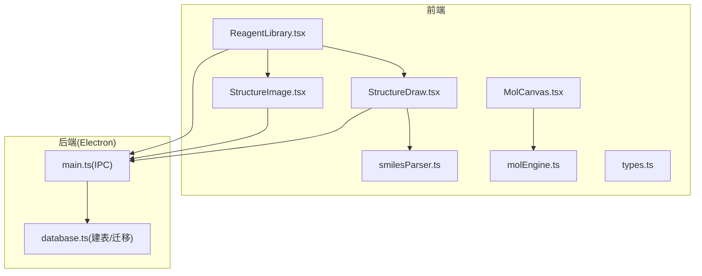
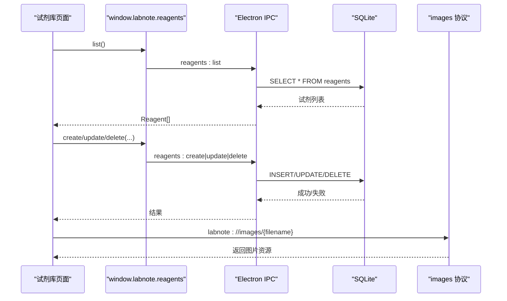
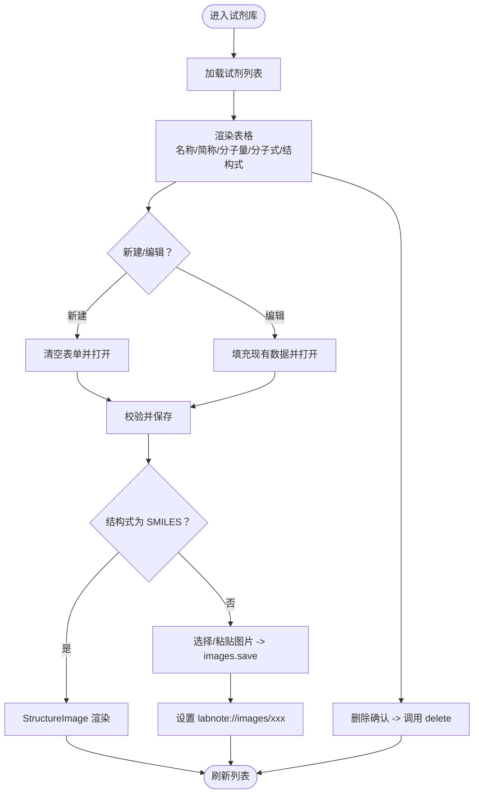
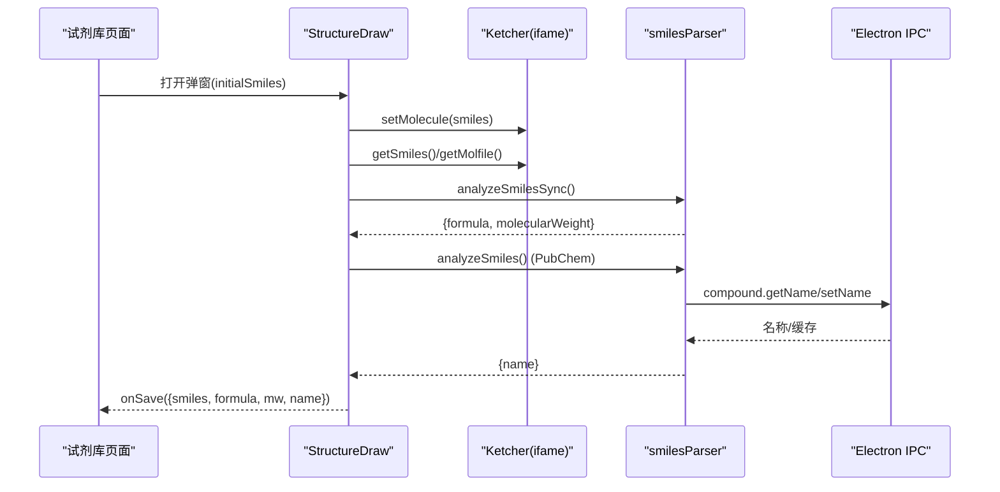
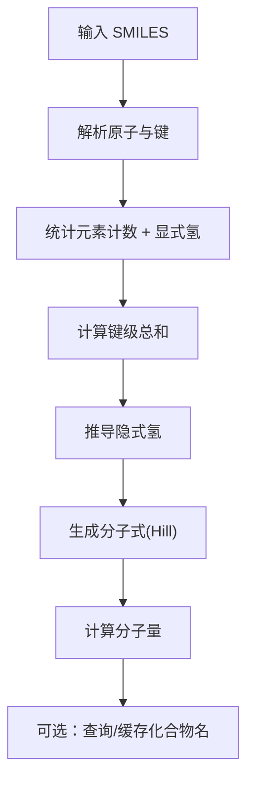
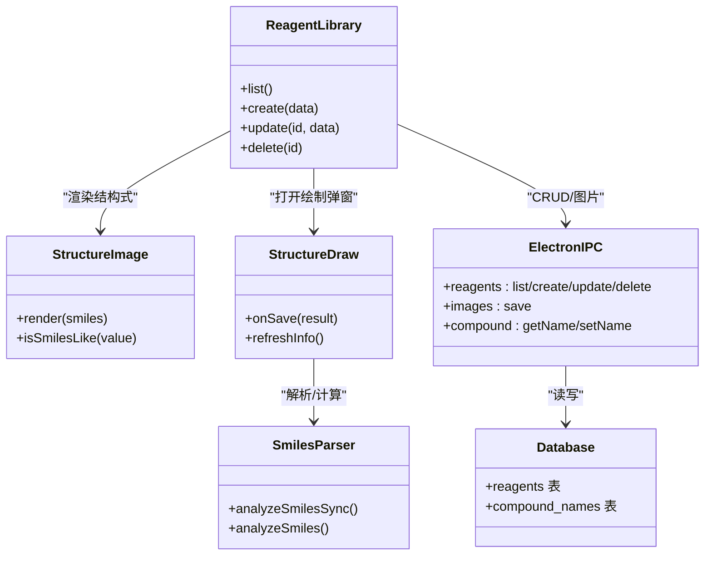

# 试剂库管理

<cite>
**本文引用的文件**   
- [ReagentLibrary.tsx](file://src/pages/ReagentLibrary.tsx)
- [StructureImage.tsx](file://src/components/StructureImage.tsx)
- [StructureDraw.tsx](file://src/pages/StructureDraw.tsx)
- [smilesParser.ts](file://src/utils/smilesParser.ts)
- [MolCanvas.tsx](file://src/components/MolCanvas.tsx)
- [molEngine.ts](file://src/utils/molEngine.ts)
- [types.ts](file://src/types.ts)
- [database.ts](file://electron/database.ts)
- [main.ts](file://electron/main.ts)
- [queries.ts](file://src/db/queries.ts)
- [ExperimentEdit.tsx](file://src/pages/ExperimentEdit.tsx)
</cite>

## 目录
1. [简介](#简介)
2. [项目结构](#项目结构)
3. [核心组件](#核心组件)
4. [架构总览](#架构总览)
5. [详细组件分析](#详细组件分析)
6. [依赖关系分析](#依赖关系分析)
7. [性能与可用性](#性能与可用性)
8. [故障排查指南](#故障排查指南)
9. [结论](#结论)
10. [附录：数据模型与维护实践](#附录数据模型与维护实践)

## 简介
本文件面向 LabNote 的“试剂库管理”功能，覆盖试剂信息的录入、编辑、删除与批量操作能力；解释试剂数据模型（名称、简称、分子量、分子式、结构式等）的设计与存储；说明试剂与化学结构式的集成（SMILES 解析、结构式渲染与图像显示）；阐述试剂在实验中的引用机制；并提供试剂库维护的最佳实践与导入导出方法建议。

## 项目结构
试剂库相关的前端页面、组件与工具函数分布如下：
- 页面层：试剂库主页面、结构式绘制弹窗
- 组件层：结构式预览组件、画布编辑器
- 工具层：SMILES 解析与计算、分子引擎
- 类型定义：全局窗口 API 与业务类型
- 后端层：Electron IPC 处理器与 SQLite 数据库初始化

图表来源
- [ReagentLibrary.tsx:1-357](file://src/pages/ReagentLibrary.tsx#L1-L357)
- [StructureImage.tsx:1-173](file://src/components/StructureImage.tsx#L1-L173)
- [StructureDraw.tsx:1-289](file://src/pages/StructureDraw.tsx#L1-L289)
- [smilesParser.ts:1-359](file://src/utils/smilesParser.ts#L1-L359)
- [MolCanvas.tsx:1-404](file://src/components/MolCanvas.tsx#L1-L404)
- [molEngine.ts:1-279](file://src/utils/molEngine.ts#L1-L279)
- [types.ts:233-316](file://src/types.ts#L233-L316)
- [main.ts:719-749](file://electron/main.ts#L719-L749)
- [database.ts:111-119](file://electron/database.ts#L111-L119)

章节来源
- [ReagentLibrary.tsx:1-357](file://src/pages/ReagentLibrary.tsx#L1-L357)
- [main.ts:719-749](file://electron/main.ts#L719-L749)
- [database.ts:111-119](file://electron/database.ts#L111-L119)

## 核心组件
- 试剂库页面：提供试剂列表展示、新建/编辑表单、图片/SMILES 结构式上传与预览、删除确认。
- 结构式预览组件：将 SMILES 渲染为 SVG，支持悬停放大与错误降级。
- 结构式绘制弹窗：嵌入 Ketcher 编辑器，支持复制 SMILES/Molfile、自动计算分子式与分子量、查询化合物名并回填。
- SMILES 解析器：从 SMILES 计算元素计数、分子式（Hill 系统）、分子量，并可异步查询 PubChem 获取 IUPAC 命名并缓存。
- 分子引擎与画布：提供本地化分子数据结构、键/原子操作、环模板插入与简化 SMILES 生成（用于自定义编辑器）。
- Electron IPC 与数据库：暴露 reagents CRUD 接口，持久化到 SQLite，包含唯一约束与默认值。

章节来源
- [ReagentLibrary.tsx:1-357](file://src/pages/ReagentLibrary.tsx#L1-L357)
- [StructureImage.tsx:1-173](file://src/components/StructureImage.tsx#L1-L173)
- [StructureDraw.tsx:1-289](file://src/pages/StructureDraw.tsx#L1-L289)
- [smilesParser.ts:1-359](file://src/utils/smilesParser.ts#L1-L359)
- [MolCanvas.tsx:1-404](file://src/components/MolCanvas.tsx#L1-L404)
- [molEngine.ts:1-279](file://src/utils/molEngine.ts#L1-L279)
- [types.ts:233-316](file://src/types.ts#L233-L316)
- [main.ts:719-749](file://electron/main.ts#L719-L749)
- [database.ts:111-119](file://electron/database.ts#L111-L119)

## 架构总览
试剂库采用前后端分离的桌面应用架构：React 前端通过 window.labnote.* 调用 Electron IPC，IPC 再访问 SQLite 数据库完成持久化。结构式渲染由 smiles-drawer 或 Ketcher 完成，SMILES 解析与基础计算在前端完成，命名信息可异步查询并缓存。

图表来源
- [ReagentLibrary.tsx:27-72](file://src/pages/ReagentLibrary.tsx#L27-L72)
- [main.ts:719-749](file://electron/main.ts#L719-L749)
- [database.ts:111-119](file://electron/database.ts#L111-L119)

## 详细组件分析

### 试剂库页面（CRUD 与结构式集成）
- 列表加载：调用 api.reagents.list 获取全部试剂并按名称排序。
- 新建/编辑：表单字段包括名称（必填）、简称、分子量、分子式、结构式（SMILES 或图片）。保存时根据是否处于编辑模式调用 update 或 create。
- 结构式处理：
  - 若为 SMILES，使用 StructureImage 渲染 SVG；
  - 若为图片，通过 images.save 持久化后以 labnote://images/... 显示。
- 删除：二次确认后调用 delete。
- 结构式绘制：点击“绘制结构式”打开 StructureDraw 弹窗，保存后将 SMILES、分子式、分子量、名称回填至表单。

图表来源
- [ReagentLibrary.tsx:27-122](file://src/pages/ReagentLibrary.tsx#L27-L122)
- [StructureImage.tsx:1-173](file://src/components/StructureImage.tsx#L1-L173)
- [main.ts:407-419](file://electron/main.ts#L407-L419)

章节来源
- [ReagentLibrary.tsx:1-357](file://src/pages/ReagentLibrary.tsx#L1-L357)
- [StructureImage.tsx:1-173](file://src/components/StructureImage.tsx#L1-L173)
- [main.ts:407-419](file://electron/main.ts#L407-L419)

### 结构式预览组件（SMILES → SVG）
- 动态加载 smiles-drawer，将 SMILES 解析为树并绘制 SVG。
- 支持 hoverZoom 放大预览，渲染失败时回退为文本显示 SMILES。
- isSmilesLike 判断是否为 SMILES 字符串，避免误判图片路径。

章节来源
- [StructureImage.tsx:1-173](file://src/components/StructureImage.tsx#L1-L173)

### 结构式绘制弹窗（Ketcher 集成与信息回填）
- 通过 iframe 加载 Ketcher，等待其初始化后读取/写入 SMILES。
- 支持复制 SMILES/Molfile、刷新信息面板。
- 保存时：
  - 同步计算分子式与分子量；
  - 异步查询 PubChem 获取名称（带超时保护），并将结果回填给父表单。
- 清空画布采用重载 iframe 的方式避免复杂结构导致的内部状态异常。

图表来源
- [StructureDraw.tsx:1-289](file://src/pages/StructureDraw.tsx#L1-L289)
- [smilesParser.ts:298-349](file://src/utils/smilesParser.ts#L298-L349)
- [types.ts:293-296](file://src/types.ts#L293-L296)

章节来源
- [StructureDraw.tsx:1-289](file://src/pages/StructureDraw.tsx#L1-L289)
- [smilesParser.ts:1-359](file://src/utils/smilesParser.ts#L1-L359)
- [types.ts:233-316](file://src/types.ts#L233-L316)

### SMILES 解析与计算（分子式、分子量、命名）
- 解析 SMILES 图（含键级、芳香性、环闭合、方括号原子、电荷、同位素等），统计元素计数。
- 基于标准化合价与键级总和计算隐式氢，生成 Hill 系统分子式。
- 按原子量累加得到分子量。
- 通过 PubChem PUG REST 查询名称，优先读取本地缓存（compound_names 表），失败则网络查询并写回缓存。

图表来源
- [smilesParser.ts:54-213](file://src/utils/smilesParser.ts#L54-L213)
- [smilesParser.ts:228-295](file://src/utils/smilesParser.ts#L228-L295)
- [smilesParser.ts:298-349](file://src/utils/smilesParser.ts#L298-L349)
- [database.ts:148-154](file://electron/database.ts#L148-L154)

章节来源
- [smilesParser.ts:1-359](file://src/utils/smilesParser.ts#L1-L359)
- [database.ts:148-154](file://electron/database.ts#L148-L154)

### 本地分子引擎与画布（可选扩展）
- 提供 Molecule 数据结构（原子/键）、常用工具（增删改查、移动、环模板插入、键型切换）。
- Canvas 渲染支持单/双/三键、楔形键、波浪键、碳点省略与隐式氢标记。
- 内置简化版 toSmiles 生成器（便于后续扩展本地导出）。

章节来源
- [molEngine.ts:1-279](file://src/utils/molEngine.ts#L1-L279)
- [MolCanvas.tsx:1-404](file://src/components/MolCanvas.tsx#L1-L404)

### 试剂在实验中的引用机制
- 实验编辑页提供“从试剂库选择”入口，弹出试剂列表供用户选择。
- 选中后，将试剂的基础信息（名称、简称、分子量、分子式）带入实验记录中，便于后续计算与展示。
- 该流程通过 React 状态与表单联动实现，不直接修改试剂库数据。

章节来源
- [ExperimentEdit.tsx:777-808](file://src/pages/ExperimentEdit.tsx#L777-L808)
- [ExperimentEdit.tsx:1197-1221](file://src/pages/ExperimentEdit.tsx#L1197-L1221)

## 依赖关系分析
- 前端模块耦合：
  - ReagentLibrary 依赖 StructureImage、StructureDraw、types 与 window.labnote API。
  - StructureDraw 依赖 smilesParser 与 IPC 的 compound 缓存接口。
  - StructureImage 依赖外部库 smiles-drawer。
- 后端依赖：
  - main.ts 注册 reagents 的 IPC 处理器，映射到 database.ts 创建的 reagents 表。
  - 图片通过自定义协议 labnote://images/ 指向 dataPath/images 下的文件。

图表来源
- [ReagentLibrary.tsx:1-357](file://src/pages/ReagentLibrary.tsx#L1-L357)
- [StructureImage.tsx:1-173](file://src/components/StructureImage.tsx#L1-L173)
- [StructureDraw.tsx:1-289](file://src/pages/StructureDraw.tsx#L1-L289)
- [smilesParser.ts:1-359](file://src/utils/smilesParser.ts#L1-L359)
- [main.ts:719-749](file://electron/main.ts#L719-L749)
- [database.ts:111-119](file://electron/database.ts#L111-L119)

章节来源
- [types.ts:233-316](file://src/types.ts#L233-L316)
- [main.ts:719-749](file://electron/main.ts#L719-L749)
- [database.ts:111-119](file://electron/database.ts#L111-L119)

## 性能与可用性
- 结构式渲染：
  - 小尺寸预览与悬停大图分别渲染，避免重复计算；
  - 解析失败时回退为文本，提升鲁棒性。
- 命名查询：
  - 先读本地缓存，再请求 PubChem，减少网络开销；
  - 保存结果到 compound_names 表，加速后续查询。
- 图片存储：
  - 使用 base64 转二进制落盘，统一通过 labnote:// 协议访问，避免跨域问题。
- 交互体验：
  - 结构式绘制弹窗对 Ketcher 初始化进行轮询与超时保护；
  - 清空画布采用重载 iframe 策略，避免复杂结构导致的状态异常。

[本节为通用指导，无需源码引用]

## 故障排查指南
- 无法加载 Ketcher：
  - 检查 iframe 是否成功加载，确认 waitForKetcher 超时逻辑；
  - 尝试刷新页面或重新打开弹窗。
- 结构式渲染失败：
  - 检查 SMILES 合法性；
  - 查看 StructureImage 的错误降级提示。
- 图片无法显示：
  - 确认 images.save 是否成功返回文件名；
  - 检查 labnote://images/ 协议是否正确拼接。
- 命名查询为空：
  - 检查网络连接与 PubChem 服务；
  - 查看缓存表是否存在对应条目。

章节来源
- [StructureDraw.tsx:46-74](file://src/pages/StructureDraw.tsx#L46-L74)
- [StructureImage.tsx:37-81](file://src/components/StructureImage.tsx#L37-L81)
- [main.ts:407-419](file://electron/main.ts#L407-L419)
- [smilesParser.ts:298-349](file://src/utils/smilesParser.ts#L298-L349)

## 结论
试剂库管理实现了完整的试剂信息生命周期管理与结构式可视化集成，具备高可用性与良好的用户体验。通过 SMILES 解析与 PubChem 命名缓存，进一步提升了数据质量与检索效率。建议在后续版本中增强搜索与筛选能力，并补充批量操作与导入导出功能，以满足更大规模试剂库的管理需求。

[本节为总结，无需源码引用]

## 附录：数据模型与维护实践

### 数据模型（试剂）
- 字段说明：
  - id：自增主键
  - name：名称（唯一）
  - abbreviation：简称
  - molecular_weight：分子量（数值）
  - molecular_formula：分子式（文本）
  - structure_image：结构式（SMILES 或图片标识）
  - created_at：创建时间
- 约束与索引：
  - name 唯一约束，防止重复录入；
  - 默认值与空值处理保证数据一致性。

章节来源
- [database.ts:111-119](file://electron/database.ts#L111-L119)
- [types.ts:43-51](file://src/types.ts#L43-L51)

### 试剂与实验的关联
- 实验编辑界面提供“从试剂库选择”，将试剂基础信息带入实验记录，便于后续计算与报告生成。
- 该过程仅读取试剂库数据，不修改试剂库本身。

章节来源
- [ExperimentEdit.tsx:777-808](file://src/pages/ExperimentEdit.tsx#L777-L808)
- [ExperimentEdit.tsx:1197-1221](file://src/pages/ExperimentEdit.tsx#L1197-L1221)

### 搜索与筛选（现状与建议）
- 现状：
  - 试剂库页面未内置搜索与筛选控件；
  - 已有 FilterBar 组件用于实验列表的多维筛选（关键词、课题、标签、日期范围），可作为参考。
- 建议：
  - 在试剂库页面增加搜索框（名称/简称/分子式模糊匹配）；
  - 增加按是否有结构式、是否填写分子量等条件筛选；
  - 复用 FilterBar 的设计模式，保持交互一致。

章节来源
- [FilterBar.tsx:1-85](file://src/components/FilterBar.tsx#L1-L85)

### 批量操作（现状与建议）
- 现状：
  - 当前仅提供单条删除；
  - 无批量新增/更新/删除能力。
- 建议：
  - 增加多选复选框与批量删除按钮；
  - 支持批量导入 CSV/Excel（名称、简称、分子量、分子式、结构式）；
  - 导入前进行数据校验与冲突检测（如名称重复）。

[本节为通用指导，无需源码引用]

### 导入与导出（现状与建议）
- 现状：
  - 试剂库未提供专用导入/导出接口；
  - 实验数据有导出能力（experiments:export/exportData），可用于生成实验段落或原始数据。
- 建议：
  - 导出：提供试剂库导出为 CSV/JSON，包含所有字段；
  - 导入：支持 CSV/JSON 批量导入，自动识别 SMILES 并计算分子式/分子量；
  - 冲突处理：重复名称可选择跳过、覆盖或合并。

章节来源
- [main.ts:761-795](file://electron/main.ts#L761-L795)

### 最佳实践
- 数据录入：
  - 优先使用结构式绘制弹窗，确保分子式与分子量准确；
  - 尽量填写简称，便于实验记录快速引用。
- 结构式规范：
  - 使用标准 SMILES；
  - 图片格式建议使用 PNG/JPEG/WebP，大小适中。
- 命名缓存：
  - 利用 PubChem 命名缓存，减少重复查询；
  - 定期清理无效缓存（可选）。
- 备份与迁移：
  - 通过菜单“选择数据库位置”迁移数据目录；
  - 定期备份 labnote.db 与 images 目录。

章节来源
- [main.ts:306-336](file://electron/main.ts#L306-L336)
- [smilesParser.ts:298-349](file://src/utils/smilesParser.ts#L298-L349)