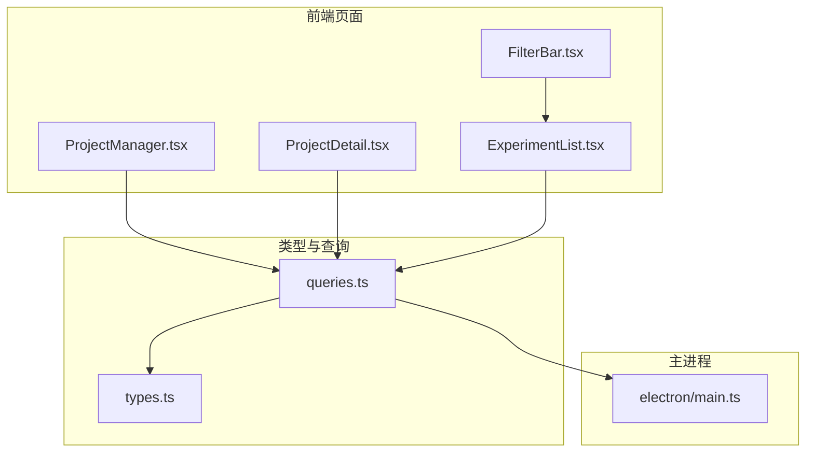
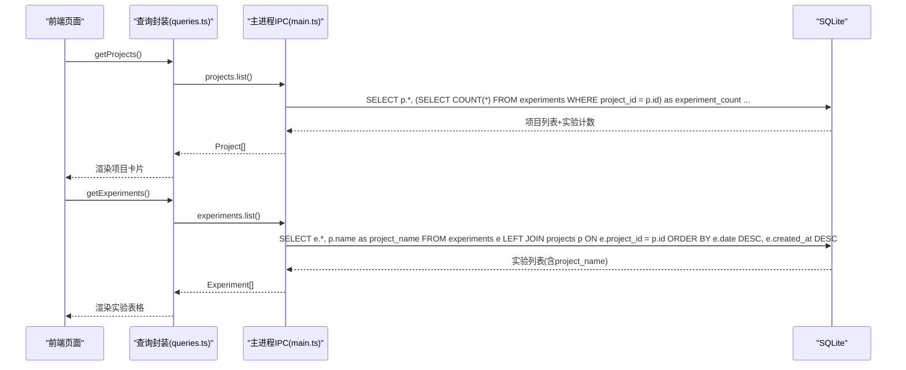
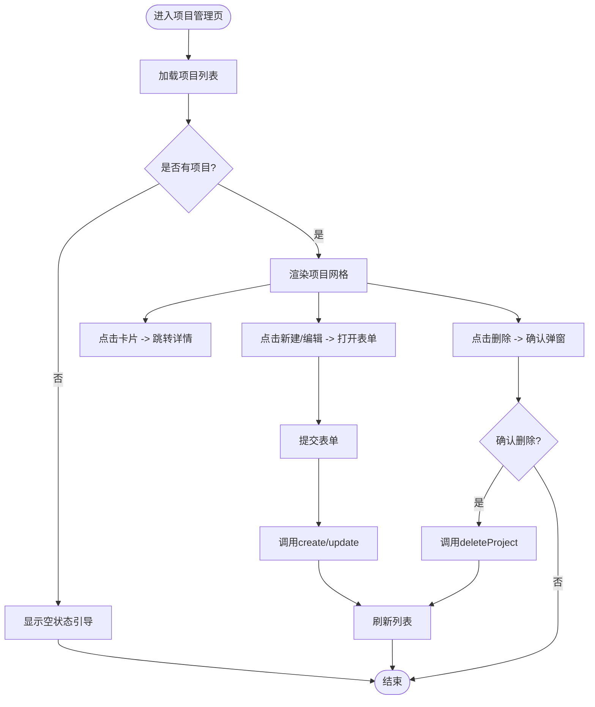
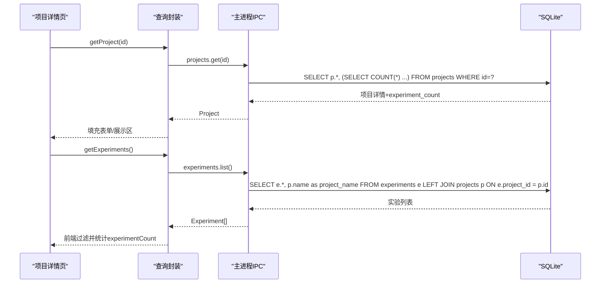
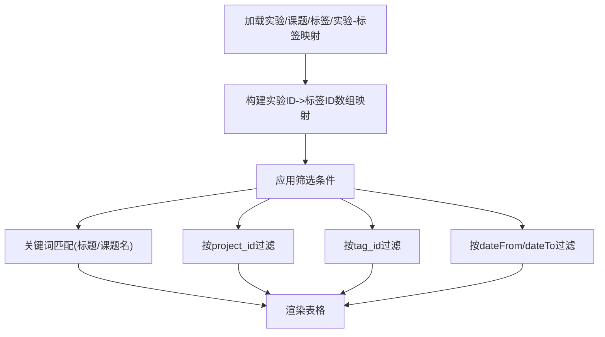
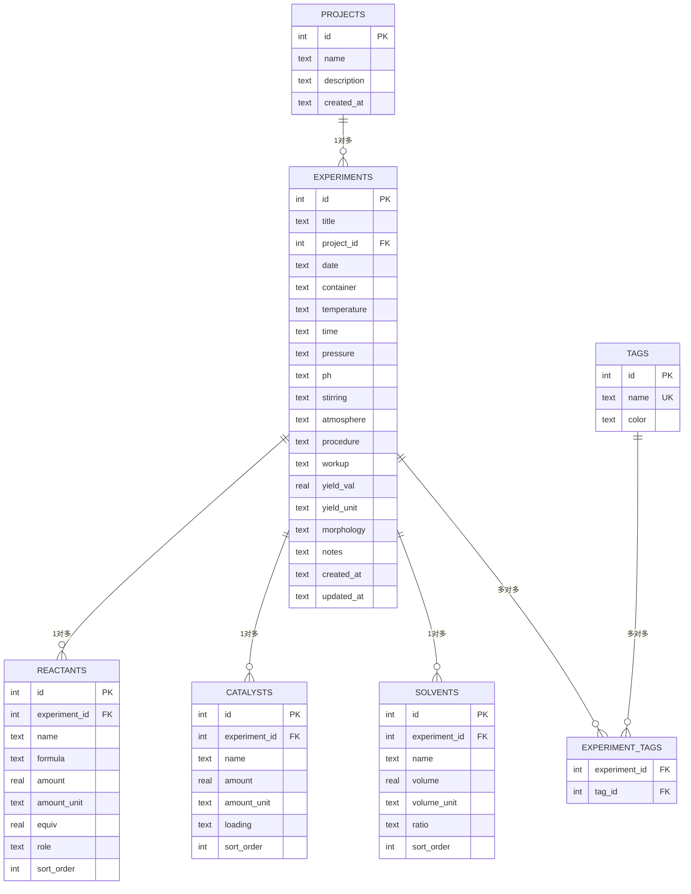
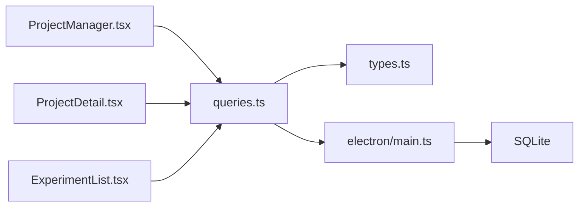

# 项目管理

<cite>
**本文引用的文件**   
- [src/pages/ProjectManager.tsx](file://src/pages/ProjectManager.tsx)
- [src/pages/ProjectDetail.tsx](file://src/pages/ProjectDetail.tsx)
- [src/pages/ExperimentList.tsx](file://src/pages/ExperimentList.tsx)
- [src/components/FilterBar.tsx](file://src/components/FilterBar.tsx)
- [src/db/schema.ts](file://src/db/schema.ts)
- [src/db/queries.ts](file://src/db/queries.ts)
- [src/types.ts](file://src/types.ts)
- [electron/main.ts](file://electron/main.ts)
</cite>

## 目录
1. [简介](#简介)
2. [项目结构](#项目结构)
3. [核心组件](#核心组件)
4. [架构总览](#架构总览)
5. [详细组件分析](#详细组件分析)
6. [依赖关系分析](#依赖关系分析)
7. [性能与扩展性](#性能与扩展性)
8. [故障排查指南](#故障排查指南)
9. [结论](#结论)
10. [附录：数据模型与约束](#附录数据模型与约束)

## 简介
本章节面向LabNote的“项目管理”功能，覆盖以下目标：
- 项目的创建、编辑、删除操作
- 项目与实验的关联关系管理
- 项目详情页面的实验列表展示、进度跟踪与统计信息计算
- 项目数据模型设计、表结构与外键约束
- 项目筛选与搜索的实现细节（以实验列表为入口）
- 项目间的数据隔离机制
- 最佳实践与常见使用场景示例

## 项目结构
围绕项目管理的关键代码分布在页面层、类型定义、数据库查询封装以及Electron主进程IPC实现中。整体组织方式如下：
- 页面层：项目管理列表与详情、实验列表与筛选
- 类型层：统一的前端数据结构定义
- 查询层：对window.labnote.* API的轻量封装
- 主进程层：SQLite数据库访问、事务处理、外键校验与聚合统计

图表来源
- [src/pages/ProjectManager.tsx:1-202](file://src/pages/ProjectManager.tsx#L1-L202)
- [src/pages/ProjectDetail.tsx:1-275](file://src/pages/ProjectDetail.tsx#L1-L275)
- [src/pages/ExperimentList.tsx:1-252](file://src/pages/ExperimentList.tsx#L1-L252)
- [src/components/FilterBar.tsx:1-85](file://src/components/FilterBar.tsx#L1-L85)
- [src/types.ts:1-316](file://src/types.ts#L1-L316)
- [src/db/queries.ts:1-193](file://src/db/queries.ts#L1-L193)
- [electron/main.ts:421-458](file://electron/main.ts#L421-L458)

章节来源
- [src/pages/ProjectManager.tsx:1-202](file://src/pages/ProjectManager.tsx#L1-L202)
- [src/pages/ProjectDetail.tsx:1-275](file://src/pages/ProjectDetail.tsx#L1-L275)
- [src/pages/ExperimentList.tsx:1-252](file://src/pages/ExperimentList.tsx#L1-L252)
- [src/components/FilterBar.tsx:1-85](file://src/components/FilterBar.tsx#L1-L85)
- [src/db/queries.ts:1-193](file://src/db/queries.ts#L1-L193)
- [src/types.ts:1-316](file://src/types.ts#L1-L316)
- [electron/main.ts:421-458](file://electron/main.ts#L421-L458)

## 核心组件
- 项目管理列表页：负责项目CRUD、跳转至详情页、显示每个项目的实验数量统计
- 项目详情页：展示项目基本信息、创新点、任务、完成进度；加载并统计关联实验数
- 实验列表页：提供按课题、标签、日期范围与关键词的筛选能力，体现项目与实验的关联
- 筛选栏组件：复用搜索、课题、标签、日期等筛选条件
- 查询封装：将前端调用映射到window.labnote.* IPC接口
- 主进程IPC：执行SQL、聚合统计、外键校验与事务写入

章节来源
- [src/pages/ProjectManager.tsx:1-202](file://src/pages/ProjectManager.tsx#L1-L202)
- [src/pages/ProjectDetail.tsx:1-275](file://src/pages/ProjectDetail.tsx#L1-L275)
- [src/pages/ExperimentList.tsx:1-252](file://src/pages/ExperimentList.tsx#L1-L252)
- [src/components/FilterBar.tsx:1-85](file://src/components/FilterBar.tsx#L1-L85)
- [src/db/queries.ts:1-193](file://src/db/queries.ts#L1-L193)

## 架构总览
前端通过React页面发起请求，经查询封装调用window.labnote.*，由Electron主进程IPC路由到具体SQL逻辑，返回结果后渲染UI。

图表来源
- [src/db/queries.ts:34-58](file://src/db/queries.ts#L34-L58)
- [electron/main.ts:421-468](file://electron/main.ts#L421-L468)

章节来源
- [src/db/queries.ts:1-193](file://src/db/queries.ts#L1-L193)
- [electron/main.ts:421-468](file://electron/main.ts#L421-L468)

## 详细组件分析

### 项目管理列表（ProjectManager）
- 功能要点
  - 新建/编辑/删除项目
  - 列表项显示项目名称、描述、创建时间与实验数量
  - 点击卡片跳转到项目详情
- 关键流程
  - 初始化时调用getProjects获取项目列表
  - 新建/更新表单提交后刷新列表
  - 删除前弹出确认对话框，确认后调用deleteProject并刷新
- 交互与状态
  - 使用本地状态控制表单、保存中、确认弹窗等
  - 失败路径通过Toast提示用户

图表来源
- [src/pages/ProjectManager.tsx:24-93](file://src/pages/ProjectManager.tsx#L24-L93)
- [src/pages/ProjectManager.tsx:99-202](file://src/pages/ProjectManager.tsx#L99-L202)

章节来源
- [src/pages/ProjectManager.tsx:1-202](file://src/pages/ProjectManager.tsx#L1-L202)
- [src/db/queries.ts:34-52](file://src/db/queries.ts#L34-L52)
- [electron/main.ts:421-458](file://electron/main.ts#L421-L458)

### 项目详情（ProjectDetail）
- 功能要点
  - 展示项目基本信息、创新点、主要任务
  - 支持编辑模式修改名称、描述、创新点、任务与完成进度
  - 显示“关联实验数”，用于统计该项目的实验总量
- 关键流程
  - 根据路由参数id加载项目详情
  - 同时加载所有实验并在前端过滤出属于当前项目的数量
  - 保存时调用updateProject，成功后刷新并提示
- 进度条
  - 编辑态支持滑块与数字输入双向绑定，取值范围0-100
  - 非编辑态以渐变进度条可视化

图表来源
- [src/pages/ProjectDetail.tsx:27-47](file://src/pages/ProjectDetail.tsx#L27-L47)
- [src/db/queries.ts:38-58](file://src/db/queries.ts#L38-L58)
- [electron/main.ts:426-468](file://electron/main.ts#L426-L468)

章节来源
- [src/pages/ProjectDetail.tsx:1-275](file://src/pages/ProjectDetail.tsx#L1-L275)
- [src/db/queries.ts:38-58](file://src/db/queries.ts#L38-L58)
- [electron/main.ts:426-468](file://electron/main.ts#L426-L468)

### 实验列表与筛选（ExperimentList + FilterBar）
- 功能要点
  - 列表展示实验标题、日期、标签、所属课题、结构式预览
  - 支持关键词搜索（标题与课题名）、按课题筛选、按标签筛选、按日期范围筛选
  - 删除实验前二次确认
- 筛选实现
  - 一次性加载实验、课题、标签及实验-标签映射
  - 使用useMemo进行前端过滤，避免频繁重算
- 与项目关联
  - 通过LEFT JOIN在查询层附带project_name
  - 前端根据project_id字段进行筛选

图表来源
- [src/pages/ExperimentList.tsx:30-74](file://src/pages/ExperimentList.tsx#L30-L74)
- [src/components/FilterBar.tsx:18-85](file://src/components/FilterBar.tsx#L18-L85)
- [electron/main.ts:461-468](file://electron/main.ts#L461-L468)

章节来源
- [src/pages/ExperimentList.tsx:1-252](file://src/pages/ExperimentList.tsx#L1-L252)
- [src/components/FilterBar.tsx:1-85](file://src/components/FilterBar.tsx#L1-L85)
- [electron/main.ts:461-468](file://electron/main.ts#L461-L468)

### 数据模型与外键约束
- 项目表projects
  - 字段：id、name、description、created_at
  - 说明：存储课题基础信息与创建时间
- 实验表experiments
  - 字段：id、title、project_id、date、...（其他实验相关字段）
  - 外键：project_id REFERENCES projects(id) ON DELETE SET NULL
- 其他辅助表
  - reactants、catalysts、solvents：均通过experiment_id引用experiments(id)，ON DELETE CASCADE
  - tags与experiment_tags：多对多关系，联合主键
  - templates、module_templates、experiment_module_data：模板与模块数据
- 注意
  - 项目与实验为1对多关系；删除项目时，实验的project_id置空（SET NULL），不会级联删除实验记录
  - 删除实验会级联删除其反应物、催化剂、溶剂与标签关联

图表来源
- [src/db/schema.ts:4-76](file://src/db/schema.ts#L4-L76)

章节来源
- [src/db/schema.ts:1-109](file://src/db/schema.ts#L1-L109)

### 项目筛选与搜索的实现细节
- 数据来源
  - 实验列表查询通过LEFT JOIN附带project_name，便于前端直接显示与筛选
  - 标签采用批量加载实验-标签映射，前端构建Map加速查找
- 筛选维度
  - 关键词：匹配实验标题与课题名
  - 课题：按project_id精确匹配
  - 标签：按tag_id精确匹配
  - 日期范围：按实验date字段比较
- 性能考量
  - 使用useMemo缓存过滤结果，减少重复计算
  - 批量加载实验-标签映射，避免N+1查询

章节来源
- [src/pages/ExperimentList.tsx:30-74](file://src/pages/ExperimentList.tsx#L30-L74)
- [electron/main.ts:461-468](file://electron/main.ts#L461-L468)
- [src/components/FilterBar.tsx:18-85](file://src/components/FilterBar.tsx#L18-L85)

### 项目间的数据隔离机制
- 前端层面
  - 项目详情仅加载指定id的项目，并通过project_id过滤实验数量
  - 实验列表支持按project_id筛选，确保用户只查看选定项目下的实验
- 后端层面
  - 查询均以project_id或id作为过滤条件，不存在跨项目读取
  - 删除项目不级联删除实验，但会将实验的project_id置空，保持数据完整性
- 建议
  - 如需严格的多租户隔离，可在查询层增加全局tenant_id过滤，或在权限层限制可访问的项目集合

章节来源
- [src/pages/ProjectDetail.tsx:27-47](file://src/pages/ProjectDetail.tsx#L27-L47)
- [src/pages/ExperimentList.tsx:57-74](file://src/pages/ExperimentList.tsx#L57-L74)
- [electron/main.ts:426-468](file://electron/main.ts#L426-L468)

### 最佳实践与常见使用场景
- 最佳实践
  - 在项目详情中维护“完成进度”，结合实验数量变化评估里程碑达成情况
  - 使用实验列表的筛选快速定位某课题下特定时间段内的实验
  - 为实验添加标签，提升检索效率与分类管理能力
  - 删除项目前确认，理解删除项目不会删除实验，但会取消关联
- 常见场景
  - 新建课题：填写名称与描述，系统自动记录创建时间
  - 编辑课题：更新创新点、任务与进度，保存后即时生效
  - 查看课题详情：了解基本信息、创新点、任务与关联实验数量
  - 筛选实验：选择某一课题与标签，限定日期范围，快速定位目标实验

[本节为通用指导，无需源码引用]

## 依赖关系分析
- 页面与查询封装
  - ProjectManager、ProjectDetail、ExperimentList均依赖queries.ts提供的API
- 查询封装与类型
  - queries.ts导入types.ts中的Project、Experiment等类型，保证前后端数据结构一致
- 查询封装与主进程
  - queries.ts通过window.labnote.*调用IPC，主进程注册对应处理器并执行SQL
- 主进程与数据库
  - main.ts使用better-sqlite3执行SQL，包含事务、外键校验与聚合统计

图表来源
- [src/pages/ProjectManager.tsx:1-202](file://src/pages/ProjectManager.tsx#L1-L202)
- [src/pages/ProjectDetail.tsx:1-275](file://src/pages/ProjectDetail.tsx#L1-L275)
- [src/pages/ExperimentList.tsx:1-252](file://src/pages/ExperimentList.tsx#L1-L252)
- [src/db/queries.ts:1-193](file://src/db/queries.ts#L1-L193)
- [src/types.ts:1-316](file://src/types.ts#L1-L316)
- [electron/main.ts:421-468](file://electron/main.ts#L421-L468)

章节来源
- [src/db/queries.ts:1-193](file://src/db/queries.ts#L1-L193)
- [src/types.ts:1-316](file://src/types.ts#L1-L316)
- [electron/main.ts:421-468](file://electron/main.ts#L421-L468)

## 性能与扩展性
- 查询优化
  - 项目列表使用子查询COUNT聚合实验数量，避免额外JOIN开销
  - 实验列表LEFT JOIN获取project_name，减少前端二次查询
- 前端计算
  - 使用useMemo缓存过滤结果，降低渲染成本
  - 批量加载实验-标签映射，避免N+1查询
- 可扩展方向
  - 引入分页与增量加载，应对大规模实验数据
  - 在后端增加索引（如experiments.date、experiments.project_id）以提升筛选性能
  - 增加后端侧的全文检索或标签聚合接口，减轻前端过滤压力

[本节为通用指导，无需源码引用]

## 故障排查指南
- 常见问题
  - 项目创建失败：检查表单是否为空、网络/IPC是否可用、主进程日志是否报错
  - 删除项目后实验仍可见：符合预期，因为外键策略为SET NULL，实验不会被删除
  - 筛选无结果：检查筛选条件组合是否过于严格，尝试放宽日期范围或清空标签
- 定位方法
  - 查看控制台错误与日志输出
  - 在主进程日志中搜索“projects:create error”、“experiments:list”等关键字
  - 验证数据库路径与权限是否正确

章节来源
- [src/pages/ProjectManager.tsx:41-93](file://src/pages/ProjectManager.tsx#L41-L93)
- [src/pages/ProjectDetail.tsx:62-81](file://src/pages/ProjectDetail.tsx#L62-L81)
- [electron/main.ts:430-458](file://electron/main.ts#L430-L458)

## 结论
LabNote的项目管理功能以清晰的前后端分层与严格的数据库约束为基础，提供了完整的项目CRUD、与实验的关联管理、进度跟踪与统计展示。通过实验列表的筛选能力，用户可以高效地定位与管理特定课题下的实验数据。建议在后续版本中引入分页、索引与更强大的检索能力，以进一步提升大数据量下的体验。

[本节为总结，无需源码引用]

## 附录：数据模型与约束
- 项目与实验的关系
  - 一对多：一个项目可包含多个实验
  - 删除项目：实验的project_id置空，实验记录保留
- 实验与其他实体的关系
  - 实验与反应物、催化剂、溶剂为一对多，删除实验会级联删除这些附属记录
  - 实验与标签为多对多，通过中间表experiment_tags维护
- 字段与默认值
  - 时间戳字段默认CURRENT_TIMESTAMP
  - 产率单位默认%

章节来源
- [src/db/schema.ts:4-76](file://src/db/schema.ts#L4-L76)