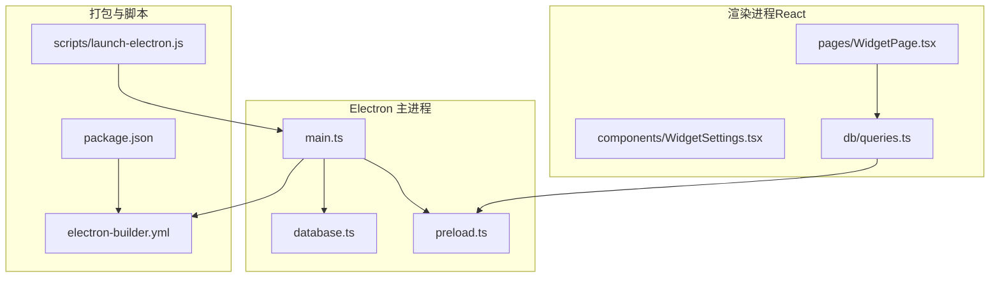
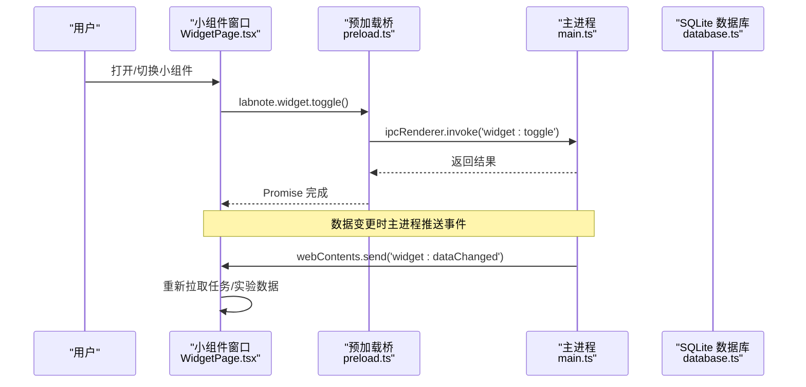
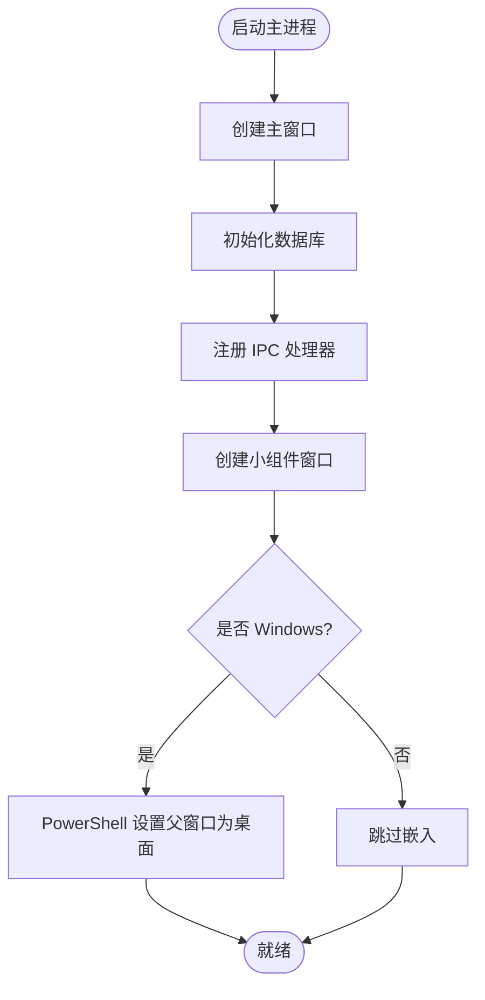
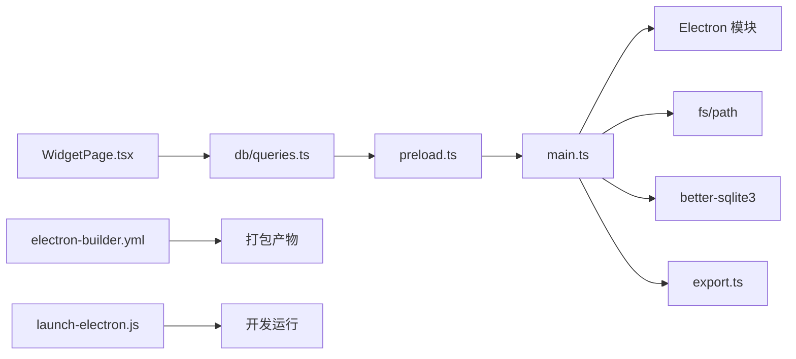

# 桌面集成特性

<cite>
**本文引用的文件**   
- [electron/main.ts](file://electron/main.ts)
- [electron/preload.ts](file://electron/preload.ts)
- [electron/database.ts](file://electron/database.ts)
- [src/pages/WidgetPage.tsx](file://src/pages/WidgetPage.tsx)
- [src/components/WidgetSettings.tsx](file://src/components/WidgetSettings.tsx)
- [src/db/queries.ts](file://src/db/queries.ts)
- [package.json](file://package.json)
- [electron-builder.yml](file://electron-builder.yml)
- [scripts/launch-electron.js](file://scripts/launch-electron.js)
</cite>

## 目录
1. [简介](#简介)
2. [项目结构](#项目结构)
3. [核心组件](#核心组件)
4. [架构总览](#架构总览)
5. [详细组件分析](#详细组件分析)
6. [依赖关系分析](#依赖关系分析)
7. [性能与实时性](#性能与实时性)
8. [跨平台与平台差异](#跨平台与平台差异)
9. [部署与分发](#部署与分发)
10. [用户体验优化建议](#用户体验优化建议)
11. [故障排除指南](#故障排除指南)
12. [结论](#结论)

## 简介
本文件聚焦 LabNote 的桌面集成特性，围绕以下目标展开：
- 桌面小组件（Widget）的实现原理与使用方法：独立窗口管理、实时数据同步、桌面嵌入显示。
- 系统集成能力：自定义协议处理、菜单集成、快捷键支持、通知系统现状与建议。
- 跨平台兼容性考虑与平台特定实现差异。
- 桌面应用部署与分发策略：安装包制作、自动更新机制、安全签名。
- 用户体验优化建议与常见问题排查。

## 项目结构
LabNote 基于 Electron + React + TypeScript 构建，桌面端入口位于 electron 目录，前端页面位于 src 目录，打包配置在根目录。

图表来源
- [electron/main.ts:1-1114](file://electron/main.ts#L1-L1114)
- [electron/preload.ts:1-165](file://electron/preload.ts#L1-L165)
- [electron/database.ts:1-320](file://electron/database.ts#L1-L320)
- [src/pages/WidgetPage.tsx:1-304](file://src/pages/WidgetPage.tsx#L1-L304)
- [src/components/WidgetSettings.tsx:1-227](file://src/components/WidgetSettings.tsx#L1-L227)
- [src/db/queries.ts:1-193](file://src/db/queries.ts#L1-L193)
- [electron-builder.yml:1-52](file://electron-builder.yml#L1-L52)
- [package.json:1-39](file://package.json#L1-L39)
- [scripts/launch-electron.js:1-59](file://scripts/launch-electron.js#L1-L59)

章节来源
- [electron/main.ts:1068-1109](file://electron/main.ts#L1068-L1109)
- [package.json:6-13](file://package.json#L6-L13)
- [electron-builder.yml:1-52](file://electron-builder.yml#L1-L52)

## 核心组件
- 主进程窗口管理：创建并维护主窗口与小组件窗口，提供 IPC 控制接口。
- 预加载桥接：通过 contextBridge 暴露安全的 API 给渲染进程。
- 数据库初始化与迁移：使用 better-sqlite3 初始化本地数据库，包含表结构与增量迁移。
- 小组件页面：展示日历、实验与任务列表，支持快速添加与设置。
- 查询封装：统一通过 window.labnote.* 调用 IPC，屏蔽底层细节。

章节来源
- [electron/main.ts:102-237](file://electron/main.ts#L102-L237)
- [electron/preload.ts:1-165](file://electron/preload.ts#L1-L165)
- [electron/database.ts:6-178](file://electron/database.ts#L6-L178)
- [src/pages/WidgetPage.tsx:80-110](file://src/pages/WidgetPage.tsx#L80-L110)
- [src/db/queries.ts:23-30](file://src/db/queries.ts#L23-L30)

## 架构总览
整体采用“主进程 + 预加载桥 + 渲染进程”的经典 Electron 架构。主进程负责窗口、协议、菜单、IPC 路由与本地资源访问；渲染进程通过预加载暴露的安全 API 进行业务交互；小组件作为独立 BrowserWindow 运行，可嵌入桌面层显示。

图表来源
- [electron/main.ts:241-288](file://electron/main.ts#L241-L288)
- [electron/preload.ts:152-161](file://electron/preload.ts#L152-L161)
- [src/pages/WidgetPage.tsx:106-110](file://src/pages/WidgetPage.tsx#L106-L110)

## 详细组件分析

### 桌面小组件（Widget）
- 独立窗口管理
  - 主进程创建独立的 BrowserWindow，无边框、透明、跳过任务栏，默认定位在主显示器右侧。
  - 监听 resize 事件，动态调整根容器尺寸，确保嵌入场景下的布局正确。
  - 点击焦点后取消置顶并将窗口置于合适层级，避免遮挡其他应用。
- 桌面嵌入显示（Windows）
  - 在 ready-to-show 阶段通过 PowerShell 调用 user32.dll 将窗口父级设置为桌面 Shell 树中的 WorkerW/Progman，使小组件仅在桌面可见时显示。
  - 该逻辑为 Windows 平台特定实现，非 Windows 平台会忽略或失败但不影响功能。
- 实时数据同步
  - 主进程在任务/实验等数据变更后，向小组件发送 'widget:dataChanged' 事件。
  - 小组件订阅该事件，触发数据刷新，保证主界面与小组件数据一致。
- 导航与交互
  - 小组件可通过 IPC 打开主窗口并跳转到指定路由（如实验详情）。
  - 小组件内支持快速添加任务、勾选完成、选择日期查看对应实验与待办。

图表来源
- [electron/main.ts:145-237](file://electron/main.ts#L145-L237)
- [electron/main.ts:1068-1109](file://electron/main.ts#L1068-L1109)

章节来源
- [electron/main.ts:136-237](file://electron/main.ts#L136-L237)
- [electron/main.ts:241-294](file://electron/main.ts#L241-L294)
- [src/pages/WidgetPage.tsx:80-110](file://src/pages/WidgetPage.tsx#L80-L110)
- [src/pages/WidgetPage.tsx:195-203](file://src/pages/WidgetPage.tsx#L195-L203)

### 系统集成能力
- 自定义协议处理
  - 注册 labnote:// 协议，用于安全读取 dataPath 下的图片等资源，防止路径穿越。
  - 渲染侧可使用 labnote://images/... 直接引用本地图片。
- 菜单集成与快捷键
  - 主进程构建应用菜单，包含“选择数据库位置...”、“退出”、“开发者工具”等项。
  - “选择数据库位置...”绑定快捷键 CmdOrCtrl+Shift+D，支持运行时切换数据存储目录并重建数据库连接。
- 通知系统
  - 当前代码未实现系统通知（如 Notification），但可在主进程需要时扩展。
  - 小组件通过 IPC 事件驱动刷新，属于内部通知机制，不等同于系统级通知。

章节来源
- [electron/main.ts:377-391](file://electron/main.ts#L377-L391)
- [electron/main.ts:297-374](file://electron/main.ts#L297-L374)
- [electron/main.ts:306-336](file://electron/main.ts#L306-L336)

### 数据持久化与迁移
- 使用 better-sqlite3 初始化数据库，开启 WAL 模式与外键约束。
- 首次启动自动创建必要目录与表结构，并在后续版本中执行增量迁移（新增字段、重建索引等）。
- 预设模块模板在首次启动时写入，便于开箱即用。

章节来源
- [electron/database.ts:6-178](file://electron/database.ts#L6-L178)
- [electron/database.ts:262-314](file://electron/database.ts#L262-L314)

### 预加载桥与类型定义
- 通过 contextBridge.exposeInMainWorld 暴露 labnote API，包括 app、images、projects、experiments、tags、templates、reagents、modules、compound、tasks、widget 等命名空间。
- 所有方法均基于 ipcRenderer.invoke/on，确保渲染进程无法直接访问 Node/Electron 敏感 API。

章节来源
- [electron/preload.ts:1-165](file://electron/preload.ts#L1-L165)

### 小组件页面与设置
- 小组件页面展示迷你日历、今日实验与待办，支持快速添加任务、切换日期、打开主界面。
- 小组件设置面板支持透明度、字体缩放、装饰小熊开关/大小/透明度/样式、自定义左右图片（base64 存储于 localStorage）。

章节来源
- [src/pages/WidgetPage.tsx:80-304](file://src/pages/WidgetPage.tsx#L80-L304)
- [src/components/WidgetSettings.tsx:1-227](file://src/components/WidgetSettings.tsx#L1-L227)

## 依赖关系分析
- 主进程依赖
  - Electron 模块：app、BrowserWindow、ipcMain、dialog、protocol、Menu、screen、net。
  - 文件系统与路径：fs、path。
  - 本地数据库：better-sqlite3。
  - 导出功能：export.ts（生成实验报告片段）。
- 渲染进程依赖
  - React、React Router DOM。
  - 通过 preload 暴露的 labnote API 访问后端能力。
- 打包与脚本
  - electron-builder 负责打包 NSIS 安装包、asar 压缩、asarUnpack 特殊模块。
  - scripts/launch-electron.js 用于开发环境绕过 npm wrapper 直接启动 Electron。

图表来源
- [electron/main.ts:1-8](file://electron/main.ts#L1-L8)
- [electron/database.ts:1-3](file://electron/database.ts#L1-L3)
- [src/db/queries.ts:1-6](file://src/db/queries.ts#L1-L6)
- [electron-builder.yml:1-52](file://electron-builder.yml#L1-L52)
- [scripts/launch-electron.js:1-59](file://scripts/launch-electron.js#L1-L59)

章节来源
- [package.json:14-21](file://package.json#L14-L21)
- [electron-builder.yml:22-47](file://electron-builder.yml#L22-L47)

## 性能与实时性
- 数据库性能
  - 启用 WAL 模式提升并发读写性能。
  - 事务批量写入（如实验创建/更新）减少磁盘 I/O 次数。
- 渲染性能
  - 小组件窗口无阴影、透明背景，降低合成开销。
  - 按需刷新：仅当收到 'widget:dataChanged' 事件时拉取数据，避免频繁轮询。
- 网络与协议
  - 自定义协议通过 net.fetch 读取本地文件，避免额外网络请求。

[本节为通用性能讨论，无需具体文件引用]

## 跨平台与平台差异
- Windows 特有
  - 桌面嵌入：通过 PowerShell 调用 user32.dll 将小组件窗口父级设为桌面 Shell，使其仅在桌面可见时显示。
  - 窗口层级控制：focus 事件后调用 SetWindowPos 将窗口置于合适层级。
- macOS/Linux
  - 当前代码未实现桌面嵌入逻辑，小组件以普通浮动窗口运行。
  - 菜单快捷键使用 CmdOrCtrl+Shift+D，在不同平台下映射到相应修饰键。
- 打包差异
  - electron-builder 配置了 Windows NSIS 目标，asar 打包与 asarUnpack 针对 native 模块与静态资源。

章节来源
- [electron/main.ts:206-236](file://electron/main.ts#L206-L236)
- [electron/main.ts:136-143](file://electron/main.ts#L136-L143)
- [electron-builder.yml:6-19](file://electron-builder.yml#L6-L19)

## 部署与分发
- 构建与打包
  - 构建流程：先构建渲染产物（vite build），再编译主进程（tsc），最后使用 electron-builder 打包。
  - 输出目录：release，产物名称含版本号。
  - asar 压缩：启用 asar，但保留 better-sqlite3 与 ketcher 静态资源不被压缩。
- 安装包制作
  - Windows 使用 NSIS 安装器，允许更改安装目录，创建桌面与开始菜单快捷方式。
- 自动更新机制
  - 当前仓库未集成自动更新逻辑（如 autoUpdater）。可在主进程引入 electron-updater 或自研服务端对比版本并下载更新包。
- 安全签名
  - 当前未配置代码签名。可在 CI 中集成签名步骤（Windows 使用 signtool，macOS 使用 codesign/notarize），并在 electron-builder 中配置签名选项。

章节来源
- [package.json:6-13](file://package.json#L6-L13)
- [electron-builder.yml:1-52](file://electron-builder.yml#L1-L52)

## 用户体验优化建议
- 小组件交互
  - 增加拖拽锁定状态提示，避免误操作移动窗口。
  - 为常用操作（新建任务、切换日期）提供键盘快捷键。
- 数据一致性
  - 在数据变更时增加短暂加载态反馈，避免用户感知延迟。
- 视觉与可读性
  - 根据系统主题自动调整小组件配色与透明度。
  - 提供字号与间距的更多档位，适配不同屏幕分辨率。
- 错误提示
  - 对数据库迁移失败、协议访问拒绝等错误，提供更友好的提示与恢复指引。

[本节为通用体验建议，无需具体文件引用]

## 故障排除指南
- 小组件无法嵌入桌面（Windows）
  - 现象：小组件始终悬浮在其他窗口之上。
  - 排查：检查 PowerShell 执行权限与 user32.dll 调用是否成功；确认 ready-to-show 事件已触发。
  - 参考实现：桌面嵌入逻辑。
- 数据库迁移失败
  - 现象：启动时报错或字段缺失。
  - 排查：查看日志输出，确认迁移脚本是否按预期执行；必要时备份 labnote.db 后重试。
  - 参考实现：数据库初始化与迁移。
- 自定义协议无法加载图片
  - 现象：labnote://images/... 显示 403 或空白。
  - 排查：确认 dataPath 配置正确且 images 子目录存在；检查路径穿越保护逻辑。
  - 参考实现：协议处理。
- 小组件数据不同步
  - 现象：主界面修改后小组件未刷新。
  - 排查：确认主进程在数据变更后发送 'widget:dataChanged'；小组件是否正确订阅并触发 loadData。
  - 参考实现：IPC 事件与小组件订阅。

章节来源
- [electron/main.ts:206-236](file://electron/main.ts#L206-L236)
- [electron/database.ts:262-314](file://electron/database.ts#L262-L314)
- [electron/main.ts:377-391](file://electron/main.ts#L377-L391)
- [electron/main.ts:277-294](file://electron/main.ts#L277-L294)
- [src/pages/WidgetPage.tsx:106-110](file://src/pages/WidgetPage.tsx#L106-L110)

## 结论
LabNote 的桌面集成特性围绕小组件窗口、IPC 通信、本地数据库与打包分发展开。Windows 平台实现了桌面嵌入以提升可用性，同时通过预加载桥保障安全性。当前未内置自动更新与系统通知，可按需扩展。建议在持续迭代中完善跨平台行为、增强错误提示与用户体验细节，并引入签名与自动更新以提升分发质量。