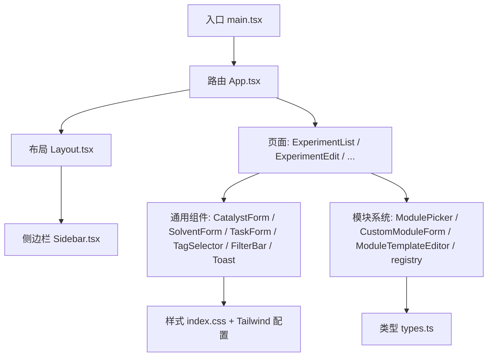
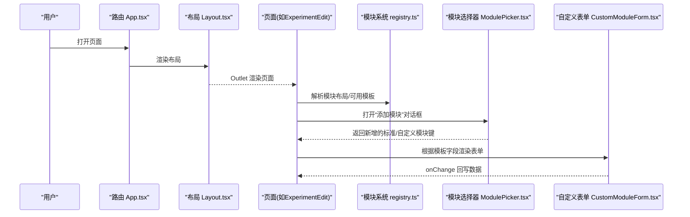
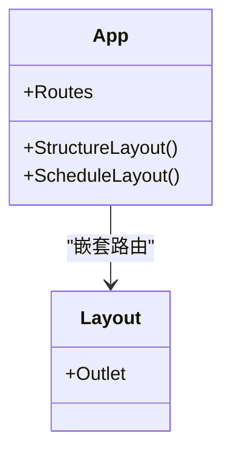
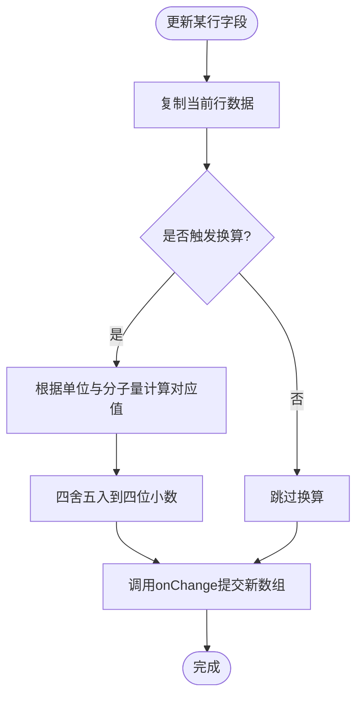
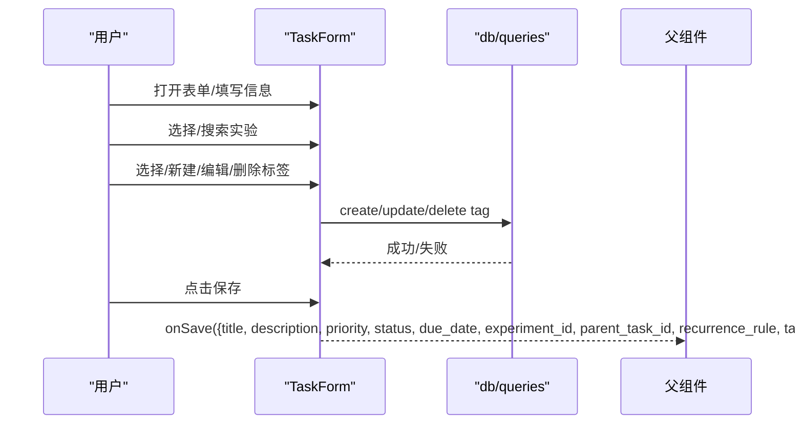
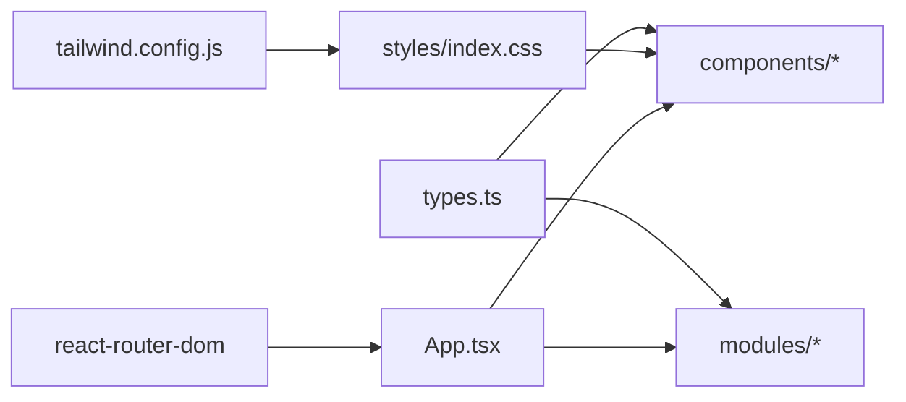

# 组件开发指南

<cite>
**本文引用的文件**   
- [src/main.tsx](file://src/main.tsx)
- [src/App.tsx](file://src/App.tsx)
- [src/components/Layout.tsx](file://src/components/Layout.tsx)
- [src/components/Sidebar.tsx](file://src/components/Sidebar.tsx)
- [src/components/CatalystForm.tsx](file://src/components/CatalystForm.tsx)
- [src/components/SolventForm.tsx](file://src/components/SolventForm.tsx)
- [src/components/TaskForm.tsx](file://src/components/TaskForm.tsx)
- [src/components/TagSelector.tsx](file://src/components/TagSelector.tsx)
- [src/components/FilterBar.tsx](file://src/components/FilterBar.tsx)
- [src/components/Toast.tsx](file://src/components/Toast.tsx)
- [src/modules/registry.ts](file://src/modules/registry.ts)
- [src/modules/ModulePicker.tsx](file://src/modules/ModulePicker.tsx)
- [src/modules/CustomModuleForm.tsx](file://src/modules/CustomModuleForm.tsx)
- [src/modules/ModuleTemplateEditor.tsx](file://src/modules/ModuleTemplateEditor.tsx)
- [src/types.ts](file://src/types.ts)
- [src/styles/index.css](file://src/styles/index.css)
- [tailwind.config.js](file://tailwind.config.js)
</cite>

## 目录
1. [简介](#简介)
2. [项目结构](#项目结构)
3. [核心组件](#核心组件)
4. [架构总览](#架构总览)
5. [详细组件分析](#详细组件分析)
6. [依赖关系分析](#依赖关系分析)
7. [性能与可访问性](#性能与可访问性)
8. [测试策略](#测试策略)
9. [故障排查](#故障排查)
10. [结论](#结论)
11. [附录：命名规范与样式约定](#附录：命名规范与样式约定)

## 简介
本指南面向LabNote的React组件系统开发者，系统化说明组件架构设计原则、命名规范与目录组织；详解通用UI组件的使用方法、属性配置与事件处理；阐述自定义模块系统的注册、表单生成与数据绑定机制；并提供样式规范、响应式设计与可访问性要求，以及测试策略、性能优化与调试方法。目标是帮助开发者快速理解并扩展组件系统。

## 项目结构
LabNote采用按功能域划分的目录组织方式：
- src/components：通用UI与业务组件（布局、表单、筛选、提示等）
- src/modules：自定义模块系统（模板编辑器、选择器、运行时渲染）
- src/pages：页面级路由组件
- src/types.ts：全局类型定义与窗口API扩展
- src/styles/index.css：基础样式与组件类名
- tailwind.config.js：主题与尺寸、颜色、字号等设计令牌



图表来源
- [src/main.tsx:1-14](file://src/main.tsx#L1-L14)
- [src/App.tsx:1-64](file://src/App.tsx#L1-L64)
- [src/components/Layout.tsx:1-16](file://src/components/Layout.tsx#L1-L16)
- [src/components/Sidebar.tsx](file://src/components/Sidebar.tsx)
- [src/modules/registry.ts:1-124](file://src/modules/registry.ts#L1-L124)
- [src/modules/ModulePicker.tsx:1-150](file://src/modules/ModulePicker.tsx#L1-L150)
- [src/modules/CustomModuleForm.tsx:1-242](file://src/modules/CustomModuleForm.tsx#L1-L242)
- [src/modules/ModuleTemplateEditor.tsx:1-257](file://src/modules/ModuleTemplateEditor.tsx#L1-L257)
- [src/types.ts:1-316](file://src/types.ts#L1-L316)
- [src/styles/index.css:1-95](file://src/styles/index.css#L1-L95)
- [tailwind.config.js:1-50](file://tailwind.config.js#L1-L50)

章节来源
- [src/main.tsx:1-14](file://src/main.tsx#L1-L14)
- [src/App.tsx:1-64](file://src/App.tsx#L1-L64)
- [src/components/Layout.tsx:1-16](file://src/components/Layout.tsx#L1-L16)
- [src/modules/registry.ts:1-124](file://src/modules/registry.ts#L1-L124)
- [src/types.ts:1-316](file://src/types.ts#L1-L316)
- [src/styles/index.css:1-95](file://src/styles/index.css#L1-L95)
- [tailwind.config.js:1-50](file://tailwind.config.js#L1-L50)

## 核心组件
本节聚焦常用UI组件的职责、属性与事件契约，便于在页面中直接复用。

- 布局与导航
  - Layout：提供侧边栏+主内容区的双栏布局，使用Outlet承载子路由内容。
  - Sidebar：侧边导航（具体实现见Sidebar组件）。
- 表单与数据录入
  - CatalystForm：催化剂行式编辑，支持名称、分子量、摩尔量、用量与单位联动换算。
  - SolventForm：溶剂行式编辑，支持名称、体积、单位与比例。
  - TaskForm：任务弹窗表单，包含标题、描述、优先级、状态、截止日期、重复规则、关联实验与标签管理。
  - TagSelector：标签选择与管理（新建、编辑、删除），支持颜色预设与批量操作。
- 筛选与反馈
  - FilterBar：搜索、课题、标签、日期范围筛选。
  - Toast：轻量消息提示，提供useToast Hook与容器组件。

章节来源
- [src/components/Layout.tsx:1-16](file://src/components/Layout.tsx#L1-L16)
- [src/components/CatalystForm.tsx:1-151](file://src/components/CatalystForm.tsx#L1-L151)
- [src/components/SolventForm.tsx:1-84](file://src/components/SolventForm.tsx#L1-L84)
- [src/components/TaskForm.tsx:1-441](file://src/components/TaskForm.tsx#L1-L441)
- [src/components/TagSelector.tsx:1-251](file://src/components/TagSelector.tsx#L1-L251)
- [src/components/FilterBar.tsx:1-85](file://src/components/FilterBar.tsx#L1-L85)
- [src/components/Toast.tsx:1-53](file://src/components/Toast.tsx#L1-L53)

## 架构总览
应用以HashRouter为路由容器，App根据路径渲染不同布局与页面。标准模块与自定义模块通过“模块注册表”与“布局配置”驱动渲染，形成“声明式布局 + 动态表单”的体系。



图表来源
- [src/App.tsx:1-64](file://src/App.tsx#L1-L64)
- [src/components/Layout.tsx:1-16](file://src/components/Layout.tsx#L1-L16)
- [src/modules/registry.ts:1-124](file://src/modules/registry.ts#L1-L124)
- [src/modules/ModulePicker.tsx:1-150](file://src/modules/ModulePicker.tsx#L1-L150)
- [src/modules/CustomModuleForm.tsx:1-242](file://src/modules/CustomModuleForm.tsx#L1-L242)

## 详细组件分析

### 布局与路由
- 职责
  - App：集中定义路由与特殊布局（全屏结构编辑器、宽屏日程页、无边框Widget页）。
  - Layout：统一侧边栏+主内容区，限制最大宽度与内边距。
- 关键点
  - 使用Suspense包裹懒加载页面，提升首屏性能。
  - 不同页面使用不同Layout以满足全屏/宽屏需求。



图表来源
- [src/App.tsx:1-64](file://src/App.tsx#L1-L64)
- [src/components/Layout.tsx:1-16](file://src/components/Layout.tsx#L1-L16)

章节来源
- [src/App.tsx:1-64](file://src/App.tsx#L1-L64)
- [src/components/Layout.tsx:1-16](file://src/components/Layout.tsx#L1-L16)

### 通用表单组件：CatalystForm
- 输入输出
  - 输入：catalysts数组、onChange回调
  - 输出：更新后的catalysts数组
- 行为
  - 支持增删行
  - 自动在“用量/摩尔量/单位/分子量”之间进行双向换算与四舍五入
- 复杂度
  - 单行更新O(1)，整表变更O(n)



图表来源
- [src/components/CatalystForm.tsx:1-151](file://src/components/CatalystForm.tsx#L1-L151)

章节来源
- [src/components/CatalystForm.tsx:1-151](file://src/components/CatalystForm.tsx#L1-L151)

### 通用表单组件：SolventForm
- 输入输出
  - 输入：solvents数组、onChange回调
  - 输出：更新后的solvents数组
- 行为
  - 支持增删行与字段直写
  - 单位支持mL/L/μL

章节来源
- [src/components/SolventForm.tsx:1-84](file://src/components/SolventForm.tsx#L1-L84)

### 复杂交互组件：TaskForm
- 能力
  - 新建/编辑任务，支持优先级、状态、截止日期、重复规则
  - 关联实验（下拉搜索）、标签多选与在线管理（创建/编辑/删除）
- 外部依赖
  - 通过db/queries进行标签CRUD
- 交互细节
  - 点击文档空白处关闭实验下拉
  - 键盘Enter快捷保存



图表来源
- [src/components/TaskForm.tsx:1-441](file://src/components/TaskForm.tsx#L1-L441)

章节来源
- [src/components/TaskForm.tsx:1-441](file://src/components/TaskForm.tsx#L1-L441)

### 标签选择器：TagSelector
- 能力
  - 多选标签、新建标签（带颜色预设）、编辑与删除
  - 删除时二次确认
- 事件
  - onChange(selectedIds)
  - onTagsRefresh()

章节来源
- [src/components/TagSelector.tsx:1-251](file://src/components/TagSelector.tsx#L1-L251)

### 筛选栏：FilterBar
- 能力
  - 文本搜索、按课题/标签筛选、起止日期筛选
- 事件
  - onSearchChange/onProjectChange/onTagChange/onDateFromChange/onDateToChange

章节来源
- [src/components/FilterBar.tsx:1-85](file://src/components/FilterBar.tsx#L1-L85)

### 提示系统：Toast
- 能力
  - useToast Hook维护消息队列，ToastContainer负责渲染
  - 自动消失与手动关闭
- 使用建议
  - 在根组件挂载ToastContainer，在各页面/组件中通过Hook调用showToast

章节来源
- [src/components/Toast.tsx:1-53](file://src/components/Toast.tsx#L1-L53)

### 自定义模块系统
- 模块注册与布局
  - STANDARD_MODULES：内置标准模块清单（基本信息、反应条件、反应物、催化剂、溶剂、步骤、后处理、结果、标签）
  - DEFAULT_LAYOUT：默认布局顺序
  - parseModuleLayout/layoutToJson：序列化/反序列化布局，去重校验
  - getHiddenStandardKeys/getActiveCustomKeys：计算隐藏标准模块与激活的自定义模板键
  - resolveCustomModuleTemplate：从“custom:<id>”解析实际模板
- 模板编辑器
  - ModuleTemplateEditor：可视化定义字段（文本/数字/长文本/下拉/图片/化学结构），自动生成key，支持选项逗号分隔输入
- 运行时表单
  - CustomModuleForm：根据模板字段动态渲染表单，支持图片粘贴/上传、结构式绘制回填
- 模块选择器
  - ModulePicker：展示已隐藏标准模块与可用自定义模板，支持搜索与创建

```mermaid
classDiagram
class Registry {
+STANDARD_MODULES
+DEFAULT_LAYOUT
+parseModuleLayout(raw)
+layoutToJson(layout)
+getHiddenStandardKeys(layout)
+getActiveCustomKeys(layout)
+resolveCustomModuleTemplate(key, templates)
}
class TemplateEditor {
+onSave({name, description, fieldsJson})
}
class RuntimeForm {
+onChange(data)
+saveImage(dataUrl)
+onOpenStructureDraw(fieldKey, setResult)
}
class Picker {
+onAddStandard(key)
+onAddCustom(templateId)
+onCreateCustom()
}
Registry <.. Picker : "读取标准/自定义模板"
Picker --> RuntimeForm : "选择后渲染"
TemplateEditor --> Registry : "持久化字段定义"
```

图表来源
- [src/modules/registry.ts:1-124](file://src/modules/registry.ts#L1-L124)
- [src/modules/ModuleTemplateEditor.tsx:1-257](file://src/modules/ModuleTemplateEditor.tsx#L1-L257)
- [src/modules/CustomModuleForm.tsx:1-242](file://src/modules/CustomModuleForm.tsx#L1-L242)
- [src/modules/ModulePicker.tsx:1-150](file://src/modules/ModulePicker.tsx#L1-L150)

章节来源
- [src/modules/registry.ts:1-124](file://src/modules/registry.ts#L1-L124)
- [src/modules/ModuleTemplateEditor.tsx:1-257](file://src/modules/ModuleTemplateEditor.tsx#L1-L257)
- [src/modules/CustomModuleForm.tsx:1-242](file://src/modules/CustomModuleForm.tsx#L1-L242)
- [src/modules/ModulePicker.tsx:1-150](file://src/modules/ModulePicker.tsx#L1-L150)

## 依赖关系分析
- 组件耦合
  - 页面组件依赖通用组件（表单、筛选、提示）
  - 模块系统通过types.ts中的接口与页面/表单解耦
- 外部依赖
  - React Router用于路由与懒加载
  - Tailwind CSS与自定义CSS类提供一致样式
  - Electron预加载API通过window.labnote暴露给前端（类型声明在types.ts）



图表来源
- [src/types.ts:1-316](file://src/types.ts#L1-L316)
- [src/styles/index.css:1-95](file://src/styles/index.css#L1-L95)
- [tailwind.config.js:1-50](file://tailwind.config.js#L1-L50)
- [src/App.tsx:1-64](file://src/App.tsx#L1-L64)

章节来源
- [src/types.ts:1-316](file://src/types.ts#L1-L316)
- [src/styles/index.css:1-95](file://src/styles/index.css#L1-L95)
- [tailwind.config.js:1-50](file://tailwind.config.js#L1-L50)
- [src/App.tsx:1-64](file://src/App.tsx#L1-L64)

## 性能与可访问性
- 性能
  - 路由懒加载：对重型页面使用lazy+Suspense减少首屏包体
  - 列表渲染：避免不必要的重渲染，尽量将稳定对象/函数提升到上层或缓存
  - 表单计算：CatalystForm中的换算逻辑保持O(1)每行更新
- 可访问性
  - 为所有输入控件提供label或aria-label
  - 按钮具备清晰的语义与键盘可达性
  - 颜色对比度遵循WCAG AA以上
  - 图片提供alt文本，结构图提供必要说明

[本节为通用指导，不直接分析具体文件]

## 测试策略
- 单元测试
  - 纯函数与工具：如CatalystForm中的换算函数，覆盖边界与精度
  - 模块解析：parseModuleLayout、getHiddenStandardKeys、resolveCustomModuleTemplate
- 组件测试
  - 表单交互：TaskForm、TagSelector、FilterBar的事件流与状态变化
  - 模块系统：ModuleTemplateEditor字段校验与JSON序列化；CustomModuleForm的图片/结构式回填
- 集成测试
  - 路由与布局：App在不同路径下的渲染组合
  - 模块选择与渲染：ModulePicker -> CustomModuleForm的数据传递

[本节为通用指导，不直接分析具体文件]

## 故障排查
- 常见问题
  - 模块布局异常：检查module_layout是否为合法JSON且包含有效项；参考解析函数的去重与校验逻辑
  - 图片无法显示：确认图片URL前缀（data/labnote/http）与存储路径是否正确
  - 结构式未回填：确认结构绘制回调或路由传参是否正确设置
- 定位技巧
  - 使用浏览器控制台查看window.labnote暴露的API是否可用
  - 在关键回调处打印前后状态，确认数据流向

章节来源
- [src/modules/registry.ts:77-96](file://src/modules/registry.ts#L77-L96)
- [src/modules/CustomModuleForm.tsx:14-42](file://src/modules/CustomModuleForm.tsx#L14-L42)
- [src/types.ts:233-316](file://src/types.ts#L233-L316)

## 结论
LabNote的组件系统以“声明式布局 + 动态表单”为核心，结合统一的类型系统与样式体系，实现了高内聚、低耦合的可扩展架构。通过标准化的模块注册与模板编辑流程，用户可以按需扩展实验记录结构；通用UI组件则提供了稳定的交互与视觉一致性。遵循本指南的设计原则与实践，可高效地开发与维护组件生态。

[本节为总结性内容，不直接分析具体文件]

## 附录：命名规范与样式约定
- 命名规范
  - 组件文件：PascalCase（如CatalystForm.tsx）
  - 模块键：snake_case（如basic_info、procedure）
  - 类型与接口：PascalCase（如ModuleField、ExperimentDetail）
- 样式约定
  - 使用Tailwind设计令牌（primary色板、字体、间距、圆角、阴影）
  - 组件类名集中在index.css中定义（btn-primary、input-field、card等）
  - 动画与过渡统一使用animate-fade-in等公共类

章节来源
- [tailwind.config.js:1-50](file://tailwind.config.js#L1-L50)
- [src/styles/index.css:1-95](file://src/styles/index.css#L1-L95)