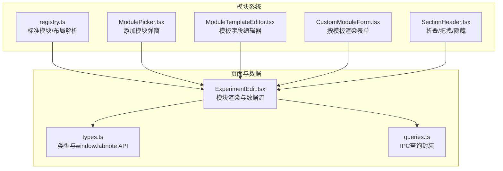
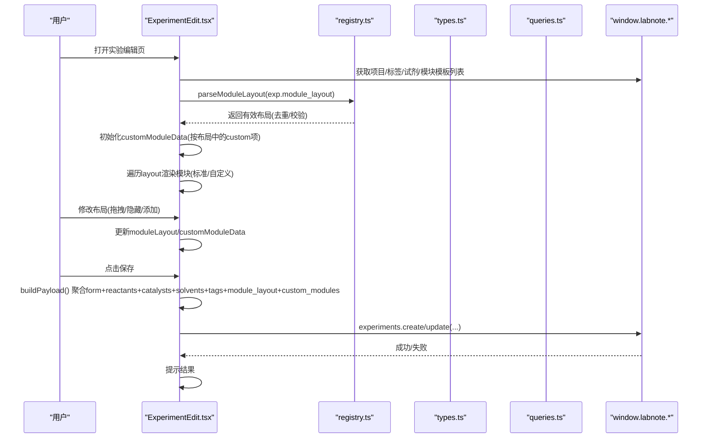
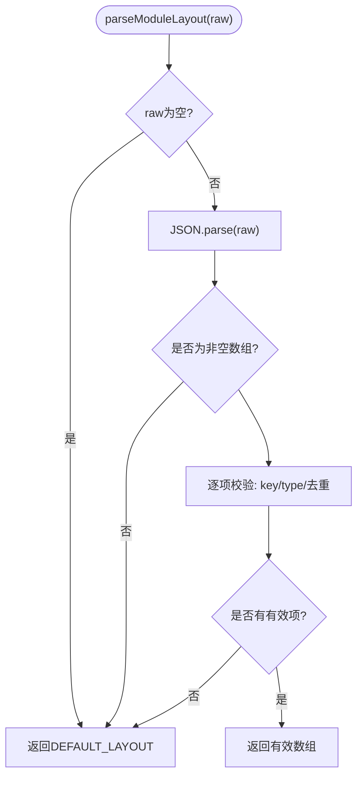
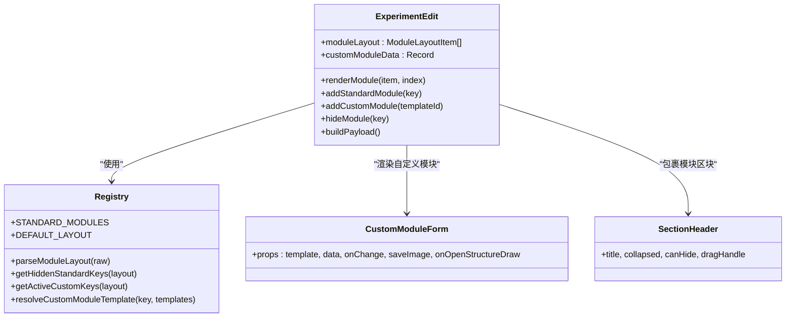
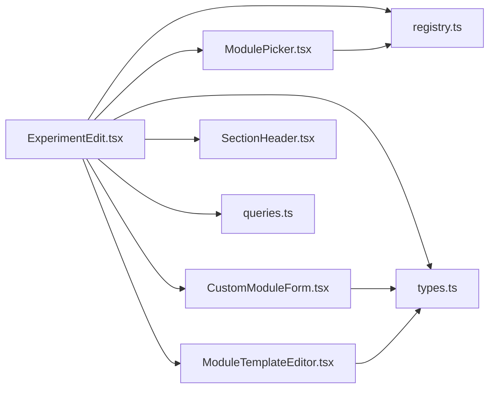

# 模块系统架构

<cite>
**本文引用的文件**   
- [src/modules/registry.ts](file://src/modules/registry.ts)
- [src/types.ts](file://src/types.ts)
- [src/modules/ModulePicker.tsx](file://src/modules/ModulePicker.tsx)
- [src/modules/CustomModuleForm.tsx](file://src/modules/CustomModuleForm.tsx)
- [src/modules/ModuleTemplateEditor.tsx](file://src/modules/ModuleTemplateEditor.tsx)
- [src/modules/SectionHeader.tsx](file://src/modules/SectionHeader.tsx)
- [src/pages/ExperimentEdit.tsx](file://src/pages/ExperimentEdit.tsx)
- [src/db/queries.ts](file://src/db/queries.ts)
- [src/utils/exportTemplates.ts](file://src/utils/exportTemplates.ts)
</cite>

## 目录
1. [引言](#引言)
2. [项目结构](#项目结构)
3. [核心组件](#核心组件)
4. [架构总览](#架构总览)
5. [详细组件分析](#详细组件分析)
6. [依赖关系分析](#依赖关系分析)
7. [性能与内存优化建议](#性能与内存优化建议)
8. [故障排查指南](#故障排查指南)
9. [结论](#结论)
10. [附录：自定义模块实现示例路径](#附录自定义模块实现示例路径)

## 引言
本文件面向LabNote的“模块化实验记录系统”，聚焦模块注册机制、动态渲染流程与生命周期管理。文档将深入解释：
- 模块注册表（registry）的工作机制，包括标准模块声明、布局解析、隐藏/激活策略
- ModuleTemplate模板结构与字段类型系统、验证规则与布局配置
- 模块与主应用的数据流交互模式：状态同步、事件传递、错误处理
- 最佳实践：性能优化、内存管理与兼容性考虑
- 提供实际代码示例的路径指引，帮助开发者正确实现一个完整的自定义模块

## 项目结构
模块系统相关代码主要分布在以下位置：
- 模块注册与布局工具：src/modules/registry.ts
- 类型定义与全局API契约：src/types.ts
- 模块选择器与模板编辑器：src/modules/ModulePicker.tsx、src/modules/ModuleTemplateEditor.tsx
- 自定义模块表单渲染：src/modules/CustomModuleForm.tsx
- 通用区块头部（折叠/拖拽/隐藏）：src/modules/SectionHeader.tsx
- 实验编辑页（模块渲染与数据流中枢）：src/pages/ExperimentEdit.tsx
- 数据库查询封装（IPC桥接）：src/db/queries.ts
- 导出模板系统（与模块无关但共享数据模型）：src/utils/exportTemplates.ts

图表来源
- [src/modules/registry.ts:1-124](file://src/modules/registry.ts#L1-L124)
- [src/modules/ModulePicker.tsx:1-150](file://src/modules/ModulePicker.tsx#L1-L150)
- [src/modules/ModuleTemplateEditor.tsx:1-257](file://src/modules/ModuleTemplateEditor.tsx#L1-L257)
- [src/modules/CustomModuleForm.tsx:1-242](file://src/modules/CustomModuleForm.tsx#L1-L242)
- [src/modules/SectionHeader.tsx:1-103](file://src/modules/SectionHeader.tsx#L1-L103)
- [src/pages/ExperimentEdit.tsx:1-800](file://src/pages/ExperimentEdit.tsx#L1-L800)
- [src/types.ts:157-316](file://src/types.ts#L157-L316)
- [src/db/queries.ts:134-165](file://src/db/queries.ts#L134-L165)

章节来源
- [src/modules/registry.ts:1-124](file://src/modules/registry.ts#L1-L124)
- [src/types.ts:157-316](file://src/types.ts#L157-L316)
- [src/pages/ExperimentEdit.tsx:1-800](file://src/pages/ExperimentEdit.tsx#L1-L800)

## 核心组件
- 模块注册表（registry）
  - 维护标准模块清单与默认布局
  - 提供布局解析、去重、隐藏键计算、自定义模板解析等工具函数
- 模块选择器（ModulePicker）
  - 展示已隐藏的标准模块与可用自定义模板
  - 支持搜索过滤、创建新模板入口
- 模板编辑器（ModuleTemplateEditor）
  - 可视化定义字段（文本、数字、长文本、下拉、图片、化学结构式）
  - 自动key生成、选项输入、必填校验
- 自定义模块表单（CustomModuleForm）
  - 根据模板字段动态渲染表单控件
  - 支持图片粘贴/上传、结构式绘制回调
- 区块头部（SectionHeader）
  - 统一标题、折叠、隐藏、拖拽排序手柄
- 实验编辑页（ExperimentEdit）
  - 模块渲染中枢：加载布局、合并模板、渲染标准/自定义模块
  - 保存时聚合module_layout与custom_modules数据
  - 通过window.labnote.*与后端IPC通信

章节来源
- [src/modules/registry.ts:1-124](file://src/modules/registry.ts#L1-L124)
- [src/modules/ModulePicker.tsx:1-150](file://src/modules/ModulePicker.tsx#L1-L150)
- [src/modules/ModuleTemplateEditor.tsx:1-257](file://src/modules/ModuleTemplateEditor.tsx#L1-L257)
- [src/modules/CustomModuleForm.tsx:1-242](file://src/modules/CustomModuleForm.tsx#L1-L242)
- [src/modules/SectionHeader.tsx:1-103](file://src/modules/SectionHeader.tsx#L1-L103)
- [src/pages/ExperimentEdit.tsx:1-800](file://src/pages/ExperimentEdit.tsx#L1-L800)

## 架构总览
模块系统采用“声明式布局 + 模板驱动渲染”的架构：
- 声明式布局：以ModuleLayoutItem数组描述模块顺序与可见性
- 模板驱动：自定义模块由ModuleTemplate定义字段，运行时渲染为表单
- 数据持久化：布局与自定义模块数据随实验一起保存，支持模板复用

图表来源
- [src/pages/ExperimentEdit.tsx:265-366](file://src/pages/ExperimentEdit.tsx#L265-L366)
- [src/pages/ExperimentEdit.tsx:385-453](file://src/pages/ExperimentEdit.tsx#L385-L453)
- [src/modules/registry.ts:77-96](file://src/modules/registry.ts#L77-L96)
- [src/types.ts:249-262](file://src/types.ts#L249-L262)
- [src/db/queries.ts:64-70](file://src/db/queries.ts#L64-L70)

## 详细组件分析

### 模块注册表（registry）
- 标准模块定义
  - STANDARD_MODULES：包含键名、名称、分类、是否必需
  - DEFAULT_LAYOUT：所有标准模块默认可见的顺序
- 布局解析与校验
  - parseModuleLayout：解析JSON字符串，校验每项type/key，去重，异常回退到默认布局
  - layoutToJson：序列化布局
- 辅助方法
  - getHiddenStandardKeys：返回当前布局未显示且非必需的标准模块键集合
  - getActiveCustomKeys：返回当前布局中激活的自定义模板键集合
  - resolveCustomModuleTemplate：从“custom:<id>”解析出模板对象

图表来源
- [src/modules/registry.ts:77-96](file://src/modules/registry.ts#L77-L96)

章节来源
- [src/modules/registry.ts:1-124](file://src/modules/registry.ts#L1-L124)

### 模块选择器（ModulePicker）
- 功能
  - 展示隐藏的标准模块，允许一键添加
  - 展示可用的自定义模板，支持搜索过滤
  - 提供“创建自定义模块模板”入口
- 交互
  - onAddStandard/onAddCustom：向父级（ExperimentEdit）提交添加动作
  - onCreateCustom：打开模板编辑器
  - onDeleteCustom：删除非预置模板（可选）

章节来源
- [src/modules/ModulePicker.tsx:1-150](file://src/modules/ModulePicker.tsx#L1-L150)

### 模板编辑器（ModuleTemplateEditor）
- 字段类型系统
  - text、number、textarea、select、image、structure
- 布局配置
  - span: half/full 控制网格列宽
- 验证规则
  - 模块名称必填
  - 至少一个字段
  - 自动从label生成key；若type不是select则清空options
- 输出
  - fields序列化为JSON字符串，供后端存储

章节来源
- [src/modules/ModuleTemplateEditor.tsx:1-257](file://src/modules/ModuleTemplateEditor.tsx#L1-L257)

### 自定义模块表单（CustomModuleForm）
- 渲染逻辑
  - 根据template.fields循环渲染对应控件
  - textarea/select/number/text/image/structure分别映射不同UI
- 图片处理
  - 支持粘贴/选择图片，调用saveImage持久化并回填文件名
- 结构式绘制
  - 通过onOpenStructureDraw回调或路由跳转打开绘制器，完成后回填smiles/分子信息

章节来源
- [src/modules/CustomModuleForm.tsx:1-242](file://src/modules/CustomModuleForm.tsx#L1-L242)

### 区块头部（SectionHeader）
- 能力
  - 标题、折叠开关、隐藏按钮
  - 拖拽手柄（dragHandle），配合父级拖拽事件完成排序
- 使用场景
  - 每个模块区块统一头部，提升一致性与可访问性

章节来源
- [src/modules/SectionHeader.tsx:1-103](file://src/modules/SectionHeader.tsx#L1-L103)

### 实验编辑页（ExperimentEdit）——模块渲染与数据流中枢
- 模块布局加载
  - 从实验详情读取module_layout，调用parseModuleLayout解析
  - 新建时默认使用DEFAULT_LAYOUT
- 自定义模块数据
  - 从custom_modules加载data映射，按布局中的custom项初始化
- 渲染流程
  - 遍历moduleLayout，区分standard/custom
  - standard：根据STANDARD_MODULES.key分支渲染内置区块
  - custom：根据模板fields渲染CustomModuleForm
- 布局操作
  - 拖拽排序：handleDragStart/Over/Drop更新moduleLayout
  - 隐藏模块：hideModule从布局移除并清理对应custom数据
  - 添加模块：addStandardModule/addCustomModule追加布局项
- 保存流程
  - buildPayload聚合form、反应物/催化剂/溶剂、标签、module_layout、custom_modules
  - 新建/更新实验后导航或提示

图表来源
- [src/pages/ExperimentEdit.tsx:596-800](file://src/pages/ExperimentEdit.tsx#L596-L800)
- [src/modules/registry.ts:1-124](file://src/modules/registry.ts#L1-L124)
- [src/modules/CustomModuleForm.tsx:1-242](file://src/modules/CustomModuleForm.tsx#L1-L242)
- [src/modules/SectionHeader.tsx:1-103](file://src/modules/SectionHeader.tsx#L1-L103)

章节来源
- [src/pages/ExperimentEdit.tsx:1-800](file://src/pages/ExperimentEdit.tsx#L1-L800)

### 类型系统与全局API（types.ts）
- 模块相关类型
  - ModuleField：字段定义（key/label/type/span/required/options/placeholder）
  - ModuleTemplate：模板元信息与字段数组
  - ExperimentModuleData：实验实例中某个模块的数据快照
  - ModuleLayoutItem：布局项（key/type）
  - StandardModuleDef：标准模块声明
- window.labnote扩展接口
  - modules.templates.list/get/create/update/delete
  - experiments.getCustomModules/saveCustomModules/setModuleLayout
  - 其他业务API（experiments/projects/tags/reagents/templates/tasks等）

章节来源
- [src/types.ts:157-316](file://src/types.ts#L157-L316)

### 数据库查询封装（queries.ts）
- 模块模板查询
  - getModuleTemplates/getModuleTemplate：返回字段数组（可能为字符串需JSON.parse）
  - createModuleTemplate/updateModuleTemplate/deleteModuleTemplate：CRUD封装
- 实验查询
  - getExperiment/createExperiment/updateExperiment：用于加载与保存实验（含模块布局与自定义模块数据）

章节来源
- [src/db/queries.ts:134-165](file://src/db/queries.ts#L134-L165)
- [src/db/queries.ts:60-74](file://src/db/queries.ts#L60-L74)

## 依赖关系分析
- 低耦合高内聚
  - registry仅负责声明与解析，不感知UI
  - ExperimentEdit作为编排层，组合registry、模板、表单与头部组件
- 外部依赖
  - window.labnote.* IPC接口，跨进程访问数据库与文件系统
  - React Router用于结构式绘制页面的导航与结果回调

图表来源
- [src/pages/ExperimentEdit.tsx:1-800](file://src/pages/ExperimentEdit.tsx#L1-L800)
- [src/modules/registry.ts:1-124](file://src/modules/registry.ts#L1-L124)
- [src/types.ts:157-316](file://src/types.ts#L157-L316)
- [src/db/queries.ts:134-165](file://src/db/queries.ts#L134-L165)

章节来源
- [src/pages/ExperimentEdit.tsx:1-800](file://src/pages/ExperimentEdit.tsx#L1-L800)
- [src/modules/registry.ts:1-124](file://src/modules/registry.ts#L1-L124)
- [src/types.ts:157-316](file://src/types.ts#L157-L316)
- [src/db/queries.ts:134-165](file://src/db/queries.ts#L134-L165)

## 性能与内存优化建议
- 避免重复解析
  - 对modules.templates.list返回的fields字段进行一次性JSON.parse并缓存，减少重复解析开销
- 布局变更节流
  - 拖拽排序频繁触发state更新，可在父组件中对update做防抖/节流，或在React中使用useTransition降低阻塞
- 大图片处理
  - 图片上传/粘贴后先压缩再持久化，避免localStorage过大导致写入失败
- 懒加载重型组件
  - 如结构式绘制器可使用React.lazy/Suspense按需加载，减少首屏体积
- 只渲染可见模块
  - 当模块数量较多时，结合虚拟滚动或分页加载，避免一次性渲染过多DOM节点
- 清理无效数据
  - 隐藏或删除模块时，及时清理customModuleData中对应的冗余数据，防止内存泄漏

[本节为通用指导，无需具体文件引用]

## 故障排查指南
- window.labnote不可用
  - 现象：控制台报错提示preload未加载
  - 排查：确认Electron preload脚本注入成功，确保在浏览器环境无法直接访问该API
- 模块布局解析失败
  - 现象：布局回退为默认值
  - 排查：检查module_layout是否为合法JSON数组，每项是否包含string类型的key与合法的type
- 自定义模板字段缺失
  - 现象：表单无内容或报错
  - 排查：确认模板fields存在且非空，字段key唯一，select类型有options
- 图片无法显示
  - 现象：图片路径不正确
  - 排查：确认图片保存返回的是文件名而非完整URL，渲染时使用labnote://images/{filename}前缀
- 保存失败
  - 现象：保存时报错
  - 排查：查看网络/IPC日志，确认payload格式正确，特别是module_layout与custom_modules结构

章节来源
- [src/db/queries.ts:23-30](file://src/db/queries.ts#L23-L30)
- [src/modules/registry.ts:77-96](file://src/modules/registry.ts#L77-L96)
- [src/modules/CustomModuleForm.tsx:14-18](file://src/modules/CustomModuleForm.tsx#L14-L18)

## 结论
LabNote的模块系统通过“声明式布局 + 模板驱动渲染”实现了高度可扩展的实验记录界面。registry提供稳定的模块声明与布局解析能力，ExperimentEdit承担编排职责，CustomModuleForm与ModuleTemplateEditor共同支撑自定义模块的创建与运行期渲染。借助window.labnote IPC接口，模块数据与布局得以持久化并与后端保持一致。遵循本文的性能与内存优化建议，可进一步提升系统的稳定性与用户体验。

[本节为总结，无需具体文件引用]

## 附录：自定义模块实现示例路径
以下为“从零实现一个完整自定义模块”的关键步骤与对应源码路径（不包含代码片段，仅提供定位）：
- 定义字段模板
  - 使用模板编辑器创建字段定义，保存为ModuleTemplate
  - 参考路径：[src/modules/ModuleTemplateEditor.tsx:1-257](file://src/modules/ModuleTemplateEditor.tsx#L1-L257)
- 在实验编辑页中添加模块
  - 打开模块选择器，选择刚创建的模板，添加到布局
  - 参考路径：[src/modules/ModulePicker.tsx:1-150](file://src/modules/ModulePicker.tsx#L1-L150)、[src/pages/ExperimentEdit.tsx:216-227](file://src/pages/ExperimentEdit.tsx#L216-L227)
- 渲染自定义表单
  - 根据模板fields渲染CustomModuleForm，绑定onChange回调
  - 参考路径：[src/modules/CustomModuleForm.tsx:1-242](file://src/modules/CustomModuleForm.tsx#L1-L242)、[src/pages/ExperimentEdit.tsx:596-800](file://src/pages/ExperimentEdit.tsx#L596-L800)
- 保存与加载
  - 保存时聚合module_layout与custom_modules；加载时解析布局并恢复custom数据
  - 参考路径：[src/pages/ExperimentEdit.tsx:385-453](file://src/pages/ExperimentEdit.tsx#L385-L453)、[src/pages/ExperimentEdit.tsx:303-315](file://src/pages/ExperimentEdit.tsx#L303-L315)
- 与后端交互
  - 通过window.labnote.modules.templates.*与experiments.*接口完成CRUD
  - 参考路径：[src/types.ts:284-292](file://src/types.ts#L284-L292)、[src/db/queries.ts:134-165](file://src/db/queries.ts#L134-L165)

章节来源
- [src/modules/ModuleTemplateEditor.tsx:1-257](file://src/modules/ModuleTemplateEditor.tsx#L1-L257)
- [src/modules/ModulePicker.tsx:1-150](file://src/modules/ModulePicker.tsx#L1-L150)
- [src/modules/CustomModuleForm.tsx:1-242](file://src/modules/CustomModuleForm.tsx#L1-L242)
- [src/pages/ExperimentEdit.tsx:216-227](file://src/pages/ExperimentEdit.tsx#L216-L227)
- [src/pages/ExperimentEdit.tsx:303-315](file://src/pages/ExperimentEdit.tsx#L303-L315)
- [src/pages/ExperimentEdit.tsx:385-453](file://src/pages/ExperimentEdit.tsx#L385-L453)
- [src/types.ts:284-292](file://src/types.ts#L284-L292)
- [src/db/queries.ts:134-165](file://src/db/queries.ts#L134-L165)