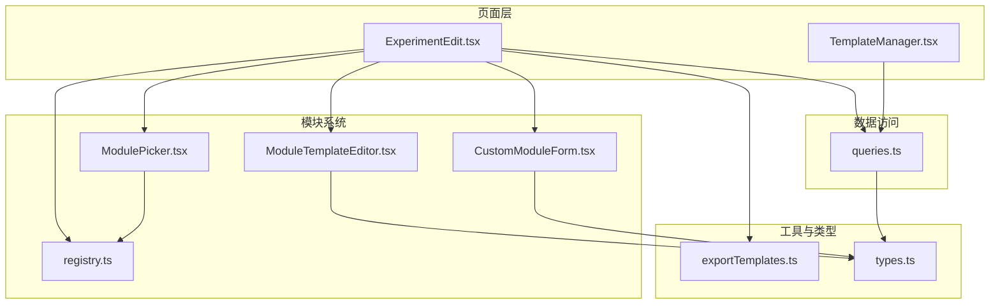
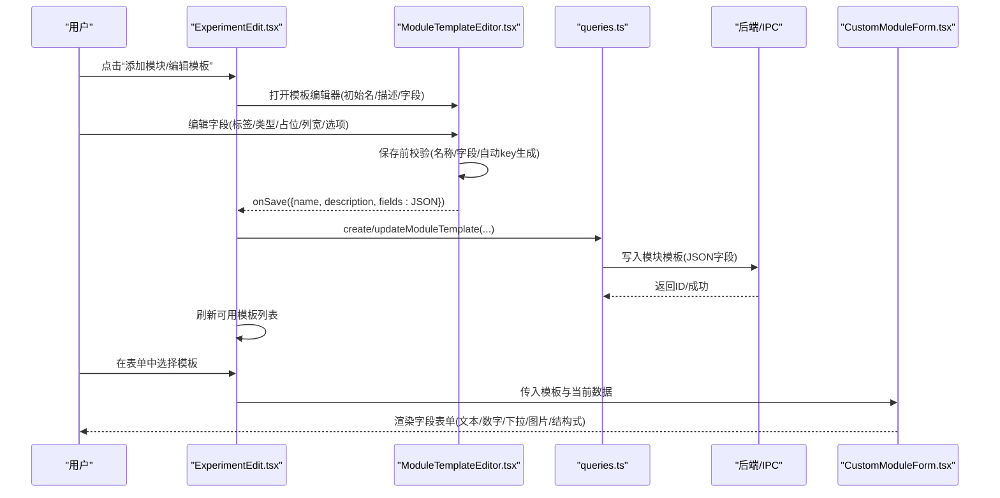
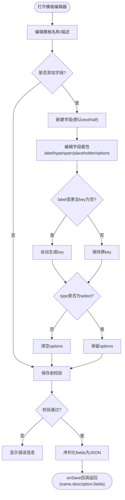
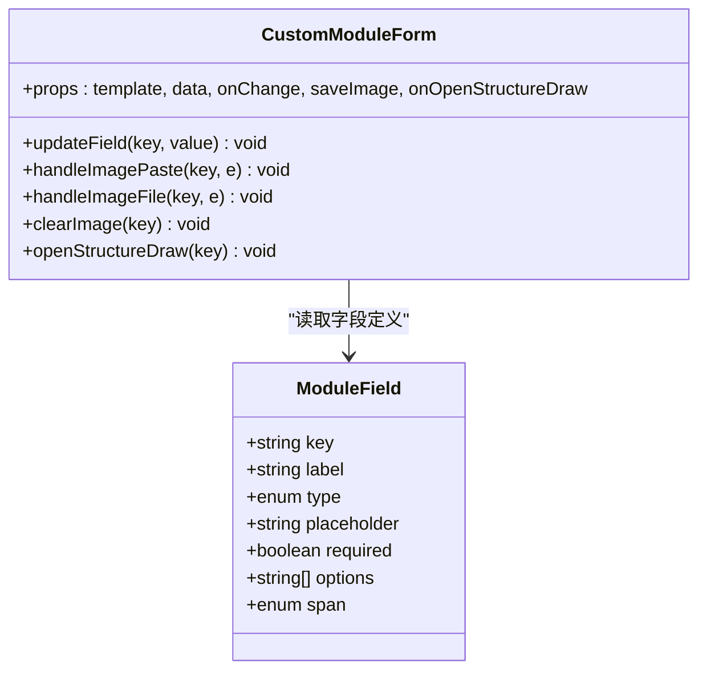
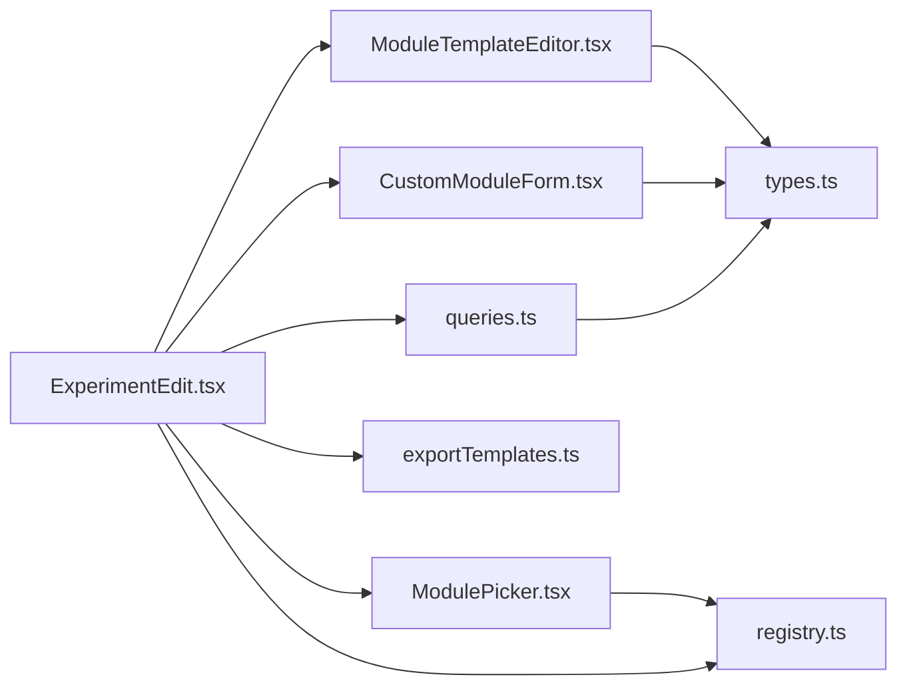

# 模板编辑器

<cite>
**本文引用的文件**   
- [ModuleTemplateEditor.tsx](file://src/modules/ModuleTemplateEditor.tsx)
- [CustomModuleForm.tsx](file://src/modules/CustomModuleForm.tsx)
- [registry.ts](file://src/modules/registry.ts)
- [ModulePicker.tsx](file://src/modules/ModulePicker.tsx)
- [ExperimentEdit.tsx](file://src/pages/ExperimentEdit.tsx)
- [TemplateManager.tsx](file://src/pages/TemplateManager.tsx)
- [exportTemplates.ts](file://src/utils/exportTemplates.ts)
- [queries.ts](file://src/db/queries.ts)
- [types.ts](file://src/types.ts)
</cite>

## 目录
1. [简介](#简介)
2. [项目结构](#项目结构)
3. [核心组件](#核心组件)
4. [架构总览](#架构总览)
5. [详细组件分析](#详细组件分析)
6. [依赖关系分析](#依赖关系分析)
7. [性能与可用性考量](#性能与可用性考量)
8. [故障排查指南](#故障排查指南)
9. [结论](#结论)
10. [附录：最佳实践与示例](#附录最佳实践与示例)

## 简介
本文件面向LabNote的“模块模板编辑器”（ModuleTemplateEditor），系统性阐述其实现原理、交互设计、数据模型、验证机制、导入导出能力，以及模板开发的最佳实践。文档覆盖以下主题：
- 模板结构与字段配置界面
- 模板元数据管理（基本信息、排序、布局）
- 字段配置的交互（属性编辑、实时预览）
- 模板验证（必填、数据类型、冲突检测）
- 模板导入导出（JSON规范、版本兼容、批量操作）
- 模板创建示例（从基础到高级复合模板）

## 项目结构
围绕模板编辑器相关的前端代码主要分布在 modules、pages、utils、db、types 等目录中。下图展示了关键文件与职责：

图表来源
- [ExperimentEdit.tsx:1-120](file://src/pages/ExperimentEdit.tsx#L1-L120)
- [TemplateManager.tsx:1-60](file://src/pages/TemplateManager.tsx#L1-L60)
- [ModuleTemplateEditor.tsx:1-120](file://src/modules/ModuleTemplateEditor.tsx#L1-L120)
- [CustomModuleForm.tsx:1-60](file://src/modules/CustomModuleForm.tsx#L1-L60)
- [ModulePicker.tsx:1-60](file://src/modules/ModulePicker.tsx#L1-L60)
- [registry.ts:1-60](file://src/modules/registry.ts#L1-L60)
- [exportTemplates.ts:1-60](file://src/utils/exportTemplates.ts#L1-L60)
- [queries.ts:1-40](file://src/db/queries.ts#L1-L40)
- [types.ts:158-194](file://src/types.ts#L158-L194)

章节来源
- [ExperimentEdit.tsx:1-120](file://src/pages/ExperimentEdit.tsx#L1-L120)
- [TemplateManager.tsx:1-60](file://src/pages/TemplateManager.tsx#L1-L60)
- [ModuleTemplateEditor.tsx:1-120](file://src/modules/ModuleTemplateEditor.tsx#L1-L120)
- [CustomModuleForm.tsx:1-60](file://src/modules/CustomModuleForm.tsx#L1-L60)
- [ModulePicker.tsx:1-60](file://src/modules/ModulePicker.tsx#L1-L60)
- [registry.ts:1-60](file://src/modules/registry.ts#L1-L60)
- [exportTemplates.ts:1-60](file://src/utils/exportTemplates.ts#L1-L60)
- [queries.ts:1-40](file://src/db/queries.ts#L1-L40)
- [types.ts:158-194](file://src/types.ts#L158-L194)

## 核心组件
- ModuleTemplateEditor：用于创建/编辑自定义模块模板，提供名称、描述、字段定义（标签、类型、占位符、列宽、下拉选项）等元数据配置，并在保存前进行基础校验。
- CustomModuleForm：根据模板字段定义渲染表单，支持文本、数字、长文本、下拉选择、图片、化学结构式等输入控件，并处理图片粘贴/上传与结构式绘制回调。
- ModulePicker：在实验编辑页中展示可添加的标准模块与自定义模板，支持搜索与删除非预置模板。
- registry：维护标准模块定义、默认布局、布局解析与去重、隐藏/激活模块键集合等。
- ExperimentEdit：集成模块系统，承载模板编辑器弹窗、模块布局与数据绑定、导出与模板管理等。
- TemplateManager：模板库管理页面，展示模板列表、使用次数、更新时间，并提供使用/编辑/删除入口。
- exportTemplates：内置期刊风格导出模板与自定义占位符模板引擎，提供占位符构建与宏替换。
- queries：通过 window.labnote.* IPC 接口封装数据库操作，包括模板与模块模板的增删改查。
- types：全局类型定义，包含 ModuleField、ModuleTemplate、ExperimentModuleData、ModuleLayoutItem 等。

章节来源
- [ModuleTemplateEditor.tsx:1-120](file://src/modules/ModuleTemplateEditor.tsx#L1-L120)
- [CustomModuleForm.tsx:1-120](file://src/modules/CustomModuleForm.tsx#L1-L120)
- [ModulePicker.tsx:1-120](file://src/modules/ModulePicker.tsx#L1-L120)
- [registry.ts:1-124](file://src/modules/registry.ts#L1-L124)
- [ExperimentEdit.tsx:1-200](file://src/pages/ExperimentEdit.tsx#L1-L200)
- [TemplateManager.tsx:1-149](file://src/pages/TemplateManager.tsx#L1-L149)
- [exportTemplates.ts:1-120](file://src/utils/exportTemplates.ts#L1-L120)
- [queries.ts:134-166](file://src/db/queries.ts#L134-L166)
- [types.ts:158-194](file://src/types.ts#L158-L194)

## 架构总览
模块模板编辑器的工作流如下：用户在实验编辑页打开模板编辑器，填写模板元数据与字段定义；保存后，模板以 JSON 字符串形式持久化；在实验表单中，按布局加载对应模板并渲染字段表单；用户填写数据后，可将结果导出为期刊风格或自定义占位符模板。

图表来源
- [ExperimentEdit.tsx:1-200](file://src/pages/ExperimentEdit.tsx#L1-L200)
- [ModuleTemplateEditor.tsx:100-130](file://src/modules/ModuleTemplateEditor.tsx#L100-L130)
- [queries.ts:134-166](file://src/db/queries.ts#L134-L166)
- [CustomModuleForm.tsx:80-120](file://src/modules/CustomModuleForm.tsx#L80-L120)

## 详细组件分析

### 模块模板编辑器（ModuleTemplateEditor）
- 功能要点
  - 模板元数据：名称（必填）、描述（可选）。
  - 字段定义：标签（label）、类型（text/number/textarea/select/image/structure）、占位提示（placeholder）、列宽（half/full）、下拉选项（select时显示 OptionsInput）。
  - 自动 key 生成：当 label 变更且 key 为空时，基于 label 生成唯一键（字母数字与中文下划线组合）。
  - 类型切换清理：当 type 从 select 切换到其他类型时，清空 options。
  - 保存校验：名称不能为空；至少保留一个有效字段（label 非空）；若 key 为空则自动生成。
  - 输出格式：fields 序列化为 JSON 字符串，供后端存储。
- 交互细节
  - OptionsInput：支持逗号分隔输入，失焦或末尾带逗号时完成分割与同步。
  - 新增/删除字段：最少保留一个字段。
  - 错误提示：名称与字段校验失败时在对应位置显示错误信息。

图表来源
- [ModuleTemplateEditor.tsx:64-130](file://src/modules/ModuleTemplateEditor.tsx#L64-L130)
- [ModuleTemplateEditor.tsx:22-62](file://src/modules/ModuleTemplateEditor.tsx#L22-L62)

章节来源
- [ModuleTemplateEditor.tsx:1-257](file://src/modules/ModuleTemplateEditor.tsx#L1-L257)

### 自定义模块表单（CustomModuleForm）
- 功能要点
  - 根据模板字段动态渲染表单控件：文本、数字、长文本、下拉选择、图片、化学结构式。
  - 图片字段：支持点击上传与 Ctrl+V 粘贴，调用 saveImage 将图片保存到本地路径，回写文件名。
  - 结构式字段：支持打开结构式绘制器，回填 smiles/formula/molecularWeight/name 等结构化数据。
  - 布局：span=full 时跨两列，half 时单列。
  - 实时数据更新：onChange 回调将字段值合并到 data 对象。
- 交互细节
  - 图片双击在新窗口查看大图。
  - 结构式编辑按钮打开绘制器，移除按钮清空该字段。

图表来源
- [CustomModuleForm.tsx:1-242](file://src/modules/CustomModuleForm.tsx#L1-L242)
- [types.ts:158-166](file://src/types.ts#L158-L166)

章节来源
- [CustomModuleForm.tsx:1-242](file://src/modules/CustomModuleForm.tsx#L1-L242)
- [types.ts:158-166](file://src/types.ts#L158-L166)

### 模块选择器（ModulePicker）
- 功能要点
  - 展示已隐藏的标准模块（非必需）与自定义模板列表。
  - 支持对自定义模板按名称/描述过滤。
  - 提供添加标准模块、添加自定义模板、创建新模板、删除非预置模板等操作。
- 交互细节
  - 预置模板标记不可删除。
  - 删除按钮仅在鼠标悬停时显示。

章节来源
- [ModulePicker.tsx:1-150](file://src/modules/ModulePicker.tsx#L1-L150)

### 模块注册表与布局（registry）
- 功能要点
  - STANDARD_MODULES：定义9个内置模块（基本信息、反应条件、反应物、催化剂、溶剂、实验步骤、后处理、实验结果、标签），含分类与是否必需。
  - DEFAULT_LAYOUT：默认全部标准模块可见。
  - parseModuleLayout：解析并去重布局项，校验 key 与 type 合法性。
  - getHiddenStandardKeys：计算当前未显示的非必需标准模块。
  - getActiveCustomKeys：提取当前布局中的自定义模板键集合。
  - resolveCustomModuleTemplate：由 layout key 解析实际模板。
- 数据结构
  - ModuleLayoutItem：{ key, type }，type 为 standard/custom。

章节来源
- [registry.ts:1-124](file://src/modules/registry.ts#L1-L124)
- [types.ts:190-194](file://src/types.ts#L190-L194)

### 实验编辑页集成（ExperimentEdit）
- 功能要点
  - 集成模块系统状态：moduleLayout、customModuleData、moduleTemplates、collapsedSections。
  - 打开模板编辑器弹窗，接收保存后的模板数据并刷新可用模板。
  - 根据 module_layout 渲染标准模块与自定义模块表单。
  - 提供导出与模板管理入口（与 exportTemplates 和 TemplateManager 协作）。
- 关键流程
  - 打开模板编辑器：showTemplateEditor=true，传入 initialName/description/fields。
  - 保存模板：onSave 回调中调用 create/updateModuleTemplate，随后刷新模板列表。
  - 渲染自定义模块：根据 active custom keys 解析模板并渲染 CustomModuleForm。

章节来源
- [ExperimentEdit.tsx:1-200](file://src/pages/ExperimentEdit.tsx#L1-L200)

### 模板库管理（TemplateManager）
- 功能要点
  - 展示所有实验模板（注意：此处的“模板”指实验级模板，非模块模板），显示名称、描述、使用次数、更新时间。
  - 提供使用、编辑、删除操作，删除前弹出确认对话框。
  - 解析 template_data 生成简要预览。
- 注意
  - 该页面管理的是实验模板（experiment templates），与模块模板（module templates）不同。

章节来源
- [TemplateManager.tsx:1-149](file://src/pages/TemplateManager.tsx#L1-L149)

### 导出与占位符模板（exportTemplates）
- 功能要点
  - 内置 ACS/JACS/Angewandte 三种期刊风格模板。
  - 自定义模板：支持 {{title}}、{{reactants}}、{{solvents}}、{{cond}}、{{result}} 等占位符与宏。
  - buildPlaceholders：将实验数据映射为占位符值，统一处理试剂/溶剂/条件/结果的拼接与标点规范化。
  - applyCustomTemplate：执行占位符替换，清理多余空格。
- 适用场景
  - 将实验数据导出为论文方法学段落，便于复制粘贴至手稿。

章节来源
- [exportTemplates.ts:1-367](file://src/utils/exportTemplates.ts#L1-L367)

### 数据访问（queries）
- 功能要点
  - 模块模板 CRUD：getModuleTemplates/getModuleTemplate/createModuleTemplate/updateModuleTemplate/deleteModuleTemplate。
  - 字段序列化：读取时将 fields 字符串反序列化为数组，is_preset 布尔化。
- 通信方式
  - 通过 window.labnote.modules.templates.* 调用 IPC 接口。

章节来源
- [queries.ts:134-166](file://src/db/queries.ts#L134-L166)
- [types.ts:284-292](file://src/types.ts#L284-L292)

## 依赖关系分析
- 组件耦合
  - ModuleTemplateEditor 仅依赖 types.ModuleField 与 React 状态，低耦合。
  - CustomModuleForm 依赖 ModuleField 与外部 saveImage/onOpenStructureDraw 回调，解耦良好。
  - ExperimentEdit 聚合多个子组件与工具函数，承担编排职责。
- 外部依赖
  - 数据库访问通过 window.labnote.* 抽象，避免直接耦合具体实现。
  - 导出模板与占位符引擎独立于 UI，可复用。

图表来源
- [ModuleTemplateEditor.tsx:1-20](file://src/modules/ModuleTemplateEditor.tsx#L1-L20)
- [CustomModuleForm.tsx:1-10](file://src/modules/CustomModuleForm.tsx#L1-L10)
- [ModulePicker.tsx:1-10](file://src/modules/ModulePicker.tsx#L1-L10)
- [ExperimentEdit.tsx:1-30](file://src/pages/ExperimentEdit.tsx#L1-L30)
- [exportTemplates.ts:1-20](file://src/utils/exportTemplates.ts#L1-L20)
- [queries.ts:134-166](file://src/db/queries.ts#L134-L166)
- [types.ts:158-194](file://src/types.ts#L158-L194)

章节来源
- [ExperimentEdit.tsx:1-200](file://src/pages/ExperimentEdit.tsx#L1-L200)
- [ModuleTemplateEditor.tsx:1-120](file://src/modules/ModuleTemplateEditor.tsx#L1-L120)
- [CustomModuleForm.tsx:1-120](file://src/modules/CustomModuleForm.tsx#L1-L120)
- [ModulePicker.tsx:1-120](file://src/modules/ModulePicker.tsx#L1-L120)
- [registry.ts:1-124](file://src/modules/registry.ts#L1-L124)
- [exportTemplates.ts:1-120](file://src/utils/exportTemplates.ts#L1-L120)
- [queries.ts:134-166](file://src/db/queries.ts#L134-L166)
- [types.ts:158-194](file://src/types.ts#L158-L194)

## 性能与可用性考量
- 渲染性能
  - 字段数量较多时，建议按需展开/折叠模块区域，减少 DOM 节点。
  - 图片字段避免重复解码，缓存已保存的图片 URL。
- 交互体验
  - OptionsInput 采用延迟同步策略，减少频繁 state 更新。
  - 结构式绘制采用懒加载，避免首屏阻塞。
- 数据一致性
  - 布局解析包含去重与类型校验，防止脏数据导致渲染异常。
  - 模板字段 key 自动生成规则保证唯一性与可读性。

[本节为通用指导，不直接分析具体文件]

## 故障排查指南
- 模板无法保存
  - 检查名称是否为空；确保至少有一个字段 label 非空。
  - 若 type 为 select，确认 options 已正确分割为数组。
- 字段未显示或报错
  - 检查模板 fields 是否为合法 JSON 数组；确认每个字段包含 key、label、type。
  - 若 span 值非法，回退为 half。
- 图片无法显示
  - 确认图片保存路径是否正确，URL 前缀是否符合 labnote://images/...。
- 结构式绘制无响应
  - 检查 onOpenStructureDraw 回调是否注入；或确认路由跳转与全局变量设置正常。

章节来源
- [ModuleTemplateEditor.tsx:100-130](file://src/modules/ModuleTemplateEditor.tsx#L100-L130)
- [CustomModuleForm.tsx:146-221](file://src/modules/CustomModuleForm.tsx#L146-L221)
- [registry.ts:77-96](file://src/modules/registry.ts#L77-L96)

## 结论
ModuleTemplateEditor 提供了轻量而强大的自定义模块模板能力，结合 CustomModuleForm 的动态渲染与 registry 的布局管理，实现了灵活的表单扩展。配合导出引擎，用户可将实验数据快速转换为论文风格的段落。建议在团队内建立命名约定与模板组织规范，提升复用效率与一致性。

[本节为总结，不直接分析具体文件]

## 附录：最佳实践与示例

### 命名约定
- 模板名称：简洁明确，如“表征数据”、“安全信息”。
- 字段 key：优先使用英文小写下划线，避免特殊字符；可由 label 自动生成。
- 字段 label：中文友好，语义清晰。

### 组织结构
- 标准模块：用于固定实验要素（基本信息、反应条件、试剂等）。
- 自定义模块：针对特定需求（如表征、安全、设备参数等）。
- 布局：通过 module_layout 控制显示顺序与可见性。

### 复用策略
- 将常用字段组合成模板，在多个实验中复用。
- 使用 ModulePicker 快速添加模板，避免重复配置。
- 利用占位符模板导出标准化段落，提高写作效率。

### 模板创建示例

#### 基础模板：表征数据
- 目标：记录常见表征结果（如 NMR、IR、XRD）。
- 步骤
  - 打开模板编辑器，填写名称“表征数据”，描述“记录各类表征结果”。
  - 添加字段：
    - 核磁（NMR）：type=textarea，span=full，placeholder="1H NMR (CDCl3, 400 MHz): δ ..."
    - 红外（IR）：type=text，span=half，placeholder="KBr pellet"
    - X射线衍射（XRD）：type=text，span=half，placeholder="Cu Kα, 2θ..."
  - 保存模板。
- 使用
  - 在实验编辑页添加“表征数据”模块，逐项填写结果。

章节来源
- [ModuleTemplateEditor.tsx:131-256](file://src/modules/ModuleTemplateEditor.tsx#L131-L256)
- [CustomModuleForm.tsx:86-120](file://src/modules/CustomModuleForm.tsx#L86-L120)

#### 进阶模板：安全信息
- 目标：记录化学品安全注意事项与应急措施。
- 步骤
  - 新增模板“安全信息”。
  - 添加字段：
    - 危害说明：type=textarea，span=full
    - 防护措施：type=textarea，span=full
    - 废弃处置：type=textarea，span=full
  - 保存模板。
- 使用
  - 在实验编辑页添加“安全信息”模块，填写相应内容。

章节来源
- [ModuleTemplateEditor.tsx:131-256](file://src/modules/ModuleTemplateEditor.tsx#L131-L256)

#### 高级复合模板：多字段联动与图片/结构式
- 目标：记录复杂样品信息与图像/结构式。
- 步骤
  - 新增模板“样品档案”。
  - 添加字段：
    - 样品编号：type=text，span=half
    - 合成日期：type=text，span=half
    - 外观描述：type=textarea，span=full
    - 产物结构：type=structure，span=full
    - 产率：type=number，span=half
    - 备注：type=text，span=half
    - 图谱附件：type=image，span=full
  - 保存模板。
- 使用
  - 在实验编辑页添加“样品档案”模块，依次填写并上传图片/结构式。

章节来源
- [CustomModuleForm.tsx:146-221](file://src/modules/CustomModuleForm.tsx#L146-L221)
- [ModuleTemplateEditor.tsx:131-256](file://src/modules/ModuleTemplateEditor.tsx#L131-L256)

### 模板导入导出（JSON 规范与兼容性）
- 字段定义 JSON 结构
  - 字段数组：每项包含 key、label、type、placeholder、required、options、span。
  - 类型枚举：text、number、textarea、select、image、structure。
  - 列宽：half、full。
- 版本兼容
  - 新增字段类型时，旧模板应能忽略未知字段。
  - 字段 key 变更需考虑历史数据迁移。
- 批量操作
  - 可通过脚本批量生成/更新模板，遵循相同 JSON 结构。
  - 导出模板时，建议附带版本号与作者信息以便追踪。

章节来源
- [types.ts:158-194](file://src/types.ts#L158-L194)
- [queries.ts:134-166](file://src/db/queries.ts#L134-L166)