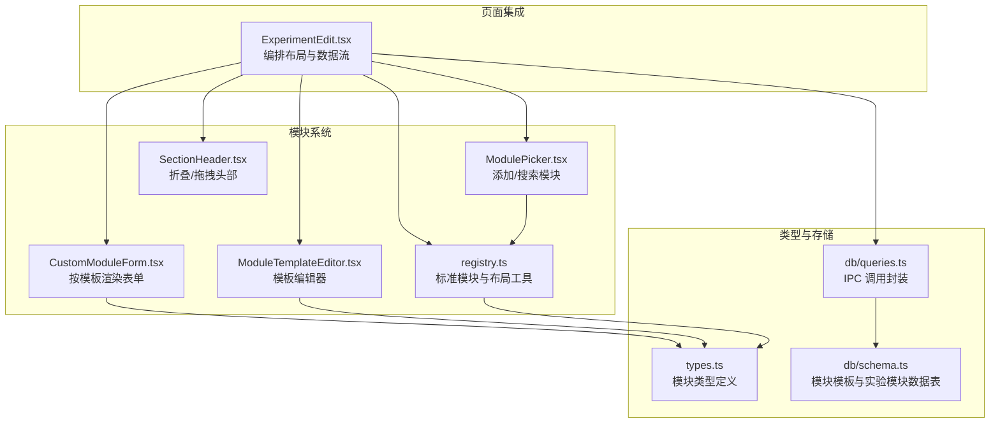
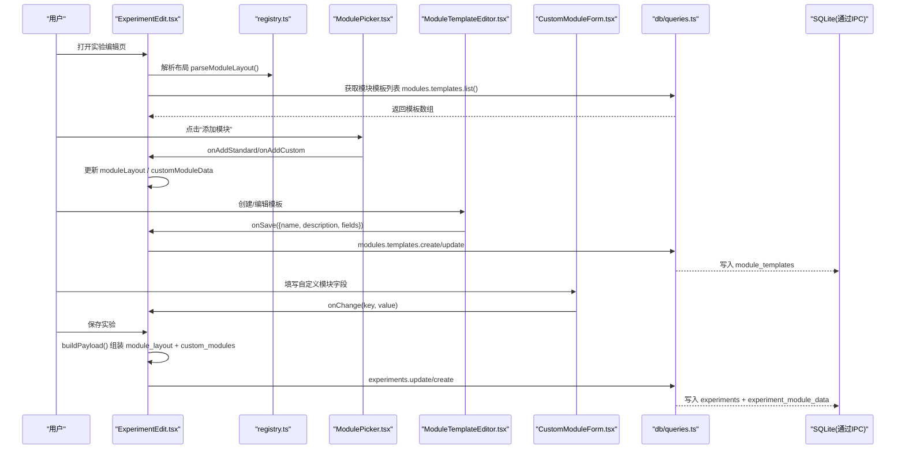

# 自定义模块开发

<cite>
**本文引用的文件**   
- [src/modules/registry.ts](file://src/modules/registry.ts)
- [src/modules/CustomModuleForm.tsx](file://src/modules/CustomModuleForm.tsx)
- [src/modules/ModulePicker.tsx](file://src/modules/ModulePicker.tsx)
- [src/modules/ModuleTemplateEditor.tsx](file://src/modules/ModuleTemplateEditor.tsx)
- [src/modules/SectionHeader.tsx](file://src/modules/SectionHeader.tsx)
- [src/types.ts](file://src/types.ts)
- [src/pages/ExperimentEdit.tsx](file://src/pages/ExperimentEdit.tsx)
- [src/db/schema.ts](file://src/db/schema.ts)
- [src/db/queries.ts](file://src/db/queries.ts)
- [src/utils/exportTemplates.ts](file://src/utils/exportTemplates.ts)
</cite>

## 目录
1. [简介](#简介)
2. [项目结构](#项目结构)
3. [核心组件](#核心组件)
4. [架构总览](#架构总览)
5. [详细组件分析](#详细组件分析)
6. [依赖关系分析](#依赖关系分析)
7. [性能与可扩展性](#性能与可扩展性)
8. [故障排查指南](#故障排查指南)
9. [结论](#结论)
10. [附录：自定义模块开发示例](#附录自定义模块开发示例)

## 简介
本指南面向需要在 LabNote 中扩展“模块化实验记录系统”的开发者。LabNote 的自定义模块系统允许用户通过模板定义字段，并在实验编辑页面动态渲染表单、持久化数据、管理布局顺序与可见性。本文深入解析模块注册机制、动态渲染流程、生命周期管理、表单组件规范、选择器与编辑器实现原理，以及注册表的工作机制，并提供从简单到复杂的完整开发示例与调试技巧。

## 项目结构
自定义模块相关代码主要位于 src/modules 与 src/pages/ExperimentEdit.tsx，类型定义集中在 src/types.ts，数据库模式在 src/db/schema.ts，查询封装在 src/db/queries.ts。



图表来源
- [src/modules/registry.ts:1-124](file://src/modules/registry.ts#L1-L124)
- [src/modules/CustomModuleForm.tsx:1-242](file://src/modules/CustomModuleForm.tsx#L1-L242)
- [src/modules/ModulePicker.tsx:1-150](file://src/modules/ModulePicker.tsx#L1-L150)
- [src/modules/ModuleTemplateEditor.tsx:1-257](file://src/modules/ModuleTemplateEditor.tsx#L1-L257)
- [src/modules/SectionHeader.tsx:1-103](file://src/modules/SectionHeader.tsx#L1-L103)
- [src/pages/ExperimentEdit.tsx:1-800](file://src/pages/ExperimentEdit.tsx#L1-L800)
- [src/types.ts:157-201](file://src/types.ts#L157-L201)
- [src/db/schema.ts:88-109](file://src/db/schema.ts#L88-L109)
- [src/db/queries.ts:134-165](file://src/db/queries.ts#L134-L165)

章节来源
- [src/modules/registry.ts:1-124](file://src/modules/registry.ts#L1-L124)
- [src/types.ts:157-201](file://src/types.ts#L157-L201)
- [src/db/schema.ts:88-109](file://src/db/schema.ts#L88-L109)

## 核心组件
- 模块注册表（registry）：维护内置标准模块清单、默认布局、布局解析与去重、隐藏/激活键计算、自定义模板解析。
- 自定义模块表单（CustomModuleForm）：根据模板字段定义动态渲染输入控件，支持文本、数字、长文本、下拉、图片、化学结构式等类型，处理粘贴/上传、结构式绘制回调。
- 模块选择器（ModulePicker）：展示可添加的标准模块与自定义模板，支持搜索过滤、创建新模板入口。
- 模板编辑器（ModuleTemplateEditor）：可视化配置模板名称、描述、字段列表（含占位符、必填、选项、宽度），保存为 JSON 字符串。
- 区块头部（SectionHeader）：提供折叠、隐藏、拖拽排序手柄，配合 ExperimentEdit 完成布局交互。
- 页面编排（ExperimentEdit）：加载布局与模板、渲染各模块、聚合提交 payload、处理保存/导出/模板复用。

章节来源
- [src/modules/registry.ts:1-124](file://src/modules/registry.ts#L1-L124)
- [src/modules/CustomModuleForm.tsx:1-242](file://src/modules/CustomModuleForm.tsx#L1-L242)
- [src/modules/ModulePicker.tsx:1-150](file://src/modules/ModulePicker.tsx#L1-L150)
- [src/modules/ModuleTemplateEditor.tsx:1-257](file://src/modules/ModuleTemplateEditor.tsx#L1-L257)
- [src/modules/SectionHeader.tsx:1-103](file://src/modules/SectionHeader.tsx#L1-L103)
- [src/pages/ExperimentEdit.tsx:1-800](file://src/pages/ExperimentEdit.tsx#L1-L800)

## 架构总览
下图展示了从用户操作到数据落库的关键路径：用户在 ExperimentEdit 中添加/调整模块，选择器与编辑器负责模板与布局变更；表单组件将用户输入汇聚到内存状态；保存时构建 payload 并通过 IPC 写入数据库。



图表来源
- [src/pages/ExperimentEdit.tsx:265-366](file://src/pages/ExperimentEdit.tsx#L265-L366)
- [src/pages/ExperimentEdit.tsx:385-453](file://src/pages/ExperimentEdit.tsx#L385-L453)
- [src/modules/registry.ts:77-123](file://src/modules/registry.ts#L77-L123)
- [src/modules/ModulePicker.tsx:15-149](file://src/modules/ModulePicker.tsx#L15-L149)
- [src/modules/ModuleTemplateEditor.tsx:68-129](file://src/modules/ModuleTemplateEditor.tsx#L68-L129)
- [src/modules/CustomModuleForm.tsx:20-46](file://src/modules/CustomModuleForm.tsx#L20-L46)
- [src/db/queries.ts:134-165](file://src/db/queries.ts#L134-L165)

## 详细组件分析

### 模块注册表（registry）
- 标准模块声明：以 key/name/category/required 形式集中管理，便于统一控制显示与权限。
- 默认布局：包含所有标准模块，作为初始渲染依据。
- 布局解析与校验：
  - 解析 JSON 字符串为 ModuleLayoutItem[]，校验每个 item 的 key/type 合法性，去重，失败回退默认布局。
- 辅助函数：
  - getHiddenStandardKeys：返回当前布局未包含且非必需的标准模块键集合。
  - getActiveCustomKeys：提取当前布局中的自定义模板键集合。
  - resolveCustomModuleTemplate：根据 layout 中的 custom:<id> 解析出对应模板对象。

复杂度与健壮性
- 解析过程 O(n)，n 为布局项数量；使用 Set 去重保证唯一性。
- 对非法 JSON 或空值进行容错，确保 UI 稳定。

章节来源
- [src/modules/registry.ts:1-124](file://src/modules/registry.ts#L1-L124)

### 自定义模块表单（CustomModuleForm）
职责
- 读取模板 fields 并逐项渲染控件。
- 维护 data[key] 的状态，通过 onChange 向父级上报。
- 特殊字段：
  - image：支持点击上传与 Ctrl+V 粘贴，调用 saveImage 持久化后回填文件名。
  - structure：打开结构式绘制窗口，回写 smiles/formula/molecularWeight/name 等结构化结果。
  - select：渲染 options 列表。
  - number：自动 parseFloat，空值转为 null。
  - textarea/text：基础输入。

数据流
- 子组件 updateField -> onChange(data) -> 父级合并 state -> 重新渲染。

错误与边界
- 无字段时给出提示。
- 图片源地址兼容 data:/labnote:/http: 前缀，否则拼接 labnote://images/ 前缀。

章节来源
- [src/modules/CustomModuleForm.tsx:1-242](file://src/modules/CustomModuleForm.tsx#L1-L242)

### 模块选择器（ModulePicker）
功能
- 展示“已隐藏的标准模块”供恢复。
- 展示“模板模块”，支持按 name/description 模糊搜索。
- 提供“创建自定义模块模板”入口。
- 删除非预置模板（可选）。

交互
- 点击添加标准模块：onAddStandard(key)。
- 点击添加自定义模板：onAddCustom(templateId)。
- 关闭弹窗：onClose。

章节来源
- [src/modules/ModulePicker.tsx:1-150](file://src/modules/ModulePicker.tsx#L1-L150)

### 模板编辑器（ModuleTemplateEditor）
能力
- 配置模板名称、描述。
- 字段列表增删改：
  - 字段属性：key/label/type/span/placeholder/options。
  - 自动生成 key：当 label 变化且 key 为空时，基于 label 生成合法 key。
  - 切换 type 为非 select 时清空 options。
  - select 的 options 支持逗号分隔输入，失焦或末尾逗号触发同步。
- 保存：
  - 校验名称与至少一个字段。
  - 输出 {name, description, fields: JSON.stringify(validFields)}。

数据结构
- 字段类型枚举：text/number/textarea/select/image/structure。
- span：half/full 控制栅格宽度。

章节来源
- [src/modules/ModuleTemplateEditor.tsx:1-257](file://src/modules/ModuleTemplateEditor.tsx#L1-L257)

### 区块头部（SectionHeader）
作用
- 提供折叠/展开按钮、隐藏按钮、拖拽手柄。
- 与 ExperimentEdit 协作实现模块拖拽排序与可见性控制。

章节来源
- [src/modules/SectionHeader.tsx:1-103](file://src/modules/SectionHeader.tsx#L1-L103)

### 页面编排（ExperimentEdit）
关键流程
- 初始化：
  - 并行加载项目、标签、试剂、模块模板。
  - 若为已有实验，解析 module_layout 与 custom_modules 数据映射。
  - 若为新实验，检查 URL 参数 template 预填充表单与模块布局。
- 模块布局：
  - addStandardModule/addCustomModule/hideModule 维护 moduleLayout。
  - 拖拽排序：handleDragStart/Over/Drop 更新顺序。
- 渲染：
  - renderModule 根据 item.type 与 item.key 分支渲染标准模块或 CustomModuleForm。
  - 标准模块包括 basic_info/conditions/reactants/catalysts/solvents/procedure/workup/results/tags 等。
- 保存：
  - buildPayload 收集 form、reactants/catalysts/solvents、module_layout、custom_modules。
  - 区分新建/更新/模板编辑三种场景，调用相应 API。
- 导出：
  - 调用 exportData 并使用模板格式化文本。

章节来源
- [src/pages/ExperimentEdit.tsx:1-800](file://src/pages/ExperimentEdit.tsx#L1-L800)

## 依赖关系分析

```mermaid
classDiagram
class StandardModuleDef {
+string key
+string name
+string category
+boolean required
}
class ModuleLayoutItem {
+string key
+string type
}
class ModuleTemplate {
+number id
+string name
+string description
+string category
+string icon
+ModuleField[] fields
+boolean is_preset
+number sort_order
}
class ModuleField {
+string key
+string label
+string type
+string placeholder
+boolean required
+string[] options
+string span
}
class ExperimentModuleData {
+number id
+number experiment_id
+string module_key
+string module_type
+Record~string, any~ data
+number sort_order
}
registry_ts["registry.ts"] --> types_ts["types.ts"] : "引用类型"
CustomModuleForm_tsx["CustomModuleForm.tsx"] --> types_ts
ModulePicker_tsx["ModulePicker.tsx"] --> registry_ts
ModuleTemplateEditor_tsx["ModuleTemplateEditor.tsx"] --> types_ts
SectionHeader_tsx["SectionHeader.tsx"] --> ExperimentEdit_tsx["ExperimentEdit.tsx"]
ExperimentEdit_tsx --> registry_ts
ExperimentEdit_tsx --> CustomModuleForm_tsx
ExperimentEdit_tsx --> ModulePicker_tsx
ExperimentEdit_tsx --> ModuleTemplateEditor_tsx
queries_ts["db/queries.ts"] --> schema_ts["db/schema.ts"] : "ORM 模型"
```

图表来源
- [src/types.ts:157-201](file://src/types.ts#L157-L201)
- [src/modules/registry.ts:1-124](file://src/modules/registry.ts#L1-L124)
- [src/modules/CustomModuleForm.tsx:1-242](file://src/modules/CustomModuleForm.tsx#L1-L242)
- [src/modules/ModulePicker.tsx:1-150](file://src/modules/ModulePicker.tsx#L1-L150)
- [src/modules/ModuleTemplateEditor.tsx:1-257](file://src/modules/ModuleTemplateEditor.tsx#L1-L257)
- [src/modules/SectionHeader.tsx:1-103](file://src/modules/SectionHeader.tsx#L1-L103)
- [src/pages/ExperimentEdit.tsx:1-800](file://src/pages/ExperimentEdit.tsx#L1-L800)
- [src/db/queries.ts:134-165](file://src/db/queries.ts#L134-L165)
- [src/db/schema.ts:88-109](file://src/db/schema.ts#L88-L109)

章节来源
- [src/types.ts:157-201](file://src/types.ts#L157-L201)
- [src/db/schema.ts:88-109](file://src/db/schema.ts#L88-L109)

## 性能与可扩展性
- 布局解析与去重：O(n) 线性扫描，适合常见规模（几十项以内）。
- 表单渲染：按 fields 长度线性渲染，建议避免单模板字段过多导致卡顿。
- 图片处理：粘贴/上传采用异步 FileReader + 后端保存，注意大图片压缩策略。
- 结构式绘制：懒加载 StructureDraw 减少首屏体积。
- 可扩展点：
  - 新增字段类型：在 CustomModuleForm 的 switch 分支与 ModuleTemplateEditor 的 FIELD_TYPES 中同步扩展。
  - 新增标准模块：在 STANDARD_MODULES 与 ExperimentEdit 的 renderModule 分支中补充。
  - 布局规则：可在 registry 中增加更多校验或排序策略。

[本节为通用指导，不直接分析具体文件]

## 故障排查指南
- 模块模板字段未生效
  - 检查 ModuleTemplateEditor 保存的 fields 是否为合法 JSON 字符串。
  - 确认 ExperimentEdit 加载时对 fields 做了 JSON.parse 转换。
- 自定义模块数据丢失
  - 确认 moduleLayout 中存在对应的 custom:<id> 项。
  - 确认保存时 buildPayload 已将 customModuleData 序列化为 custom_modules。
- 图片无法显示
  - 检查图片路径是否以 data:/labnote:/http: 开头，否则需拼接 labnote://images/ 前缀。
- 拖拽排序无效
  - 检查 dragIdxRef 与 native dataTransfer 兼容性，必要时使用 ref 回退逻辑。
- 模板搜索无结果
  - 确认 filter 大小写不敏感匹配 name/description。

章节来源
- [src/pages/ExperimentEdit.tsx:265-366](file://src/pages/ExperimentEdit.tsx#L265-L366)
- [src/pages/ExperimentEdit.tsx:385-453](file://src/pages/ExperimentEdit.tsx#L385-L453)
- [src/modules/CustomModuleForm.tsx:14-18](file://src/modules/CustomModuleForm.tsx#L14-L18)
- [src/modules/ModulePicker.tsx:24-31](file://src/modules/ModulePicker.tsx#L24-L31)

## 结论
LabNote 的自定义模块系统通过“模板驱动 + 布局编排”的方式实现了高度灵活的实验记录扩展能力。registry 提供标准模块与布局工具，ExperimentEdit 负责编排与持久化，CustomModuleForm 按模板渲染表单，ModulePicker 与 ModuleTemplateEditor 提供可视化的选择与配置体验。遵循本文规范与示例，可快速开发从简单文本到复杂复合表单的自定义模块。

[本节为总结，不直接分析具体文件]

## 附录：自定义模块开发示例

### 示例一：简单文本输入模块
目标：创建一个仅包含“备注”字段的自定义模块。

步骤
- 打开模板编辑器，新增字段：
  - label: “备注”, type: “textarea”, span: “full”。
- 保存模板后，在实验编辑页通过“添加模块”选择该模板。
- 在运行时，CustomModuleForm 会渲染一个全宽文本域，onChange 将值写入 customModuleData[custom:<id>]。

验证
- 保存实验后，在数据库中 experiment_module_data 表应有一条记录，data 字段包含 {"备注": "..."}。

章节来源
- [src/modules/ModuleTemplateEditor.tsx:68-129](file://src/modules/ModuleTemplateEditor.tsx#L68-L129)
- [src/modules/CustomModuleForm.tsx:86-112](file://src/modules/CustomModuleForm.tsx#L86-L112)
- [src/pages/ExperimentEdit.tsx:385-453](file://src/pages/ExperimentEdit.tsx#L385-L453)
- [src/db/schema.ts:101-109](file://src/db/schema.ts#L101-L109)

### 示例二：带选项的下拉选择模块
目标：创建一个“反应类型”下拉选择模块。

步骤
- 在模板编辑器新增字段：
  - label: “反应类型”, type: “select”, options: ["偶联", "取代", "加成", "氧化还原"]。
- 保存模板并添加到实验布局。
- 运行期选择后，onChange 将选中值写入 customModuleData。

验证
- 保存后，data 字段包含 {"反应类型": "偶联"}。

章节来源
- [src/modules/ModuleTemplateEditor.tsx:221-228](file://src/modules/ModuleTemplateEditor.tsx#L221-L228)
- [src/modules/CustomModuleForm.tsx:114-129](file://src/modules/CustomModuleForm.tsx#L114-L129)

### 示例三：图片附件模块
目标：创建一个“谱图附件”模块，支持粘贴/上传图片。

步骤
- 模板字段：
  - label: “谱图附件”, type: “image”, span: “full”。
- 在表单中粘贴或选择图片，CustomModuleForm 调用 saveImage 并回填文件名。
- 保存后，data 字段包含 {"谱图附件": "文件名"}。

章节来源
- [src/modules/CustomModuleForm.tsx:146-185](file://src/modules/CustomModuleForm.tsx#L146-L185)

### 示例四：化学结构式模块
目标：创建一个“产物结构”模块，支持绘制 SMILES 并展示分子信息。

步骤
- 模板字段：
  - label: “产物结构”, type: “structure”, span: “full”。
- 点击绘制后打开 StructureDraw，返回 smiles/formula/molecularWeight/name。
- 保存后，data 字段包含 {"产物结构": {"smiles":"...", "formula":"...", "molecularWeight":..., "name":"..."}}。

章节来源
- [src/modules/CustomModuleForm.tsx:187-221](file://src/modules/CustomModuleForm.tsx#L187-L221)

### 示例五：复合表单模块（多字段组合）
目标：创建一个“表征数据”模块，包含 NMR、IR、MS 等多行文本与数值字段。

步骤
- 模板字段：
  - label: “NMR 数据”, type: “textarea”, span: “full”。
  - label: “IR 数据”, type: “textarea”, span: “full”。
  - label: “分子量”, type: “number”, span: “half”。
  - label: “纯度%”, type: “number”, span: “half”。
- 保存模板并添加至布局。
- 保存后，data 字段包含上述键值对。

章节来源
- [src/modules/ModuleTemplateEditor.tsx:183-243](file://src/modules/ModuleTemplateEditor.tsx#L183-L243)
- [src/modules/CustomModuleForm.tsx:131-144](file://src/modules/CustomModuleForm.tsx#L131-L144)

### 调试技巧
- 在 ExperimentEdit 中打印 moduleLayout 与 customModuleData，确认布局与数据映射正确。
- 在 CustomModuleForm 的 onChange 处断点，观察字段值变化。
- 检查网络/IPC 调用日志，确认模块模板与实验数据的读写成功。
- 对于图片与结构式，确认 window.labnote.images.save 与结构式绘制回调是否正常执行。

章节来源
- [src/pages/ExperimentEdit.tsx:265-366](file://src/pages/ExperimentEdit.tsx#L265-L366)
- [src/pages/ExperimentEdit.tsx:385-453](file://src/pages/ExperimentEdit.tsx#L385-L453)
- [src/modules/CustomModuleForm.tsx:44-46](file://src/modules/CustomModuleForm.tsx#L44-L46)