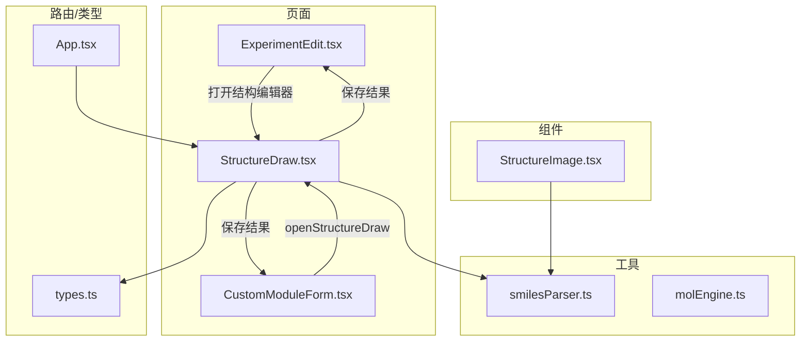
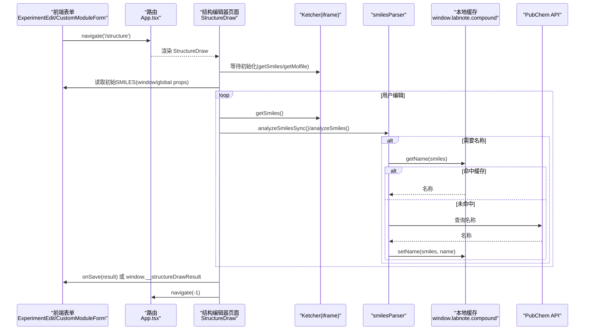
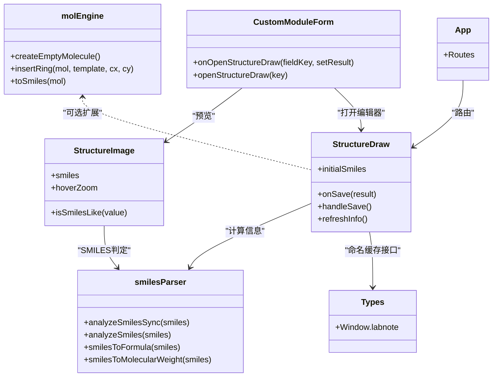

# 化学结构编辑器集成

<cite>
**本文引用的文件**   
- [StructureDraw.tsx](file://src/pages/StructureDraw.tsx)
- [StructureImage.tsx](file://src/components/StructureImage.tsx)
- [smilesParser.ts](file://src/utils/smilesParser.ts)
- [molEngine.ts](file://src/utils/molEngine.ts)
- [CustomModuleForm.tsx](file://src/modules/CustomModuleForm.tsx)
- [ExperimentEdit.tsx](file://src/pages/ExperimentEdit.tsx)
- [App.tsx](file://src/App.tsx)
- [types.ts](file://src/types.ts)
</cite>

## 目录
1. [简介](#简介)
2. [项目结构与角色划分](#项目结构与角色划分)
3. [核心组件与数据模型](#核心组件与数据模型)
4. [架构总览](#架构总览)
5. [关键流程详解](#关键流程详解)
6. [依赖关系分析](#依赖关系分析)
7. [性能与可用性考量](#性能与可用性考量)
8. [故障排查指南](#故障排查指南)
9. [结论](#结论)
10. [附录：字段开发与扩展示例](#附录字段开发与扩展示例)

## 简介
本指南面向需要在 LabNote 自定义表单中集成“化学结构编辑器”的开发者，重点说明 structure 字段类型的特殊处理逻辑、SMILES 格式支持与结构式数据模型；详细解释 openStructureDraw 函数的工作原理（结果回调机制与路由导航）；介绍 StructureImage 组件的结构式渲染能力（分子式、分子量、名称显示）；并提供完整的结构式字段开发示例与化学信息计算、验证的实现方法。

## 项目结构与角色划分
- 页面层
  - 实验编辑页 ExperimentEdit：在标准模块“结构式”处提供绘制入口，并处理保存后的回写逻辑。
  - 结构编辑器页面 StructureDraw：全屏 Ketcher 编辑器，负责 SMILES/Molfile 获取、信息刷新与结果回传。
- 组件层
  - StructureImage：基于 smiles-drawer 将 SMILES 渲染为 SVG，支持悬停放大与降级文本展示。
  - CustomModuleForm：自定义模块表单，内置 structure 字段类型渲染与 openStructureDraw 调用。
- 工具层
  - smilesParser：SMILES 解析、隐式氢计算、分子式生成、分子量计算、PubChem 命名查询与缓存。
  - molEngine：轻量分子数据模型与基础操作（原子/键/环模板/简易 SMILES 生成等）。
- 路由与类型
  - App.tsx：注册 /structure 路由，使用独立布局包裹 StructureDraw。
  - types.ts：定义全局 Window.labnote 接口（含 compound 命名缓存）、模块字段类型等。

图表来源
- [App.tsx:43-64](file://src/App.tsx#L43-L64)
- [ExperimentEdit.tsx:650-750](file://src/pages/ExperimentEdit.tsx#L650-L750)
- [CustomModuleForm.tsx:30-42](file://src/modules/CustomModuleForm.tsx#L30-L42)
- [StructureDraw.tsx:19-44](file://src/pages/StructureDraw.tsx#L19-L44)
- [StructureImage.tsx:21-56](file://src/components/StructureImage.tsx#L21-L56)
- [smilesParser.ts:344-359](file://src/utils/smilesParser.ts#L344-L359)
- [molEngine.ts:22-25](file://src/utils/molEngine.ts#L22-L25)
- [types.ts:233-315](file://src/types.ts#L233-L315)

章节来源
- [App.tsx:43-64](file://src/App.tsx#L43-L64)
- [ExperimentEdit.tsx:650-750](file://src/pages/ExperimentEdit.tsx#L650-L750)
- [CustomModuleForm.tsx:30-42](file://src/modules/CustomModuleForm.tsx#L30-L42)
- [StructureDraw.tsx:19-44](file://src/pages/StructureDraw.tsx#L19-L44)
- [StructureImage.tsx:21-56](file://src/components/StructureImage.tsx#L21-L56)
- [smilesParser.ts:344-359](file://src/utils/smilesParser.ts#L344-L359)
- [molEngine.ts:22-25](file://src/utils/molEngine.ts#L22-L25)
- [types.ts:233-315](file://src/types.ts#L233-L315)

## 核心组件与数据模型
- StructureDraw（结构编辑器页面）
  - 通过 iframe 加载 Ketcher，等待其初始化后读取 SMILES/Molfile。
  - 支持初始 SMILES 注入（从 props 或 window 全局变量），保存时计算分子式、分子量，并异步查询 PubChem 名称。
  - 结果回传策略：优先 onSave 回调；否则写入 window 全局变量并返回上一页。
- StructureImage（结构式预览组件）
  - 动态导入 smiles-drawer，将 SMILES 渲染为 SVG，失败时降级显示原始 SMILES 文本。
  - 可选 hoverZoom 悬停放大弹窗，自动定位避免溢出屏幕。
  - 提供 isSmilesLike 判断值是否为 SMILES 字符串。
- smilesParser（化学信息计算）
  - 解析 SMILES 图，计算隐式氢，生成 Hill 系统分子式与分子量。
  - 通过 PubChem PUG REST API 查询 IUPAC 名称，并优先使用本地 SQLite 缓存（window.labnote.compound）。
  - 提供同步 analyzeSmilesSync 与异步 analyzeSmiles 两种接口。
- molEngine（分子数据模型）
  - 定义 AtomData/BondData/Molecule 等数据结构，以及添加/删除原子键、插入环模板、简单 SMILES 生成等工具函数。
- 自定义模块表单 CustomModuleForm
  - 支持 field.type === 'structure' 的渲染与交互，封装 openStructureDraw 调用，支持 onOpenStructureDraw 回调或路由导航回退。
- 路由与类型
  - App.tsx 注册 /structure 路由并使用无侧边栏的全屏布局。
  - types.ts 声明 Window.labnote 接口，包含 compound.getName/setName 用于命名缓存。

章节来源
- [StructureDraw.tsx:19-44](file://src/pages/StructureDraw.tsx#L19-L44)
- [StructureDraw.tsx:76-94](file://src/pages/StructureDraw.tsx#L76-L94)
- [StructureDraw.tsx:126-169](file://src/pages/StructureDraw.tsx#L126-L169)
- [StructureImage.tsx:21-56](file://src/components/StructureImage.tsx#L21-L56)
- [StructureImage.tsx:160-172](file://src/components/StructureImage.tsx#L160-L172)
- [smilesParser.ts:228-295](file://src/utils/smilesParser.ts#L228-L295)
- [smilesParser.ts:297-334](file://src/utils/smilesParser.ts#L297-L334)
- [smilesParser.ts:344-359](file://src/utils/smilesParser.ts#L344-L359)
- [molEngine.ts:22-25](file://src/utils/molEngine.ts#L22-L25)
- [molEngine.ts:187-212](file://src/utils/molEngine.ts#L187-L212)
- [molEngine.ts:236-265](file://src/utils/molEngine.ts#L236-L265)
- [CustomModuleForm.tsx:30-42](file://src/modules/CustomModuleForm.tsx#L30-L42)
- [CustomModuleForm.tsx:187-221](file://src/modules/CustomModuleForm.tsx#L187-L221)
- [App.tsx:43-64](file://src/App.tsx#L43-L64)
- [types.ts:233-315](file://src/types.ts#L233-L315)

## 架构总览
下图展示了结构编辑器在应用中的整体交互：表单触发 → 路由跳转 → Ketcher 初始化 → 信息计算 → 结果回传。

图表来源
- [App.tsx:59-61](file://src/App.tsx#L59-L61)
- [StructureDraw.tsx:28-44](file://src/pages/StructureDraw.tsx#L28-L44)
- [StructureDraw.tsx:76-94](file://src/pages/StructureDraw.tsx#L76-L94)
- [StructureDraw.tsx:126-169](file://src/pages/StructureDraw.tsx#L126-L169)
- [smilesParser.ts:297-334](file://src/utils/smilesParser.ts#L297-L334)
- [smilesParser.ts:344-359](file://src/utils/smilesParser.ts#L344-L359)

## 关键流程详解

### 1) structure 字段类型的特殊处理逻辑
- 字段定义
  - ModuleField.type 支持 'structure'，用于标识结构式字段。
- 渲染行为
  - 当 value 存在且包含 smiles 时，使用 StructureImage 渲染结构式，同时展示分子式、分子量与名称。
  - 点击“绘制/编辑”按钮触发 openStructureDraw。
- 数据模型
  - 结构式字段期望值为对象，至少包含 smiles，并可携带 formula、molecularWeight、name 等元信息。
- 回写策略
  - 若传入 onOpenStructureDraw 回调，则直接通过 setResult 更新当前字段值。
  - 否则采用路由导航到 /structure，并通过 window 全局变量传递初始 SMILES 与结果回调。

章节来源
- [types.ts:158-166](file://src/types.ts#L158-L166)
- [CustomModuleForm.tsx:187-221](file://src/modules/CustomModuleForm.tsx#L187-L221)
- [CustomModuleForm.tsx:30-42](file://src/modules/CustomModuleForm.tsx#L30-L42)

### 2) SMILES 格式支持与结构式数据模型
- 解析与计算
  - smilesToAtomCounts：解析 SMILES 图，统计显式/隐式氢，得到元素计数。
  - atomCountsToFormula：按 Hill 系统输出分子式（C/H 优先，其余字母序）。
  - atomCountsToWeight：根据原子量表计算分子量。
  - analyzeSmilesSync：同步计算分子式与分子量。
  - analyzeSmiles：异步补充 PubChem 名称。
- 命名缓存
  - 优先通过 window.labnote.compound.getName 查询本地 SQLite 缓存；未命中则调用 PubChem PUG REST API，并将结果缓存至 setName。
- 结构式数据模型
  - Molecule 由 AtomData[] 与 BondData[] 组成，支持增删改查、环模板插入、简单 SMILES 生成等。

章节来源
- [smilesParser.ts:228-295](file://src/utils/smilesParser.ts#L228-L295)
- [smilesParser.ts:297-334](file://src/utils/smilesParser.ts#L297-L334)
- [smilesParser.ts:344-359](file://src/utils/smilesParser.ts#L344-L359)
- [molEngine.ts:22-25](file://src/utils/molEngine.ts#L22-L25)
- [molEngine.ts:187-212](file://src/utils/molEngine.ts#L187-L212)
- [molEngine.ts:236-265](file://src/utils/molEngine.ts#L236-L265)
- [types.ts:293-296](file://src/types.ts#L293-L296)

### 3) openStructureDraw 函数的工作原理
- 回调模式
  - 父组件可传入 onOpenStructureDraw(fieldKey, setResult)，子组件内部直接调用 setResult(result) 完成回写，无需路由跳转。
- 路由回退模式
  - 未提供回调时，将当前字段的 smiles 写入 window.__structureInitialSmiles，设置 window.structureDrawResult 回调，然后 navigate('/structure')。
  - StructureDraw 页面启动时读取 initialSmiles 或 window.__structureInitialSmiles，并在保存时将结果写入 window.__structureDrawResult 并返回上一页。
- 注意
  - 为避免跨帧访问受限，StructureDraw 在调用 Ketcher API 前会尝试 focus iframe.contentWindow。

章节来源
- [CustomModuleForm.tsx:30-42](file://src/modules/CustomModuleForm.tsx#L30-L42)
- [StructureDraw.tsx:28-44](file://src/pages/StructureDraw.tsx#L28-L44)
- [StructureDraw.tsx:64-74](file://src/pages/StructureDraw.tsx#L64-L74)
- [StructureDraw.tsx:157-169](file://src/pages/StructureDraw.tsx#L157-L169)

### 4) StructureImage 组件的结构式渲染功能
- 渲染流程
  - 动态 import('smiles-drawer')，调用 SmilesDrawer.parse 生成树，再用 SvgDrawer.draw 输出 SVG HTML。
  - 渲染失败时，error 状态为 true，显示原始 SMILES 文本作为降级提示。
- 悬停放大
  - 可选 hoverZoom，预渲染大图并弹出固定定位的浮层，自动计算 left/top 避免越界。
- 辅助判断
  - isSmilesLike：快速判断字符串是否像 SMILES（排除 data/http/labnote 协议与图片后缀，匹配常见 SMILES 特征字符）。

章节来源
- [StructureImage.tsx:21-56](file://src/components/StructureImage.tsx#L21-L56)
- [StructureImage.tsx:84-90](file://src/components/StructureImage.tsx#L84-L90)
- [StructureImage.tsx:92-110](file://src/components/StructureImage.tsx#L92-L110)
- [StructureImage.tsx:160-172](file://src/components/StructureImage.tsx#L160-L172)

### 5) 结构式编辑器的集成方式（初始数据与结果回传）
- 实验编辑页集成
  - 点击“编辑结构式”时，将 form.structure_image 作为初始 SMILES 传入，设置结构保存回调，打开结构编辑器。
  - 保存成功后，将 result.smiles 写回 form.structure_image，若 result.name 存在且标题为空，则自动填充标题。
- 自定义模块表单集成
  - 通过 onOpenStructureDraw 或直接路由导航两种方式，均能实现初始数据传递与结果回写。

章节来源
- [ExperimentEdit.tsx:661-711](file://src/pages/ExperimentEdit.tsx#L661-L711)
- [CustomModuleForm.tsx:30-42](file://src/modules/CustomModuleForm.tsx#L30-L42)

### 6) 化学信息计算与验证
- 计算
  - 同步：analyzeSmilesSync 返回 { smiles, formula, molecularWeight }。
  - 异步：analyzeSmiles 额外返回 name（优先本地缓存，其次 PubChem）。
- 验证
  - 可使用 isSmilesLike 做初步校验；更严格的校验可在保存前调用 smilesToFormula/smilesToMolecularWeight 进行一致性检查。
  - 对于复杂结构，建议结合 Ketcher 的 getSmiles 返回值进行二次确认。

章节来源
- [smilesParser.ts:344-359](file://src/utils/smilesParser.ts#L344-L359)
- [StructureImage.tsx:160-172](file://src/components/StructureImage.tsx#L160-L172)

## 依赖关系分析
- 组件耦合
  - StructureDraw 依赖 smilesParser 进行信息计算，依赖 types.ts 的 Window.labnote 接口进行命名缓存。
  - CustomModuleForm 依赖 StructureImage 进行预览，依赖 openStructureDraw 控制编辑器打开与结果回写。
  - ExperimentEdit 通过 ref 与状态管理结构式字段，并与 StructureDraw 协作。
- 外部依赖
  - Ketcher：通过 iframe 嵌入，提供 setMolecule/getSmiles/getMolfile 等 API。
  - smiles-drawer：浏览器端 SMILES→SVG 渲染库。
  - PubChem PUG REST：在线化合物名称查询。
- 潜在循环依赖
  - 当前未见循环引用；页面与组件之间通过 props/callback 解耦。

图表来源
- [StructureDraw.tsx:19-44](file://src/pages/StructureDraw.tsx#L19-L44)
- [CustomModuleForm.tsx:30-42](file://src/modules/CustomModuleForm.tsx#L30-L42)
- [StructureImage.tsx:21-56](file://src/components/StructureImage.tsx#L21-L56)
- [smilesParser.ts:344-359](file://src/utils/smilesParser.ts#L344-L359)
- [molEngine.ts:187-212](file://src/utils/molEngine.ts#L187-L212)
- [App.tsx:59-61](file://src/App.tsx#L59-L61)
- [types.ts:293-296](file://src/types.ts#L293-L296)

## 性能与可用性考量
- 懒加载与按需引入
  - StructureDraw 使用 React.lazy 延迟加载，减少首屏体积。
  - StructureImage 动态 import('smiles-drawer')，仅在需要时加载渲染库。
- 渲染优化
  - StructureImage 预渲染大图用于悬停放大，避免交互时的卡顿。
  - 渲染失败降级为文本，提升鲁棒性。
- 网络请求
  - PubChem 名称查询异步执行，默认超时保护（例如在保存流程中使用 Promise.race 限制等待时间）。
- 用户体验
  - 清空画布时直接重载 iframe，避免复杂结构导致 Ketcher 内部卡死。
  - 保存按钮禁用态防止重复提交。

[本节为通用指导，不直接分析具体文件]

## 故障排查指南
- Ketcher 初始化失败
  - 现象：无法调用 getSmiles/getMolfile。
  - 排查：检查 iframe 是否成功加载；确保在调用前 focus contentWindow；增加等待超时与错误提示。
- 名称查询超时
  - 现象：名称始终为空或长时间等待。
  - 排查：检查网络连通性与 PubChem 服务；确认已启用本地缓存；必要时缩短超时时间。
- SMILES 渲染失败
  - 现象：StructureImage 显示空白或报错。
  - 排查：确认输入为合法 SMILES；查看 isSmilesLike 判定；检查 smiles-drawer 是否成功加载。
- 结果回写无效
  - 现象：保存后字段未更新。
  - 排查：确认 onSave 回调是否正确设置；或在路由模式下检查 window.__structureDrawResult 是否被调用。

章节来源
- [StructureDraw.tsx:46-58](file://src/pages/StructureDraw.tsx#L46-L58)
- [StructureDraw.tsx:179-192](file://src/pages/StructureDraw.tsx#L179-L192)
- [StructureImage.tsx:78-81](file://src/components/StructureImage.tsx#L78-L81)
- [smilesParser.ts:297-334](file://src/utils/smilesParser.ts#L297-L334)

## 结论
LabNote 的化学结构编辑器集成以 StructureDraw 为核心，结合 smilesParser 与 StructureImage，实现了从绘制、计算到展示的完整链路。通过 onOpenStructureDraw 回调与路由回退两种模式，灵活适配不同表单场景。配合本地命名缓存与 PubChem 在线查询，既保证性能又增强信息丰富度。建议在业务中充分利用同步/异步计算接口，并结合 isSmilesLike 进行前置校验，以获得稳定可靠的体验。

[本节为总结，不直接分析具体文件]

## 附录：字段开发与扩展示例

### A. 在自定义模块中添加 structure 字段
- 步骤
  - 在模板字段定义中将 type 设为 'structure'。
  - 在表单中渲染时，value 应包含 smiles，可选附带 formula/molecularWeight/name。
  - 通过 onOpenStructureDraw 或路由模式打开编辑器，保存后将结果写回字段。
- 参考路径
  - 字段类型定义：[types.ts:158-166](file://src/types.ts#L158-L166)
  - 渲染与交互：[CustomModuleForm.tsx:187-221](file://src/modules/CustomModuleForm.tsx#L187-L221)
  - 打开编辑器逻辑：[CustomModuleForm.tsx:30-42](file://src/modules/CustomModuleForm.tsx#L30-L42)

### B. 在实验编辑页集成结构式字段
- 步骤
  - 在“结构式”模块区域，点击“编辑结构式”，将现有 SMILES 作为初始值传入。
  - 保存后，将 result.smiles 写回 form.structure_image，并根据 result.name 自动填充标题。
- 参考路径
  - 编辑入口与回写：[ExperimentEdit.tsx:661-711](file://src/pages/ExperimentEdit.tsx#L661-L711)

### C. 自定义结构式处理逻辑与扩展
- 扩展点
  - 在 StructureDraw 的 handleSave 中，可增加额外的计算或校验逻辑（如立体化学检查、官能团识别）。
  - 在 smilesParser 中扩展更多属性（如同位素、电荷规范化、芳香性修正）。
  - 在 molEngine 中扩展 SMILES 生成器，支持更复杂的分支与环闭合规则。
- 参考路径
  - 保存流程：[StructureDraw.tsx:126-169](file://src/pages/StructureDraw.tsx#L126-L169)
  - 同步/异步计算：[smilesParser.ts:344-359](file://src/utils/smilesParser.ts#L344-L359)
  - 分子引擎工具：[molEngine.ts:187-212](file://src/utils/molEngine.ts#L187-L212), [molEngine.ts:236-265](file://src/utils/molEngine.ts#L236-L265)

### D. 化学信息计算与验证实现方法
- 计算
  - 使用 analyzeSmilesSync 快速获取分子式与分子量。
  - 使用 analyzeSmiles 获取名称（带缓存）。
- 验证
  - 使用 isSmilesLike 进行初步过滤。
  - 对复杂结构，结合 Ketcher.getSmiles 的结果进行二次校验。
- 参考路径
  - 计算接口：[smilesParser.ts:344-359](file://src/utils/smilesParser.ts#L344-L359)
  - SMILES 判定：[StructureImage.tsx:160-172](file://src/components/StructureImage.tsx#L160-L172)