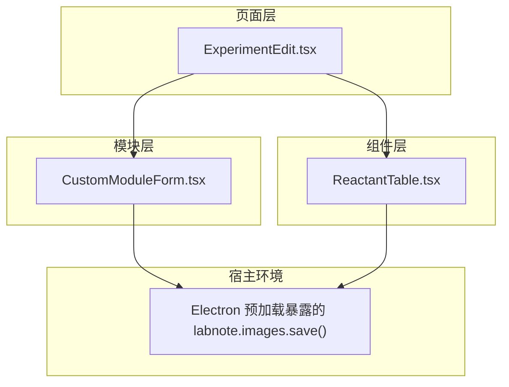
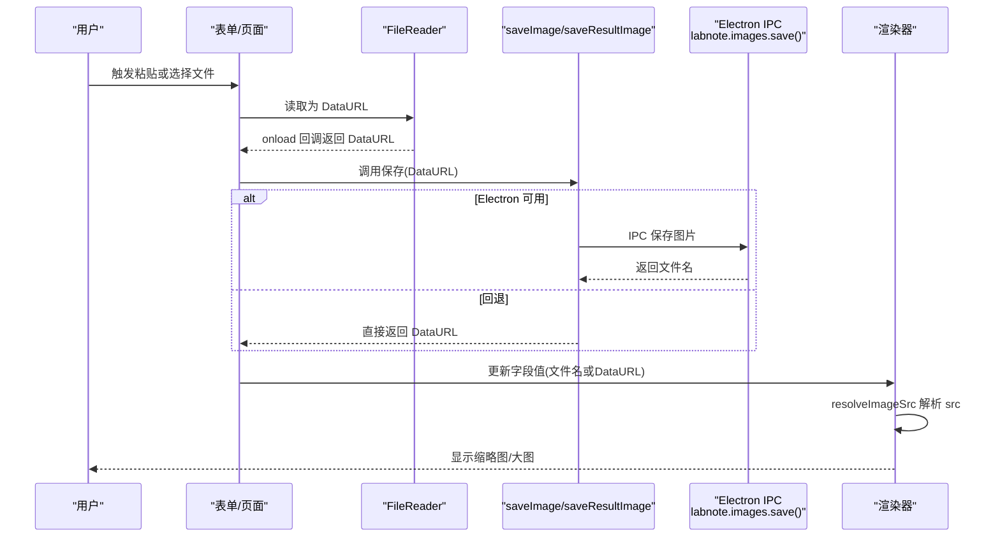
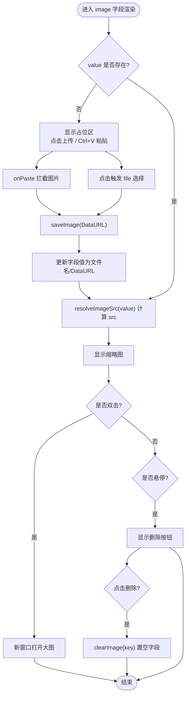
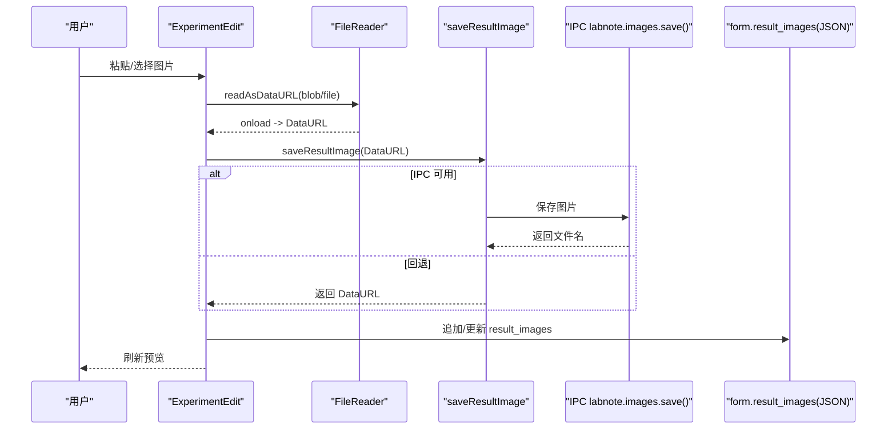
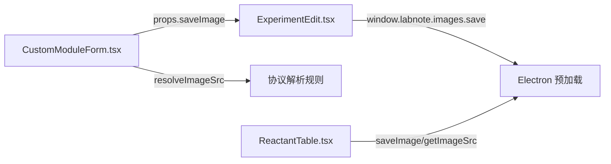

# 图片上传与粘贴

<cite>
**本文引用的文件**
- [CustomModuleForm.tsx](file://src/modules/CustomModuleForm.tsx)
- [ExperimentEdit.tsx](file://src/pages/ExperimentEdit.tsx)
- [ReactantTable.tsx](file://src/components/ReactantTable.tsx)
</cite>

## 目录
1. [简介](#简介)
2. [项目结构](#项目结构)
3. [核心组件](#核心组件)
4. [架构总览](#架构总览)
5. [详细组件分析](#详细组件分析)
6. [依赖关系分析](#依赖关系分析)
7. [性能考虑](#性能考虑)
8. [故障排查指南](#故障排查指南)
9. [结论](#结论)

## 简介
本文件面向 LabNote 自定义表单的图片上传与粘贴能力，聚焦以下实现细节：
- 剪贴板事件监听与处理（handleImagePaste）
- 本地文件选择与读取（handleImageFile）
- Base64 编码与存储管理（saveImage/saveResultImage）
- 图片源解析策略（resolveImageSrc）
- 预览显示与删除交互
- 错误处理、加载状态与用户反馈
- 性能优化建议与兼容性注意事项

## 项目结构
与图片上传和粘贴相关的代码主要分布在三个文件中：
- 自定义模块表单渲染与交互：src/modules/CustomModuleForm.tsx
- 实验编辑页中的结果图上传与保存：src/pages/ExperimentEdit.tsx
- 通用图片工具函数（含 IPC 回退逻辑）：src/components/ReactantTable.tsx

图表来源
- [CustomModuleForm.tsx:1-242](file://src/modules/CustomModuleForm.tsx#L1-L242)
- [ExperimentEdit.tsx:120-180](file://src/pages/ExperimentEdit.tsx#L120-L180)
- [ReactantTable.tsx:70-88](file://src/components/ReactantTable.tsx#L70-L88)

章节来源
- [CustomModuleForm.tsx:1-242](file://src/modules/CustomModuleForm.tsx#L1-L242)
- [ExperimentEdit.tsx:120-180](file://src/pages/ExperimentEdit.tsx#L120-L180)
- [ReactantTable.tsx:70-88](file://src/components/ReactantTable.tsx#L70-L88)

## 核心组件
- CustomModuleForm：负责自定义模板字段渲染，包含 image 类型字段的粘贴、上传、预览与删除。
- ExperimentEdit：提供结果图的上传入口，封装 saveResultImage 与图片列表管理。
- ReactantTable：提供通用的 saveImage 工具函数，用于在 Electron 环境下通过 IPC 保存图片并返回文件名；若不可用则回退为 data URL。

章节来源
- [CustomModuleForm.tsx:44-81](file://src/modules/CustomModuleForm.tsx#L44-L81)
- [ExperimentEdit.tsx:125-154](file://src/pages/ExperimentEdit.tsx#L125-L154)
- [ReactantTable.tsx:70-88](file://src/components/ReactantTable.tsx#L70-L88)

## 架构总览
图片从“输入”到“持久化”再到“展示”的整体流程如下：

图表来源
- [CustomModuleForm.tsx:48-78](file://src/modules/CustomModuleForm.tsx#L48-L78)
- [ExperimentEdit.tsx:125-148](file://src/pages/ExperimentEdit.tsx#L125-L148)
- [ReactantTable.tsx:70-88](file://src/components/ReactantTable.tsx#L70-L88)

## 详细组件分析

### 自定义模块表单（image 字段）
- 粘贴处理 handleImagePaste
  - 监听 onPaste 事件，遍历 clipboardData.items，筛选出类型为 image/* 的项目。
  - 使用 FileReader.readAsDataURL 将 Blob 转为 DataURL。
  - 调用传入的 saveImage(dataUrl) 进行持久化，成功后将返回值写入对应字段。
  - 阻止默认粘贴行为，避免插入富文本内容。
- 文件选择处理 handleImageFile
  - 监听 input[type=file] 的 change 事件，取第一个文件并校验类型是否为 image/*。
  - 同样通过 FileReader 转 DataURL，再调用 saveImage 持久化。
  - 清空 input.value 以支持重复选择同一文件。
- 预览与删除
  - 当字段有值时，使用 resolveImageSrc(value) 生成 img.src，显示缩略图。
  - 双击可在新窗口打开大图。
  - 悬停显示删除按钮，点击后调用 clearImage(key) 将字段置空。
- 图片源解析 resolveImageSrc
  - 若 value 为空返回空串。
  - 若 value 以 data:、labnote: 或 http: 开头，直接返回。
  - 否则视为文件名，拼接为 labnote://images/{filename}。

图表来源
- [CustomModuleForm.tsx:14-18](file://src/modules/CustomModuleForm.tsx#L14-L18)
- [CustomModuleForm.tsx:48-81](file://src/modules/CustomModuleForm.tsx#L48-L81)
- [CustomModuleForm.tsx:146-185](file://src/modules/CustomModuleForm.tsx#L146-L185)

章节来源
- [CustomModuleForm.tsx:14-18](file://src/modules/CustomModuleForm.tsx#L14-L18)
- [CustomModuleForm.tsx:48-81](file://src/modules/CustomModuleForm.tsx#L48-L81)
- [CustomModuleForm.tsx:146-185](file://src/modules/CustomModuleForm.tsx#L146-L185)

### 实验编辑页（结果图上传）
- 保存函数 saveResultImage
  - 优先尝试通过 window.labnote.images.save(dataUrl) 调用 Electron IPC 保存图片，成功返回文件名。
  - 捕获异常后回退为直接返回 DataURL，保证在无 IPC 环境仍可工作。
- 结果图列表管理
  - addResultImage：保存单张图并追加到 result_images JSON 数组中。
  - removeResultImage：按索引移除并更新 JSON。
  - getResultImages：安全解析 JSON，失败时返回空数组。
- 粘贴与文件选择
  - handleResultPaste：与自定义表单一致的剪贴板图片读取与保存流程。
  - handleResultFileSelect：与自定义表单一致的文件选择与保存流程。

图表来源
- [ExperimentEdit.tsx:125-154](file://src/pages/ExperimentEdit.tsx#L125-L154)
- [ExperimentEdit.tsx:156-179](file://src/pages/ExperimentEdit.tsx#L156-L179)

章节来源
- [ExperimentEdit.tsx:125-154](file://src/pages/ExperimentEdit.tsx#L125-L154)
- [ExperimentEdit.tsx:156-179](file://src/pages/ExperimentEdit.tsx#L156-L179)

### 通用图片工具（ReactantTable）
- saveImage(dataUrl)
  - 尝试通过 (window as any).labnote.images.save(dataUrl) 保存图片，成功返回文件名。
  - 捕获异常后 console.warn 并回退为返回原始 DataURL。
- getImageSrc(value)
  - 与 resolveImageSrc 类似的解析逻辑，兼容 data:、http:、labnote: 以及纯文件名前缀。

章节来源
- [ReactantTable.tsx:70-88](file://src/components/ReactantTable.tsx#L70-L88)

## 依赖关系分析
- 自定义模块表单依赖父级传入的 saveImage 回调，该回调由实验编辑页注入，实际指向 saveResultImage。
- 两者均可能依赖 Electron 预加载脚本暴露的 labnote.images.save API；不可用时自动回退为 DataURL。
- 图片源解析统一遵循三种协议直返与纯文件名补全的策略。

图表来源
- [CustomModuleForm.tsx:9-12](file://src/modules/CustomModuleForm.tsx#L9-L12)
- [ExperimentEdit.tsx:125-137](file://src/pages/ExperimentEdit.tsx#L125-L137)
- [ReactantTable.tsx:70-88](file://src/components/ReactantTable.tsx#L70-L88)

章节来源
- [CustomModuleForm.tsx:9-12](file://src/modules/CustomModuleForm.tsx#L9-L12)
- [ExperimentEdit.tsx:125-137](file://src/pages/ExperimentEdit.tsx#L125-L137)
- [ReactantTable.tsx:70-88](file://src/components/ReactantTable.tsx#L70-L88)

## 性能考虑
- 大图片压缩与尺寸限制
  - 建议在 saveImage 之前对图片进行压缩与缩放，减少 IPC 传输与磁盘占用。
  - 可在前端增加大小阈值判断，超过阈值提示用户或自动压缩。
- 异步与并发
  - 批量粘贴多张图片时应串行保存，避免同时触发多次 IPC 导致阻塞。
- 内存与缓存
  - 避免长时间持有大量 DataURL 引用，及时释放 DOM 节点引用。
  - 对于已保存为文件的图片，尽量使用 labnote:// 或 http: 地址，避免在内存中重复存放二进制数据。
- 渲染优化
  - 缩略图使用固定高度与 object-contain，减少重排。
  - 大图仅在双击时打开新窗口，避免主界面渲染大图。

[本节为通用指导，不直接分析具体文件]

## 故障排查指南
- 粘贴无效
  - 检查 onPaste 是否被其他组件拦截或 preventDefault 顺序是否正确。
  - 确认 clipboardData.items 中存在 image/* 类型条目。
- 文件选择无响应
  - 确保 input[type=file] 的 accept="image/*" 且未被隐藏元素遮挡。
  - 每次选择后重置 e.target.value 以便重复选择同一文件。
- 保存失败回退
  - 若 IPC 不可用，saveImage/saveResultImage 会回退为 DataURL，此时图片不会落盘，仅保存在内存中。
  - 可通过控制台警告信息定位 IPC 调用失败原因。
- 图片无法显示
  - 检查 resolveImageSrc 生成的 src 是否符合预期（data:/labnote:/http: 或 labnote://images/xxx）。
  - 确认 Electron 侧路由能正确解析 labnote://images/ 路径。

章节来源
- [ReactantTable.tsx:70-88](file://src/components/ReactantTable.tsx#L70-L88)
- [ExperimentEdit.tsx:125-137](file://src/pages/ExperimentEdit.tsx#L125-L137)
- [CustomModuleForm.tsx:14-18](file://src/modules/CustomModuleForm.tsx#L14-L18)

## 结论
LabNote 自定义表单的图片上传与粘贴功能通过统一的剪贴板监听、文件读取与 Base64 转换，结合 Electron IPC 的持久化能力，实现了跨场景的图片处理体验。resolveImageSrc 提供了灵活的图片源解析策略，兼容 data URL、labnote 协议与 http 链接。通过合理的错误回退与用户交互设计，系统在多种运行环境下具备良好鲁棒性。后续可在图片压缩、大小限制与并发控制方面进一步优化，以提升整体性能与用户体验。