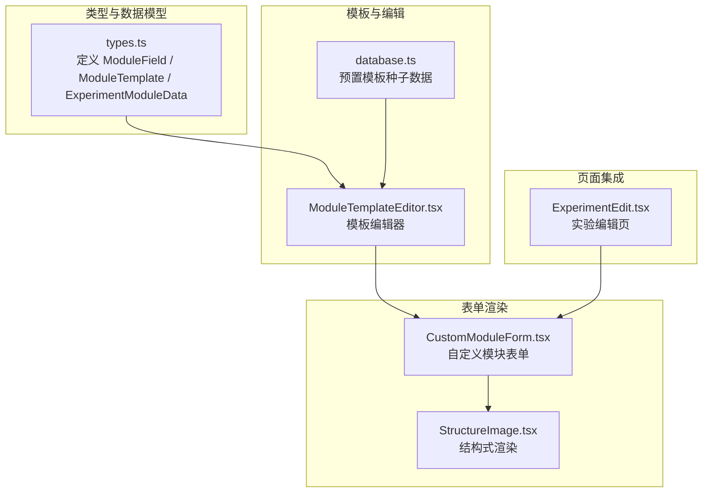
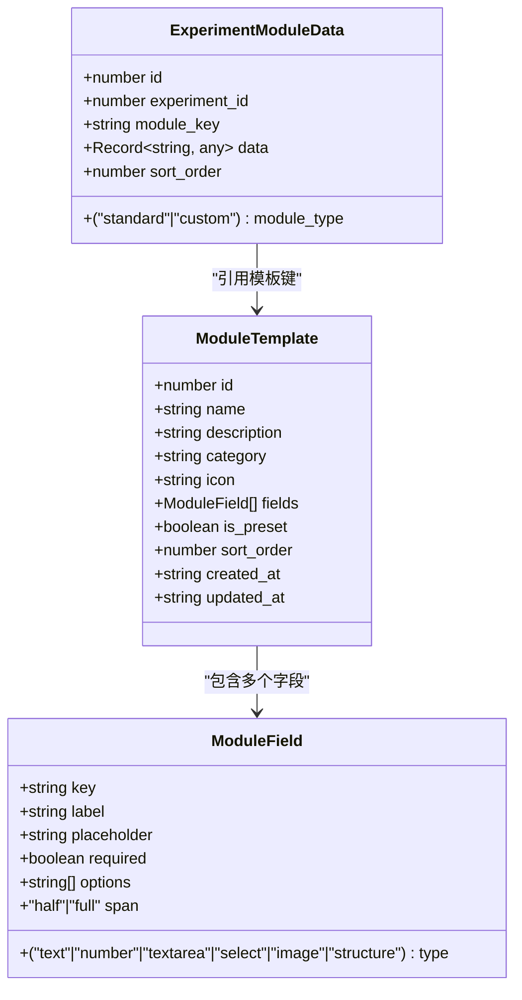
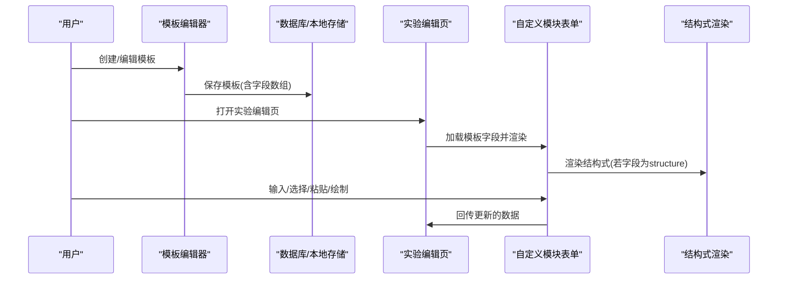
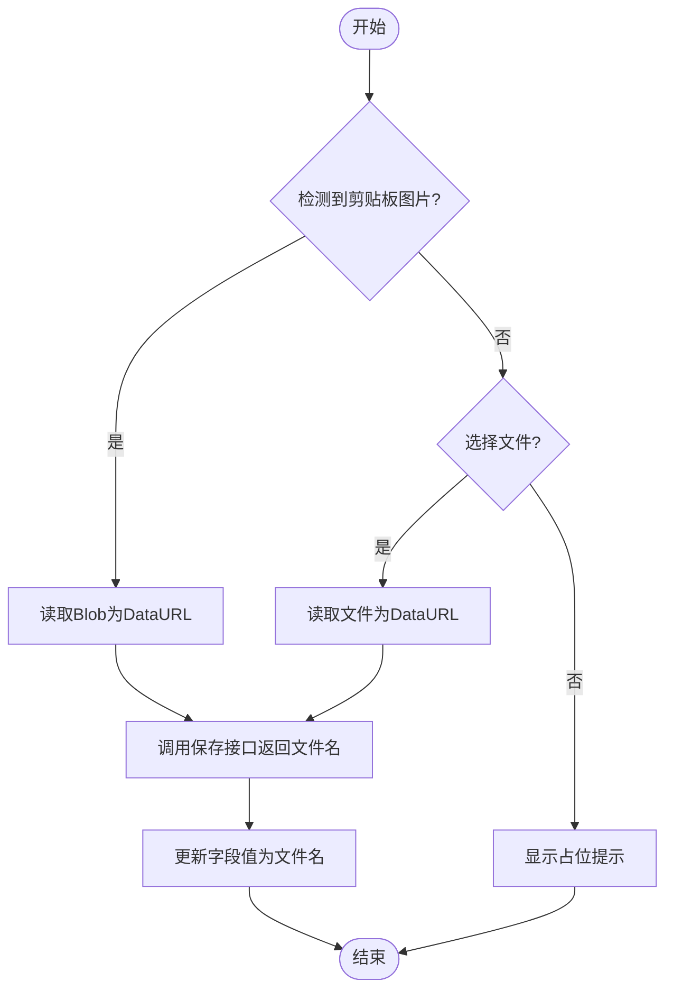
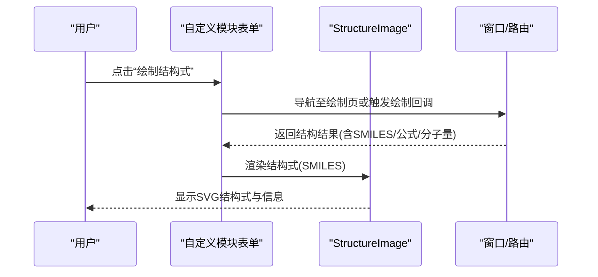
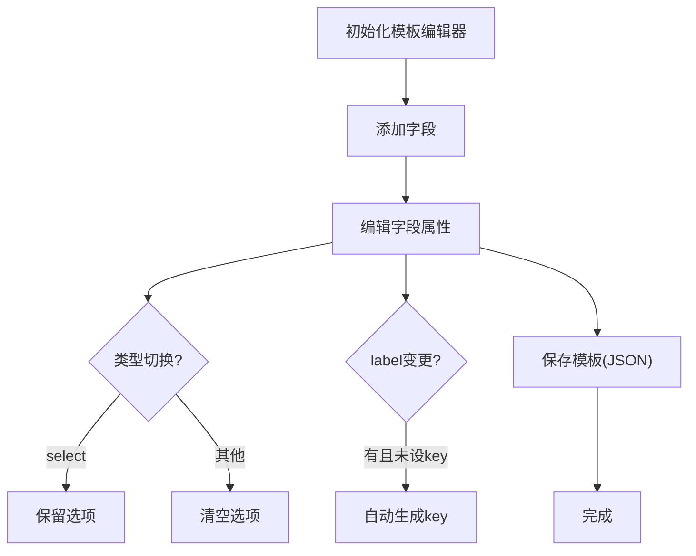
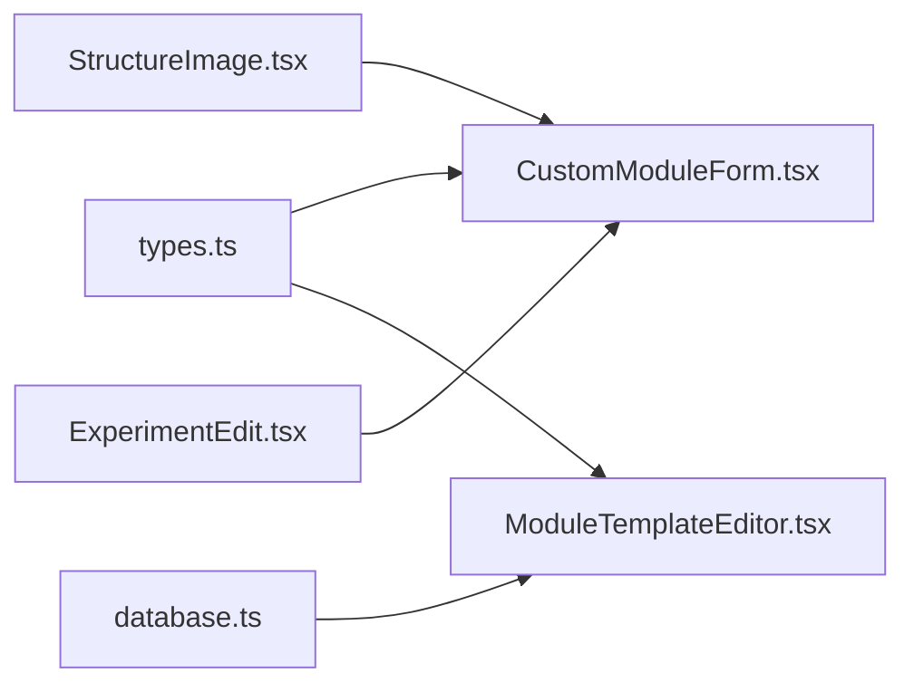

# 字段类型配置

<cite>
**本文引用的文件列表**
- [types.ts](file://src/types.ts)
- [CustomModuleForm.tsx](file://src/modules/CustomModuleForm.tsx)
- [ModuleTemplateEditor.tsx](file://src/modules/ModuleTemplateEditor.tsx)
- [StructureImage.tsx](file://src/components/StructureImage.tsx)
- [ExperimentEdit.tsx](file://src/pages/ExperimentEdit.tsx)
- [database.ts](file://electron/database.ts)
</cite>

## 目录
1. [简介](#简介)
2. [项目结构与相关组件](#项目结构与相关组件)
3. [核心类型与字段模型](#核心类型与字段模型)
4. [架构总览](#架构总览)
5. [字段类型详解与配置](#字段类型详解与配置)
6. [模板编辑器与字段生成流程](#模板编辑器与字段生成流程)
7. [依赖关系与耦合分析](#依赖关系与耦合分析)
8. [性能与可用性考量](#性能与可用性考量)
9. [故障排查指南](#故障排查指南)
10. [结论](#结论)

## 简介
本文件面向LabNote的“自定义模块”表单系统，系统化梳理并解释字段类型配置，覆盖以下类型：text、textarea、number、select、image、structure，并给出属性定义、特殊配置项、渲染行为、交互细节与验证建议。文档同时提供模板编辑器的工作流说明，帮助读者理解从“模板定义”到“表单渲染”的完整链路。

## 项目结构与相关组件
- 字段类型与模板定义集中在类型声明文件中，用于约束模板字段与表单数据结构。
- 自定义模块表单渲染由专用组件负责，按字段类型分支渲染对应输入控件。
- 模板编辑器允许用户创建/修改字段集合，自动校验必要字段并生成模板。
- 化学结构式通过独立组件进行渲染，支持SMILES字符串可视化与悬停放大。
- 实验编辑页集成模块系统，负责布局、可见性控制与数据持久化。

图表来源
- [types.ts:158-188](file://src/types.ts#L158-L188)
- [ModuleTemplateEditor.tsx:13-20](file://src/modules/ModuleTemplateEditor.tsx#L13-L20)
- [CustomModuleForm.tsx:88-241](file://src/modules/CustomModuleForm.tsx#L88-L241)
- [StructureImage.tsx:21-158](file://src/components/StructureImage.tsx#L21-L158)
- [ExperimentEdit.tsx:67-120](file://src/pages/ExperimentEdit.tsx#L67-L120)

章节来源
- [types.ts:158-188](file://src/types.ts#L158-L188)
- [ModuleTemplateEditor.tsx:13-20](file://src/modules/ModuleTemplateEditor.tsx#L13-L20)
- [CustomModuleForm.tsx:88-241](file://src/modules/CustomModuleForm.tsx#L88-L241)
- [StructureImage.tsx:21-158](file://src/components/StructureImage.tsx#L21-L158)
- [ExperimentEdit.tsx:67-120](file://src/pages/ExperimentEdit.tsx#L67-L120)

## 核心类型与字段模型
- ModuleField：定义单个字段的元数据，包括键名、标签、类型、占位提示、必填标记、跨度、可选选项等。
- ModuleTemplate：模块模板，包含模板基本信息与字段数组。
- ExperimentModuleData：实验中使用的模块实例数据，以键值对形式存储。

图表来源
- [types.ts:158-188](file://src/types.ts#L158-L188)

章节来源
- [types.ts:158-188](file://src/types.ts#L158-L188)

## 架构总览
- 模板定义阶段：用户在模板编辑器中创建字段集合，系统进行基础校验并保存为模板。
- 表单渲染阶段：根据模板字段动态生成表单控件，绑定数据更新回调。
- 特殊控件：图像字段支持粘贴/文件上传；结构式字段支持绘制与SMILES渲染。
- 页面集成：实验编辑页管理模块布局、可见性与数据持久化。

图表来源
- [ModuleTemplateEditor.tsx:68-129](file://src/modules/ModuleTemplateEditor.tsx#L68-L129)
- [ExperimentEdit.tsx:554-568](file://src/pages/ExperimentEdit.tsx#L554-L568)
- [CustomModuleForm.tsx:20-46](file://src/modules/CustomModuleForm.tsx#L20-L46)
- [StructureImage.tsx:21-81](file://src/components/StructureImage.tsx#L21-L81)

## 字段类型详解与配置
以下为六种字段类型的属性定义、渲染行为与特殊处理逻辑的系统化说明。

### 基础属性
- key：字段唯一标识，用于数据存取与模板关联。
- label：显示标签，支持必填星号标记。
- type：字段类型，取值限定于 text、textarea、number、select、image、structure。
- placeholder：占位提示文本。
- required：是否必填，影响标签渲染与校验策略。
- span：布局跨度，half 或 full，决定网格列跨度。
- options：仅 select 类型有效，表示下拉选项数组。

章节来源
- [types.ts:158-166](file://src/types.ts#L158-L166)
- [CustomModuleForm.tsx:92-97](file://src/modules/CustomModuleForm.tsx#L92-L97)

### 文本字段 text
- 控件：单行文本输入框。
- 行为：双向绑定 value，onChange 更新数据。
- 占位提示：使用 placeholder 属性。
- 必填标记：label 后追加红色星号。

章节来源
- [CustomModuleForm.tsx:223-236](file://src/modules/CustomModuleForm.tsx#L223-L236)

### 多行文本字段 textarea
- 控件：多行文本域，支持上下拖拽调整大小。
- 行为：双向绑定 value，onChange 更新数据。
- 占位提示：使用 placeholder 属性。
- 布局：span='full' 时占据整行。

章节来源
- [CustomModuleForm.tsx:100-112](file://src/modules/CustomModuleForm.tsx#L100-L112)

### 数字字段 number
- 控件：数值输入框，步进值为任意精度。
- 行为：onChange 解析为浮点数，空值转为 null。
- 占位提示：使用 placeholder 属性。
- 必填标记：label 后追加红色星号。

章节来源
- [CustomModuleForm.tsx:131-144](file://src/modules/CustomModuleForm.tsx#L131-L144)

### 下拉选择字段 select
- 控件：下拉选择框，带空选项占位。
- 选项来源：读取字段的 options 数组。
- 行为：onChange 更新所选值。
- 特殊：当字段类型切换非 select 时，会清空 options。

章节来源
- [CustomModuleForm.tsx:114-129](file://src/modules/CustomModuleForm.tsx#L114-L129)
- [ModuleTemplateEditor.tsx:22-62](file://src/modules/ModuleTemplateEditor.tsx#L22-L62)
- [ModuleTemplateEditor.tsx:94-97](file://src/modules/ModuleTemplateEditor.tsx#L94-L97)

### 图片字段 image
- 控件：拖拽/粘贴/文件选择区域，支持双击放大查看。
- 数据存储：保存为本地路径或数据URL，解析时自动识别 labnote:// 前缀。
- 交互：
  - 粘贴：监听剪贴板图片，读取后调用保存接口并回填文件名。
  - 文件：选择图片后读取并保存，回填文件名。
  - 清除：点击清除按钮将字段置空。
- 布局：span='full' 时占据整行。

图表来源
- [CustomModuleForm.tsx:48-80](file://src/modules/CustomModuleForm.tsx#L48-L80)

章节来源
- [CustomModuleForm.tsx:146-185](file://src/modules/CustomModuleForm.tsx#L146-L185)

### 化学结构式字段 structure
- 控件：SMILES 可视化渲染，支持编辑与移除。
- 渲染：使用 StructureImage 组件，内部通过 SMILES Drawer 渲染 SVG。
- 交互：
  - 已有结构：显示结构式与分子式/MW/名称信息，支持编辑与移除。
  - 无结构：显示“绘制结构式”按钮，打开绘制界面。
- 数据结构：通常为包含 SMILES、分子式、分子量、名称的对象。

图表来源
- [CustomModuleForm.tsx:30-42](file://src/modules/CustomModuleForm.tsx#L30-L42)
- [StructureImage.tsx:21-81](file://src/components/StructureImage.tsx#L21-L81)

章节来源
- [CustomModuleForm.tsx:187-221](file://src/modules/CustomModuleForm.tsx#L187-L221)
- [StructureImage.tsx:21-158](file://src/components/StructureImage.tsx#L21-L158)

## 模板编辑器与字段生成流程
- 字段类型选择：支持 text、textarea、number、select、image、structure 六种类型。
- 选项输入：select 类型的选项通过逗号/中文逗号分隔的文本输入，实时同步为数组。
- 键名生成：当 label 变更且未设置 key 时，自动从标签生成合法键名。
- 类型切换：切换为非 select 时，自动清空 options。
- 校验与保存：校验模块名称与字段存在性，最终将字段数组序列化保存。

图表来源
- [ModuleTemplateEditor.tsx:64-66](file://src/modules/ModuleTemplateEditor.tsx#L64-L66)
- [ModuleTemplateEditor.tsx:83-99](file://src/modules/ModuleTemplateEditor.tsx#L83-L99)
- [ModuleTemplateEditor.tsx:107-129](file://src/modules/ModuleTemplateEditor.tsx#L107-L129)

章节来源
- [ModuleTemplateEditor.tsx:13-20](file://src/modules/ModuleTemplateEditor.tsx#L13-L20)
- [ModuleTemplateEditor.tsx:22-62](file://src/modules/ModuleTemplateEditor.tsx#L22-L62)
- [ModuleTemplateEditor.tsx:64-66](file://src/modules/ModuleTemplateEditor.tsx#L64-L66)
- [ModuleTemplateEditor.tsx:83-99](file://src/modules/ModuleTemplateEditor.tsx#L83-L99)
- [ModuleTemplateEditor.tsx:107-129](file://src/modules/ModuleTemplateEditor.tsx#L107-L129)

## 依赖关系与耦合分析
- CustomModuleForm 依赖 ModuleField 的类型定义与字段数组，按 type 分支渲染控件。
- StructureImage 作为通用组件被结构式字段复用，负责 SMILES 渲染与悬停放大。
- ExperimentEdit 负责模块布局、可见性控制与数据持久化，间接依赖模板系统。
- 模板编辑器与数据库层协作，保存/更新/删除模板，支持预置模板种子数据。

图表来源
- [types.ts:158-188](file://src/types.ts#L158-L188)
- [CustomModuleForm.tsx:88-241](file://src/modules/CustomModuleForm.tsx#L88-L241)
- [StructureImage.tsx:21-158](file://src/components/StructureImage.tsx#L21-L158)
- [ExperimentEdit.tsx:67-120](file://src/pages/ExperimentEdit.tsx#L67-L120)
- [database.ts:179-199](file://electron/database.ts#L179-L199)

章节来源
- [types.ts:158-188](file://src/types.ts#L158-L188)
- [CustomModuleForm.tsx:88-241](file://src/modules/CustomModuleForm.tsx#L88-L241)
- [StructureImage.tsx:21-158](file://src/components/StructureImage.tsx#L21-L158)
- [ExperimentEdit.tsx:67-120](file://src/pages/ExperimentEdit.tsx#L67-L120)
- [database.ts:179-199](file://electron/database.ts#L179-L199)

## 性能与可用性考量
- 结构式渲染：SMILES 渲染为 SVG，建议在悬停时预渲染大图，避免频繁重绘。
- 图片字段：粘贴/文件读取使用 FileReader，注意内存占用与大图处理。
- 表单渲染：按字段数量线性渲染，建议限制单模块字段数量或采用虚拟滚动。
- 模板编辑：选项输入采用本地状态与延迟同步，减少频繁写入。

[本节为通用指导，不直接分析具体文件]

## 故障排查指南
- 模板保存失败：检查模板名称与字段是否存在，确保字段 label 已填写。
- 结构式不显示：确认 SMILES 字符串格式正确，检查渲染错误降级逻辑。
- 图片粘贴无效：确认浏览器剪贴板权限与图片类型，检查保存接口返回。
- 下拉选项不生效：确认字段类型为 select，且 options 数组已正确设置。

章节来源
- [ModuleTemplateEditor.tsx:107-129](file://src/modules/ModuleTemplateEditor.tsx#L107-L129)
- [StructureImage.tsx:78-81](file://src/components/StructureImage.tsx#L78-L81)
- [CustomModuleForm.tsx:48-80](file://src/modules/CustomModuleForm.tsx#L48-L80)

## 结论
LabNote 的自定义模块表单系统以清晰的字段类型模型为基础，结合模板编辑器与动态表单渲染，实现了灵活的实验记录扩展能力。通过统一的字段属性与特殊控件处理，用户可以快速构建符合自身需求的表单模块。建议在实际应用中：
- 明确必填字段与占位提示，提升用户体验；
- 对结构式与图片字段提供清晰的引导文案；
- 在模板层面做好字段命名规范，便于后续维护与导出。

[本节为总结性内容，不直接分析具体文件]