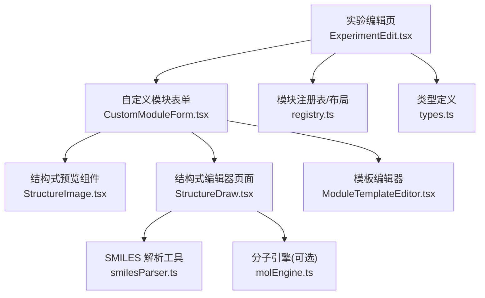
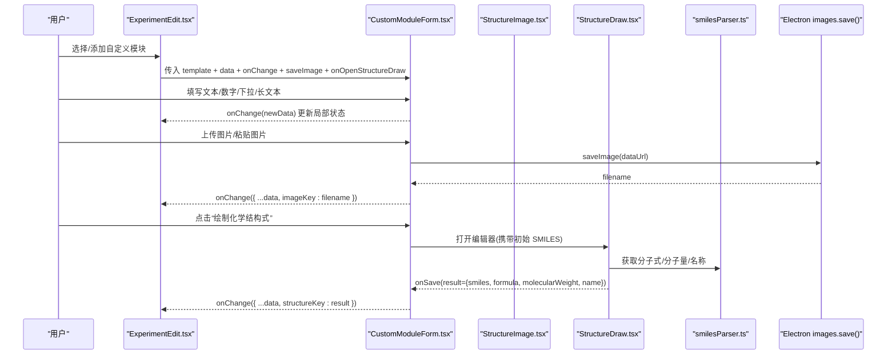
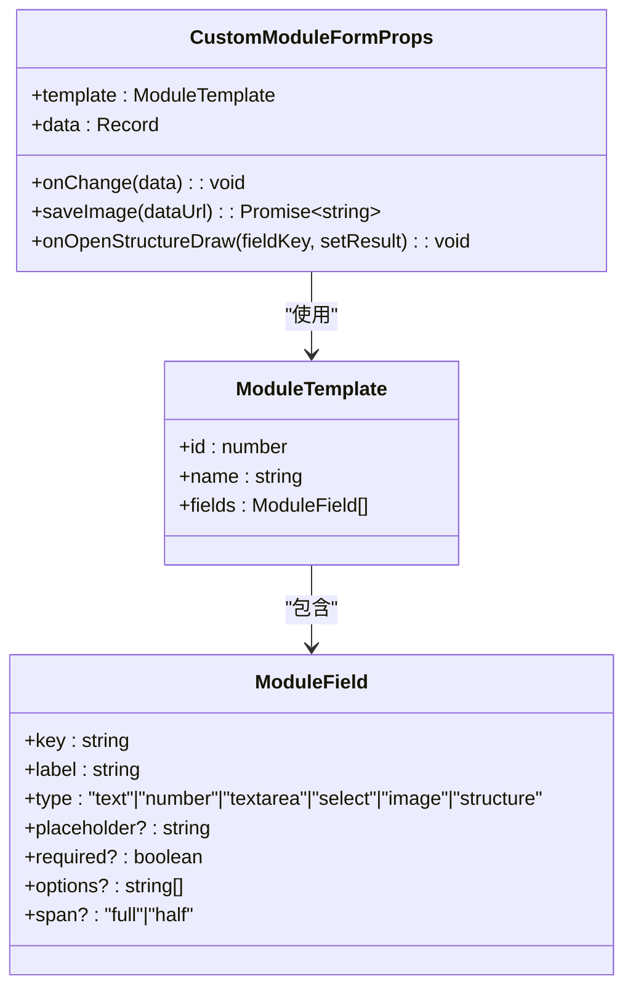
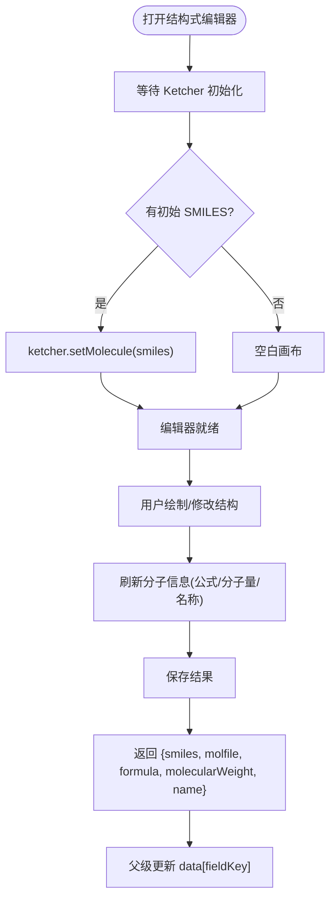
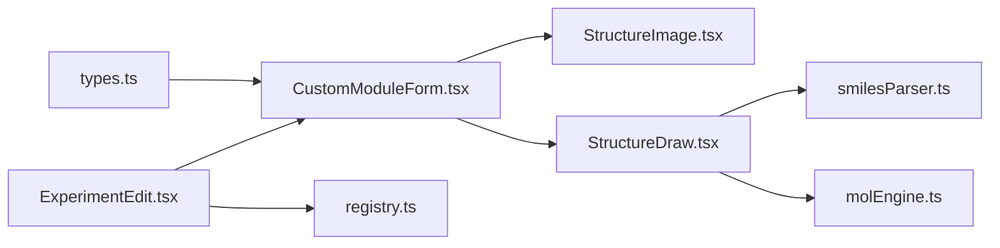

# 自定义表单开发

<cite>
**本文引用的文件**   
- [CustomModuleForm.tsx](file://src/modules/CustomModuleForm.tsx)
- [types.ts](file://src/types.ts)
- [StructureImage.tsx](file://src/components/StructureImage.tsx)
- [StructureDraw.tsx](file://src/pages/StructureDraw.tsx)
- [MolCanvas.tsx](file://src/components/MolCanvas.tsx)
- [molEngine.ts](file://src/utils/molEngine.ts)
- [smilesParser.ts](file://src/utils/smilesParser.ts)
- [ExperimentEdit.tsx](file://src/pages/ExperimentEdit.tsx)
- [ModuleTemplateEditor.tsx](file://src/modules/ModuleTemplateEditor.tsx)
- [registry.ts](file://src/modules/registry.ts)
</cite>

## 目录
1. [简介](#简介)
2. [项目结构](#项目结构)
3. [核心组件](#核心组件)
4. [架构总览](#架构总览)
5. [详细组件分析](#详细组件分析)
6. [依赖关系分析](#依赖关系分析)
7. [性能与体验优化](#性能与体验优化)
8. [故障排查指南](#故障排查指南)
9. [结论](#结论)
10. [附录：字段类型与配置清单](#附录字段类型与配置清单)

## 简介
本指南面向需要在 LabNote 中扩展“自定义模块表单”的开发者，围绕 CustomModuleForm 组件的实现规范、字段类型定义、数据绑定与验证、图片上传与粘贴、化学结构式字段的 SMILES 处理与编辑器集成等主题进行系统化说明。文档同时提供从简单文本输入到复杂复合表单的完整开发示例路径与调试技巧，帮助快速构建可复用、可扩展的实验记录表单。

## 项目结构
LabNote 的自定义表单系统由以下关键部分组成：
- 模板定义与编辑器：用于创建和维护自定义模块的字段定义（ModuleField[]）
- 渲染器：根据模板动态渲染表单控件（CustomModuleForm）
- 数据结构与类型：统一字段类型、模板、布局等类型定义（types.ts）
- 图片处理：剪贴板粘贴与本地存储桥接（通过 Electron IPC）
- 化学结构式：SMILES 解析、分子信息计算、Ketcher 编辑器集成与预览渲染

图表来源
- [ExperimentEdit.tsx:920-970](file://src/pages/ExperimentEdit.tsx#L920-L970)
- [CustomModuleForm.tsx:20-46](file://src/modules/CustomModuleForm.tsx#L20-L46)
- [StructureImage.tsx:21-56](file://src/components/StructureImage.tsx#L21-L56)
- [StructureDraw.tsx:19-44](file://src/pages/StructureDraw.tsx#L19-L44)
- [smilesParser.ts:344-349](file://src/utils/smilesParser.ts#L344-L349)
- [molEngine.ts:236-265](file://src/utils/molEngine.ts#L236-L265)
- [ModuleTemplateEditor.tsx:68-129](file://src/modules/ModuleTemplateEditor.tsx#L68-L129)
- [registry.ts:77-96](file://src/modules/registry.ts#L77-L96)
- [types.ts:158-188](file://src/types.ts#L158-L188)

章节来源
- [ExperimentEdit.tsx:920-970](file://src/pages/ExperimentEdit.tsx#L920-L970)
- [CustomModuleForm.tsx:20-46](file://src/modules/CustomModuleForm.tsx#L20-L46)
- [types.ts:158-188](file://src/types.ts#L158-L188)

## 核心组件
- CustomModuleForm：根据 ModuleTemplate.fields 动态渲染表单控件，支持 text、textarea、number、select、image、structure 六种字段类型；负责图片上传/粘贴、结构式编辑器打开与结果回写。
- StructureImage：基于 smiles-drawer 将 SMILES 渲染为 SVG，并支持悬停放大预览。
- StructureDraw：嵌入 Ketcher 编辑器，支持复制 SMILES/Molfile、刷新分子信息、保存结果回传。
- smilesParser：从 SMILES 计算分子式、分子量，并通过 PubChem 查询名称（带本地缓存）。
- molEngine：轻量分子图结构与 SMILES 生成（供内部绘制或扩展使用）。
- ModuleTemplateEditor：可视化维护自定义模块的字段定义，自动生成 key，校验必填项。
- registry：标准模块与布局管理，解析 layout JSON，识别 active custom 模块。

章节来源
- [CustomModuleForm.tsx:20-46](file://src/modules/CustomModuleForm.tsx#L20-L46)
- [StructureImage.tsx:21-56](file://src/components/StructureImage.tsx#L21-L56)
- [StructureDraw.tsx:19-44](file://src/pages/StructureDraw.tsx#L19-L44)
- [smilesParser.ts:344-349](file://src/utils/smilesParser.ts#L344-L349)
- [molEngine.ts:236-265](file://src/utils/molEngine.ts#L236-L265)
- [ModuleTemplateEditor.tsx:68-129](file://src/modules/ModuleTemplateEditor.tsx#L68-L129)
- [registry.ts:77-96](file://src/modules/registry.ts#L77-L96)

## 架构总览
下图展示了从“模板定义”到“表单渲染”，再到“图片/结构式处理”的端到端流程。

图表来源
- [ExperimentEdit.tsx:920-970](file://src/pages/ExperimentEdit.tsx#L920-L970)
- [CustomModuleForm.tsx:30-46](file://src/modules/CustomModuleForm.tsx#L30-L46)
- [StructureDraw.tsx:126-169](file://src/pages/StructureDraw.tsx#L126-L169)
- [smilesParser.ts:344-349](file://src/utils/smilesParser.ts#L344-L349)

## 详细组件分析

### CustomModuleForm 组件
职责
- 读取模板 fields，按 type 分支渲染对应控件
- 维护字段级值变更，调用父级 onChange 实现受控双向绑定
- 处理图片上传与剪贴板粘贴，持久化后以文件名回写
- 打开结构式编辑器，接收结构化结果（含 SMILES、分子式、分子量、名称）

字段类型与行为
- text：单行文本输入
- textarea：多行文本输入
- number：数值输入，空值转为 null
- select：下拉选择，options 来自模板字段 options
- image：支持点击上传与 Ctrl+V 粘贴，显示缩略图，双击在新窗口查看，支持删除
- structure：展示 SMILES 预览与分子信息，支持打开编辑器编辑与移除

数据绑定机制
- 每个字段 value 取自 data[field.key]，onChange 返回新对象 { ...data, [key]: value }
- 父级 ExperimentEdit 将 customModuleData[moduleKey] 作为 data 传入，并在 onChange 时合并回 state

图片处理
- 剪贴板：监听 paste，过滤 image/*，FileReader 转 dataURL，调用 saveImage 得到文件名
- 文件选择：input[type=file] accept="image/*"，同上流程
- 图片源解析：resolveImageSrc 支持 data:/labnote:/http: 前缀，否则拼接 labnote://images/{filename}

结构式字段
- 若已有 value.smiles，则渲染 StructureImage 并显示分子式、分子量、名称
- 点击“绘制”打开 StructureDraw，支持两种回传方式：
  - 回调 onOpenStructureDraw(fieldKey, setResult)：推荐，直接写入父级状态
  - 路由导航 fallback：设置 window.__structureInitialSmiles 与 window.structureDrawResult，保存后回写

错误与边界
- 无 fields 时提示“此模块无已定义字段，请编辑模板”
- 图片为空时显示占位区，支持拖拽/粘贴提示
- 结构式字段值为 null 时显示“绘制化学结构式”按钮

章节来源
- [CustomModuleForm.tsx:20-46](file://src/modules/CustomModuleForm.tsx#L20-L46)
- [CustomModuleForm.tsx:48-80](file://src/modules/CustomModuleForm.tsx#L48-L80)
- [CustomModuleForm.tsx:146-221](file://src/modules/CustomModuleForm.tsx#L146-L221)
- [CustomModuleForm.tsx:82-84](file://src/modules/CustomModuleForm.tsx#L82-L84)

#### 类/接口关系图（代码级）

图表来源
- [CustomModuleForm.tsx:6-12](file://src/modules/CustomModuleForm.tsx#L6-L12)
- [types.ts:168-179](file://src/types.ts#L168-L179)
- [types.ts:158-166](file://src/types.ts#L158-L166)

### 图片上传与粘贴实现原理
- 事件入口：onPaste 与 input[type=file] onChange
- 文件读取：FileReader.readAsDataURL(blob)
- 持久化：调用 Electron IPC window.labnote.images.save(dataUrl)，返回文件名
- 显示：根据 resolveImageSrc 规则拼接 src，支持 dataURL、labnote 协议与 http
- 交互：双击在新窗口查看大图；悬浮显示删除按钮

章节来源
- [CustomModuleForm.tsx:48-80](file://src/modules/CustomModuleForm.tsx#L48-L80)
- [CustomModuleForm.tsx:14-18](file://src/modules/CustomModuleForm.tsx#L14-L18)
- [ExperimentEdit.tsx:126-137](file://src/pages/ExperimentEdit.tsx#L126-L137)

### 化学结构式字段特殊处理
- 预览渲染：StructureImage 使用 smiles-drawer 将 SMILES 渲染为 SVG，支持 hoverZoom 放大
- 编辑器集成：StructureDraw 通过 iframe 加载 Ketcher，支持 set/get SMILES、Molfile
- 分子信息：smilesParser 同步计算分子式与分子量，异步查询 PubChem 名称（优先本地缓存）
- 结果回传：保存时返回 { smiles, molfile, formula, molecularWeight, name }，父级将其写入 data[fieldKey]

图表来源
- [StructureDraw.tsx:29-44](file://src/pages/StructureDraw.tsx#L29-L44)
- [StructureDraw.tsx:77-94](file://src/pages/StructureDraw.tsx#L77-L94)
- [StructureDraw.tsx:126-169](file://src/pages/StructureDraw.tsx#L126-L169)
- [smilesParser.ts:344-349](file://src/utils/smilesParser.ts#L344-L349)
- [StructureImage.tsx:37-56](file://src/components/StructureImage.tsx#L37-L56)

章节来源
- [StructureImage.tsx:21-56](file://src/components/StructureImage.tsx#L21-L56)
- [StructureDraw.tsx:19-44](file://src/pages/StructureDraw.tsx#L19-L44)
- [smilesParser.ts:344-349](file://src/utils/smilesParser.ts#L344-L349)

### 模板编辑器与字段定义
- 字段类型枚举：text、number、textarea、select、image、structure
- 自动 key 生成：当 label 变化且 key 为空时，基于 label 生成小写下划线 key
- select 选项输入：逗号分隔，失焦或末尾逗号触发分割与同步
- 基础校验：模块名必填、至少一个字段；保存时将 fields 序列化为 JSON 字符串

章节来源
- [ModuleTemplateEditor.tsx:13-20](file://src/modules/ModuleTemplateEditor.tsx#L13-L20)
- [ModuleTemplateEditor.tsx:83-99](file://src/modules/ModuleTemplateEditor.tsx#L83-L99)
- [ModuleTemplateEditor.tsx:107-129](file://src/modules/ModuleTemplateEditor.tsx#L107-L129)

### 在实验编辑页中的集成
- 布局解析：parseModuleLayout 决定标准/自定义模块可见性与顺序
- 自定义模块渲染：遍历 layout，对 type=custom 的项查找模板并渲染 CustomModuleForm
- 状态管理：customModuleData 以 module_key 为键，值为该模块的 data 对象
- 保存载荷：buildPayload 将 custom_modules 序列化，仅保留非空模块

章节来源
- [registry.ts:77-96](file://src/modules/registry.ts#L77-L96)
- [ExperimentEdit.tsx:920-970](file://src/pages/ExperimentEdit.tsx#L920-L970)
- [ExperimentEdit.tsx:385-396](file://src/pages/ExperimentEdit.tsx#L385-L396)

## 依赖关系分析
- CustomModuleForm 依赖 types 中的 ModuleTemplate/ModuleField 类型
- StructureImage 依赖第三方库 smiles-drawer（动态 import）
- StructureDraw 依赖 Ketcher（iframe 内嵌），并与 smilesParser 协作
- ExperimentEdit 作为容器，协调布局、模板、数据与保存逻辑

图表来源
- [types.ts:158-188](file://src/types.ts#L158-L188)
- [CustomModuleForm.tsx:1-5](file://src/modules/CustomModuleForm.tsx#L1-L5)
- [StructureImage.tsx:1-2](file://src/components/StructureImage.tsx#L1-L2)
- [StructureDraw.tsx:1-6](file://src/pages/StructureDraw.tsx#L1-L6)
- [smilesParser.ts:1-2](file://src/utils/smilesParser.ts#L1-L2)
- [molEngine.ts:1-10](file://src/utils/molEngine.ts#L1-L10)
- [ExperimentEdit.tsx:1-12](file://src/pages/ExperimentEdit.tsx#L1-L12)
- [registry.ts:1-2](file://src/modules/registry.ts#L1-L2)

章节来源
- [types.ts:158-188](file://src/types.ts#L158-L188)
- [CustomModuleForm.tsx:1-5](file://src/modules/CustomModuleForm.tsx#L1-L5)
- [StructureImage.tsx:1-2](file://src/components/StructureImage.tsx#L1-L2)
- [StructureDraw.tsx:1-6](file://src/pages/StructureDraw.tsx#L1-L6)
- [smilesParser.ts:1-2](file://src/utils/smilesParser.ts#L1-L2)
- [molEngine.ts:1-10](file://src/utils/molEngine.ts#L1-L10)
- [ExperimentEdit.tsx:1-12](file://src/pages/ExperimentEdit.tsx#L1-L12)
- [registry.ts:1-2](file://src/modules/registry.ts#L1-L2)

## 性能与体验优化
- 图片处理
  - 使用 FileReader 异步读取，避免阻塞 UI
  - 通过 Electron IPC 持久化，减少内存占用
  - 图片 URL 规范化，避免重复请求
- 结构式预览
  - StructureImage 按需动态导入 smiles-drawer，首屏不阻塞
  - 支持 hoverZoom 预渲染大图，提升交互流畅度
- 编辑器集成
  - 等待 Ketcher 初始化完成后再操作，避免跨帧 API 失败
  - 清空画布时重载 iframe，避免复杂结构导致的白屏问题
- 数据提交
  - 仅提交非空自定义模块，减小 payload 体积

章节来源
- [CustomModuleForm.tsx:48-80](file://src/modules/CustomModuleForm.tsx#L48-L80)
- [StructureImage.tsx:37-56](file://src/components/StructureImage.tsx#L37-L56)
- [StructureDraw.tsx:46-58](file://src/pages/StructureDraw.tsx#L46-L58)
- [StructureDraw.tsx:179-192](file://src/pages/StructureDraw.tsx#L179-L192)
- [ExperimentEdit.tsx:385-396](file://src/pages/ExperimentEdit.tsx#L385-L396)

## 故障排查指南
- 图片无法显示
  - 检查 resolveImageSrc 生成的 URL 是否合法（data:/labnote:/http:）
  - 确认 Electron IPC images.save 是否可用，必要时降级为 dataURL
- 结构式编辑器无法加载
  - 确认 iframe 已加载完成，再调用 getSmiles/setMolecule
  - 若出现白屏，尝试重载 iframe 而非 setMolecule('')
- 分子信息未更新
  - 调用 refreshInfo 前先 focus 窗口，确保跨帧 API 可用
  - 网络超时情况下，名称可能为空，属预期行为
- 表单数据未保存
  - 检查 buildPayload 是否正确序列化 custom_modules
  - 确认 onChange 是否被正确调用并合并到父级状态

章节来源
- [CustomModuleForm.tsx:14-18](file://src/modules/CustomModuleForm.tsx#L14-L18)
- [StructureDraw.tsx:46-58](file://src/pages/StructureDraw.tsx#L46-L58)
- [StructureDraw.tsx:179-192](file://src/pages/StructureDraw.tsx#L179-L192)
- [ExperimentEdit.tsx:385-396](file://src/pages/ExperimentEdit.tsx#L385-L396)

## 结论
CustomModuleForm 提供了高内聚、低耦合的自定义表单能力，结合模板编辑器与结构式处理工具链，能够快速搭建复杂的实验记录表单。遵循本文的开发规范与最佳实践，可在保证用户体验的同时，获得良好的可维护性与扩展性。

## 附录：字段类型与配置清单
- text
  - 用途：单行文本
  - 配置：label、placeholder、span
- textarea
  - 用途：多行文本
  - 配置：label、placeholder、span
- number
  - 用途：数值输入，空值转为 null
  - 配置：label、placeholder、span
- select
  - 用途：下拉选择
  - 配置：label、options（逗号分隔）、span
- image
  - 用途：图片上传/粘贴
  - 配置：label、span
  - 行为：支持粘贴、点击上传、双击预览、删除
- structure
  - 用途：化学结构式
  - 配置：label、span
  - 行为：SMILES 预览、分子式/分子量/名称展示、打开编辑器编辑、移除

章节来源
- [types.ts:158-166](file://src/types.ts#L158-L166)
- [ModuleTemplateEditor.tsx:13-20](file://src/modules/ModuleTemplateEditor.tsx#L13-L20)
- [CustomModuleForm.tsx:99-236](file://src/modules/CustomModuleForm.tsx#L99-L236)