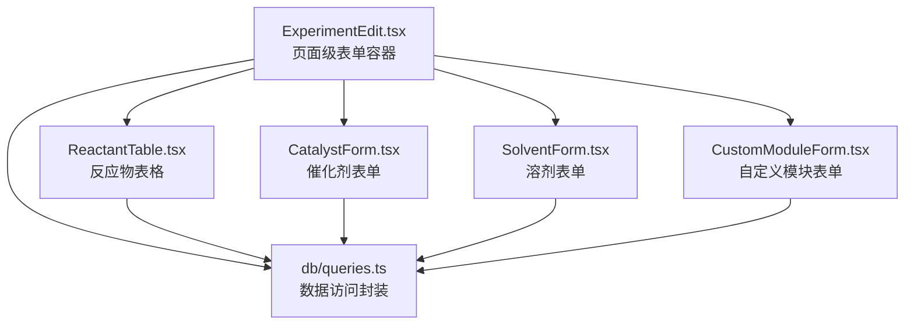
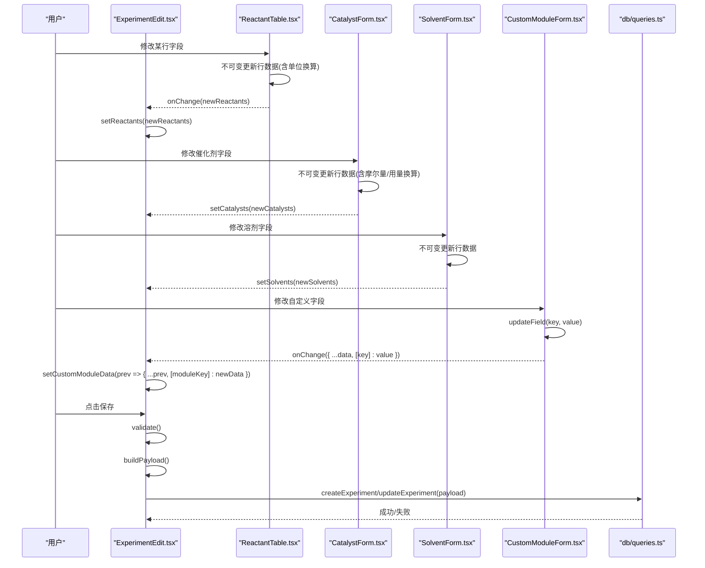
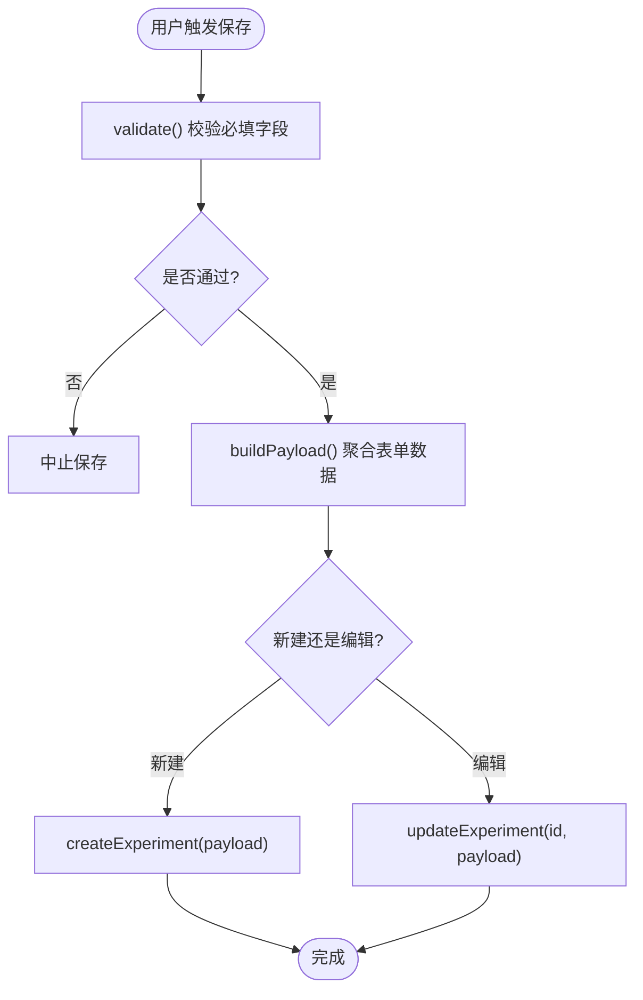
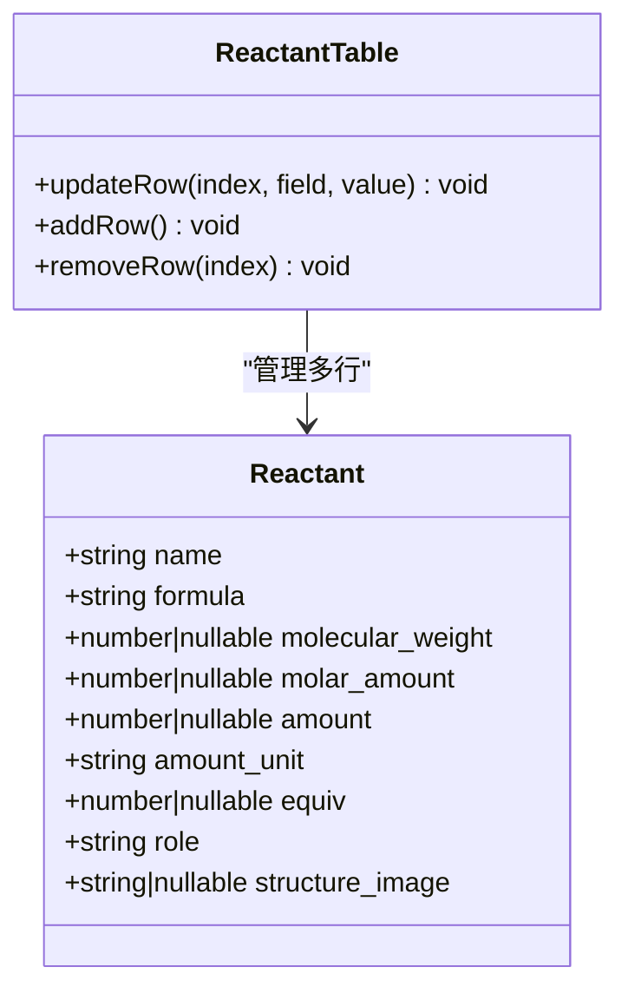
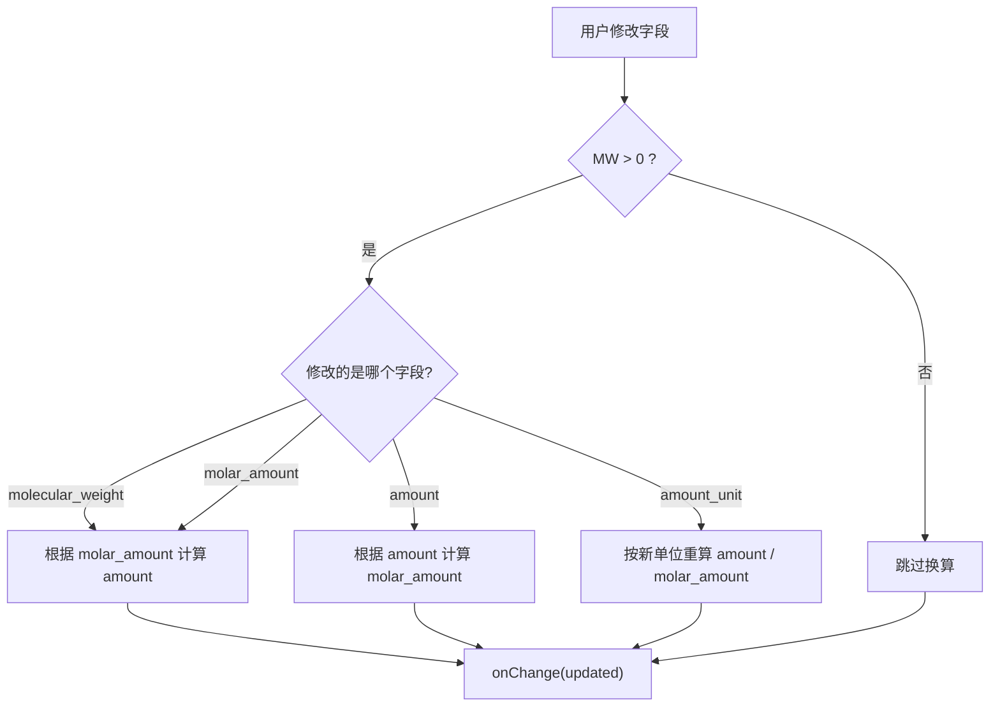
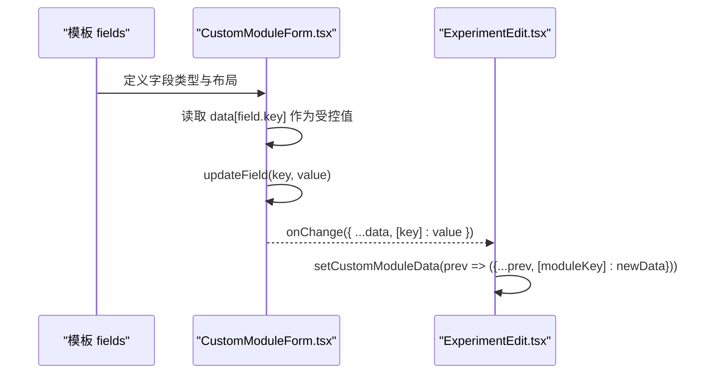
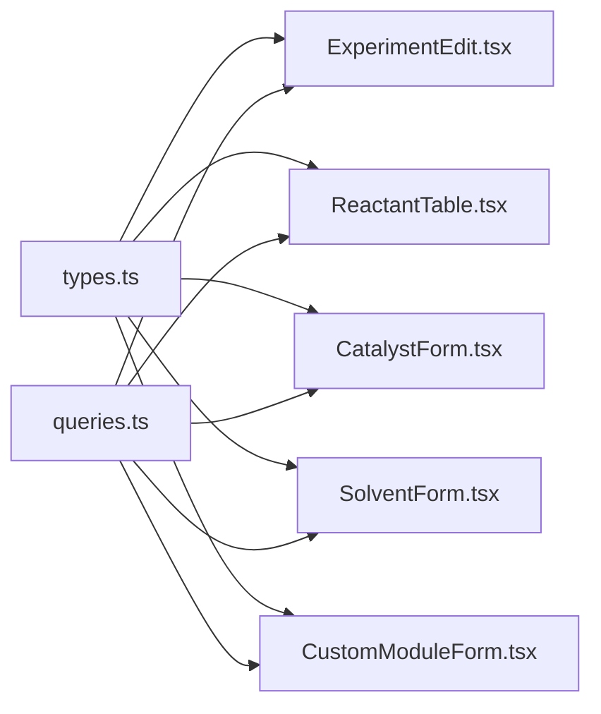

# 表单数据绑定

<cite>
**本文引用的文件**   
- [ExperimentEdit.tsx](file://src/pages/ExperimentEdit.tsx)
- [CatalystForm.tsx](file://src/components/CatalystForm.tsx)
- [SolventForm.tsx](file://src/components/SolventForm.tsx)
- [ReactantTable.tsx](file://src/components/ReactantTable.tsx)
- [CustomModuleForm.tsx](file://src/modules/CustomModuleForm.tsx)
- [types.ts](file://src/types.ts)
- [queries.ts](file://src/db/queries.ts)
</cite>

## 目录
1. [简介](#简介)
2. [项目结构](#项目结构)
3. [核心组件](#核心组件)
4. [架构总览](#架构总览)
5. [详细组件分析](#详细组件分析)
6. [依赖关系分析](#依赖关系分析)
7. [性能考虑](#性能考虑)
8. [故障排查指南](#故障排查指南)
9. [结论](#结论)
10. [附录：完整示例与最佳实践](#附录完整示例与最佳实践)

## 简介
本指南聚焦于 LabNote 自定义表单的数据绑定机制，系统阐述双向绑定的实现原理、updateField 的工作方式、onChange 回调处理流程、表单状态管理与重渲染策略、字段值获取与设置（含默认值与空值）、以及数据的持久化与恢复。同时提供复杂数据类型与嵌套对象的处理示例，并给出性能优化技巧与最佳实践建议。

## 项目结构
LabNote 的表单数据绑定采用“受控组件 + 不可变更新”的模式：
- 页面级容器负责维护主表单状态与子模块数据，并通过 updateField 与 onChange 将变更向上传递。
- 子表单组件通过 props 接收当前值与回调，内部仅做局部计算与不可变更新，再调用父级传入的 onChange。
- 最终保存时由页面聚合所有状态，构建提交载荷并持久化到数据库。

图表来源
- [ExperimentEdit.tsx:372-396](file://src/pages/ExperimentEdit.tsx#L372-L396)
- [ReactantTable.tsx:90-132](file://src/components/ReactantTable.tsx#L90-L132)
- [CatalystForm.tsx:40-78](file://src/components/CatalystForm.tsx#L40-L78)
- [SolventForm.tsx:15-24](file://src/components/SolventForm.tsx#L15-L24)
- [CustomModuleForm.tsx:44-46](file://src/modules/CustomModuleForm.tsx#L44-L46)
- [queries.ts:64-70](file://src/db/queries.ts#L64-L70)

章节来源
- [ExperimentEdit.tsx:75-91](file://src/pages/ExperimentEdit.tsx#L75-L91)
- [ExperimentEdit.tsx:372-396](file://src/pages/ExperimentEdit.tsx#L372-L396)
- [queries.ts:64-70](file://src/db/queries.ts#L64-L70)

## 核心组件
- 页面容器 ExperimentEdit：集中管理 form、reactants、catalysts、solvents、customModuleData 等状态；提供 updateField 统一更新单个字段；在保存时聚合为 payload 并调用持久化接口。
- 子表单 ReactantTable、CatalystForm、SolventForm：各自维护行级数据，支持单位换算与联动计算，通过 onChange 将新数组回传给父级。
- 自定义模块 CustomModuleForm：基于模板动态渲染字段，使用 updateField 更新 data[key]，再由父级合并到 customModuleData。

章节来源
- [ExperimentEdit.tsx:372-396](file://src/pages/ExperimentEdit.tsx#L372-L396)
- [ReactantTable.tsx:90-132](file://src/components/ReactantTable.tsx#L90-L132)
- [CatalystForm.tsx:40-78](file://src/components/CatalystForm.tsx#L40-L78)
- [SolventForm.tsx:15-24](file://src/components/SolventForm.tsx#L15-L24)
- [CustomModuleForm.tsx:44-46](file://src/modules/CustomModuleForm.tsx#L44-L46)

## 架构总览
下图展示了从用户输入到持久化的完整数据流，包括 updateField 与 onChange 的职责边界。

图表来源
- [ExperimentEdit.tsx:372-396](file://src/pages/ExperimentEdit.tsx#L372-L396)
- [ExperimentEdit.tsx:400-453](file://src/pages/ExperimentEdit.tsx#L400-L453)
- [ReactantTable.tsx:90-132](file://src/components/ReactantTable.tsx#L90-L132)
- [CatalystForm.tsx:40-78](file://src/components/CatalystForm.tsx#L40-L78)
- [SolventForm.tsx:15-24](file://src/components/SolventForm.tsx#L15-L24)
- [CustomModuleForm.tsx:44-46](file://src/modules/CustomModuleForm.tsx#L44-L46)
- [queries.ts:64-70](file://src/db/queries.ts#L64-L70)

## 详细组件分析

### 页面容器：ExperimentEdit
- 状态设计
  - form：基础信息对象，包含标题、日期、条件等字段。
  - reactants/catalysts/solvents：列表型受控状态。
  - customModuleData：以模块 key 为键的对象映射，值为该模块的 data 记录。
  - moduleLayout：控制标准与自定义模块的显示顺序与可见性。
- 字段更新：updateField(field, value) 使用函数式 setState 进行浅拷贝更新，避免直接变异。
- 校验与构建载荷：validate 检查必填项；buildPayload 过滤空行、组装 tag_ids、module_layout 与 custom_modules。
- 持久化：根据新建或编辑模式调用 createExperiment 或 updateExperiment。

图表来源
- [ExperimentEdit.tsx:377-396](file://src/pages/ExperimentEdit.tsx#L377-L396)
- [ExperimentEdit.tsx:400-453](file://src/pages/ExperimentEdit.tsx#L400-L453)
- [queries.ts:64-70](file://src/db/queries.ts#L64-L70)

章节来源
- [ExperimentEdit.tsx:75-91](file://src/pages/ExperimentEdit.tsx#L75-L91)
- [ExperimentEdit.tsx:372-396](file://src/pages/ExperimentEdit.tsx#L372-L396)
- [ExperimentEdit.tsx:400-453](file://src/pages/ExperimentEdit.tsx#L400-L453)

### 反应物表格：ReactantTable
- 数据模型：Reactant 包含名称、分子式、MW、摩尔量、用量、单位、当量、角色、结构图等。
- 联动计算：
  - 当 MW 或 molar_amount 变化时，按 amount_unit 重新计算 amount。
  - 当 amount 变化时，反算 molar_amount。
  - 当 unit 变化时，优先保持 molar_amount 不变，重算 amount；若无 molar_amount，则先由 amount+newUnit 计算 molar_amount，再同步 amount。
- 不可变更新：每次只复制受影响行，再整体替换数组，确保 React 能检测到变更。
- 图片处理：支持粘贴/选择图片，必要时通过 IPC 保存到本地，返回文件名用于展示。

图表来源
- [ReactantTable.tsx:11-21](file://src/components/ReactantTable.tsx#L11-L21)
- [ReactantTable.tsx:90-132](file://src/components/ReactantTable.tsx#L90-L132)

章节来源
- [ReactantTable.tsx:90-132](file://src/components/ReactantTable.tsx#L90-L132)

### 催化剂表单：CatalystForm
- 数据模型：Catalyst 包含名称、用量、单位、MW、摩尔量等。
- 联动计算：与 ReactantTable 类似，但单位集合不同（g/mg/mol%），对 mol% 等非质量单位不做质量换算。
- 不可变更新：同 ReactantTable，保证上层感知变更。

图表来源
- [CatalystForm.tsx:16-34](file://src/components/CatalystForm.tsx#L16-L34)
- [CatalystForm.tsx:40-78](file://src/components/CatalystForm.tsx#L40-L78)

章节来源
- [CatalystForm.tsx:40-78](file://src/components/CatalystForm.tsx#L40-L78)

### 溶剂表单：SolventForm
- 数据模型：Solvent 包含名称、体积、单位、比例等。
- 行为：无复杂联动，仅做不可变更新与行增删。

章节来源
- [SolventForm.tsx:15-24](file://src/components/SolventForm.tsx#L15-L24)

### 自定义模块表单：CustomModuleForm
- 模板驱动：根据 ModuleTemplate.fields 动态渲染 text/textarea/select/number/image/structure 等字段。
- 字段更新：updateField(key, value) 生成新对象并调用 onChange，父级将其合并到 customModuleData[moduleKey]。
- 图片与结构式：支持粘贴/选择图片，结构式字段可打开绘制器并将结果回填。

图表来源
- [CustomModuleForm.tsx:44-46](file://src/modules/CustomModuleForm.tsx#L44-L46)
- [CustomModuleForm.tsx:88-144](file://src/modules/CustomModuleForm.tsx#L88-L144)
- [ExperimentEdit.tsx:216-227](file://src/pages/ExperimentEdit.tsx#L216-L227)

章节来源
- [CustomModuleForm.tsx:44-46](file://src/modules/CustomModuleForm.tsx#L44-L46)
- [CustomModuleForm.tsx:88-144](file://src/modules/CustomModuleForm.tsx#L88-L144)

## 依赖关系分析
- 类型定义集中在 types.ts，供各组件共享，确保表单数据结构一致。
- 数据访问统一通过 queries.ts 封装，实际调用 window.labnote.* API，屏蔽 IPC 细节。
- 页面容器依赖多个子组件，形成“一父多子”的受控树。

图表来源
- [types.ts:1-316](file://src/types.ts#L1-L316)
- [queries.ts:1-193](file://src/db/queries.ts#L1-L193)
- [ExperimentEdit.tsx:1-31](file://src/pages/ExperimentEdit.tsx#L1-L31)

章节来源
- [types.ts:1-316](file://src/types.ts#L1-L316)
- [queries.ts:1-193](file://src/db/queries.ts#L1-L193)

## 性能考虑
- 不可变更新：所有行/对象更新均采用浅拷贝与数组重建，避免深层遍历带来的开销。
- 局部计算：仅在相关字段变化时执行单位换算，减少不必要的计算。
- 延迟加载：结构式编辑器按需懒加载，降低首屏成本。
- 最小化重渲染：通过精确的 state 拆分（form/reactants/catalysts/solvents/customModuleData）与函数式 setState，避免整树重渲染。
- 图片存储：优先使用 IPC 保存为文件路径，避免在 JSON 中嵌入大体积 base64。

[本节为通用指导，不直接分析具体文件]

## 故障排查指南
- 字段未更新
  - 确认 onChange 是否正确传递到父级，父级是否用函数式 setState 更新。
  - 检查是否误用可变更新导致 React 无法检测变更。
- 单位换算异常
  - 确认 MW 是否为正数；非质量单位（如 mL、mol%）不应参与质量换算。
  - 注意 parseFloat 后空字符串应转为 null，避免 NaN。
- 图片无法显示
  - 检查 resolveImageSrc 逻辑：data URL、http/labnote 协议直显，其他视为文件名拼接 labnote://images/。
  - 若 IPC 保存失败，会回退到 data URL，需确认浏览器环境兼容性。
- 保存失败
  - 查看 validate 错误提示；确认必填字段已填写。
  - 检查 buildPayload 是否过滤了空行，确保后端期望格式。

章节来源
- [ExperimentEdit.tsx:377-396](file://src/pages/ExperimentEdit.tsx#L377-L396)
- [ReactantTable.tsx:23-49](file://src/components/ReactantTable.tsx#L23-L49)
- [CustomModuleForm.tsx:14-18](file://src/modules/CustomModuleForm.tsx#L14-L18)

## 结论
LabNote 的表单数据绑定遵循受控组件与不可变更新的经典范式：页面容器集中管理状态并提供 updateField，子组件通过 onChange 上报变更；在保存阶段聚合为 payload 并持久化。该模式清晰、可测试、易扩展，适合复杂实验表单场景。

[本节为总结，不直接分析具体文件]

## 附录：完整示例与最佳实践

### 双向数据绑定原理
- 受控组件：每个输入控件的 value 来自 state，onChange 回调更新 state，形成“单向数据流”。
- 伪双向体验：通过 updateField/onChange 的组合，使 UI 与数据保持一致，达到“双向绑定”的效果。

章节来源
- [ExperimentEdit.tsx:372-375](file://src/pages/ExperimentEdit.tsx#L372-L375)
- [CustomModuleForm.tsx:44-46](file://src/modules/CustomModuleForm.tsx#L44-L46)

### updateField 工作机制
- 单字段更新：以形参 field/key 为索引，构造新对象并赋值，返回新引用。
- 联动计算：在子组件内根据业务规则（如单位换算）在更新前计算衍生字段。
- 错误清理：在页面层 updateField 中，若对应字段存在错误，自动清除。

章节来源
- [ExperimentEdit.tsx:372-375](file://src/pages/ExperimentEdit.tsx#L372-L375)
- [ReactantTable.tsx:90-132](file://src/components/ReactantTable.tsx#L90-L132)
- [CatalystForm.tsx:40-78](file://src/components/CatalystForm.tsx#L40-L78)

### onChange 回调处理流程
- 子组件：计算新数据 → 调用 onChange(newData)。
- 父组件：setXxx(newData) 触发重渲染 → 后续保存时聚合。

章节来源
- [ReactantTable.tsx:131-139](file://src/components/ReactantTable.tsx#L131-L139)
- [CatalystForm.tsx:77-81](file://src/components/CatalystForm.tsx#L77-L81)
- [SolventForm.tsx:22-24](file://src/components/SolventForm.tsx#L22-L24)

### 表单状态管理与重渲染
- 状态拆分：form、reactants、catalysts、solvents、customModuleData 独立管理，粒度合理。
- 函数式更新：setState(prev => ...) 避免闭包陈旧问题。
- 选择性渲染：模块布局控制显示，隐藏模块时清理其数据，减少无关渲染。

章节来源
- [ExperimentEdit.tsx:75-91](file://src/pages/ExperimentEdit.tsx#L75-L91)
- [ExperimentEdit.tsx:196-206](file://src/pages/ExperimentEdit.tsx#L196-L206)

### 字段值的获取与设置（默认值与空值）
- 默认值：emptyForm 与 emptyRow 提供初始值；新增行时使用空对象。
- 空值管理：数值型输入为空时转为 null，避免空字符串导致的类型不一致。
- 解析与格式化：保存前过滤空行，确保 payload 整洁。

章节来源
- [ExperimentEdit.tsx:56-65](file://src/pages/ExperimentEdit.tsx#L56-L65)
- [ReactantTable.tsx:11-21](file://src/components/ReactantTable.tsx#L11-L21)
- [CatalystForm.tsx:8-14](file://src/components/CatalystForm.tsx#L8-L14)
- [SolventForm.tsx:8-13](file://src/components/SolventForm.tsx#L8-L13)
- [ExperimentEdit.tsx:385-396](file://src/pages/ExperimentEdit.tsx#L385-L396)

### 数据持久化与恢复
- 恢复：loadData 并行加载项目、标签、试剂、模板，并根据 isNew 分支填充表单与模块布局。
- 持久化：handleSave 校验通过后构建 payload，调用 createExperiment 或 updateExperiment。
- 模板预填：支持从模板参数预填 form、catalysts、solvents、tag_ids、module_layout 与 custom_modules_data。

章节来源
- [ExperimentEdit.tsx:265-366](file://src/pages/ExperimentEdit.tsx#L265-L366)
- [ExperimentEdit.tsx:400-453](file://src/pages/ExperimentEdit.tsx#L400-L453)
- [queries.ts:64-70](file://src/db/queries.ts#L64-L70)

### 复杂数据类型与嵌套对象处理
- 列表型数据：reactants/catalysts/solvents 均为数组，行级更新采用不可变替换。
- 嵌套对象：customModuleData 以模块 key 为键，值为任意结构的 data 对象，支持 image/structure 等复合字段。
- 结构化数据：结构式字段包含 smiles/formula/name/molecularWeight 等属性，通过绘制器回填。

章节来源
- [ExperimentEdit.tsx:216-227](file://src/pages/ExperimentEdit.tsx#L216-L227)
- [CustomModuleForm.tsx:187-221](file://src/modules/CustomModuleForm.tsx#L187-L221)

### 性能优化技巧与最佳实践
- 使用函数式 setState 避免陈旧状态。
- 只在必要字段变化时执行计算（如单位换算）。
- 懒加载重型组件（如结构式编辑器）。
- 图片走 IPC 存储，避免 JSON 膨胀。
- 过滤空行与空模块数据，减小 payload 体积。

[本节为通用指导，不直接分析具体文件]