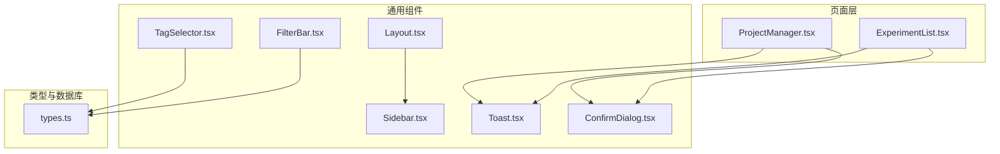
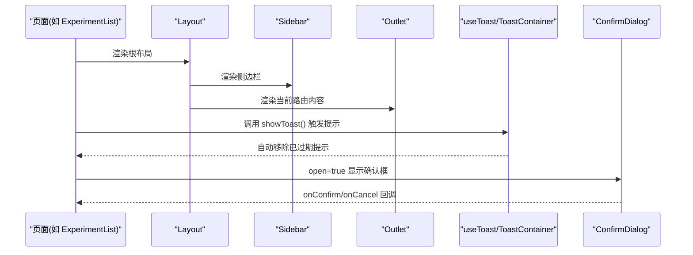
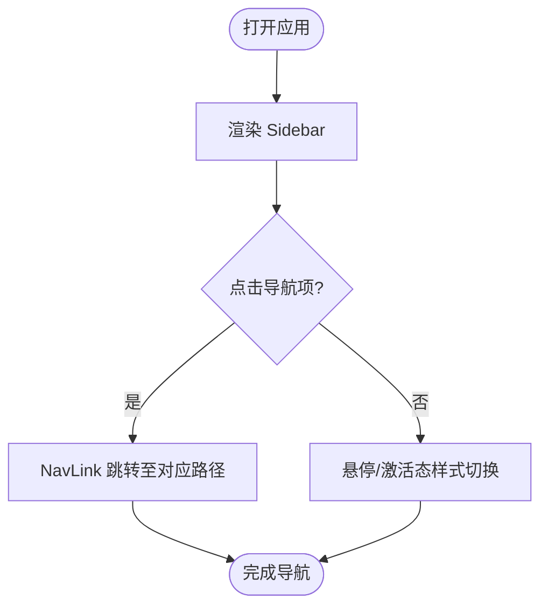
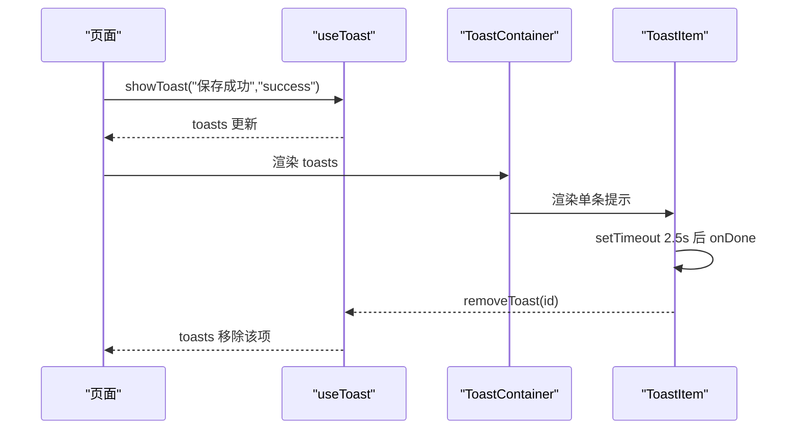
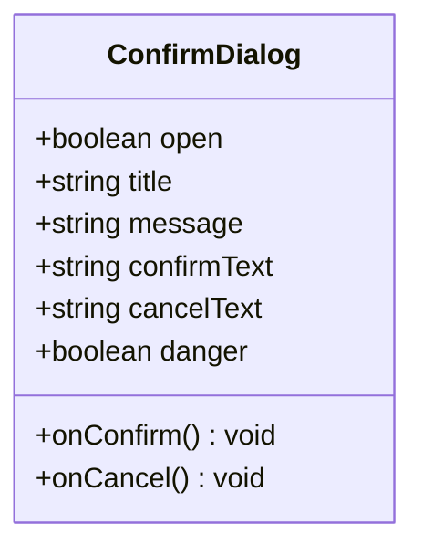
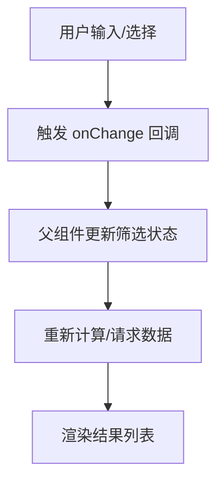
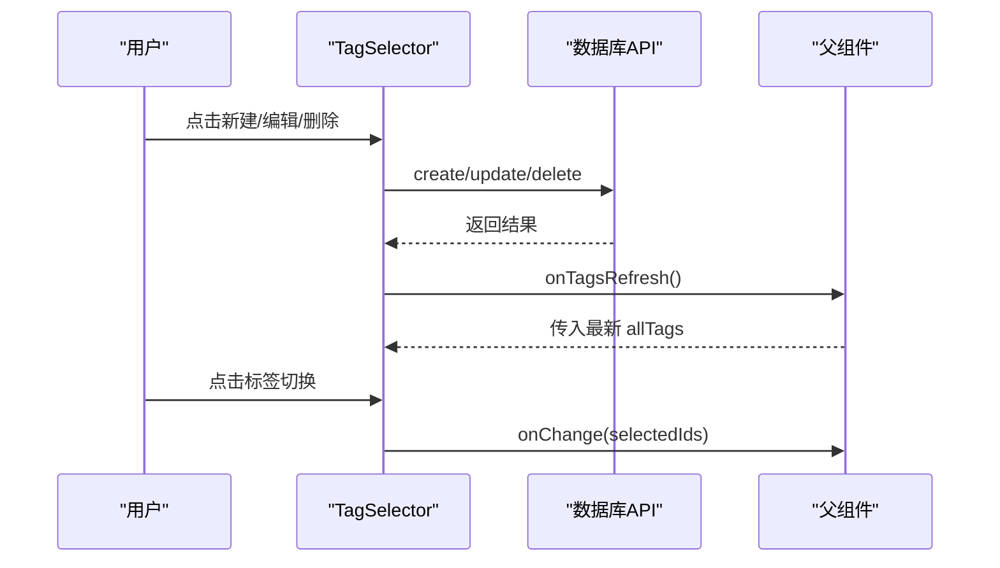
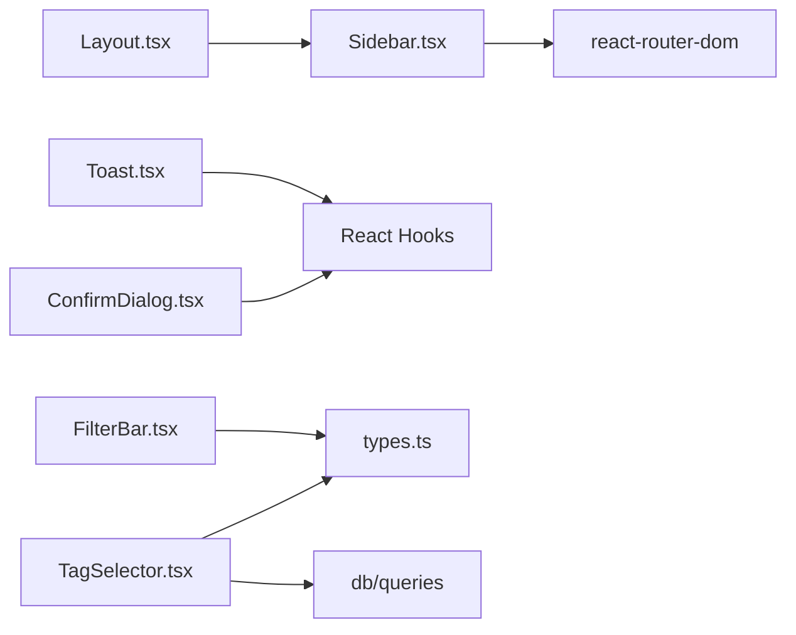

# 通用UI组件

<cite>
**本文引用的文件**   
- [Layout.tsx](file://src/components/Layout.tsx)
- [Sidebar.tsx](file://src/components/Sidebar.tsx)
- [Toast.tsx](file://src/components/Toast.tsx)
- [ConfirmDialog.tsx](file://src/components/ConfirmDialog.tsx)
- [FilterBar.tsx](file://src/components/FilterBar.tsx)
- [TagSelector.tsx](file://src/components/TagSelector.tsx)
- [types.ts](file://src/types.ts)
- [ExperimentList.tsx](file://src/pages/ExperimentList.tsx)
- [ProjectManager.tsx](file://src/pages/ProjectManager.tsx)
</cite>

## 目录
1. [简介](#简介)
2. [项目结构](#项目结构)
3. [核心组件](#核心组件)
4. [架构总览](#架构总览)
5. [详细组件分析](#详细组件分析)
6. [依赖关系分析](#依赖关系分析)
7. [性能与可访问性建议](#性能与可访问性建议)
8. [故障排查指南](#故障排查指南)
9. [结论](#结论)
10. [附录：Props 接口与使用示例索引](#附录props-接口与使用示例索引)

## 简介
本文件为 LabNote 的通用 UI 组件提供系统化、可操作的使用文档，覆盖以下组件：
- Layout 布局组件：侧边栏集成、内容区域管理、响应式适配
- Sidebar 导航组件：功能特性、路由集成、自定义菜单项添加方法
- Toast 消息提示：使用方式、样式定制、事件处理
- ConfirmDialog 确认对话框：配置选项、回调处理、国际化支持
- FilterBar 筛选栏：数据绑定、多条件筛选、状态管理
- TagSelector 标签选择器：交互模式、颜色主题、数据同步机制

目标读者包括前端开发者与产品工程师，帮助快速集成并高效使用这些基础组件。

## 项目结构
通用 UI 组件位于 src/components 目录下，类型定义在 src/types.ts，页面层通过引入这些组件完成业务集成。整体采用“容器 + 展示”的分层思路：页面负责状态与副作用，组件专注渲染与交互。

图表来源
- [Layout.tsx:1-16](file://src/components/Layout.tsx#L1-L16)
- [Sidebar.tsx:1-123](file://src/components/Sidebar.tsx#L1-L123)
- [Toast.tsx:1-53](file://src/components/Toast.tsx#L1-L53)
- [ConfirmDialog.tsx:1-82](file://src/components/ConfirmDialog.tsx#L1-L82)
- [FilterBar.tsx:1-85](file://src/components/FilterBar.tsx#L1-L85)
- [TagSelector.tsx:1-251](file://src/components/TagSelector.tsx#L1-L251)
- [types.ts:1-316](file://src/types.ts#L1-L316)
- [ExperimentList.tsx:230-252](file://src/pages/ExperimentList.tsx#L230-L252)
- [ProjectManager.tsx:180-202](file://src/pages/ProjectManager.tsx#L180-L202)

章节来源
- [Layout.tsx:1-16](file://src/components/Layout.tsx#L1-L16)
- [Sidebar.tsx:1-123](file://src/components/Sidebar.tsx#L1-L123)
- [Toast.tsx:1-53](file://src/components/Toast.tsx#L1-L53)
- [ConfirmDialog.tsx:1-82](file://src/components/ConfirmDialog.tsx#L1-L82)
- [FilterBar.tsx:1-85](file://src/components/FilterBar.tsx#L1-L85)
- [TagSelector.tsx:1-251](file://src/components/TagSelector.tsx#L1-L251)
- [types.ts:1-316](file://src/types.ts#L1-L316)
- [ExperimentList.tsx:230-252](file://src/pages/ExperimentList.tsx#L230-L252)
- [ProjectManager.tsx:180-202](file://src/pages/ProjectManager.tsx#L180-L202)

## 核心组件
本节概述各组件的职责与协作关系，后续章节将深入每个组件的 Props、用法与最佳实践。

- Layout：应用级布局容器，左侧固定 Sidebar，右侧自适应主内容区，内部使用 Outlet 承载子路由视图。
- Sidebar：全局导航面板，内置常用入口，支持图标与高亮状态，并提供新建实验快捷入口。
- Toast：轻量消息提示，提供 useToast Hook 与 ToastContainer 容器，自动计时关闭。
- ConfirmDialog：异步确认弹窗，替代原生 confirm，支持键盘 ESC 关闭与焦点管理。
- FilterBar：多条件筛选条，包含搜索、课题、标签、日期范围等受控输入。
- TagSelector：标签多选与 CRUD 管理，支持预设颜色、编辑与删除，并与数据库 API 同步。

章节来源
- [Layout.tsx:1-16](file://src/components/Layout.tsx#L1-L16)
- [Sidebar.tsx:1-123](file://src/components/Sidebar.tsx#L1-L123)
- [Toast.tsx:1-53](file://src/components/Toast.tsx#L1-L53)
- [ConfirmDialog.tsx:1-82](file://src/components/ConfirmDialog.tsx#L1-L82)
- [FilterBar.tsx:1-85](file://src/components/FilterBar.tsx#L1-L85)
- [TagSelector.tsx:1-251](file://src/components/TagSelector.tsx#L1-L251)

## 架构总览
下图展示了页面层如何组合通用组件，以及组件之间的依赖关系。

图表来源
- [Layout.tsx:1-16](file://src/components/Layout.tsx#L1-L16)
- [Sidebar.tsx:1-123](file://src/components/Sidebar.tsx#L1-L123)
- [Toast.tsx:1-53](file://src/components/Toast.tsx#L1-L53)
- [ConfirmDialog.tsx:1-82](file://src/components/ConfirmDialog.tsx#L1-L82)

## 详细组件分析

### Layout 布局组件
- 结构与职责
  - 外层 flex 容器占满视口高度，左侧 Sidebar 固定宽度，右侧 main 自适应填充剩余空间并滚动。
  - 内容区使用 Outlet 挂载子路由视图，适合页面级嵌套路由。
- 响应式适配
  - 当前实现以桌面端为主，main 区域设置最大宽度与居中，保证阅读体验。
  - 如需移动端适配，可在外层容器增加断点类或根据屏幕尺寸切换 Sidebar 显隐。
- 集成要点
  - 在应用根路由中使用该布局包裹所有页面路由。
  - 若需要顶部工具栏或面包屑，可在 Outlet 上方插入额外区域。

章节来源
- [Layout.tsx:1-16](file://src/components/Layout.tsx#L1-L16)

### Sidebar 导航组件
- 功能特性
  - 内置一组导航项（全部实验、日程、课题管理、模板库、试剂库、结构式绘制），每项含 to、label、icon。
  - 使用 NavLink 进行路由跳转，并根据 isActive 动态高亮。
  - 底部提供“桌面小组件”开关按钮与“新建实验”快捷入口。
- 路由集成
  - 通过 react-router-dom 的 NavLink/useNavigate 完成导航与编程式跳转。
- 自定义菜单项
  - 扩展 navItems 数组即可新增菜单项；如需分组或外链，可在渲染逻辑中分支处理。
- 可访问性与交互
  - 图标与文字并列，便于识别；悬停与激活态有明确视觉反馈。

图表来源
- [Sidebar.tsx:1-123](file://src/components/Sidebar.tsx#L1-L123)

章节来源
- [Sidebar.tsx:1-123](file://src/components/Sidebar.tsx#L1-L123)

### Toast 消息提示组件
- 使用方式
  - 在页面中引入 useToast Hook，获取 toasts、showToast、removeToast。
  - 在页面根节点附近渲染 ToastContainer，传入 toasts 与 removeToast。
  - 在业务逻辑中调用 showToast(message, type) 弹出提示，type 支持 success/error。
- 样式定制
  - 成功/错误分别使用不同背景色，可通过 Tailwind 类名替换主题色。
  - 位置固定在右下角，z-index 较高，避免被其他元素遮挡。
- 事件处理
  - 每条提示默认 2.5 秒后自动移除；也可手动调用 removeToast(id) 立即关闭。
- 典型用法参考
  - 页面中多处使用 useToast 与 ToastContainer 组合，用于保存、删除等操作反馈。

图表来源
- [Toast.tsx:1-53](file://src/components/Toast.tsx#L1-L53)
- [ExperimentList.tsx:230-252](file://src/pages/ExperimentList.tsx#L230-L252)
- [ProjectManager.tsx:180-202](file://src/pages/ProjectManager.tsx#L180-L202)

章节来源
- [Toast.tsx:1-53](file://src/components/Toast.tsx#L1-L53)
- [ExperimentList.tsx:230-252](file://src/pages/ExperimentList.tsx#L230-L252)
- [ProjectManager.tsx:180-202](file://src/pages/ProjectManager.tsx#L180-L202)

### ConfirmDialog 确认对话框
- 配置选项
  - open: 控制显示/隐藏
  - title/message: 标题与正文
  - confirmText/cancelText: 按钮文案
  - danger: 是否危险操作样式
  - onConfirm/onCancel: 回调函数
- 回调处理
  - 在页面中维护 open 状态与 pending 数据，点击确认后执行 onConfirm，取消时重置状态。
- 键盘与焦点
  - 打开后自动聚焦确认按钮，支持 ESC 键关闭。
- 国际化支持
  - 所有文案均通过 props 注入，建议在页面层集中管理 i18n 文本并传入。

图表来源
- [ConfirmDialog.tsx:1-82](file://src/components/ConfirmDialog.tsx#L1-L82)

章节来源
- [ConfirmDialog.tsx:1-82](file://src/components/ConfirmDialog.tsx#L1-L82)
- [ExperimentList.tsx:230-252](file://src/pages/ExperimentList.tsx#L230-L252)
- [ProjectManager.tsx:180-202](file://src/pages/ProjectManager.tsx#L180-L202)

### FilterBar 筛选栏
- 数据绑定
  - 受控组件：search/projectId/tagId/dateFrom/dateTo 由父组件 state 驱动，onChange 回调回写父组件。
- 多条件筛选
  - 支持关键词搜索、按课题过滤、按标签过滤、起止日期范围筛选。
- 状态管理
  - 建议在页面层统一维护筛选状态对象，并在输入变化时触发列表刷新或查询。
- 使用建议
  - 对长列表场景，建议防抖搜索与延迟加载，避免频繁请求。

图表来源
- [FilterBar.tsx:1-85](file://src/components/FilterBar.tsx#L1-L85)

章节来源
- [FilterBar.tsx:1-85](file://src/components/FilterBar.tsx#L1-L85)

### TagSelector 标签选择器
- 交互模式
  - 多选：点击标签切换选中状态，selectedIds 由父组件受控。
  - 新建：展开输入区，选择预设颜色并创建新标签。
  - 编辑/删除：悬浮显示操作按钮，进入编辑态或二次确认后删除。
- 颜色主题
  - 内置预设色板，选中态边框与背景色跟随标签颜色，形成强视觉关联。
- 数据同步机制
  - 创建/更新/删除标签后调用 onTagsRefresh 通知父组件刷新标签列表，确保 UI 与后端一致。
- 与类型系统对接
  - 基于 types.ts 中的 Tag 类型，保证数据结构一致性。

图表来源
- [TagSelector.tsx:1-251](file://src/components/TagSelector.tsx#L1-L251)
- [types.ts:64-70](file://src/types.ts#L64-L70)

章节来源
- [TagSelector.tsx:1-251](file://src/components/TagSelector.tsx#L1-L251)
- [types.ts:64-70](file://src/types.ts#L64-L70)

## 依赖关系分析
- 组件内聚与耦合
  - Layout 仅依赖 Sidebar 与路由 Outlet，职责单一，内聚度高。
  - Sidebar 依赖 react-router-dom，无外部业务耦合。
  - Toast 与 ConfirmDialog 为纯展示与交互组件，依赖最小化。
  - FilterBar 与 TagSelector 依赖 types.ts 的类型定义，保持数据契约清晰。
- 外部依赖
  - react-router-dom：路由与导航
  - Tailwind CSS：样式体系
  - 数据库 API（db/queries）：标签增删改查（TagSelector）

图表来源
- [Layout.tsx:1-16](file://src/components/Layout.tsx#L1-L16)
- [Sidebar.tsx:1-123](file://src/components/Sidebar.tsx#L1-L123)
- [Toast.tsx:1-53](file://src/components/Toast.tsx#L1-L53)
- [ConfirmDialog.tsx:1-82](file://src/components/ConfirmDialog.tsx#L1-L82)
- [FilterBar.tsx:1-85](file://src/components/FilterBar.tsx#L1-L85)
- [TagSelector.tsx:1-251](file://src/components/TagSelector.tsx#L1-L251)
- [types.ts:1-316](file://src/types.ts#L1-L316)

章节来源
- [Layout.tsx:1-16](file://src/components/Layout.tsx#L1-L16)
- [Sidebar.tsx:1-123](file://src/components/Sidebar.tsx#L1-L123)
- [Toast.tsx:1-53](file://src/components/Toast.tsx#L1-L53)
- [ConfirmDialog.tsx:1-82](file://src/components/ConfirmDialog.tsx#L1-L82)
- [FilterBar.tsx:1-85](file://src/components/FilterBar.tsx#L1-L85)
- [TagSelector.tsx:1-251](file://src/components/TagSelector.tsx#L1-L251)
- [types.ts:1-316](file://src/types.ts#L1-L316)

## 性能与可访问性建议
- 性能
  - FilterBar 的搜索建议加入防抖，避免高频重渲染与请求。
  - 大量标签时，TagSelector 可考虑虚拟滚动或分页加载。
  - Toast 数量较多时可限制最大显示条数，避免 DOM 膨胀。
- 可访问性
  - 为关键按钮补充 aria-label/title，提升屏幕阅读器体验。
  - 确认对话框已支持 ESC 关闭与自动聚焦，建议保留键盘导航一致性。
- 主题与样式
  - 通过 Tailwind 变量或自定义类名统一管理主题色，便于品牌化。

[本节为通用建议，不直接分析具体文件]

## 故障排查指南
- Toast 未显示
  - 检查是否在页面根节点渲染了 ToastContainer，并确保传入正确的 toasts 与 removeToast。
- 确认对话框无法关闭
  - 确认 open 状态是否正确更新，onCancel 是否被调用；检查 ESC 监听是否生效。
- 筛选无效
  - 检查 FilterBar 的 onChange 回调是否更新了父组件状态，并触发了数据刷新。
- 标签操作无反馈
  - 确认 onTagsRefresh 是否被调用，allTags 是否随数据库变更而更新。

章节来源
- [Toast.tsx:1-53](file://src/components/Toast.tsx#L1-L53)
- [ConfirmDialog.tsx:1-82](file://src/components/ConfirmDialog.tsx#L1-L82)
- [FilterBar.tsx:1-85](file://src/components/FilterBar.tsx#L1-L85)
- [TagSelector.tsx:1-251](file://src/components/TagSelector.tsx#L1-L251)

## 结论
上述通用 UI 组件提供了稳定的布局、导航、反馈与表单能力，配合类型系统与页面层的状态管理，能够快速构建一致的实验室记录应用界面。遵循受控组件与最小依赖原则，有助于提高可维护性与可扩展性。

[本节为总结，不直接分析具体文件]

## 附录：Props 接口与使用示例索引

- Layout
  - 说明：应用级布局容器，内部包含 Sidebar 与 Outlet。
  - 使用示例索引
    - [Layout.tsx:1-16](file://src/components/Layout.tsx#L1-L16)

- Sidebar
  - 说明：导航面板，内置菜单项与快捷操作。
  - 使用示例索引
    - [Sidebar.tsx:1-123](file://src/components/Sidebar.tsx#L1-L123)

- Toast
  - 说明：消息提示 Hook 与容器组件。
  - 使用示例索引
    - [Toast.tsx:1-53](file://src/components/Toast.tsx#L1-L53)
    - [ExperimentList.tsx:230-252](file://src/pages/ExperimentList.tsx#L230-L252)
    - [ProjectManager.tsx:180-202](file://src/pages/ProjectManager.tsx#L180-L202)

- ConfirmDialog
  - 说明：确认对话框组件，支持危险操作样式与键盘交互。
  - 使用示例索引
    - [ConfirmDialog.tsx:1-82](file://src/components/ConfirmDialog.tsx#L1-L82)
    - [ExperimentList.tsx:230-252](file://src/pages/ExperimentList.tsx#L230-L252)
    - [ProjectManager.tsx:180-202](file://src/pages/ProjectManager.tsx#L180-L202)

- FilterBar
  - 说明：多条件筛选栏，受控输入与回调。
  - 使用示例索引
    - [FilterBar.tsx:1-85](file://src/components/FilterBar.tsx#L1-L85)

- TagSelector
  - 说明：标签多选与 CRUD，颜色主题与数据同步。
  - 使用示例索引
    - [TagSelector.tsx:1-251](file://src/components/TagSelector.tsx#L1-L251)
    - [types.ts:64-70](file://src/types.ts#L64-L70)