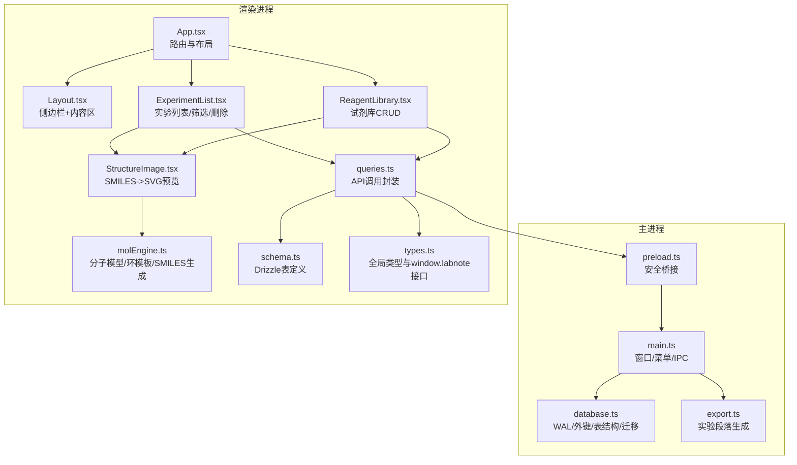
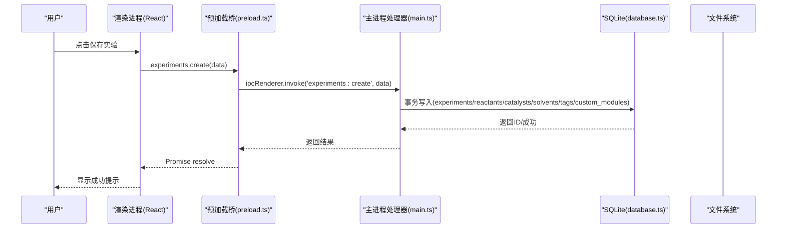
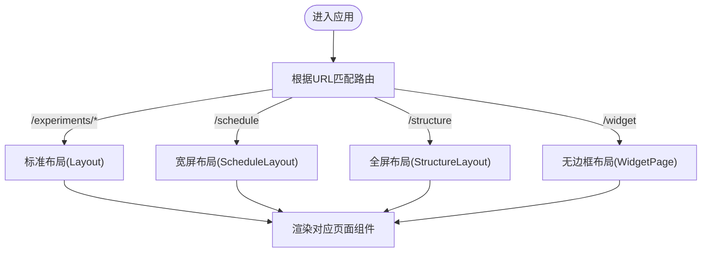
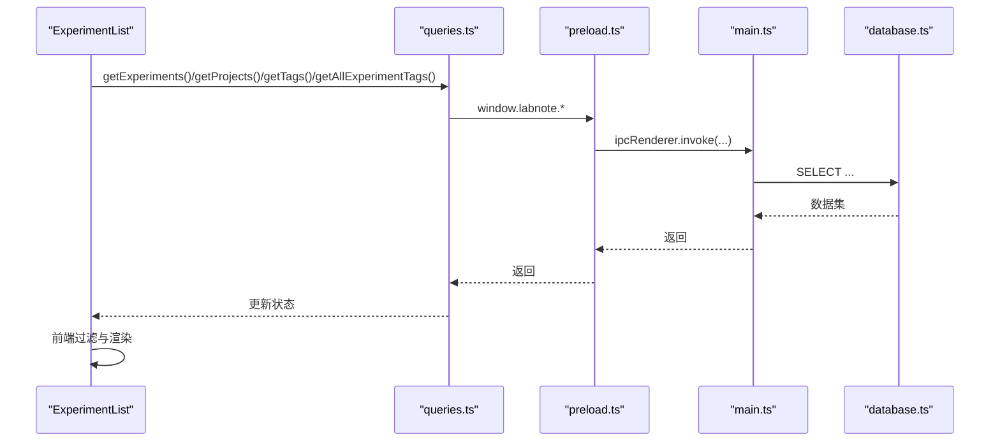
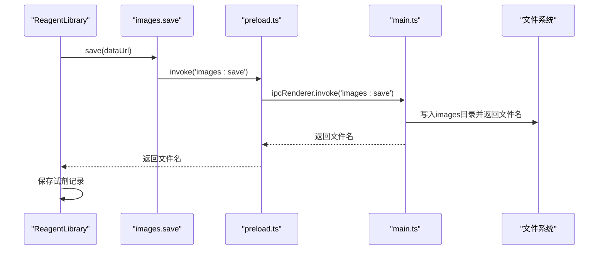
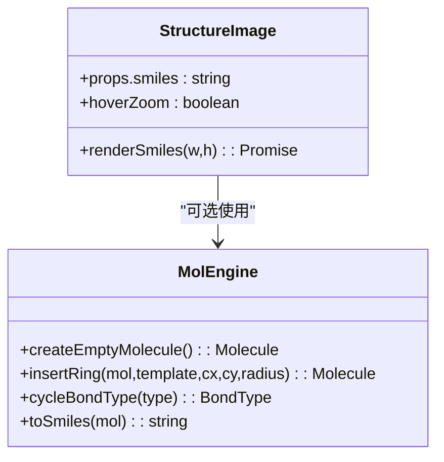
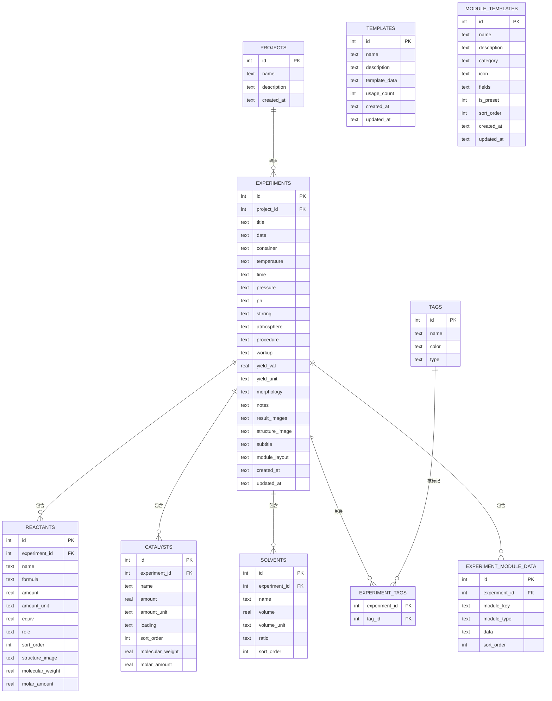
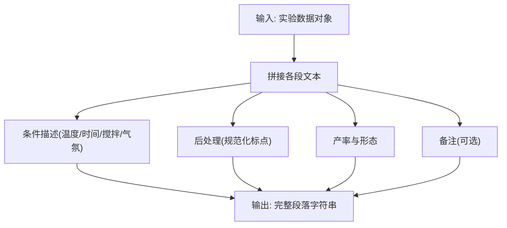
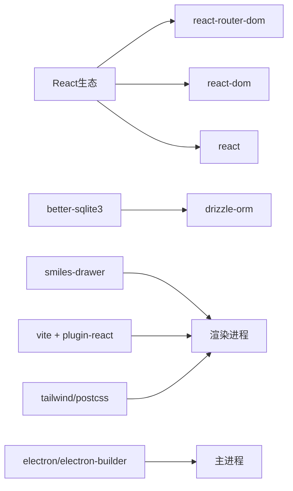

# 项目概述

<cite>
**本文引用的文件**   
- [package.json](file://package.json)
- [vite.config.ts](file://vite.config.ts)
- [electron/main.ts](file://electron/main.ts)
- [electron/preload.ts](file://electron/preload.ts)
- [electron/database.ts](file://electron/database.ts)
- [electron/export.ts](file://electron/export.ts)
- [src/App.tsx](file://src/App.tsx)
- [src/db/schema.ts](file://src/db/schema.ts)
- [src/db/queries.ts](file://src/db/queries.ts)
- [src/types.ts](file://src/types.ts)
- [src/pages/ExperimentList.tsx](file://src/pages/ExperimentList.tsx)
- [src/pages/ReagentLibrary.tsx](file://src/pages/ReagentLibrary.tsx)
- [src/components/Layout.tsx](file://src/components/Layout.tsx)
- [src/components/StructureImage.tsx](file://src/components/StructureImage.tsx)
- [src/utils/molEngine.ts](file://src/utils/molEngine.ts)
</cite>

## 目录
1. [简介](#简介)
2. [项目结构](#项目结构)
3. [核心组件](#核心组件)
4. [架构总览](#架构总览)
5. [详细组件分析](#详细组件分析)
6. [依赖分析](#依赖分析)
7. [性能考量](#性能考量)
8. [故障排查指南](#故障排查指南)
9. [结论](#结论)
10. [附录](#附录)

## 简介
LabNote 是一款面向化学研究人员的桌面端实验记录软件，围绕“实验管理、模板系统、试剂库管理”三大核心能力构建，提供结构化实验记录、模块化内容组织、SMILES 结构式绘制与预览、任务与日程等辅助功能。技术栈采用 Electron + React + TypeScript，结合 Vite 构建与 better-sqlite3 本地数据库，兼顾跨平台体验与高性能本地数据管理。

该项目通过 IPC 将渲染进程（React）与主进程（Electron）解耦，使用 Drizzle ORM 进行类型化建模，并通过自定义模块模板实现高度可配置的实验记录表单。同时内置期刊风格实验段落导出工具，便于快速生成论文方法部分草稿。

## 项目结构
整体采用分层组织：
- 主进程层（electron）：窗口管理、菜单、IPC 路由、本地文件系统访问、SQLite 初始化与迁移、图片协议处理、导出逻辑。
- 渲染进程层（src）：React 页面与组件、路由、类型定义、Drizzle 查询封装、化学结构引擎与 SMILES 渲染。
- 配置与构建：Vite 构建配置、Tailwind 样式、打包脚本。

图示来源
- [electron/main.ts:1-120](file://electron/main.ts#L1-L120)
- [electron/preload.ts:1-80](file://electron/preload.ts#L1-L80)
- [electron/database.ts:1-120](file://electron/database.ts#L1-L120)
- [electron/export.ts:1-60](file://electron/export.ts#L1-L60)
- [src/App.tsx:1-64](file://src/App.tsx#L1-L64)
- [src/components/Layout.tsx:1-16](file://src/components/Layout.tsx#L1-L16)
- [src/pages/ExperimentList.tsx:1-60](file://src/pages/ExperimentList.tsx#L1-L60)
- [src/pages/ReagentLibrary.tsx:1-60](file://src/pages/ReagentLibrary.tsx#L1-L60)
- [src/components/StructureImage.tsx:1-60](file://src/components/StructureImage.tsx#L1-L60)
- [src/utils/molEngine.ts:1-60](file://src/utils/molEngine.ts#L1-L60)
- [src/db/queries.ts:1-40](file://src/db/queries.ts#L1-L40)
- [src/db/schema.ts:1-40](file://src/db/schema.ts#L1-L40)
- [src/types.ts:233-316](file://src/types.ts#L233-L316)

章节来源
- [package.json:1-39](file://package.json#L1-L39)
- [vite.config.ts:1-26](file://vite.config.ts#L1-L26)

## 核心组件
- 应用入口与路由
  - App 负责定义页面路由与不同布局（标准布局、日程宽屏布局、结构编辑器全屏布局、无边框小部件布局）。
  - Layout 提供统一的侧边栏与内容区域容器。
- 实验管理
  - 实验列表页支持搜索、按课题/标签/日期范围筛选，展示结构式缩略图，并提供新建/编辑/删除操作。
  - 实验详情与编辑由统一页面承载，支持多模块布局与自定义模块数据持久化。
- 试剂库管理
  - 支持名称、简称、分子量、分子式、结构式（SMILES 或图片）的增删改查；支持从剪贴板粘贴图片与打开结构式编辑器。
- 模板与模块系统
  - 模板用于复用实验记录结构；模块模板定义字段集合与布局，支持预设与自定义两类。
- 结构与可视化
  - StructureImage 基于 smiles-drawer 动态加载并渲染 SMILES 为 SVG，支持悬停放大。
  - molEngine 提供分子数据结构、环模板、键型切换、简单 SMILES 生成等基础能力。
- 数据与持久化
  - 通过 preload 暴露 window.labnote API，前端 queries.ts 封装调用；主进程 main.ts 注册 IPC 处理器，直接操作 SQLite。
  - database.ts 负责 WAL 模式、外键约束、表结构创建与增量迁移，以及预设模块模板的种子数据。
- 导出
  - export.ts 将实验数据格式化为期刊风格的“实验部分”文本，便于复制粘贴到论文中。

章节来源
- [src/App.tsx:1-64](file://src/App.tsx#L1-L64)
- [src/components/Layout.tsx:1-16](file://src/components/Layout.tsx#L1-L16)
- [src/pages/ExperimentList.tsx:1-120](file://src/pages/ExperimentList.tsx#L1-L120)
- [src/pages/ReagentLibrary.tsx:1-120](file://src/pages/ReagentLibrary.tsx#L1-L120)
- [src/components/StructureImage.tsx:1-120](file://src/components/StructureImage.tsx#L1-L120)
- [src/utils/molEngine.ts:1-120](file://src/utils/molEngine.ts#L1-L120)
- [src/db/queries.ts:1-120](file://src/db/queries.ts#L1-L120)
- [electron/preload.ts:1-120](file://electron/preload.ts#L1-L120)
- [electron/main.ts:395-520](file://electron/main.ts#L395-L520)
- [electron/database.ts:1-120](file://electron/database.ts#L1-L120)
- [electron/export.ts:1-138](file://electron/export.ts#L1-L138)

## 架构总览
LabNote 采用典型的双进程架构：
- 主进程负责窗口生命周期、菜单、文件系统、数据库连接与迁移、IPC 路由与业务聚合。
- 渲染进程负责 UI 交互、状态管理、网络与第三方库（如 smiles-drawer）按需加载。
- 两者通过 contextBridge 暴露的 window.labnote API 通信，确保安全性与最小权限原则。

图示来源
- [src/pages/ExperimentList.tsx:76-92](file://src/pages/ExperimentList.tsx#L76-L92)
- [src/db/queries.ts:64-74](file://src/db/queries.ts#L64-L74)
- [electron/preload.ts:96-109](file://electron/preload.ts#L96-L109)
- [electron/main.ts:495-577](file://electron/main.ts#L495-L577)
- [electron/database.ts:1-120](file://electron/database.ts#L1-L120)

## 详细组件分析

### 应用路由与布局
- App 集中声明所有页面路由，并为不同场景定制布局（标准、宽屏、全屏、无边框）。
- Layout 组合 Sidebar 与 Outlet，形成一致的页面骨架。

图示来源
- [src/App.tsx:43-64](file://src/App.tsx#L43-L64)
- [src/components/Layout.tsx:1-16](file://src/components/Layout.tsx#L1-L16)

章节来源
- [src/App.tsx:1-64](file://src/App.tsx#L1-L64)
- [src/components/Layout.tsx:1-16](file://src/components/Layout.tsx#L1-L16)

### 实验列表与筛选
- 列表页并行加载实验、课题、标签与实验-标签映射，构建前端过滤条件（标题/课题/标签/日期区间）。
- 删除操作包含确认弹窗与错误提示。

图示来源
- [src/pages/ExperimentList.tsx:30-74](file://src/pages/ExperimentList.tsx#L30-L74)
- [src/db/queries.ts:34-122](file://src/db/queries.ts#L34-L122)
- [electron/preload.ts:89-123](file://electron/preload.ts#L89-L123)
- [electron/main.ts:422-493](file://electron/main.ts#L422-L493)
- [electron/database.ts:1-120](file://electron/database.ts#L1-L120)

章节来源
- [src/pages/ExperimentList.tsx:1-120](file://src/pages/ExperimentList.tsx#L1-L120)
- [src/db/queries.ts:1-120](file://src/db/queries.ts#L1-L120)

### 试剂库管理
- 支持新增/编辑/删除试剂，结构式支持 SMILES 与图片两种形式。
- 图片上传走 images:save IPC，落盘后返回文件名；SMILES 通过 StructureImage 渲染。

图示来源
- [src/pages/ReagentLibrary.tsx:74-92](file://src/pages/ReagentLibrary.tsx#L74-L92)
- [electron/preload.ts:86-88](file://electron/preload.ts#L86-L88)
- [electron/main.ts:407-419](file://electron/main.ts#L407-L419)

章节来源
- [src/pages/ReagentLibrary.tsx:1-120](file://src/pages/ReagentLibrary.tsx#L1-L120)
- [electron/main.ts:407-419](file://electron/main.ts#L407-L419)

### 结构式预览与绘制
- StructureImage 动态导入 smiles-drawer，解析 SMILES 并渲染 SVG，支持悬停放大。
- molEngine 提供分子数据结构、环模板、键型切换与简化 SMILES 生成，供编辑器扩展使用。

图示来源
- [src/components/StructureImage.tsx:1-120](file://src/components/StructureImage.tsx#L1-L120)
- [src/utils/molEngine.ts:1-120](file://src/utils/molEngine.ts#L1-L120)

章节来源
- [src/components/StructureImage.tsx:1-173](file://src/components/StructureImage.tsx#L1-L173)
- [src/utils/molEngine.ts:1-279](file://src/utils/molEngine.ts#L1-L279)

### 数据模型与迁移
- schema.ts 使用 Drizzle 定义表结构，便于类型推导与文档化。
- database.ts 在启动时执行建表、开启 WAL 与外键、运行增量迁移、注入预设模块模板种子数据。

图示来源
- [src/db/schema.ts:1-109](file://src/db/schema.ts#L1-L109)
- [electron/database.ts:18-177](file://electron/database.ts#L18-L177)

章节来源
- [src/db/schema.ts:1-109](file://src/db/schema.ts#L1-L109)
- [electron/database.ts:1-177](file://electron/database.ts#L1-L177)

### 导出实验段落
- 将实验基本信息、反应物/催化剂、溶剂、条件、后处理、产率与形态等整合为连贯的英文段落，适合粘贴至论文方法部分。

图示来源
- [electron/export.ts:55-137](file://electron/export.ts#L55-L137)

章节来源
- [electron/export.ts:1-138](file://electron/export.ts#L1-L138)

## 依赖分析
- 运行时依赖
  - react / react-dom / react-router-dom：UI 框架与路由。
  - better-sqlite3：高性能本地 SQLite 驱动。
  - drizzle-orm：类型化 ORM 与类型推导。
  - smiles-drawer：SMILES 解析与 SVG 渲染。
- 开发依赖
  - electron / electron-builder：桌面应用与打包。
  - vite / @vitejs/plugin-react：现代构建与热重载。
  - tailwindcss / autoprefixer / postcss：样式体系。
  - typescript：类型系统。

图示来源
- [package.json:14-37](file://package.json#L14-L37)
- [vite.config.ts:1-26](file://vite.config.ts#L1-L26)

章节来源
- [package.json:1-39](file://package.json#L1-L39)
- [vite.config.ts:1-26](file://vite.config.ts#L1-L26)

## 性能考量
- 数据库
  - 启用 WAL 模式提升并发读性能；外键约束保证数据一致性。
  - 批量迁移与索引优化减少冷启动开销。
- 构建与加载
  - Vite 手动分包 vendor，减小首屏体积。
  - 结构编辑器与 smiles-drawer 按需懒加载，避免阻塞主流程。
- 渲染
  - StructureImage 对大图进行预渲染与缓存，配合悬停放大降低重复计算。
- 内存与稳定性
  - 主进程集中管理数据库连接，避免渲染进程直连 native 模块带来的不稳定风险。

[本节为通用指导，不直接分析具体文件]

## 故障排查指南
- 无法连接数据库
  - 检查数据路径是否有效且具备读写权限；确认 initDatabase 已正确调用。
  - 查看控制台日志中的数据库路径与初始化信息。
- 图片无法显示
  - 确认 images:save 已成功写入 images 目录，且前端以 labnote://images/xxx 方式引用。
  - 检查 protocol.handle 的路径白名单与防穿越校验。
- 删除失败或无响应
  - 确认外层确认对话框未误关闭；查看 Toast 错误提示。
  - 检查主进程事务回滚日志与异常堆栈。
- 结构式渲染异常
  - 若 SMILES 无效，StructureImage 会降级显示原始字符串；请核对输入。
  - 浏览器环境需允许动态 import，确保网络/资源未被拦截。

章节来源
- [electron/main.ts:378-391](file://electron/main.ts#L378-L391)
- [electron/main.ts:407-419](file://electron/main.ts#L407-L419)
- [src/pages/ExperimentList.tsx:76-92](file://src/pages/ExperimentList.tsx#L76-L92)
- [src/components/StructureImage.tsx:1-120](file://src/components/StructureImage.tsx#L1-L120)

## 结论
LabNote 以 Electron + React + TypeScript 为核心，结合 better-sqlite3 与 Drizzle ORM，构建了稳定高效的本地实验记录系统。其模块化模板、试剂库管理与结构式可视化能力，贴合化学研究日常需求；同时提供期刊风格导出，显著提升写作效率。未来可在更多结构解析、协同备份与跨设备同步方面持续演进。

[本节为总结性内容，不直接分析具体文件]

## 附录
- 术语对照
  - 实验记录：一次合成或表征的完整过程与结果。
  - 模块模板：可复用的字段定义与布局，支撑灵活的内容组织。
  - 试剂库：常用试剂的结构与理化属性集中管理。
  - 结构式：以 SMILES 或图片表示的分子结构。
- 使用场景示例
  - 新建实验：选择课题与日期，填写反应物/催化剂/溶剂，附加表征与安全信息，一键导出方法段落。
  - 维护试剂库：录入新试剂，绘制或粘贴结构式，后续在实验中快速引用。
  - 任务与日程：将实验步骤拆解为任务，设置周期规则与截止日期，跟踪进度。

[本节为概念性说明，不直接分析具体文件]